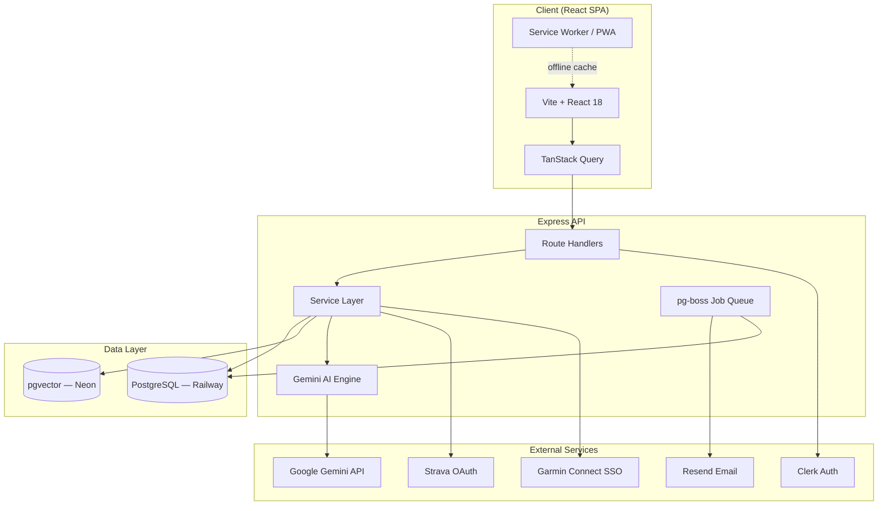
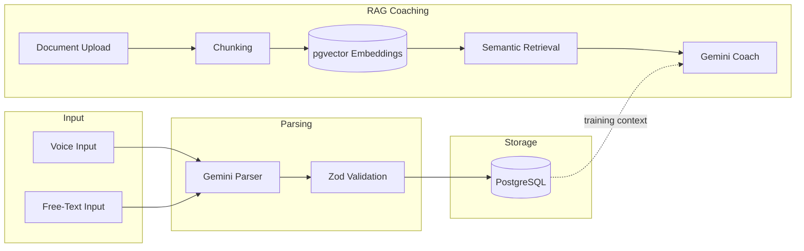

<div align="center">
  <h1>🏃‍♂️ HyroxTracker (Companion App)</h1>
  <p><strong>A fully responsive, AI-powered specialized training planner and analytics suite built exclusively for <a href="https://hyrox.com/" target="_blank">Hyrox</a> athletes.</strong></p>

  <p>
    <a href="#features">Features</a> •
    <a href="#-architecture--tech-stack">Tech Stack</a> •
    <a href="#-system-architecture">Architecture</a> •
    <a href="#-project-structure">Project Structure</a> •
    <a href="#-getting-started">Getting Started</a> •
    <a href="#-available-scripts">Scripts</a> •
    <a href="#-testing--code-quality">Testing</a> •
    <a href="#-cicd-pipeline">CI/CD</a> •
    <a href="#-license">License</a>
  </p>

  <p>
    
    
    
    
    
    
    
  </p>
</div>

---

<br />

Plan structured training programs, log complex workouts with voice or free-text using Gemini LLMs to parse sets & reps, automatically sync activities from Strava and Garmin Connect, and get real-time prescriptive AI coaching to adjust your volume based on your completed results.

## Features

### Unified Training Experience
- **Interactive Timeline** — Drag-and-drop view spanning past, present, and future workouts with status indicators (completed, planned, missed).
- **Timeline Annotations** — Mark date ranges as injury / illness / travel / rest so dips in volume are visible in context on the Timeline and as shaded bands on Analytics charts.
- **Training Plans** — Import CSV, DOCX, or PDF training blocks, use the built-in 8-week Hyrox program, or generate a fully custom plan via AI.
- **Custom Exercises** — Log non-standard movements (sled pushes, sandbag lunges) alongside standard lifts.
- **Guided Onboarding** — Configure profile, units, weekly goals, and AI coach personality on first launch.

### Gemini AI Engine
- **Workout Parsing** — Say or type *"3 sets bench 225lbs x 8, then 3 miles in 24 min"* and Gemini parses it into structured data with Zod-validated schemas.
- **Auto-Coach** — Reads your plan and recent activity to evaluate fatigue, volume, and pacing, then suggests schedule adjustments.
- **Streaming Chat** — Ask contextual questions over Server-Sent Events (SSE), e.g. *"What pace for my next 1km run?"*

### RAG-Powered Coaching
- **Document Uploads** — Upload coaching materials (CSV, DOCX, PDF) to enrich the AI coach's knowledge base.
- **Vector Search** — Documents are chunked and embedded via pgvector for semantic retrieval-augmented generation.

### Activity Sync
- **Strava** — OAuth link with HMAC-signed state; activities auto-appear on the timeline with encrypted token storage and per-user dedupe.
- **Garmin Connect** — Email/password link against the reverse-engineered Garmin SSO, protected by a global 429 circuit breaker, a per-user in-flight mutex, and a 5-minute minimum sync interval. Credentials and OAuth tokens are encrypted at rest. *(Note: Garmin 2-step verification must be disabled for the current SSO library to authenticate.)*

### Analytics & Export
- **Personal Records** — 1RM estimation, lifetime PRs, and progression charts.
- **Week-over-Week Deltas** — The Analytics overview shows percentage-change indicators against the equal-length prior period for total workouts, avg/week, total duration, and avg duration.
- **Filtering** — Drill down by exercise category, date range, or micro-cycle.
- **Data Export** — Download workout timeline and exercise sets as CSV or JSON.
- **Email Notifications** — Opt-in weekly training summaries and missed-day reminders via pg-boss + Resend, with a master toggle plus independent per-type switches (`emailWeeklySummary`, `emailMissedReminder`).

### Privacy & Data Control
- **GDPR Account Deletion** — `DELETE /api/v1/account` removes your Clerk identity, best-effort deauthorizes Strava, and cascade-deletes every row owned by the user across `workout_logs`, `exercise_sets`, `training_plans`, `plan_days`, `chat_messages`, `coaching_materials`, `document_chunks`, `strava_connections`, `garmin_connections`, `custom_exercises`, `push_subscriptions`, `ai_usage_logs`, `idempotency_keys`, and `timeline_annotations`.
- **AI Consent Gate** — The AI coach is opt-in (`aiCoachEnabled`, defaults `false`); no workout data is sent to Google Gemini until the user explicitly enables it.
- **Privacy Policy** — First-party Privacy page (`client/src/pages/Privacy.tsx`) listing every third-party processor (Clerk, Gemini, Strava, Garmin, Resend, Sentry) and the data they receive.

### PWA & Offline
- **Installable** — Progressive Web App with Workbox service worker for offline caching and native-like mobile experience.

---

## 🏗 Architecture & Tech Stack

This repository is a fully functional monorepo containing both the React frontend and the Express REST API backend, written entirely in strictly typed **TypeScript**.

### Frontend
- **Framework**: React 18, Vite 5, TypeScript 5.9
- **Styling**: Tailwind CSS 4 layered over shadcn/ui (accessible Radix primitives)
- **State Management**: TanStack Query (React Query) for optimized server state caching
- **Client Routing**: wouter for ultra-lightweight navigation
- **Drag & Drop**: dnd-kit for sortable, accessible drag-and-drop interactions
- **Visualization**: Recharts for interactive performance charts
- **PWA**: vite-plugin-pwa + Workbox for offline support and installability
- **Error Tracking**: Sentry for real-time error monitoring

### Backend
- **API Runtime**: Node.js + Express 4 with thin controller wrappers and thick service abstractions
- **Database**: PostgreSQL (hosted on [Railway](https://railway.app/)) bridged by the type-safe Drizzle ORM
- **Authentication**: Clerk JWT middleware protecting all private endpoints
- **AI**: Google Gemini API (`@google/genai`) for workout parsing and coaching
- **Vector DB**: pgvector on [Neon](https://neon.tech/) for RAG document embeddings
- **Job Queue**: pg-boss for background tasks (email scheduling, maintenance)
- **Email**: Resend for transactional email delivery
- **Logging**: Pino + pino-http for structured, high-performance logging
- **API Documentation**: Swagger UI auto-generated from Zod schemas via zod-to-openapi
- **Validation**: Zod for runtime schema validation with drizzle-zod integration
- **Security**:
  - Helmet for HTTP security headers
  - express-rate-limit for granular API rate limiting
  - csrf-csrf for CSRF protection (double-submit cookie pattern bound to Clerk userId); in production `CSRF_SECRET` is required and **must differ** from `ENCRYPTION_KEY` (key separation is enforced at startup)
  - Server-side idempotency enforcement via `X-Idempotency-Key` header with database-backed cache; pg-boss job retries are scoped to idempotent handlers only (`sendJobNoRetry` for side-effectful handlers like email send)
  - Compression middleware skips `text/event-stream` responses to unblock Gemini streaming chat
  - AES-256-GCM encryption for Strava and Garmin credentials / tokens at rest
  - Strava OAuth CSRF state verification
  - Garmin 7-layer safety stack: per-route rate limiter, per-user mutex, 5-minute min-sync interval, fail-fast on prior `lastError`, global 30-minute 429 circuit breaker, no silent re-login on stale tokens, audit logging on every Garmin call
  - HTML sanitization of AI-generated content

### Shared
- Shared Zod schemas and TypeScript types between client and server
- OpenAPI spec generation from Zod schemas

---

## 🔀 System Architecture



### AI Pipeline



---

## 📁 Project Structure

```
Hyrox-Companion/
├── client/                     # React frontend (Vite SPA)
│   └── src/
│       ├── components/         # UI components
│       │   ├── ui/             # shadcn/ui primitives
│       │   ├── analytics/      # Analytics dashboard
│       │   ├── coach/          # AI coaching interface
│       │   ├── onboarding/     # Onboarding wizard
│       │   ├── plans/          # Training plan management
│       │   ├── settings/       # User preferences
│       │   ├── timeline/       # Drag-and-drop timeline
│       │   └── workout/        # Workout logging
│       ├── hooks/              # Custom React hooks
│       ├── lib/                # Utilities & API client
│       └── pages/              # Route pages (Landing, Timeline, LogWorkout, Analytics, Settings)
├── server/                     # Express backend
│   ├── gemini/                 # Gemini AI parsing & prompt logic
│   ├── middleware/             # Express middleware (CSP nonce, CSRF, idempotency)
│   ├── routes/                 # API route handlers
│   ├── services/               # Business logic layer (includes workoutUseCases.ts)
│   ├── storage/                # Database access layer (Drizzle)
│   └── utils/                  # Server utilities
├── shared/                     # Shared code (client + server)
│   └── schema/                 # Drizzle table definitions, Zod types, enums
├── migrations/                 # Drizzle SQL migrations
├── cypress/                    # E2E test suites
├── .github/workflows/          # CI/CD pipelines (7 workflows)
├── scripts/                    # Build & maintenance scripts
├── .claude/commands/review/    # Code-review skill profiles (security, privacy, ux, performance, business, qa, devops, all)
└── docs/                       # Documentation (11 living guides + dated snapshots)
```

---

## 📚 Documentation

Detailed documentation for each subsystem is available in the [`docs/`](docs/) directory:

| Document | Description |
|----------|-------------|
| [Architecture Overview](docs/architecture.md) | End-to-end flows, service dependencies, RAG decision tree, schema pipeline |
| [Client (Frontend)](docs/client.md) | React SPA: pages, components, routing, styling, PWA, error tracking |
| [Server (Backend)](docs/server.md) | Express API: bootstrap, middleware stack, security, logging, graceful shutdown |
| [Database](docs/database.md) | PostgreSQL schema, Drizzle ORM, pgvector, migrations, storage layer |
| [AI and RAG](docs/ai-and-rag.md) | Gemini integration, workout parsing, auto-coach, RAG pipeline |
| [State Management](docs/state-management.md) | TanStack Query, custom hooks, offline queue, utility functions |
| [API Reference](docs/api-reference.md) | All API endpoints with request/response shapes and rate limits |
| [Authentication](docs/authentication.md) | Clerk setup, user sync, dev auth bypass, route protection |
| [Integrations](docs/integrations.md) | Strava OAuth, Garmin Connect, email system, pg-boss queue, cron scheduling |
| [Testing](docs/testing.md) | Vitest, Cypress E2E, jest-axe accessibility tests, code-review skill profiles, CI workflows |
| [Native Mobile](docs/native-mobile.md) | Capacitor vs. React Native comparison, packaging phases, cost trade-offs |

---

## 📖 API Documentation

Interactive API documentation is available via **Swagger UI** at `/api/docs` when the server is running. The spec is auto-generated from Zod schemas using `@asteasolutions/zod-to-openapi`, ensuring documentation always stays in sync with the codebase.

---

## 🚀 Getting Started

Follow these instructions to run the full application ecosystem locally.

### Prerequisites
- [Node.js](https://nodejs.org/) (v20 or higher)
- [pnpm](https://pnpm.io/) (v9.x — run `corepack enable` to auto-install)
- [PostgreSQL](https://www.postgresql.org/download/) with the [pgvector](https://github.com/pgvector/pgvector) extension — production uses [Railway](https://railway.app/) for the main DB and [Neon](https://neon.tech/) for vector embeddings
- A [Clerk.dev](https://clerk.dev/) account for auth (optional — use `ALLOW_DEV_AUTH_BYPASS=true` for local dev)
- A [Google AI Studio](https://aistudio.google.com/) key for AI features (optional)

### 1. Environment Variables
Copy the example environment file and fill in your values:

```bash
cp .env.example .env
```

At minimum, set the two **required** variables:
- `DATABASE_URL` – PostgreSQL connection string
- `ENCRYPTION_KEY` – 32+ char hex key (generate with `node -e "console.log(require('crypto').randomBytes(32).toString('hex'))"`)

See `.env.example` for all available configuration options including Clerk auth, Gemini AI, Strava sync, Resend email, Sentry, and more.

### 2. Installation & Database Setup

```bash
# Install dependencies
pnpm install

# Generate and run Drizzle ORM migrations
pnpm run db:generate
pnpm run db:migrate
```

### 3. Start the Application

```bash
pnpm dev
```

This fires up the Vite frontend with HMR and the Express backend on port `5000`. Visit `http://localhost:5000` in your browser.

---

## 📜 Available Scripts

| Script | Description |
|---|---|
| `pnpm dev` | Start development server (Vite HMR + Express) |
| `pnpm build` | Production build (client + server) |
| `pnpm start` | Run production build |
| `pnpm check` | TypeScript type checking |
| `pnpm test` | Run Vitest unit & integration tests |
| `pnpm test:watch` | Run tests in watch mode |
| `pnpm lint` | Run ESLint |
| `pnpm lint:fix` | Auto-fix lint issues |
| `pnpm format` | Format code with Prettier |
| `pnpm format:check` | Check formatting without writing |
| `pnpm db:generate` | Generate Drizzle migrations from schema changes |
| `pnpm db:migrate` | Run pending database migrations |
| `pnpm db:check` | Validate migration/schema consistency |

---

## 🧪 Testing & Code Quality

| Layer | Tool | Coverage | Command |
|---|---|---|---|
| Unit & Integration | Vitest | 750+ tests across 60+ files (80% threshold) | `pnpm test` |
| End-to-End | Cypress | 120+ tests across 9 suites | `pnpm exec cypress open` |
| Accessibility | jest-axe (via Vitest + jsdom) | Automated a11y assertions on interactive components (`*.a11y.test.tsx`) | `pnpm test` |
| Type Safety | TypeScript 5.9 (strict) | Full codebase | `pnpm check` |
| Lint & Format | ESLint + Prettier | Full codebase | `pnpm lint` / `pnpm format:check` |

Opinionated **code-review skill profiles** live under `.claude/commands/review/` and can be invoked as `/review:<profile>` (`security`, `privacy`, `ux`, `performance`, `business`, `qa`, `devops`, or `all`) for structured, role-based audits of the codebase.

---

## 🔄 CI/CD Pipeline

Every push and pull request triggers automated pipelines via GitHub Actions:

| Workflow | Trigger | Purpose |
|---|---|---|
| **Build** | Push / PR | Lint, type check, production build, SonarCloud analysis |
| **Test** | Push / PR | Unit & integration test suite |
| **Cypress** | Push / PR | E2E browser tests |
| **Migrations** | Push / PR | Database schema consistency validation |
| **Post-Migration** | After migration | Post-migration health checks |
| **Trivy** | Push / PR / Weekly | Security vulnerability scanning |
| **Dependency Review** | PR | Audit new/updated dependencies for known vulnerabilities |

---

## 🤝 Contributing

Contributions make the open-source community an amazing place to learn, inspire, and create. Any contributions to HyroxTracker are **greatly appreciated**.

1. Fork the Project.
2. Create your Feature Branch (`git checkout -b feature/AmazingFeature`)
3. Commit your Changes (`git commit -m 'Add some AmazingFeature'`)
4. Verify your tests strictly (`pnpm check` & `pnpm test`).
5. Push to the Branch (`git push origin feature/AmazingFeature`)
6. Open a Pull Request.

---

## 📄 License
This project is licensed under the MIT License.
