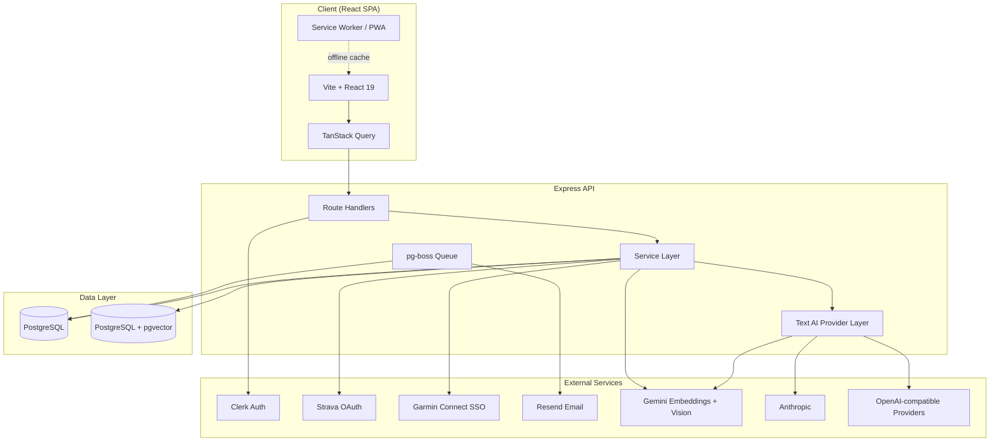
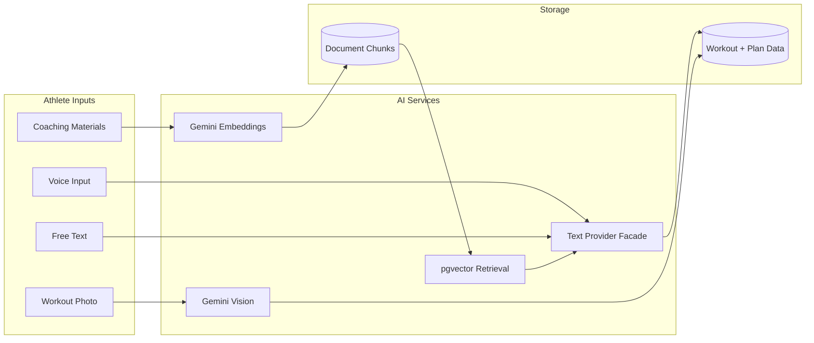

<div align="center">
  
  <h1>fitai.coach</h1>
  <p><strong>AI-native training planning, workout logging, nutrition, analytics, and coaching for Hyrox-style hybrid athletes.</strong></p>

  <p>
    <a href="#features">Features</a> |
    <a href="#architecture--tech-stack">Tech Stack</a> |
    <a href="#system-architecture">Architecture</a> |
    <a href="#project-structure">Project Structure</a> |
    <a href="#getting-started">Getting Started</a> |
    <a href="#available-scripts">Scripts</a> |
    <a href="#testing--code-quality">Testing</a> |
    <a href="#cicd-pipeline">CI/CD</a> |
    <a href="#license">License</a>
  </p>

  <p>
    
    
    
    =22">
    
    
    
  </p>
</div>

---

fitai.coach helps athletes plan structured training, log complex workouts, fuel correctly, understand progress, and adjust upcoming sessions with coach-grade AI context. It combines a timeline-first training log, plan import and generation, structured exercise tables, training-style controls, Strava and Garmin sync, nutrition and fuelling tracking, RAG-backed coaching materials, and privacy controls that keep AI features opt-in.

## Features

### Unified Training Experience

- **Interactive timeline** - View past, current, and upcoming training with planned, completed, missed, and skipped states.
- **Structured workout logging** - Log free-text, voice-entered, table-backed, or block-based sessions with sets, reps, loads, distances, times, custom exercise names, notes, and scores, plus optional session-level distance and average/max heart rate for athletes logging manually without a synced wearable.
- **Training plans** - Import CSV plans, start from built-in programming, or generate a plan with AI.
- **Training styles** - Choose balanced programming or MAF Method constraints, with MAF setup fields used to calculate and persist the athlete's heart-rate ceiling. MAF athletes can tag any logged workout, including synced Strava runs, as a MAF test to track pace at the same heart rate over time.
- **Timeline annotations** - Mark injury, illness, travel, rest, or other date ranges so analytics and training gaps have context.
- **Guided onboarding** - Set units, race profile and age, a goal and optional race date, an optional fuelling target, and the AI Coach consent, then start a plan (AI, template or CSV import) before landing in the main app. Re-running it from Settings starts from the saved answers.

### AI Coaching

- **Modular text AI provider layer** - Text features default to Gemini and can be routed by operators to Anthropic or OpenAI-compatible providers such as OpenAI, xAI, Groq, Together, OpenRouter, DeepSeek, or a custom base URL.
- **Workout parsing** - Turn text or voice like `"3 sets bench 225lbs x 8, then 3 miles in 24 min"` into validated structured exercise data.
- **Photo-to-workout parsing** - Upload an image of a whiteboard, plan sheet, or coach notes and extract workout structure with Gemini vision.
- **Streaming coach chat** - Ask context-aware questions over Server-Sent Events with recent training, plan status, and coaching materials in scope.
- **Auto-coach and suggestions** - Evaluate completed workouts, fatigue signals, plan phase, station gaps, and RAG materials to propose targeted updates.

### RAG-Powered Coaching

- **Coaching material uploads** - Add CSV, DOCX, or PDF materials to enrich the coach with athlete-specific or coach-specific guidance.
- **Vector retrieval** - Documents are chunked, embedded with Gemini embeddings, and searched through pgvector for retrieval-augmented coaching.
- **Fallback-aware retrieval** - The app can fall back to legacy full-text materials when embeddings are missing, mismatched, or unavailable.

### Activity Sync

- **Strava** - OAuth sync imports activities automatically: Strava's webhook push lands a new activity within about a minute of upload, a polling fallback covers anything the push misses, and the Sync button remains for an on-demand refresh. Activities are deduplicated per user and tokens are stored encrypted. Each synced activity is matched to that day's training first: it enriches the workout you already logged (filling only the metrics you left blank) or completes the planned session, and only lands as a separate workout when nothing plausible matches. A Perceived Exertion you gave on Strava arrives as the workout's RPE; without one, the review sheet suggests an RPE from the session's heart rate, which is saved only when you tap it.
- **Garmin Connect** - Email/password Garmin SSO sync imports recent activities with encrypted credentials and a strict safety stack: per-user locks, rate limits, minimum sync interval, global 429 circuit breaker, and audit logging.

### Nutrition & Fuelling

- **Food logging** - Log foods by database search, barcode scan, plain-English description, or meal photo, plus custom foods and recipes that roll up like any other food.
- **Smart food search** - Local search matches name and brand with typo-tolerant `pg_trgm` fuzzy fallback, accent-insensitive matching, and synonym expansion, with optional semantic (embeddings) search that surfaces related foods when keyword results are thin.
- **Trusted nutrition data** - Foods come from Edamam, USDA FoodData Central, and Open Food Facts, and every calorie and macro traces back to a real database row, with graceful degradation to cached-only results when a provider is unavailable.
- **Targets and micronutrients** - Set versioned calorie and macro goals from a Mifflin-St Jeor TDEE estimate and track daily totals, including micronutrients against reference daily intakes.
- **Per-meal fuel targets** - Distribute the day's target across a configurable 3/4/5-meal schedule with pre/post-workout fuelling windows anchored to each session's time of day.
- **Fuelling vs. training** - See fuelling around each session and a block view of daily intake against training load (UTSS), with opt-in AI analysis of recent fuelling.

### Analytics & Export

- **Training overview** - Track volume, duration, average workouts per week, completion rate, streaks, and week-over-week changes.
- **Exercise progression** - See personal records, set history, category breakdowns, and progression trends.
- **Coach insights** - Surface RPE trends, plan phase, weekly volume, station gaps, fatigue flags, and progression flags. Results are persisted server-side and paint instantly on open, with an automatic refresh at local midnight when newer workouts are logged.
- **Race predictor** - Estimate your HYROX finish time from logged history, with the same stored-first instant paint and a manual refresh.
- **MAF Trend** - For MAF Method athletes, chart per-test compliance and pace-at-ceiling progression with classification badges across tagged MAF tests.
- **Data export** - Download workout timeline and exercise sets as CSV or JSON.
- **Recycle bin** - Deleted workouts, plan days and training plans can be restored for 90 days, either with Undo on the delete toast or from the Recycle bin tab in Settings.
- **Email and push notifications** - Opt-in weekly summaries, missed-day reminders, Sunday weekly-review reminders, daily session briefs and analysis digests, sent at the athlete's chosen local hour through pg-boss, Resend, and Web Push when configured, with one-click unsubscribe on every email.

### Privacy & Data Control

- **AI consent gate** - AI coach features are opt-in through `aiCoachEnabled`; new users default to disabled.
- **Runtime AI kill switch** - Operators can disable AI provider traffic with `AI_FEATURES_ENABLED=false`.
- **Account deletion** - `DELETE /api/v1/account` removes Clerk identity data where possible and cascade-deletes user-owned app records, including the separate vector database and this device's cached API responses and local snapshots.
- **Privacy page** - A first-party privacy page lists third-party processors and the data each receives.
- **Error telemetry scrubbing** - Sentry is gated on the privacy notice plus a per-user opt-out, and both the server and client strip request bodies, query strings and identifying fields before anything is sent.

### PWA & Offline

- **Installable app** - Vite PWA and Workbox provide installability and offline-aware behavior. Cached API responses are purged on sign-out, so a shared device does not leak one athlete's data to the next.
- **Browser push** - Web Push subscriptions can deliver training reminders to opted-in devices when VAPID credentials are configured, capped at 10 devices per athlete.
- **Offline feedback** - The client surfaces offline/drop notifications so failed interactions are visible.

---

## Architecture & Tech Stack

This is a full-stack TypeScript monorepo with a React SPA, an Express API, shared schemas, Drizzle-backed PostgreSQL storage, pgvector-backed retrieval, and a modular AI provider layer.

### Frontend

- **Framework**: React 19, Vite 8, TypeScript 7
- **Styling**: Tailwind CSS 4 with shadcn/ui-style Radix primitives
- **State management**: TanStack Query for server state and cache invalidation
- **Routing**: wouter
- **Drag and drop**: dnd-kit
- **Charts**: Recharts
- **PWA**: vite-plugin-pwa and Workbox
- **Error tracking**: Sentry React, optional by environment

### Backend

- **Runtime**: Node.js >=22, Express 5, TypeScript 7
- **Database**: PostgreSQL with Drizzle ORM, with `pg_trgm` trigram indexes for fuzzy food search
- **Vector search**: pgvector, optionally on a separate `VECTOR_DATABASE_URL`, backing both RAG retrieval and semantic food search
- **Authentication**: Clerk JWT middleware with local dev bypass support
- **AI text providers**: Gemini by default, Anthropic, and OpenAI-compatible adapters
- **Gemini-specific services**: embeddings and image parsing through `@google/genai`
- **Jobs and scheduling**: pg-boss plus node-cron
- **Email**: Resend
- **Push notifications**: Web Push with VAPID keys
- **Logging**: Pino and pino-http
- **API docs**: Swagger UI generated from Zod/OpenAPI schemas
- **Validation**: Zod and drizzle-zod

### Security and Reliability

- Helmet security headers with a nonce-based production CSP
- CORS allowlist with credentials
- CSRF protection through a double-submit cookie flow
- Server-side idempotency for mutating API requests with `X-Idempotency-Key`
- AES-256-GCM encryption for Strava and Garmin credentials/tokens, with a versioned keyring for zero-downtime key rotation
- Rate limiting on every authenticated endpoint, backed by Postgres so limits hold across replicas
- Per-user and application-wide AI spend caps, on top of the consent gate and kill switch
- SSRF guards on every outbound URL the app does not hard-code, checked again at send time
- HTML sanitization for AI-generated content, and prompt-injection escaping for user text in both user turns and system instructions
- Startup env validation for production-only invariants such as `CSRF_SECRET`, `STRAVA_STATE_SECRET`, weak key rejection, and auth bypass lockout

The most recent review is [`docs/SECURITY_AUDIT_2026-09-19.md`](docs/SECURITY_AUDIT_2026-09-19.md), which records what was found, what was fixed, and the handful of items deliberately left alone with reasons.

### Shared

- Shared Drizzle tables, Zod schemas, enums, types, and OpenAPI registry in `shared/`
- Client and server import shared types directly through TypeScript path aliases

---

## System Architecture


```mermaid
flowchart TB
    subgraph Client["Client (React SPA)"]
        UI["Vite + React 19"]
        TQ["TanStack Query"]
        SW["Service Worker / PWA"]
    end

    subgraph Server["Express API"]
        API["Route Handlers"]
        Services["Service Layer"]
        TextAI["Text AI Provider Layer"]
        Queue["pg-boss Queue"]
    end

    subgraph Data["Data Layer"]
        PG[("PostgreSQL")]
        PGV[("PostgreSQL + pgvector")]
    end

    subgraph External["External Services"]
        Clerk["Clerk Auth"]
        Strava["Strava OAuth"]
        Garmin["Garmin Connect SSO"]
        Resend["Resend Email"]
        Gemini["Gemini Embeddings + Vision"]
        Anthropic["Anthropic"]
        OpenAICompatible["OpenAI-compatible Providers"]
    end

    UI --> TQ --> API
    SW -. "offline cache" .-> UI
    API --> Services
    Services --> PG
    Services --> PGV
    Services --> TextAI
    TextAI --> Gemini
    TextAI --> Anthropic
    TextAI --> OpenAICompatible
    Services --> Gemini
    API --> Clerk
    Services --> Strava
    Services --> Garmin
    Queue --> Resend
    Queue --> PG
```

### AI Pipeline


```mermaid
flowchart LR
    subgraph Inputs["Athlete Inputs"]
        Voice["Voice Input"]
        Text["Free Text"]
        Photo["Workout Photo"]
        Docs["Coaching Materials"]
    end

    subgraph AI["AI Services"]
        Provider["Text Provider Facade"]
        Vision["Gemini Vision"]
        Embeddings["Gemini Embeddings"]
        Retrieval["pgvector Retrieval"]
    end

    subgraph Storage["Storage"]
        DB[("Workout + Plan Data")]
        VDB[("Document Chunks")]
    end

    Voice --> Provider
    Text --> Provider
    Photo --> Vision
    Docs --> Embeddings --> VDB --> Retrieval
    Provider --> DB
    Vision --> DB
    Retrieval --> Provider
```

---

## Project Structure

```text
Hyrox-Companion/
|-- client/                    # React frontend (Vite SPA)
|   |-- public/                # Brand assets, favicon, PWA assets
|   `-- src/
|       |-- components/        # UI, timeline, coach, analytics, settings, workout surfaces
|       |-- hooks/             # Custom React hooks
|       |-- lib/               # API client, query client, utilities
|       `-- pages/             # Landing, Timeline, LogWorkout, Analytics, Nutrition, Review, Settings, Privacy
|-- server/                    # Express backend
|   |-- ai/                    # Provider-agnostic AI core: retry/timeout, circuit breaker, Gemini SDK factory
|   |   `-- providers/         # Gemini, Anthropic, and OpenAI-compatible text adapters
|   |-- bootstrap/             # Startup, health, observability, and shutdown wiring
|   |-- gemini/                # Gemini client, parsing, image, chat, suggestion helpers
|   |-- middleware/            # CSP nonce, CSRF, idempotency, AI budget/consent
|   |-- prompts/               # AI prompt builders and coaching-context formatters
|   |-- routes/                # Route modules and workout route groups
|   |-- services/              # Business logic, AI context, RAG, analytics, plans
|   |-- storage/               # Drizzle-backed data access
|   |-- usecases/              # Use-case orchestration layer
|   `-- utils/                 # Server utilities
|-- shared/                    # Drizzle schema, Zod types, OpenAPI registry, and the pure domain
|                              # math both sides share (units, MAF, nutrition targets, race spec, plan phase)
|-- migrations/                # Drizzle SQL migrations
|-- cypress/                   # End-to-end specs and support
|-- test/                      # Cross-cutting suites: docs-sync checks, calculation-audit guards, factories
|-- docs/                      # Living subsystem docs and OpenAPI snapshot
|-- script/                    # Build, maintenance, benchmark, and docs scripts
|-- .github/workflows/         # CI workflows
`-- README.md
```

---

## Documentation

Detailed documentation lives in [`docs/`](docs/). The core reference set is below;
[**`docs/README.md`**](docs/README.md) indexes everything else — runbooks, ADRs, feature specs,
the brand kit, in-flight plans, and the dated review snapshots.

| Document                                               | Description                                                                                |
| ------------------------------------------------------ | ------------------------------------------------------------------------------------------ |
| [Architecture Overview](docs/architecture.md)          | End-to-end flows, provider layer, service dependencies, RAG decision tree, schema pipeline |
| [Environment Variables](docs/env-reference.md)         | Required and optional env vars, defaults, feature gates, safety invariants                 |
| [Client](docs/client.md)                               | React SPA, routing, components, styling, PWA, client Sentry                                |
| [Server](docs/server.md)                               | Express bootstrap, middleware stack, routes, logging, graceful shutdown                    |
| [Database](docs/database.md)                           | PostgreSQL schema, Drizzle ORM, pgvector, migrations, storage layer                        |
| [AI and RAG](docs/ai-and-rag.md)                       | Text provider layer, Gemini embeddings/vision, coaching context, RAG pipeline              |
| [Nutrition & Fuelling](docs/nutrition.md)              | Food logging, food search (fuzzy/synonym/semantic), per-meal fuel targets, AI parsing      |
| [State Management](docs/state-management.md)           | TanStack Query, custom hooks, offline queue, utility functions                             |
| [API Reference](docs/api-reference.md)                 | Endpoint catalog, request/response shapes, rate limits                                     |
| [Authentication](docs/authentication.md)               | Clerk setup, user sync, dev auth bypass, protected routes                                  |
| [Integrations](docs/integrations.md)                   | Strava, Garmin, Resend, pg-boss, cron, Sentry                                              |
| [Testing](docs/testing.md)                             | Vitest, integration tests, Cypress, accessibility checks, CI workflows                     |
| [Native Mobile](docs/native-mobile.md)                 | Capacitor vs. React Native comparison and packaging phases                                 |
| [Product Opportunities](docs/PRODUCT_OPPORTUNITIES.md) | Prioritised register of new features and improvements, with code-level evidence            |

---

## API Documentation

Interactive Swagger UI is available at `/api/docs` when the server is running in development. The OpenAPI document is generated from the shared Zod registry through `@asteasolutions/zod-to-openapi`.

A committed OpenAPI 3.0 snapshot is kept at [`docs/openapi.json`](docs/openapi.json). Regenerate it with:

```bash
pnpm docs:openapi
```

The Build workflow fails if the committed snapshot drifts from the generated spec.

---

## Getting Started

### Prerequisites

- [Node.js](https://nodejs.org/) 22 or newer
- [pnpm](https://pnpm.io/) 9.12.x through Corepack (`corepack enable`)
- PostgreSQL with the [pgvector](https://github.com/pgvector/pgvector) extension
- Optional: [Clerk](https://clerk.com/) keys for real authentication
- Optional: Gemini, Anthropic, or OpenAI-compatible provider keys for AI text features
- Optional: Strava, Resend, Sentry, and Web Push credentials for their integrations

### 1. Environment Variables

Copy the example file:

```bash
cp .env.example .env
```

Minimum local boot variables:

| Variable         | Purpose                                         |
| ---------------- | ----------------------------------------------- |
| `DATABASE_URL`   | PostgreSQL connection string                    |
| `ENCRYPTION_KEY` | 32+ character secret for AES-256-GCM encryption |

Generate a strong local key with:

```bash
node -e "console.log(require('crypto').randomBytes(32).toString('hex'))"
```

Production also requires `CSRF_SECRET`, and it must differ from `ENCRYPTION_KEY`. See [`.env.example`](.env.example) and [Environment Variables](docs/env-reference.md) for the full reference.

For local development without Clerk, set:

```bash
ALLOW_DEV_AUTH_BYPASS=true
```

### 2. Install and Prepare the Database

```bash
pnpm install
pnpm run db:migrate
```

Use `pnpm run db:generate` only when you intentionally change `shared/schema/tables.ts` and need to create a new migration.

### 3. Start the Application

```bash
pnpm dev
```

The app serves the React frontend and Express API on port `5000`. Visit `http://localhost:5000`.

---

## Available Scripts

| Script                               | Description                                                                       |
| ------------------------------------ | --------------------------------------------------------------------------------- |
| `pnpm dev`                           | Start the development server with `.env` loaded                                   |
| `pnpm build`                         | Build the client and server for production                                        |
| `pnpm start`                         | Run the production build from `dist/`                                             |
| `pnpm check`                         | Run TypeScript type checking (TS 7 native compiler)                               |
| `pnpm check:strict`                  | Typecheck the `noUncheckedIndexedAccess` subset (`tsconfig.strict.json`)          |
| `pnpm check:test`                    | Typecheck the `*.test.ts` files, which `pnpm check` excludes                      |
| `pnpm check:bundle`                  | Verify client-bundle invariants against `dist/`                                   |
| `pnpm test`                          | Run the Vitest unit test suite                                                    |
| `pnpm test:watch`                    | Run Vitest in watch mode                                                          |
| `pnpm test:smoke`                    | Smoke-test the built server over HTTP (needs `pnpm build` and a database)         |
| `pnpm test:coverage`                 | Run the unit suite with coverage reporting                                        |
| `pnpm lint`                          | Run ESLint                                                                        |
| `pnpm lint:fix`                      | Auto-fix ESLint issues                                                            |
| `pnpm format`                        | Format the repo with Prettier                                                     |
| `pnpm format:check`                  | Check formatting without writing files                                            |
| `pnpm db:generate`                   | Generate a new Drizzle migration after schema changes                             |
| `pnpm db:migrate`                    | Run pending Drizzle migrations                                                    |
| `pnpm db:check`                      | Validate migration/schema consistency                                             |
| `pnpm db:decode-entities`            | Decode stored HTML entities in workout text                                       |
| `pnpm coach:influence`               | Run the AI coach influence harness                                                |
| `pnpm docs:openapi`                  | Regenerate `docs/openapi.json`                                                    |
| `pnpm bench:timeline`                | Run the timeline benchmark                                                        |
| `pnpm bench:timeline:check`          | Run the timeline benchmark guard                                                  |
| `pnpm data:race-benchmarks`          | Rebuild the race-benchmark artifacts from the results CSV                         |
| `pnpm data:race-benchmarks:backtest` | Score old seeds against new data (accuracy report)                                |
| `pnpm ops:restore-drill`             | Verify a restored backup (the mechanical half of the monthly drill)               |
| `pnpm ops:reembed`                   | Rebuild the vector DB from the primary DB                                         |
| `pnpm strava:webhook`                | Operator tool for the Strava push subscription (`status` / `register` / `delete`) |

`postinstall` runs `script/patch-cypress-deps.js` to patch Cypress transitive dependencies.

---

## Testing & Code Quality

| Layer                  | Tool                   | Command                                                      |
| ---------------------- | ---------------------- | ------------------------------------------------------------ |
| Unit tests             | Vitest                 | `pnpm test`                                                  |
| Integration tests      | Vitest with PostgreSQL | `pnpm exec vitest run --config vitest.integration.config.ts` |
| Production smoke tests | Vitest smoke config    | `pnpm test:smoke`                                            |
| End-to-end tests       | Cypress                | `pnpm exec cypress open` or `pnpm exec cypress run`          |
| Accessibility checks   | jest-axe via Vitest    | `pnpm test`                                                  |
| Type safety            | TypeScript 7 (native)  | `pnpm check`                                                 |
| Linting                | ESLint                 | `pnpm lint`                                                  |
| Formatting             | Prettier               | `pnpm format:check`                                          |

The suite is around 490 Vitest test files plus 12 Cypress E2E specs (2026-09-23). The count moves with every branch that lands, so [Testing](docs/testing.md) carries the commands to derive it, alongside setup, local database requirements, Cypress conventions, and CI details.

---

## CI/CD Pipeline

GitHub Actions workflows live in [`.github/workflows/`](.github/workflows/):

| Workflow                        | Trigger                                       | Purpose                                                                                         |
| ------------------------------- | --------------------------------------------- | ----------------------------------------------------------------------------------------------- |
| **Build**                       | Push to `main`, pull request                  | ESLint, TypeScript (`check`, `check:strict`, `check:test`), OpenAPI snapshot drift check        |
| **Unit Tests**                  | Push to `main`, pull request                  | Vitest unit suite with coverage thresholds (`pnpm test:coverage`)                               |
| **Cypress Tests**               | Push, pull request                            | Build, bundle-invariant check, integration tests, smoke tests, Cypress with PostgreSQL/pgvector |
| **Check Migrations**            | Push to `main`, pull request                  | Drizzle migration consistency and drift; applies the real chain to a fresh pgvector database twice |
| **Post-Migration Verification** | Manual                                        | Apply migrations and verify a real Neon database                                                |
| **Dependency Review**           | Pull request                                  | Audit dependency changes                                                                        |
| **DevSkim**                     | Push to `main`, pull request, weekly schedule | Static security scanning                                                                        |
| **Bearer**                      | Push to `main`, pull request, weekly schedule | Security and privacy scanning                                                                   |
| **Secret Scan**                 | Push to `main`, pull request                  | Gitleaks secret scanning                                                                        |

SonarQube Cloud automatic analysis is configured outside the manual workflow steps.

---

## Accessibility

The app targets WCAG 2.1 AA. It uses Radix primitives for focus management, supports keyboard navigation, includes a skip-to-content link, respects reduced-motion preferences, and has automated `jest-axe` checks for key interactive components.

When reporting an accessibility issue, include the page, browser, assistive technology, expected behavior, and actual behavior.

---

## Contributing

Contributions are welcome. See [`CONTRIBUTING.md`](CONTRIBUTING.md) for local setup, the checks to run before opening a pull request, and code-style conventions. In short:

1. Fork the project and create a feature branch.
2. Make the smallest focused change that solves the problem.
3. Run `pnpm check`, `pnpm test`, and `pnpm lint`.
4. Update docs and `docs/openapi.json` when the public API or setup changes.
5. Open a pull request with the behavior change, verification, and any remaining risks.

---

## License

This project is licensed under the MIT License. See the [`LICENSE`](LICENSE) file for the full text.
