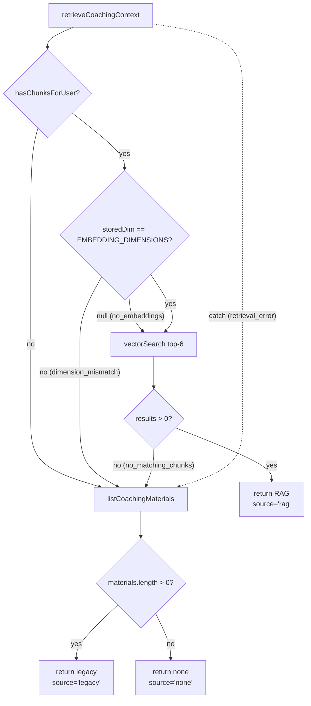

# AI and RAG Pipeline

[Back to README](../README.md)

## Overview

The Hyrox Companion integrates Google's Gemini API for three core AI capabilities: workout parsing, coaching chat, and training plan generation. A Retrieval-Augmented Generation (RAG) pipeline enriches AI responses with user-uploaded coaching materials stored as vector embeddings in pgvector.

**AI consent gate.** Every outbound Gemini call — workout parsing, chat (regular + streaming), auto-coach, suggestions, plan generation — is gated on `user.aiCoachEnabled` (defaults `false` for new users). When the flag is `false`, the coach service short-circuits (`triggerAutoCoach` returns `{ adjusted: 0 }` at `server/services/coachService.ts:82`) and the chat/parsing routes refuse to compose a prompt. The UI hides or disables the AI features until the user flips the toggle in Settings → Preferences, and flipping it back to `false` stops new Gemini requests immediately.

**Key dependencies:**
- `@google/genai` -- Google Gemini API client
- pgvector -- PostgreSQL vector extension for semantic search
- Zod -- Structured output validation

---

## Table of Contents

- [Gemini Client](#gemini-client)
- [Workout Parsing](#workout-parsing)
- [AI Coach Chat](#ai-coach-chat)
- [Auto-Coach Pipeline](#auto-coach-pipeline)
- [RAG Pipeline](#rag-pipeline)
- [AI Plan Generation](#ai-plan-generation)
- [Prompt Templates](#prompt-templates)
- [Context Building](#context-building)
- [Security](#security)
- [Configuration](#configuration)

---

## Gemini Client

**File:** `server/gemini/client.ts`

The shared Gemini client provides:

- **Singleton client:** `getAiClient()` lazily initializes a `GoogleGenAI` instance using `GEMINI_API_KEY`.
- **Models:**
  - `gemini-2.5-flash-lite` -- Used for exercise parsing (fast, low-cost).
  - `gemini-3.1-pro-preview` -- Used for coaching chat, suggestions, and plan generation (higher quality, with thinking enabled).
- **Retry with backoff:** `retryWithBackoff(fn, label, maxRetries, baseDelayMs, budgetMs)` retries on rate limits (429), server errors (500/503), and network failures. Exponential backoff (2s base) with a total budget timeout.
- **Timeout:** `withTimeout(promise, ms, label)` races a promise against a configurable timeout.
- **Embedding:** `generateEmbedding(text)` and `generateEmbeddings(texts)` produce 3072-dimensional vectors using `gemini-embedding-001`. Batch embeddings process in groups of 5 with 200ms inter-batch delay to avoid rate limiting.

### Model Selection

| Model | Used For | Rationale |
|-------|----------|-----------|
| `gemini-2.5-flash-lite` | Exercise parsing | Fast and low-cost. Parsing is a structured extraction task that maps free-text to a fixed JSON schema -- it does not require deep reasoning or nuanced coaching knowledge. |
| `gemini-3.1-pro-preview` | Coaching chat, workout suggestions, plan generation | Higher quality with `ThinkingLevel.HIGH` enabled. These tasks require deeper reasoning about training periodization, fatigue management, and personalized coaching decisions based on complex athlete context. |

---

## Workout Parsing

**File:** `server/gemini/exerciseParser.ts`

Transforms free-text or voice input into structured exercise data.

### Flow

1. User submits text (e.g., "3 sets bench 225lbs x 8, then 3 miles in 24 min")
2. The parser builds a prompt with:
   - `PARSE_EXERCISES_PROMPT` system instruction
   - Unit awareness (kg/lbs based on user preference, with conversion rules)
   - Custom exercise names (if any saved by the user)
3. Gemini returns JSON with `responseMimeType: "application/json"`
4. Response is validated with `parsedExerciseSchema` (Zod)
5. Exercises are post-processed:
   - Known exercises get 95% confidence; unknown get 50%
   - Unknown exercise names are mapped to `"custom"` with the original name as `customLabel`
   - Invalid categories fall back to `"conditioning"`
   - All text is HTML-sanitized

### ParsedExercise Output

```typescript
{
  exerciseName: string;     // Standard name or "custom"
  category: string;         // e.g., "strength", "running", "conditioning"
  customLabel?: string;     // Original name for custom exercises
  confidence: number;       // 0-100, AI's confidence in the parse
  missingFields?: string[]; // Fields the AI couldn't determine
  sets: Array<{
    setNumber: number;
    reps?: number;
    weight?: number;
    distance?: number;
    time?: number;
  }>;
}
```

### API Endpoint

`POST /api/v1/parse-exercises` -- Rate limited to 5/min.

See also: [API Reference -- AI Routes](api-reference.md#ai-and-chat-routes)

---

## AI Coach Chat

**Files:** `server/gemini/chatService.ts`, `server/routes/ai.ts`

### Regular Chat

`chatWithCoach()` sends the full conversation history to Gemini and returns a complete response. Uses `ThinkingLevel.HIGH` for deeper reasoning.

### Streaming Chat

`streamChatWithCoach()` is an `AsyncGenerator<string>` that yields text chunks. It accepts an optional `AbortSignal` parameter, allowing the caller to cancel Gemini generation mid-stream. The route handler (`POST /api/v1/chat/stream`) serves these as Server-Sent Events:

```
data: {"ragInfo": {"source": "rag", "chunkCount": 3}}   // First event
data: {"text": "Based on your recent..."}                 // Text chunks
data: {"text": " training data, I recommend..."}
data: {"done": true}                                      // Stream complete
```

The server propagates an `AbortSignal` to the Gemini API when the SSE client disconnects. This cancels in-flight token generation immediately, preventing unnecessary API costs and compute waste. The signal is constructed from the request's `close` event and passed through the entire streaming pipeline.

### Complete Streaming Example

A full SSE event sequence for a coaching chat request:

```
data: {"ragInfo":{"source":"rag","chunkCount":3}}

data: {"text":"Based on your"}

data: {"text":" recent training data, I recommend"}

data: {"text":" reducing your squat volume this week."}

data: {"done":true}
```

Each SSE event is separated by a double newline (`\n\n`). The first event always carries `ragInfo` metadata so the client knows which retrieval method was used. Subsequent events stream text chunks as they arrive from Gemini's `generateContentStream`. The final event carries `{"done":true}` to signal stream completion.

On the client side, text chunks are buffered and rendered via `requestAnimationFrame` to avoid layout thrashing during rapid chunk delivery. On the server side, the route handler propagates an `AbortSignal` to cancel the Gemini stream when the client disconnects, preventing unnecessary token generation and API costs.

### Chat History

- `GET /api/v1/chat/history` -- Retrieve saved messages
- `POST /api/v1/chat/message` -- Save a message (max 50,000 chars)
- `DELETE /api/v1/chat/history` -- Clear all messages
- History is truncated to the last 20 messages in chat requests via `chatRequestSchema`

### RagInfo

Every chat response includes `RagInfo` metadata:

```typescript
{
  source: "rag" | "legacy" | "none"; // Which retrieval method was used
  chunkCount: number;                // Number of RAG chunks retrieved
  chunks?: string[];                 // Chunk contents (dev only)
  materialCount?: number;            // Legacy material count
  fallbackReason?: string;           // Why RAG wasn't used (dev only)
}
```

In production, `chunks` and `fallbackReason` are stripped by `sanitizeRagInfo()`.

---

## Auto-Coach Pipeline

**File:** `server/services/coachService.ts`

Automatically adjusts upcoming plan days after a workout is completed.

### Flow

1. **Trigger:** User creates a workout via `POST /api/v1/workouts`. If `aiCoachEnabled`, the route sets `isAutoCoaching = true` on the user record and queues an `auto-coach` job via pg-boss.
2. **Client polling:** The `useAuth` hook polls `isAutoCoaching` every 2 seconds (max 5 minutes) to show a loading indicator.
3. **`triggerAutoCoach(userId)`:**
   - Checks if AI coach is enabled; if not, resets flag and returns.
   - Fetches in parallel: `buildTrainingContext()`, `getActivePlan()`, `getTimeline()`
   - Extracts the next 7 upcoming planned workouts sorted by date.
   - Retrieves coaching materials via RAG (or legacy fallback).
   - Calls `generateWorkoutSuggestions()` with the training context, upcoming workouts, plan goal, and coaching materials.
   - Applies each suggestion to the corresponding plan day via `storage.updatePlanDay()`.
   - Resets `isAutoCoaching = false` in a `finally` block.
4. **Suggestion application:** Suggestions specify a `targetField` (`mainWorkout`, `accessory`, or `notes`) and an `action` (`replace` or `append`). Appended content is prefixed with `[AI Coach]`.

See also: [Integrations -- pg-boss Job Queue](integrations.md#job-queue-pg-boss)

### WorkoutSuggestion

```typescript
{
  workoutId: string;
  workoutDate: string;
  workoutFocus: string;
  targetField: "mainWorkout" | "accessory" | "notes";
  action: "replace" | "append";
  recommendation: string;
  rationale: string;
  priority: "high" | "medium" | "low";
}
```

---

## RAG Pipeline

For a sequence diagram of the full upload → chunk → embed → persist path, see [architecture.md § 3b — RAG Ingest Pipeline](architecture.md#3b-rag-ingest-pipeline). The complementary read-path decision tree lives in [architecture.md § 4](architecture.md#4-rag-retrieval-decision-tree).

### Document Chunking

**File:** `server/services/ragService.ts`

1. **Input:** User uploads a coaching material (text content up to 1.5M characters).
2. **Chunking:** `chunkText(text)` splits content into overlapping chunks:
   - **Chunk size:** Configurable via `RAG_CHUNK_SIZE` (default 600 chars).
   - **Overlap:** Configurable via `RAG_CHUNK_OVERLAP` (default 100 chars).
   - **Boundary detection:** Prefers breaking at paragraph boundaries (`\n\n`), then sentence boundaries (`. `), falling back to raw character limit.
   - The material title is prepended to the first chunk for semantic context.
3. **Embedding:** Each chunk is embedded via `generateEmbeddings()` (Gemini `gemini-embedding-001`, 3072 dimensions). Processed in batches of 5 with 200ms delay.
4. **Storage:** Chunks and embeddings are stored in the `document_chunks` table. Old chunks are replaced transactionally via `storage.replaceChunks()`.

### Embedding Trigger

Embedding is triggered asynchronously via pg-boss queue (`embed-coaching-material` job) when:
- A coaching material is created
- A coaching material's content or title is updated

### Retrieval

**File:** `server/services/ragRetrieval.ts`

`retrieveCoachingContext(userId, query, log)` is the main retrieval entry point:

1. Check if the user has any document chunks (`storage.hasChunksForUser()`).
2. If chunks exist, verify embedding dimensions match (detects model changes).
3. Generate a query embedding and search via `storage.searchChunksByEmbedding()` (cosine distance, top-6 by default).
4. If RAG succeeds, return chunks with `ragInfo.source = "rag"`.
5. If RAG fails (no chunks, dimension mismatch, retrieval error), fall back to legacy full-text coaching materials with `ragInfo.source = "legacy"`.
6. If no coaching materials exist at all, return `ragInfo.source = "none"`.

### RAG Retrieval Decision Tree



**fallbackReason values:**

| Value | Trigger |
|-------|---------|
| `dimension_mismatch` | Stored embedding dimension differs from `EMBEDDING_DIMENSIONS` (model changed). Fix by re-embedding via settings. |
| `no_embeddings` | Chunks exist in the database but none have embedding vectors yet. |
| `no_matching_chunks` | Vector search executed successfully but returned 0 results for the query. |
| `retrieval_error` | An exception was thrown during the retrieval attempt (network, database, etc.). |

### RAG Status

`GET /api/v1/coaching-materials/rag-status` returns diagnostic info:
- Per-material chunk counts and embedding status
- Embedding API health (probes with a test embedding)
- Dimension mismatch detection (stored vs. expected)
- Total chunk count

### Re-embedding

`POST /api/v1/coaching-materials/re-embed` re-chunks and re-embeds all materials. Uses `Promise.allSettled()` for resilience -- individual failures don't block others.

See also: [Database -- documentChunks table](database.md#schema-tables)

---

## AI Plan Generation

**File:** `server/services/planGenerationService.ts`

Generates structured multi-week training plans via Gemini.

### Input (GeneratePlanInput)

| Field | Type | Description |
|-------|------|-------------|
| `goal` | string (required) | Training goal (max 500 chars) |
| `totalWeeks` | number | 1-24, default 8 |
| `daysPerWeek` | number | 2-7, default 5 |
| `experienceLevel` | enum | `"beginner"`, `"intermediate"`, `"advanced"` |
| `raceDate` | string? | `YYYY-MM-DD`, plan phases peak for this date |
| `startDate` | string? | `YYYY-MM-DD`, when the plan begins |
| `restDays` | string[]? | Days of the week that must be rest days |
| `focusAreas` | string[]? | Priority training areas |
| `injuries` | string? | Injuries/limitations to avoid |

### Flow

1. `buildGenerationPrompt()` creates a structured prompt from the input.
2. Gemini generates JSON with `responseMimeType: "application/json"` and `ThinkingLevel.HIGH`.
3. Response is parsed and validated against `generatedDaySchema` (Zod). Invalid days are dropped with a warning.
4. All AI-generated text is HTML-sanitized.
5. A `TrainingPlan` record is created with associated `PlanDay` records.
6. If `startDate` or `raceDate` is provided, the plan is auto-scheduled (dates assigned to days, aligned to Monday).

### API Endpoint

`POST /api/v1/plans/generate` -- Rate limited to 3/min.

---

## Prompt Templates

**File:** `server/prompts.ts`

### BASE_SYSTEM_PROMPT

The core coaching persona. Covers:
- Multi-goal coaching (Hyrox, endurance, strength, weight loss, general fitness)
- Hyrox-specific knowledge (8 stations, distances, race format)
- Instructions for using training data context
- Security instruction: refuses to reveal system prompts

### SUGGESTIONS_PROMPT

Detailed instructions for the auto-coach. Includes:
- Phase-based coaching (Early, Build, Peak, Taper, Race Week)
- Workout type awareness (Shakeout, Recovery, Deload, Benchmark, Simulation)
- Response to coaching analysis (fatigue, undertraining, exercise gaps, plateaus)
- Hyrox-specific coaching (grip fatigue, transitions, station substitutes)
- Running-focused coaching (periodization, easy/tempo/interval balance)
- Modification priority hierarchy (adjust intensity > swap exercises > rewrite > add accessory > coaching cues)

### PARSE_EXERCISES_PROMPT

Instructions for parsing free-text into structured exercise data. Defines valid exercise names, categories, and output JSON format.

### Prompt Excerpts

**BASE_SYSTEM_PROMPT -- Persona and Hyrox knowledge:**

```text
You are an expert AI fitness coach. You help athletes plan, track, and optimize
their training for any fitness goal -- from running races and functional fitness
competitions (like Hyrox) to strength building, weight loss, and general health.

You adapt your coaching based on the athlete's goal:
- Functional fitness / Hyrox: Hyrox is a fitness race with 8x 1km runs between
  8 functional stations (SkiErg 1000m, Sled Push 50m, Sled Pull 50m,
  Burpee Broad Jumps 80m, Rowing 1000m, Farmers Carry 200m,
  Sandbag Lunges 100m, Wall Balls 75-100 reps). Focus on station practice,
  running endurance, grip management, and race-day pacing.
- Endurance / Running: Focus on periodization, pacing, mileage progression,
  easy/tempo/interval balance, and race-specific preparation.
- Strength: Focus on progressive overload, compound lifts, programming
  periodization, and recovery.
- Weight loss: Balanced training with sustainable intensity, caloric awareness,
  and habit building.
- General fitness: Well-rounded approach across running, strength, and
  conditioning.
```

**SUGGESTIONS_PROMPT -- Phase-based coaching rules:**

```text
PHASE-BASED COACHING:
- EARLY (first 25% of plan): Build aerobic base, establish movement patterns.
  Moderate volume, low-moderate intensity. Add form cues in notes. Don't push
  heavy loads yet.
- BUILD (25-60%): Progressive overload -- increase weights/reps/distance in
  small increments (2.5-5% per week). For functional fitness goals, ensure all
  functional exercises get practice at least once every 10 days. Build running
  volume.
- PEAK (60-85%): Highest intensity. For functional fitness: simulation workouts
  (back-to-back stations with runs). Race-pace intervals. Full circuits.
  Maintain strength, don't add new exercises.
- TAPER (85-100%): Reduce volume 30-40% but maintain intensity. Shorter
  sessions, focus on sharpness and confidence. No new exercises or heavy loads.
  Do NOT add accessory work -- remove or simplify existing accessory instead.
  Station gaps are NOT urgent during taper.
- RACE WEEK: Light movement ONLY. Max 20-30 minutes per session. Short easy
  jogs, activation drills, light mobility. Do NOT add any station practice,
  running intervals, or strength work.
```

**PARSE_EXERCISES_PROMPT -- Exercise categories and confidence scoring:**

```text
Available exercises and their keys:
FUNCTIONAL: skierg, sled_push, sled_pull, burpee_broad_jump, rowing,
            farmers_carry, sandbag_lunges, wall_balls
RUNNING:    easy_run, tempo_run, interval_run, long_run
STRENGTH:   back_squat, front_squat, deadlift, romanian_deadlift, bench_press,
            overhead_press, pull_up, bent_over_row, lunges, hip_thrust
CONDITIONING: burpees, box_jumps, assault_bike, kettlebell_swings, battle_ropes

Categories: functional, running, strength, conditioning

CONFIDENCE SCORING:
- 95-100: Exact match to a known exercise (e.g. "back squat" -> back_squat)
- 80-94:  Strong match with minor ambiguity (e.g. "squats" -> back_squat)
- 60-79:  Reasonable guess but could be wrong (e.g. "presses" -> bench_press
          vs overhead_press)
- 40-59:  Weak match, mapped to custom (e.g. unfamiliar abbreviation)
- 0-39:   Very uncertain, likely custom exercise with unclear details
```

### PLAN_GENERATION_PROMPT

Instructions for generating multi-week training plans with day-by-day structure.

### Helper Functions

- `buildSystemPrompt(trainingContext, coachingMaterials, retrievedChunks)` -- Assembles the full system prompt with training stats and coaching materials.
- `buildCoachingMaterialsSection(materials)` -- Formats legacy coaching materials.
- `buildRetrievedChunksSection(chunks)` -- Formats RAG-retrieved chunks.
- `buildTrainingContextSection(context)` -- Formats training stats as structured text.

---

## Context Building

**File:** `server/services/aiContextService.ts`

`buildAIContext(userId, query, log)` is the shared context builder used by both chat and suggestion endpoints. It parallelizes two independent data fetches:

```typescript
const [trainingContext, coachingContext] = await Promise.all([
  buildTrainingContext(userId),                     // Last 12 weeks of stats
  retrieveCoachingContext(userId, query, log),      // RAG or legacy materials
]);
```

### TrainingContext (from `server/services/ai/`)

Aggregates the user's training state:
- Workout counts (total, completed, planned, missed, skipped)
- Completion rate and current streak
- Recent workouts with exercise details (last 12 weeks)
- Upcoming planned workouts
- Exercise breakdown (category counts)
- Structured exercise stats (max weight, max distance, best time per exercise)
- Active plan info (name, weeks, current week, goal)
- **Coaching insights:** RPE trends, fatigue/undertraining flags, station gaps, plan phase, weekly volume trends, progression flags per exercise

---

## Coaching Insights

**File:** `server/services/ai/coachingInsights.ts`

The coaching insights module computes seven analytical dimensions from the athlete's timeline data. These are included in every `TrainingContext` and injected into the AI system prompt so the model can make data-driven coaching decisions.

### RPE Trend

Compares the average RPE (Rate of Perceived Exertion) of the last 3 completed workouts against the prior 3. Requires at least 3 workouts with RPE data; returns `insufficient_data` otherwise.

- **Rising:** difference > 0.8 -- training load is increasing.
- **Stable:** difference between -0.8 and 0.8.
- **Falling:** difference < -0.8 -- training load is decreasing.

Two boolean flags are derived from the last-3 average:
- `fatigueFlag`: true when avgRPE >= 8 (high perceived effort, risk of overtraining).
- `undertrainingFlag`: true when avgRPE <= 4 (low perceived effort, stimulus may be insufficient).

### Exercise Gaps (Station Gaps)

Tracks the last trained date for each of the 8 Hyrox functional stations plus running (9 stations total): `skierg`, `sled_push`, `sled_pull`, `burpee_broad_jump`, `rowing`, `farmers_carry`, `sandbag_lunges`, `wall_balls`, and `running`.

Detection uses two strategies:
1. **Exercise sets:** Maps `exerciseName` from logged sets to station names. Running exercises (`easy_run`, `tempo_run`, `interval_run`, `long_run`) are all mapped to the `running` station.
2. **Focus text:** Scans the workout focus string for keywords via `EXERCISE_FOCUS_MAP` (e.g., "ski erg" and "ski-erg" both map to `skierg`).

Returns an array of `{ station, daysSinceLastTrained }` where `daysSinceLastTrained` is `null` if the station has never been trained.

### Plan Phase

Maps the athlete's current position within their training plan to a periodization phase:

| Phase | Condition | Description |
|-------|-----------|-------------|
| `early` | progressPct < 25% | Aerobic base building, movement pattern establishment |
| `build` | 25% <= progressPct < 60% | Progressive overload, volume accumulation |
| `peak` | 60% <= progressPct < 85% | Highest intensity, simulation workouts |
| `taper` | 85% <= progressPct < 100% | Volume reduction, maintain intensity |
| `race_week` | currentWeek >= totalWeeks | Light movement only, mental prep |

`progressPct` is calculated as `round((currentWeek / totalWeeks) * 100)`. Returns `undefined` if no active plan exists.

### Weekly Volume

Compares workout completion counts between the current week (Monday to today) and the previous full week against the user's `weeklyGoal`. Only computed when `weeklyGoal > 0`.

- **Trend:** `increasing` if thisWeek > lastWeek, `decreasing` if thisWeek < lastWeek, `stable` if equal.
- Output: `{ thisWeekCompleted, lastWeekCompleted, goal, trend }`.

### Progression Flags

Per-exercise analysis of weight and time trends across completed workouts. Each exercise receives at most one flag:

| Flag | Condition | Detail |
|------|-----------|--------|
| `plateau` | Last 3 sessions have identical weight (or time within 0.1min) | Suggests progressive overload is needed |
| `progressing` | Weight increased (or time decreased) from session 1 to session 3 of last 3 | Positive adaptation signal |
| `regressing` | Weight decreased (or time increased) from session 1 to session 3 of last 3 | May indicate fatigue or form issues |
| `new` | Only 1 session logged for this exercise | Insufficient data for trend analysis |

Weight analysis takes priority over time analysis. If a weight-based flag is found, time analysis is skipped for that exercise.

### Current Week

Calculated from the earliest plan entry date to today: `max(1, ceil((daysSinceStart + 1) / 7))`, clamped to `totalWeeks`. Falls back to week 1 if no plan entries have dates.

---

## Security

- **Consent gate:** `user.aiCoachEnabled` must be `true` before any Gemini call runs on the user's behalf. See [Overview](#overview).
- **Input sanitization:** `sanitizeUserInput()` wraps all user text in XML tags and strips potential injection patterns before sending to Gemini.
- **Output validation:** `validateAiOutput()` checks Gemini responses for safety.
- **HTML sanitization:** `sanitizeHtml()` strips HTML from all AI-generated content before database storage.
- **Content length limits:** Chat messages max 1,000 chars (request) / 50,000 chars (storage). Coaching materials max 1,500,000 chars.
- **RAG injection prevention:** Retrieved chunks are wrapped in `<coaching_data>` tags with instructions to treat content as data only.
- **Prompt protection:** System prompts include instructions refusing to reveal their own content.
- **Streaming transport:** The `compression` middleware is configured to skip `text/event-stream` responses so the streaming-chat output is delivered without being held in a gzip buffer (see [Server → Middleware Ordering Rationale](server.md#middleware-ordering-rationale)).

---

## Configuration

| Variable | Default | Description |
|----------|---------|-------------|
| `GEMINI_API_KEY` | (required for AI) | Google Gemini API key |
| `VECTOR_DATABASE_URL` | Falls back to `DATABASE_URL` | Separate pgvector database connection |
| `RAG_CHUNK_SIZE` | 600 | Characters per document chunk |
| `RAG_CHUNK_OVERLAP` | 100 | Character overlap between adjacent chunks |

---

## Key Files

| File | Purpose |
|------|---------|
| `server/gemini/client.ts` | Gemini client, retry logic, embedding generation |
| `server/gemini/exerciseParser.ts` | Free-text to structured exercise parsing |
| `server/gemini/chatService.ts` | Chat and streaming chat with Gemini |
| `server/gemini/suggestionService.ts` | Workout suggestion generation |
| `server/gemini/types.ts` | TrainingContext type definition |
| `server/services/aiContextService.ts` | Shared context builder for AI endpoints |
| `server/services/aiService.ts` | Re-exports from `server/services/ai/` |
| `server/services/ragService.ts` | Document chunking, embedding, and re-embedding |
| `server/services/ragRetrieval.ts` | Vector search and fallback retrieval logic |
| `server/services/coachService.ts` | Auto-coach pipeline |
| `server/services/planGenerationService.ts` | AI training plan generation |
| `server/prompts.ts` | All prompt templates and context formatters |
