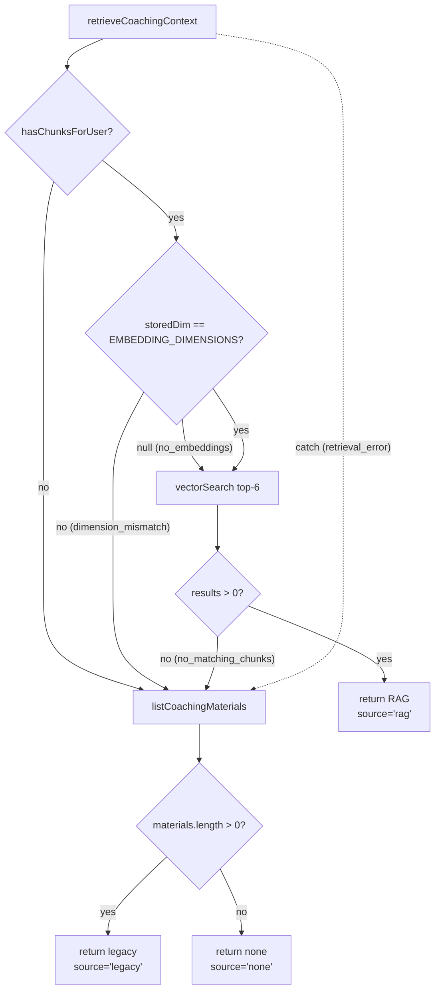

# AI and RAG Pipeline

[Back to README](../README.md)

## Overview

fitai.coach routes text AI through a modular provider layer for workout parsing, coaching chat, suggestions, review notes, coach insights, and training plan generation. Gemini remains the default text provider, while Anthropic and OpenAI-compatible providers can be selected by environment variables. A Retrieval-Augmented Generation (RAG) pipeline enriches AI responses with user-uploaded coaching materials stored as Gemini-generated vector embeddings in pgvector.

**AI consent gate.** Every outbound AI request for workout parsing, chat (regular + streaming), auto-coach, suggestions, plan generation, embeddings, and image parsing is gated on `user.aiCoachEnabled` (defaults `false` for new users). When the flag is `false`, the coach service short-circuits (`triggerAutoCoach` returns `{ adjusted: 0 }` early in `server/services/coachService.ts`) and the chat/parsing routes are blocked by the `aiConsentCheck` middleware (403 `AI_COACH_DISABLED`). The UI hides or disables the AI features until the user flips the toggle in Settings -> Preferences, and flipping it back to `false` stops new AI requests immediately.

**Key dependencies:**
- `@google/genai` -- Google Gemini API client for the default text provider, embeddings, and image parsing
- Native `fetch` -- Anthropic and OpenAI-compatible text provider adapters
- pgvector -- PostgreSQL vector extension for semantic search
- Zod -- Structured output validation

Provider selection is operator-only in this release. Set `AI_TEXT_PROVIDER`
to `gemini`, `anthropic`, or `openai-compatible`; RAG embeddings and image
parsing (photo-to-workout, nutrition meal photos and label scans) still
require `GEMINI_API_KEY`.

---

## Table of Contents

- [Text Provider Layer and Gemini Client](#text-provider-layer-and-gemini-client)
- [Workout Parsing](#workout-parsing)
- [AI Coach Chat](#ai-coach-chat)
- [Auto-Coach Pipeline](#auto-coach-pipeline)
- [RAG Pipeline](#rag-pipeline)
- [AI Plan Generation](#ai-plan-generation)
- [Prompt Templates](#prompt-templates)
- [Context Building](#context-building)
- [Exercise Selection Brief](#exercise-selection-brief)
- [Workout Engine](#workout-engine)
- [Security](#security)
- [Configuration](#configuration)

---

## Text Provider Layer and Gemini Client

**Files:** `server/ai/providers/*`, `server/ai/retry.ts`, `server/ai/circuitBreaker.ts`, `server/ai/geminiSdk.ts`, `server/gemini/client.ts`

The text provider layer (`config.ts`, `index.ts`, `types.ts`, `http.ts`,
`gemini.ts`, `anthropic.ts`, `openaiCompatible.ts`) exposes a canonical
`TextAiProvider` interface (`generateText` + `streamText`) plus the
`generateText`/`generateJsonText`/`streamText` entry points in `index.ts`.
The active provider is chosen by `AI_TEXT_PROVIDER`, and `getTextAiProvider()`
builds and caches a single instance. Each request resolves a per-role model
(`fast` vs `reasoning`) via `resolveTextAiModel()`. The shared pieces live in
`server/ai/` (retry, timeout, circuit breaker, Gemini SDK factory) and
`server/gemini/client.ts` (embeddings); `client.ts` re-exports `getAiClient`,
`retryWithBackoff`, `withTimeout` and `isRetryableError` so older importers
keep working:

- **Singleton client:** `getAiClient()` (`server/ai/geminiSdk.ts`) lazily initializes a `GoogleGenAI` instance using `GEMINI_API_KEY`, and throws while `AI_FEATURES_ENABLED=false`.
- **Models:**
  - `gemini-2.5-flash-lite` -- Used for exercise parsing (fast, low-cost).
  - `gemini-3.1-pro-preview` -- Used for coaching chat, suggestions, and plan generation (higher quality, with thinking enabled).
- **Retry with backoff:** `retryWithBackoff(fn, label, maxRetries, baseDelayMs, budgetMs, callTimeoutMs)` (`server/ai/retry.ts`, used by all three provider adapters for non-streaming calls) retries on rate limits (429), server errors (500/503), and network failures or timeouts. Exponential backoff (2s base, up to 4 retries, with jitter) inside a total budget (120s by default); each attempt is capped (90s by default) and aborted through the `AbortSignal` passed to `fn`.
- **Timeout:** `withTimeout(promise, ms, label, onTimeout?)` (`server/ai/retry.ts`) races a promise against a configurable timeout.
- **Embedding:** `generateEmbedding(text)` and `generateEmbeddings(texts)` (`server/gemini/client.ts`) produce 3072-dimensional vectors using `gemini-embedding-001`. Batch embeddings process in groups of 5 with 200ms inter-batch delay to avoid rate limiting. Repeat lookups of the same text are served from a process-local LRU cache (256 entries, 1h TTL), which is deliberately not shared through `server_runtime_cache`.

### Model Selection

| Model | Used For | Rationale |
|-------|----------|-----------|
| `gemini-2.5-flash-lite` | Exercise parsing | Fast and low-cost. Parsing is a structured extraction task that maps free-text to a fixed JSON schema -- it does not require deep reasoning or nuanced coaching knowledge. |
| `gemini-3.1-pro-preview` | Coaching chat, workout suggestions, plan generation | Higher quality with `ThinkingLevel.HIGH` enabled. These tasks require deeper reasoning about training periodization, fatigue management, and personalized coaching decisions based on complex athlete context. |

### Circuit Breaker

**File:** `server/ai/circuitBreaker.ts`

One process-wide breaker sits in front of every provider call: `retryWithBackoff()` checks it before its first attempt (which covers text generation, embeddings, and image parsing), and the streaming facade (`streamText()` in `server/ai/providers/index.ts`) checks and feeds it too, since streams are never retried.

- **Closed → open:** after 5 consecutive failed calls (`FAILURE_THRESHOLD`). A call counts once, after its retries are exhausted, and only when the failure says something about the provider's health: 400/404/422 and "invalid request"-style errors are ignored, while auth failures (401/403) and rate limits (429) count.
- **Open:** calls fail fast with `CircuitBreakerOpenError` ("AI provider temporarily unavailable (circuit breaker open)") for 30 seconds (`COOLDOWN_MS`).
- **Half-open:** after the cooldown a single probe call goes through; success closes the breaker, a provider failure re-opens it for another cooldown. A probe that never reports back is released after 10 seconds (`PROBE_TIMEOUT_MS`).
- **Persistence:** every transition is written to `server_runtime_cache` (`ai-circuit-breaker:state`, 1-hour TTL), and `loadPersistedBreakerState()` restores it during [startup maintenance](integrations.md#startup-maintenance), so a deploy in the middle of a provider outage does not reset the breaker to closed. A persisted half-open state is restored as open.

---

## Workout Parsing

**Files:** `server/gemini/exerciseParser.ts` (barrel re-export), `server/gemini/exerciseParser/` (`text.ts` for free-text parsing, `image.ts` for photo-to-workout parsing, plus `schema.ts`, `mapping.ts`, `provider.ts`, `validation.ts`, `fallback.ts`, `structure.ts`)

Transforms free-text, voice, or photo input into structured exercise data.

### Flow

1. User submits text (e.g., "3 sets bench 225lbs x 8, then 3 miles in 24 min")
2. The parser builds a prompt with:
   - `PARSE_EXERCISES_PROMPT` system instruction
   - Unit awareness (kg/lbs based on user preference, with conversion rules)
   - Custom exercise names (if any saved by the user)
3. The selected text provider returns JSON through the provider facade's JSON mode
4. Response is validated with `parsedExerciseSchema` (Zod)
5. Exercises are post-processed:
   - Known exercises get 95% confidence; unknown get 50%
   - Unknown exercise names are mapped to `"custom"` with the original name as `customLabel`
   - Invalid categories fall back to `"conditioning"`
   - All text is HTML-sanitized

### ParsedExercise Output

```typescript
{
  exerciseName: string;     // Standard name or "custom"
  category: string;         // e.g., "strength", "running", "conditioning"
  customLabel?: string;     // Original name for custom exercises
  confidence: number;       // 0-100, AI's confidence in the parse
  missingFields?: string[]; // Fields the AI couldn't determine
  sets: Array<{
    setNumber: number;
    reps?: number;
    weight?: number;
    distance?: number;
    time?: number;
  }>;
}
```

### API Endpoint

`POST /api/v1/parse-exercises` -- Rate limited to 5/min.

See also: [API Reference -- AI Routes](api-reference.md#ai-and-chat-routes)

---

## AI Coach Chat

**Files:** `server/gemini/chatService.ts`, `server/routes/ai.ts`

### Regular Chat

`chatWithCoach()` sends the full conversation history to the configured text provider and returns a complete response. Gemini remains the default; non-Gemini providers are selected through `AI_TEXT_PROVIDER`.

### Streaming Chat

`streamChatWithCoach()` is an `AsyncGenerator<string>` that yields text chunks. It accepts an optional `AbortSignal` parameter, allowing the caller to cancel provider generation mid-stream. The route handler (`POST /api/v1/chat/stream`) serves these as Server-Sent Events:

```
data: {"ragInfo": {"source": "rag", "chunkCount": 3}}   // First event
data: {"text": "Based on your recent..."}                 // Text chunks
data: {"text": " training data, I recommend..."}
data: {"done": true}                                      // Stream complete
```

The server propagates an `AbortSignal` to the provider adapter when the SSE client disconnects. This cancels in-flight token generation promptly where the upstream API supports aborts. The signal is constructed from the request's `close` event and passed through the streaming pipeline.

### Complete Streaming Example

A full SSE event sequence for a coaching chat request:

```
data: {"ragInfo":{"source":"rag","chunkCount":3}}

data: {"text":"Based on your"}

data: {"text":" recent training data, I recommend"}

data: {"text":" reducing your squat volume this week."}

data: {"done":true}
```

Each SSE event is separated by a double newline (`\n\n`). The first event always carries `ragInfo` metadata so the client knows which retrieval method was used. Subsequent events stream text chunks as they arrive from the selected provider. The final event carries `{"done":true}` to signal stream completion.

On the client side, text chunks are buffered and rendered via `requestAnimationFrame` to avoid layout thrashing during rapid chunk delivery. On the server side, the route handler propagates an `AbortSignal` to cancel the provider stream when the client disconnects, preventing unnecessary token generation and API costs where supported.

### Chat History

- `GET /api/v1/chat/history` -- Retrieve saved messages
- `POST /api/v1/chat/message` -- Save a message (max 50,000 chars)
- `DELETE /api/v1/chat/history` -- Clear all messages
- History is truncated to the last 20 messages in chat requests via `chatRequestSchema`

### RagInfo

Every chat response includes `RagInfo` metadata:

```typescript
{
  source: "rag" | "legacy" | "none"; // Which retrieval method was used
  chunkCount: number;                // Number of RAG chunks retrieved
  chunks?: string[];                 // Chunk contents (dev only)
  materialCount?: number;            // Legacy material count
  fallbackReason?: string;           // Why RAG wasn't used (dev only)
}
```

In production, `chunks` and `fallbackReason` are stripped by `sanitizeRagInfo()`.

### Plan Editing From Chat

**Files:** `server/services/chatIntentService.ts`, `server/services/planAdjustmentService.ts`, `server/gemini/planAdjustmentService.ts`, `server/routes/planProposals.ts`

On the streaming route (`POST /api/v1/chat/stream`), a message asking for a plan change gets a structured proposal instead of a prose reply:

1. **Intent gate.** A free keyword scan (`hasPlanEditKeywords()`: day names, "move", "skip", "easier", "travel", and so on) decides whether to classify at all; `classifyPlanEditIntent()` then asks the fast model, with the last two user turns as context. Only `plan_modification` at confidence ≥ 0.7 proceeds. A request can opt out with `planEditing: false`, and any error in this branch falls back to the normal chat stream.
2. **Proposal.** `createPlanAdjustmentProposal()` shows the reasoning model (`PLAN_ADJUSTMENT_PROMPT`) up to 28 upcoming planned days. Changes to days outside that set are dropped, as are `focus`/`mainWorkout`/`accessory` edits to structure-block (EMOM/AMRAP) days. A red-flag safety signal answers with the safety escalation note instead; no upcoming days, or no change surviving the checks, answers in plain text; a failed generation falls back to the normal chat stream. Otherwise the proposal is stored as `pending` in `plan_adjustment_proposals` (superseding any earlier pending one) and the stream sends its summary text plus a `planProposal` event.
3. **Apply or dismiss.** The athlete decides via `POST /api/v1/plan-proposals/:id/apply` or `/dismiss` (see [API Reference → Plan Proposal Routes](api-reference.md#plan-proposal-routes)). Apply re-checks every targeted day first: if any is no longer `planned` or has changed since the proposal was built, the whole proposal is marked `invalidated` (409 `stale`). Otherwise table-backed days whose `mainWorkout`/`accessory` text changes are re-parsed into structured rows, all changes are written in one transaction, and the proposal becomes `applied`.
4. **Auto-apply.** With the `coachAutoApplyPlanChanges` preference on (Settings → "Auto-Apply Chat Plan Changes", default off), the proposal is applied as soon as it is created; if applying fails it keeps its status (pending, or invalidated) for the athlete to retry or dismiss.

---

## Auto-Coach Pipeline

**File:** `server/services/coachService.ts`

Automatically adjusts upcoming plan days after a workout is completed.

### Flow

1. **Trigger:** Five events queue an `auto-coach` pg-boss job through `server/services/autoCoachQueue.ts`: a workout created, a logged workout moved to another date, sets edited on an existing workout log, a plan day completed, and a plan day rescheduled (see [What Triggers A Pass](ai-coach-auto-regulation-flow.md#what-triggers-a-pass)). Every producer shares the singleton key `auto-coach:<userId>` with a 60-second window, so a burst of edits collapses into one pass per athlete. Only workout creation (`POST /api/v1/workouts`, via `createWorkoutAndScheduleCoaching()`) also sets `isAutoCoaching = true`, in the same transaction as the insert and only when `aiCoachEnabled`.
2. **Client polling:** The `useAuth` hook polls `isAutoCoaching` every 2 seconds (max 5 minutes) to show a loading indicator.
3. **`triggerAutoCoach(userId)`:**
   - Checks if AI coach is enabled; if not, returns `{ adjusted: 0 }` (the `finally` block still clears the flag).
   - Checks the rolling 24h AI budget. The budget gates the model's pass only: over budget, the two rule-based stages below still run.
   - Calls `buildTrainingContext()`, which already fetches the active plan, upcoming planned days, and recent timeline (no duplicate `getActivePlan` / `getTimeline` calls).
   - Maps upcoming planned workouts (those with a `planDayId`) into the suggestion-generator shape.
   - Runs the rule-based stages: the load governor's fatigue and workload edits, then the [workout engine's plan adaptation](#adapting-the-plan-to-logged-sessions) to the athlete's latest logs (skipping any day the governor rewrote). The days either stage changes are kept out of the model's suggestions and review notes. Over budget, or with nothing planned this week, only these stages are applied.
   - Retrieves coaching materials via RAG (or legacy fallback).
   - Calls `generateWorkoutSuggestions()` with the training context, upcoming workouts, plan goal, and coaching materials.
   - Runs each suggestion through the safety layer (`applySafetyLayerToSuggestions`) and the modification guard (`shouldSuppressRepeatedFatigueReduction`) before applying.
   - Applies surviving modifications and review notes atomically inside a single `db.transaction()`.
   - Resets `isAutoCoaching = false` in a `finally` block.
4. **Suggestion application:** Suggestions specify a `targetField` (`mainWorkout`, `accessory`, or `notes`) and an `action` (`replace` or `append`). A text append written by the auto-coach goes on a new line prefixed with `[AI Coach]` (`buildUpdateValue()` in `coachService.ts`). A suggestion the athlete applies by hand (`POST /api/v1/timeline/ai-suggestions/apply` → `applyTimelineAiSuggestion()` in `server/services/aiSuggestionService.ts`) is appended after a blank line, prefixed with `AI suggestion:`.

### Repeated-Modification Guard

**File:** `server/services/aiModificationGuard.ts`

To prevent the auto-coach from repeatedly cutting volume on the same workout across consecutive runs, every fatigue-driven suggestion passes through `shouldSuppressRepeatedFatigueReduction()`:

- `classifyCoachModification()` tags a suggestion as `fatigue_volume_reduction` when an active fatigue signal (`fatigueFlag` or RPE `rising`) coincides with fatigue and reduction keywords in the recommendation/rationale.
- `buildWorkoutPrescriptionFingerprint()` computes a SHA-256 hash over the workout's normalized `mainWorkout`, `accessory`, `notes`, and sorted `exerciseDetails`.
- A repeat reduction is suppressed when the prior `lastFatigueReduction` metadata carries the same prescription fingerprint **and** no new workouts have been completed since that modification.
- `withCoachModificationMetadata()` stamps the applied modification onto `CoachNoteInputs` (`lastModification` / `lastFatigueReduction`) so the next run can detect the repeat.

See also: [Integrations -- pg-boss Job Queue](integrations.md#job-queue-pg-boss)

### WorkoutSuggestion

```typescript
{
  workoutId: string;
  workoutDate: string;
  workoutFocus: string;
  targetField: "mainWorkout" | "accessory" | "notes";
  action: "replace" | "append";
  recommendation: string;
  rationale: string;
  priority: "high" | "medium" | "low";
}
```

---

## RAG Pipeline

For a sequence diagram of the full upload → chunk → embed → persist path, see [architecture.md § 3b — RAG Ingest Pipeline](architecture.md#3b-rag-ingest-pipeline). The complementary read-path decision tree lives in [architecture.md § 4](architecture.md#4-rag-retrieval-decision-tree).

### Document Chunking

**File:** `server/services/ragService.ts`

1. **Input:** User uploads a coaching material (text content up to 1.5M characters).
2. **Chunking:** `chunkText(text)` splits content into overlapping chunks:
   - **Chunk size:** Configurable via `RAG_CHUNK_SIZE` (default 600 chars).
   - **Overlap:** Configurable via `RAG_CHUNK_OVERLAP` (default 100 chars).
   - **Boundary detection:** Prefers breaking at paragraph boundaries (`\n\n`), then sentence boundaries (`. `), falling back to raw character limit.
   - The material title is prepended to the first chunk for semantic context.
3. **Embedding:** Each chunk is embedded via `generateEmbeddings()` (Gemini `gemini-embedding-001`, 3072 dimensions). Processed in batches of 5 with 200ms delay.
4. **Storage:** Chunks and embeddings are stored in the `document_chunks` table. Old chunks are replaced transactionally via `storage.coaching.replaceChunks()`.

### Embedding Trigger

Embedding is triggered asynchronously via pg-boss queue (`embed-coaching-material` job) when:
- A coaching material is created
- A coaching material's content or title is updated

### Retrieval

**File:** `server/services/ragRetrieval.ts`

`retrieveCoachingContext(userId, query, log)` is the main retrieval entry point:

1. Check if the user has any document chunks (`storage.coaching.hasChunksForUser()`).
2. If chunks exist, verify embedding dimensions match (detects model changes).
3. Generate a query embedding and search via `storage.coaching.searchChunksByEmbedding()` (cosine distance, top-6 by default).
4. If RAG succeeds, return chunks with `ragInfo.source = "rag"`.
5. If RAG fails (no chunks, dimension mismatch, retrieval error), fall back to legacy full-text coaching materials with `ragInfo.source = "legacy"`.
6. If no coaching materials exist at all, return `ragInfo.source = "none"`.

### RAG Retrieval Decision Tree


```mermaid
flowchart TD
    A[retrieveCoachingContext] --> B{hasChunksForUser?}
    B -- no --> F[listCoachingMaterials]
    B -- yes --> C{storedDim == EMBEDDING_DIMENSIONS?}
    C -- "no (dimension_mismatch)" --> F
    C -- "null (no_embeddings)" --> D[vectorSearch top-6]
    C -- yes --> D
    D --> E{results > 0?}
    E -- yes --> G["return RAG\nsource='rag'"]
    E -- "no (no_matching_chunks)" --> F
    F --> H{materials.length > 0?}
    H -- yes --> I["return legacy\nsource='legacy'"]
    H -- no --> J["return none\nsource='none'"]
    A -. "catch (retrieval_error)" .-> F
```

**fallbackReason values:**

| Value | Trigger |
|-------|---------|
| `dimension_mismatch` | Stored embedding dimension differs from `EMBEDDING_DIMENSIONS` (model changed). Fix by re-embedding via settings. |
| `no_embeddings` | Chunks exist in the database but none have embedding vectors yet. |
| `no_matching_chunks` | Vector search executed successfully but returned 0 results for the query. |
| `retrieval_error` | An exception was thrown during the retrieval attempt (network, database, etc.). |

### RAG Status

`GET /api/v1/coaching-materials/rag-status` returns diagnostic info:
- Per-material chunk counts and embedding status
- Embedding API health (probes with a test embedding)
- Dimension mismatch detection (stored vs. expected)
- Total chunk count

### Re-embedding

`POST /api/v1/coaching-materials/re-embed` re-chunks and re-embeds all materials. Uses `Promise.allSettled()` for resilience -- individual failures don't block others.

See also: [Database -- documentChunks table](database.md#schema-tables)

---

## AI Plan Generation

**File:** `server/services/planGenerationService.ts`

Generates structured multi-week training plans via the configured text provider.

### Input (GeneratePlanInput)

| Field | Type | Description |
|-------|------|-------------|
| `goal` | string (required) | Training goal (max 500 chars) |
| `daysPerWeek` | number | 2-7, default 5 |
| `experienceLevel` | enum (required) | `"beginner"`, `"intermediate"`, `"advanced"` |
| `startDate` | string (required) | `YYYY-MM-DD`, when the plan begins |
| `endDate` | string (required) | `YYYY-MM-DD`, after `startDate`. The plan length is derived from the span (`computePlanWeeks()`, 1-24 weeks); there is no separate weeks field |
| `endDateIsRaceDate` | boolean? | Default `true`: the end date is the race the plan peaks for (stored as the plan's `raceDate`) |
| `restDays` | string[]? | Days of the week that must be rest days |
| `focusAreas` | string[]? | Priority training areas (max 10) |
| `injuries` | string? | Injuries/limitations to avoid (max 500 chars); also saved to the athlete's profile as `trainingConstraints` |
| `supersedePlanIds` | string[]? | Up to 5 plans the athlete is switching away from; retired only if this plan generates successfully |

### Flow

Generation is asynchronous. `POST /api/v1/plans/generate` refuses a second in-flight generation for the same athlete (409 `PLAN_GENERATION_IN_PROGRESS`), creates the plan row with `generationStatus: "pending"` (`createPendingPlan()`), enqueues a `plan-generation` pg-boss job (no retries; see [Integrations → Job Types](integrations.md#job-types)), and returns `202` with that stub. The client polls `GET /api/v1/plans/:id/generation-status`. The worker runs `executePlanGeneration()`:

1. Marks the plan `generating` and gathers calibration (`server/services/planGenerationCalibration.ts`) from one read of the last 70 days: the athlete's current training-load posture (for the opening week), per-exercise load anchors, and the [exercise selection brief](#exercise-selection-brief) (goal lens, familiar exercises, ranked needs with candidate exercises, constraint substitutes, race standards, primary lifts), plus declared absences inside the plan window, and the [workout engine](#workout-engine)'s plan: weekly rhythm, primary-lift targets for every week, run paces and volume, and station doses. Each piece degrades on its own: an unreadable history drops the posture and anchors, but the brief is still built from the goal, focus areas, constraints and experience level, and the engine still lays out the rhythm, effort-based lift targets and station doses.
2. Splits the plan into 2-week chunks (`PLAN_GENERATION_CHUNK_WEEKS`) and generates them in parallel, at most 3 at a time (`pLimit(PLAN_CHUNK_CONCURRENCY)`). Each chunk is one JSON-mode request to the reasoning model with the prompt from `buildGenerationPrompt()` for its week range, and a 5-minute timeout (`PLAN_GENERATION_AI_TIMEOUT_MS`). Because the chunks cannot see each other, every chunk receives the same shared state: the load anchors, the exercise selection brief, and a **program blueprint** (`server/services/planBlueprint.ts`) — the primary lifts for the whole plan, the training blocks, the deload weeks (one at ~50% for plans of 6-11 weeks, every 4th week for longer plans, never in the final three weeks), and each week's phase from `computePlanPhase()`, the same rule the auto-coach later reviews those weeks by. Each chunk also gets its slice of the **WORKOUT ENGINE TARGETS** (`server/prompts/workoutEngine.ts`): the weekly rhythm, the primary lifts' estimated 1RMs, and for each of its weeks every session's content with the lifts' exact sets, reps, loads, effort and rest, the run sessions at the athlete's paces, and the station doses for the phase.
3. Each response is validated against `generatedDaySchema` (Zod); invalid days and exercises are dropped with a warning, and `&` is rewritten to `and` in day text and exercise labels.
4. The combined days must cover every week with all seven days exactly once, and every non-rest day must carry exercise-table rows, or the generation fails (502 `AI_ERROR`). Primary-lift sets (and the text line describing each) are then snapped back to the engine's week targets (`server/services/workoutEngine/planRepair.ts`; race week is left as written). Last, an exercise whose heaviest weight rises more than 8% week over week (`MAX_WEEKLY_WEIGHT_INCREASE_PCT`), or one real plate step where that is larger, is clamped to that ceiling. The week after a blueprint deload is measured against the loading week before the deload, not the deload itself.
5. Plan days and their exercise sets are written in one transaction, and the plan is scheduled from `startDate` (week 1 aligned to that week's Monday; no session is placed before `startDate`). For a midweek start, the prompt for the chunk holding week 1 carries a `PLAN START` block naming the week-1 days before the start, so the model keeps them as rest instead of losing sessions to them.
6. A final transaction records the plan's engine state (`training_plans.engine_state`: the run fitness its paces were written against, and the recent logs its numbers already reflect), retires the plans in `supersedePlanIds` and marks this one `ready`. Any error marks it `failed` with a client-safe `generationError`.

### API Endpoint

`POST /api/v1/plans/generate` -- Rate limited to 3/min.

---

## Prompt Templates

**Files:** `server/prompts.ts` (prompt strings + `buildSystemPrompt`), `server/prompts/` (`coachingContext.ts` for training-data sections, `materialsBuilder.ts` for coaching-material/RAG-chunk sections, `exerciseSetFormatter.ts` for structured exercise-set formatting, `exerciseSelection.ts` for the exercise selection brief and the plan generator's grouped exercise menu)

### BASE_SYSTEM_PROMPT

The core coaching persona. Covers:
- Multi-goal coaching (Hyrox, endurance, strength, weight loss, general fitness)
- Hyrox-specific knowledge (8 stations, distances, race format)
- Instructions for using training data context
- Security instruction: refuses to reveal system prompts

### SUGGESTIONS_PROMPT

Detailed instructions for the auto-coach. Includes:
- Phase-based coaching (Early, Build, Peak, Taper, Race Week)
- Workout type awareness (Shakeout, Recovery, Deload, Benchmark, Simulation)
- Response to coaching analysis (fatigue, undertraining, exercise gaps, plateaus)
- Hyrox-specific coaching (grip fatigue, transitions, station substitutes)
- Running-focused coaching (periodization, easy/tempo/interval balance)
- Modification priority hierarchy (adjust intensity > swap exercises > rewrite > add accessory > coaching cues)
- Exercise selection rules: choose from the exercise selection brief (familiar exercises first), give every exercise a job for this athlete, keep familiar main lifts and progress them rather than swapping for look-alikes, swap like for like, fix the week's pattern balance, and raise specificity toward the goal date
- Prescription detail: sets x reps @ load with effort (RPE or reps in reserve) and rest in parentheses, pace or effort targets for runs and ergs, station loads relative to race standards, loads and paces anchored on the TRAINING TARGETS when given, auto-progressed loads kept unless fatigue or safety says otherwise, and a rationale addressed to the athlete that names the data point behind the change
- HYROX station gaps are acted on only when the goal involves functional fitness/HYROX or the plan already includes station work

### PARSE_EXERCISES_PROMPT

Instructions for parsing free-text into structured exercise data. Defines valid exercise names, categories, and output JSON format.

### Prompt Excerpts

**BASE_SYSTEM_PROMPT -- Persona and Hyrox knowledge:**

```text
You are an expert AI fitness coach. You help athletes plan, track, and optimize
their training for any fitness goal -- from running races and functional fitness
competitions (like Hyrox) to strength building, weight loss, and general health.

You adapt your coaching based on the athlete's goal:
- Functional fitness / Hyrox: Hyrox is a fitness race with 8x 1km runs between
  8 functional stations (SkiErg 1000m, Sled Push 50m, Sled Pull 50m,
  Burpee Broad Jumps 80m, Rowing 1000m, Farmers Carry 200m,
  Sandbag Lunges 100m, Wall Balls 75-100 reps). Focus on station practice,
  running endurance, grip management, and race-day pacing.
- Endurance / Running: Focus on periodization, pacing, mileage progression,
  easy/tempo/interval balance, and race-specific preparation.
- Strength: Focus on progressive overload, compound lifts, programming
  periodization, and recovery.
- Weight loss: Balanced training with sustainable intensity, caloric awareness,
  and habit building.
- General fitness: Well-rounded approach across running, strength, and
  conditioning.
```

**SUGGESTIONS_PROMPT -- Phase-based coaching rules:**

```text
PHASE-BASED COACHING:
- EARLY (first 25% of plan): Build aerobic base, establish movement patterns.
  Moderate volume, low-moderate intensity. Add form cues in notes. Don't push
  heavy loads yet.
- BUILD (25-60%): Progressive overload -- increase weights/reps/distance in
  small increments (2.5-5% per week). For functional fitness goals, ensure all
  functional exercises get practice at least once every 10 days. Build running
  volume.
- PEAK (60-85%): Highest intensity. For functional fitness: simulation workouts
  (back-to-back stations with runs). Race-pace intervals. Full circuits.
  Maintain strength, don't add new exercises.
- TAPER (85-100%): Reduce volume 30-40% but maintain intensity. Shorter
  sessions, focus on sharpness and confidence. No new exercises or heavy loads.
  Do NOT add accessory work -- remove or simplify existing accessory instead.
  Station gaps are NOT urgent during taper.
- RACE WEEK: Light movement ONLY. Max 20-30 minutes per session. Short easy
  jogs, activation drills, light mobility. Do NOT add any station practice,
  running intervals, or strength work.
```

**PARSE_EXERCISES_PROMPT -- Exercise categories and confidence scoring:**

```text
Available exercises and their keys:
FUNCTIONAL: skierg, sled_push, sled_pull, burpee_broad_jump, rowing,
            farmers_carry, sandbag_lunges, wall_balls
RUNNING:    easy_run, tempo_run, interval_run, long_run
STRENGTH:   back_squat, front_squat, deadlift, romanian_deadlift, bench_press,
            overhead_press, pull_up, bent_over_row, lunges, hip_thrust
CONDITIONING: burpees, box_jumps, assault_bike, kettlebell_swings, battle_ropes

Categories: functional, running, strength, conditioning

CONFIDENCE SCORING:
- 95-100: Exact match to a known exercise (e.g. "back squat" -> back_squat)
- 80-94:  Strong match with minor ambiguity (e.g. "squats" -> back_squat)
- 60-79:  Reasonable guess but could be wrong (e.g. "presses" -> bench_press
          vs overhead_press)
- 40-59:  Weak match, mapped to custom (e.g. unfamiliar abbreviation)
- 0-39:   Very uncertain, likely custom exercise with unclear details
```

### PLAN_GENERATION_PROMPT

Instructions for generating multi-week training plans with day-by-day structure. Covers:
- The exercise keys, grouped by what they train (HYROX stations, running, squat, hinge, single-leg, horizontal/vertical push and pull, carries, trunk, power, conditioning, engines, lower-leg and hip durability) — built by `buildExerciseMenu()`, and a superset of the flat list it replaced
- How to read the request's exercise selection brief, program blueprint and workout engine targets: the blueprint's phases and deload weeks are authoritative, and the engine's weekly rhythm and primary-lift numbers are written as given (they are enforced after the answer), leaving the model the write-up, warm-ups, secondary lifts and accessories
- Exercise selection principles: every exercise has a job for this athlete, primary lifts stay fixed so load can progress, the brief's top needs get recurring slots, session anatomy (warm-up, power/skill, primary lift, secondary lifts, accessories for needs, optional finisher), weekly pattern balance, rising specificity, and accessory rotation only at block boundaries
- Prescription detail: `mainWorkout` one line per block with sets x reps @ load, effort, rest and tempo where it serves the intent; runs with warm-up, a paced or effort-based main set, recoveries and cool-down; stations relative to race standard; `notes` with the session's intent, the key technique cue, and an adjustment rule
- The JSON contract: working sets only in `exercises` (warm-ups and cool-downs stay in the text), null fields omitted, and a short per-set target in the first set's `notes` (e.g. `RPE 7 · rest 2 min · 3-1-1 tempo`)

### Helper Functions

- `buildSystemPrompt(trainingContext, coachingMaterials, retrievedChunks)` -- Assembles the full system prompt with training stats and coaching materials. When `retrievedChunks` is provided it takes priority over `coachingMaterials` (`server/prompts.ts`).
- `buildCoachingMaterialsSection(materials)` -- Formats legacy coaching materials (`server/prompts/materialsBuilder.ts`).
- `buildRetrievedChunksSection(chunks)` -- Formats RAG-retrieved chunks (`server/prompts/materialsBuilder.ts`).
- `buildOverallStats` / `buildExerciseFocus` / `buildStructuredPerformance` / `buildRecentWorkouts` / `buildUpcomingWorkouts` -- Format the training-data sections of the system prompt (`server/prompts/coachingContext.ts`).

---

## Context Building

**File:** `server/services/aiContextService.ts`

`buildAIContext(userId, query, log)` is the shared context builder used by both chat and suggestion endpoints. It parallelizes two independent data fetches:

```typescript
const [trainingContext, coachingContext] = await Promise.all([
  buildTrainingContext(userId),                     // Latest 400 timeline entries + 70-day load window
  retrieveCoachingContext(userId, query, log),      // RAG or legacy materials
]);
```

### TrainingContext (from `server/services/ai/`)

Aggregates the user's training state from two windows that `buildTrainingContext()` (`server/services/ai/index.ts`) reads:

- **Timeline:** the athlete's latest 400 timeline entries (`AI_CONTEXT_TIMELINE_LIMIT` in `server/constants.ts`). These are plan days and logged workouts sorted newest date first, so upcoming plan days count toward the 400. The counts, rate, streak, recent workouts, breakdown and exercise stats below come from this window, as do the timeline-based coaching insights.
- **Load:** workout logs and exercise sets dated from 70 days before the athlete-local today through today. The load governor and the supplementary signals (personal records, PRs this week, compliance, neglected patterns and muscle groups, race readiness) come from this window.

The context carries:
- Workout counts (total, completed, planned, missed, skipped)
- Completion rate and current streak
- The 10 most recent completed workouts, with exercise details
- Upcoming planned workouts (the next 7 planned days)
- Exercise breakdown (completed workouts per functional exercise named in the focus text, or per focus when none is named)
- Structured exercise stats (max weight, max distance, best time per exercise)
- Active plan info (name, weeks, current week, goal)
- **Coaching insights:** RPE trends, fatigue/undertraining flags, station gaps, recent skips with their reasons (`recentSkips`, up to 5), plan phase, weekly volume trends, progression flags per exercise, the training-load governor overview (`loadGovernor`, from `calculateTrainingLoad()` over the last 70 days), and the rule-based training-state decision (`decisionTree` from `decideTrainingState()`: phase, allowed workout types, whether intensity is permitted, rationale codes). When the data supports them, it also carries personal records, PRs this week, plan compliance, neglected movement patterns and muscle groups, and race readiness.
- **Exercise selection brief** (`exerciseSelection`): built from the same 70-day training sets, the active plan's goal, the athlete's standing constraints, the station gaps and the upcoming planned days — see [Exercise Selection Brief](#exercise-selection-brief). Rendered after the COACHING ANALYSIS block in the auto-coach, review-note, chat plan-edit and chat prompts; a failure to build it is logged and leaves the context without it.
- **Training targets** (`trainingTargets`): the athlete's estimated 1RMs on up to 6 lifts (the plan's primary lifts first), each with its 5- and 8-rep working loads at RPE 8, and their run paces — computed by the [workout engine](#workout-engine) from the same 70-day window. Rendered as TRAINING TARGETS after the brief in the auto-coach and chat prompts, so a load or pace the coach suggests agrees with the plan.

---

## Coaching Insights

**File:** `server/services/ai/coachingInsights.ts` (plan phase and current week live in `shared/planPhase.ts` and are re-exported from it)

The coaching insights module computes the signals below from the athlete's timeline window and active plan. They are included in every `TrainingContext` and injected into the AI system prompt so the model can make data-driven coaching decisions. Plan phase is absent when there is no active plan or the plan has ended, and weekly volume is absent when the athlete has no weekly goal. `buildTrainingContext()` (`server/services/ai/index.ts`) adds signals computed outside this module to the same `coachingInsights` object: `recentSkips` (`server/services/ai/trainingStats.ts`), `loadGovernor` (`server/services/trainingLoadService.ts`), `decisionTree` (`server/services/ai/trainingDecisionEngine.ts`), and the supplementary signals listed under TrainingContext above.

> **Not to be confused with the user-facing "Coach Insights" tab.** This module (`coachingInsights.ts`) produces the *deterministic signals* fed **into** the AI context. The single-shot AI narrative shown on the Analytics → Coach Insights tab is generated separately by `server/services/coachInsightsService.ts` (the `COACH_INSIGHTS_PROMPT` path) and **persisted** to the `analytics_results` table for instant paint and midnight recompute — see [API Reference — Coach Insights](api-reference.md#get-apiv1coach-insights) and [Integrations — recompute-analytics](integrations.md#job-types).

### RPE Trend

Compares the average RPE (Rate of Perceived Exertion) of the last 3 completed workouts that carry an RPE against the up to 3 rated workouts before them (`computeRpeTrend()`). Both averages are rounded to one decimal. The trend needs at least 5 rated workouts. With 3 or 4, `rpeTrend` is `insufficient_data`, but `avgRpeLast3` is still reported and the absolute flag thresholds below still apply. With fewer than 3, both flags are false.

- **Rising:** difference > 0.8 -- perceived effort is climbing.
- **Stable:** difference between -0.8 and 0.8.
- **Falling:** difference < -0.8 -- perceived effort is dropping.

Two boolean flags combine an absolute threshold on the last-3 average with the trend:
- `fatigueFlag`: true when avgRPE >= 8, or when the trend is rising and avgRPE >= 7.
- `undertrainingFlag`: true when avgRPE <= 4, or when the trend is falling and avgRPE <= 5.

### Exercise Gaps (Station Gaps)

Tracks the last trained date for each of the 8 Hyrox functional stations plus running (9 stations total): `skierg`, `sled_push`, `sled_pull`, `burpee_broad_jump`, `rowing`, `farmers_carry`, `sandbag_lunges`, `wall_balls`, and `running`. `computeExerciseGaps()` is a thin adapter over `buildStationCoverage()` in `shared/stationCoverage.ts`, the same builder the analytics training overview uses. Only completed timeline entries count.

Detection uses two strategies:
1. **Exercise sets:** Maps each logged set's `exerciseName` (canonical name or registered alias) to a station. The interval variants `ski_erg_intervals` and `rowing_intervals` count for `skierg` and `rowing`, and every exercise defined with category `running` counts for `running`.
2. **Focus text:** Scans the workout focus string for the keywords in `STATION_KEYWORDS`, as a case-insensitive substring match. For example, "ski erg" and "ski-erg" both map to `skierg`, "row" to `rowing` and "run" to `running`.

Stations the athlete's training constraints rule out are dropped. `stationsRuledOutByConstraints()` matches whole words in the `trainingConstraints` text, so "no sled at my gym" drops both sled stations and "can't do burpees" drops `burpee_broad_jump`. The drop is coach-side only: the analytics coverage still shows every station.

Returns an array of `{ station, daysSinceLastTrained }` for the remaining stations. Days are counted to the athlete-local date that `buildTrainingContext()` passes in as `today`. `daysSinceLastTrained` is `null` when no completed entry in the timeline window trained the station.

### Plan Phase

Maps the athlete's current week within their training plan to a periodization phase. This is `computePlanPhase()` in `shared/planPhase.ts`, which the Timeline summary card also uses, so the card and the coach agree on the phase:

| Phase | Condition | Description |
|-------|-----------|-------------|
| `early` | progressPct < 25% | Aerobic base building, movement pattern establishment |
| `build` | 25% <= progressPct < 60% | Progressive overload, volume accumulation |
| `peak` | 60% <= progressPct < 85% | Highest intensity, simulation workouts |
| `taper` | progressPct >= 85%, or the second-to-last week of a plan of 4+ weeks | Volume reduction, maintain intensity |
| `race_week` | currentWeek == totalWeeks (the final week) | Light movement only, mental prep |

The two week-based rules win over the percentage bands. `progressPct` is measured at the midpoint of the current week: `round(((currentWeek - 0.5) / totalWeeks) * 100)`. Returns `undefined` if no active plan exists, or once the plan has ended (`currentWeek > totalWeeks`, see [Current Week](#current-week)).

### Weekly Volume

Counts completed workouts in the current week (Monday to today) and in the previous week, on the athlete's local calendar (`computeWeeklyVolume()`). Only computed when the athlete's `weeklyGoal > 0`. The goal is passed through for the prompt and plays no part in the trend.

- **Trend:** compares this week with the same days of last week (Monday up to the same weekday). On a Wednesday, this week's count is weighed against last week's Monday-to-Wednesday count, not its full seven days. `increasing` if this week is ahead, `decreasing` if behind, `stable` if equal.
- Output: `{ thisWeekCompleted, lastWeekCompleted, goal, trend }`. `lastWeekCompleted` is last week's full total; only the trend uses the same-days slice.

### Progression Flags

Per-exercise analysis of weight, pace and time trends across completed workouts (`computeProgressionFlags()`). Each completed workout that logged sets for an exercise is one session for it, summarised three ways:

- its heaviest weight
- its fastest set that recorded both a time and a distance, as pace per km or mile in the athlete's distance unit
- its shortest set that recorded a time but no distance

The last 3 sessions are compared, session 1 being the oldest, and each exercise receives at most one flag:

| Flag | Condition | Detail |
|------|-----------|--------|
| `plateau` | Last 3 sessions have identical weight, paces within 3 s (per km or mile) of the first, or times within 0.1min of the first | `Weight stuck at … for last 3 sessions` (likewise `Pace`, `Time`) |
| `progressing` | From session 1 to session 3: weight increased, pace more than 3 s faster, or time decreased | `Weight increased from … to … over last 3 sessions` (`Pace improved`, `Time improved` likewise) |
| `regressing` | From session 1 to session 3: weight decreased, pace more than 3 s slower, or time increased | `Weight decreased from … to … over last 3 sessions` (`Pace worsened`, `Time worsened` likewise) |
| `new` | Only 1 session logged for this exercise | `Only trained once (<date>)` |

The checks run in order (weight, then pace, then time) and the first that produces a flag wins. Each needs its value in all three sessions. Pace details quote the distance behind each pace, so the model can see when it is comparing efforts of different lengths. Time is compared only for exercises that do not carry a distance (`exerciseTracksDistance()`), and only when the three sessions logged the same rep count on those sets. A distance-carrying exercise logged without distances gets no pace or time flag, and an exercise with exactly two sessions gets no flag at all.

### Current Week

Calculated from the active plan's `startDate` to the athlete-local `today` that `buildTrainingContext()` passes in: `max(1, ceil((daysSinceStart + 1) / 7))` (`computeCurrentWeek()` in `shared/planPhase.ts`). It is not clamped to `totalWeeks`. Once the plan has ended, the week runs past `totalWeeks` and [Plan Phase](#plan-phase) returns `undefined`. A plan with no `startDate`, or one that has not started yet, reads as week 1.

---

## Exercise Selection Brief

**Files:** `server/services/ai/exerciseSelection.ts` (builder), `server/services/ai/exerciseProfile.ts` (goal lens and constraint reading), `server/services/ai/exerciseKnowledge.ts` (curated tables), `server/prompts/exerciseSelection.ts` (renderer), `server/services/planBlueprint.ts` (plan skeleton)

The COACHING ANALYSIS decides whether and how much to change a session; the brief decides **which exercise**. Without it the plan generator chose from a flat list of keys and the auto-coach was told to "swap in a neglected exercise" with nothing to choose from, so both defaulted to the most average exercise for the goal. `buildExerciseSelectionBrief()` is a pure function of data both callers already hold, so plan generation and every coaching surface read the same conclusions.

| Part | What it holds |
|------|---------------|
| Goal lens | `hyrox`, `running`, `strength`, `hybrid` (running + strength), `weight_loss` or `general`, classified from the goal text (word-bounded, so "10kg" is not a 10K), falling back to the plan wizard's focus areas. Each lens states what exercise choice is for — a runner's strength work is for durability, a HYROX athlete's makes the stations cheaper. |
| Familiar exercises | Up to 8 exercises the athlete logged in 2+ sessions, most-practised first, with the last session ("4 sets, top 100 kg x 5", read through each set's own unit stamp) and days since. |
| Needs | Up to 7, ranked: plan-wizard focus areas first; then HYROX station gaps of 14+ days or with no recent session (at most 2 — only for HYROX goals or station focus areas, "no recent session" only once there are 6+ sessions of history, and never for a station the constraints rule out) alongside whole patterns the goal needs that the last 4 weeks never touched (at most 3 — e.g. single-leg, hinge and trunk work for a runner; skipped when a listed station gap already stands for the pattern, as farmers carry does for carries); then lifts stalled at the same top load for 3 sessions without a rep gain (at most 2), with same-pattern variations and a method alternative (tempo, pauses, rep-range shift), and lopsided ratios once 20+ sets are logged (pulling under 70% of pushing, hinging under half of squatting, no single-leg work); then 10-13 day station gaps and missing calf/foot work for runners. |
| Candidates | Up to 4 per need, from curated pools, familiar ones first (push and pull pools alternate horizontal and vertical options, so a cut offers both). Filtered by the athlete's constraints text: equipment they say they lack ("no sled", "just dumbbells and a pull-up bar"), movements they say they can't do (needs a limiting word — "lunges hurt", not "I love lunges"), and body regions (knee/ankle/achilles → no jumps or sprints, shoulder → no overhead pressing, lower back → no heavy unsupported hinging), plus high-skill lifts for beginners they haven't logged. The constraints text itself still reaches the model, which decides anything this reading misses. |
| Station substitutes | For a HYROX athlete whose constraints rule a station out, what trains the same demand (sled push → leg press, walking lunges, box step-overs). A ruled-out station appears here only, never as a gap to close. |
| Race standards | The athlete's division and gender loads from `STATION_LOADS_KG`, in their weight unit; both categories when gender is unset. |
| Upcoming week shape | Coach only: planned sets per pattern across the next 7 days, the patterns the goal needs that the week never touches, and heavy squat/hinge days that land back to back. |
| Primary lifts | Plan generation only: one backbone lift per slot for the goal (e.g. squat, hinge, vertical push, pull, single-leg for HYROX), the athlete's most-practised eligible lift when they have one, otherwise the first default their constraints, equipment and experience allow. |

The renderer names exercises by display name for the coach (its rationale is athlete-facing) and by exact key for plan generation (its `exerciseName` must be a key), and sanitizes athlete-named custom exercises like every other free-text field.

---

## Workout Engine

**Files:** `server/services/workoutEngine/` — `loadMath.ts`, `strength.ts`, `running.ts`, `stations.ts`, `weekSkeleton.ts`, `sessions.ts`, `enginePlan.ts` (plan-wide targets), `planRepair.ts` (post-generation repair), `adaptation.ts` and `paceRewrite.ts` (adapting to logged sessions), `trainingTargets.ts` (coach and chat numbers); `server/prompts/workoutEngine.ts` (renderers); `server/services/planAdaptationService.ts` (auto-coach stage); `shared/progression.ts` (session-to-session rules shared with the workout detail's "Next" chip).

The brief decides which exercises; the engine decides the numbers and the week. It is deterministic and pure (history arrives as data), so every parallel generation chunk renders the same plan, and it adapts that plan as the athlete logs.

### What it computes for a plan

| Part | How |
|------|-----|
| Estimated 1RM | Per lift, each session's best set by Epley with 2 reps assumed in reserve (a set that fell short of its prescription is read as a true max); the best of the last four sessions, falling back to the second-best when the best stands more than 10% clear (a typo, a one-off day). Two sessions needed; bodyweight lifts are never estimated. |
| Primary-lift targets | For every week: sets x reps from the goal lens's scheme for the phase (a runner stays at 5-8 reps, a strength athlete peaks on triples, doubles when advanced), shaped by the slot (single-leg on even per-side reps, calves at 12) and the lift (heavy floor pulls capped at 6 reps). The load opens a block at the phase's starting RPE and climbs ~2.5% a week up to its RPE ceiling; the estimated 1RM grows slowly with loading weeks (0.75/0.4/0.2% a week by experience, at most 10%). A deload halves the sets at ~90% of the last loading week at RPE 6. No week steps more than 7.5% or one real plate (2.5 kg barbell, 2 kg dumbbell, 4 kg kettlebell, 5 kg machine; 5/5/5/10 lb). Beginners stay at RPE 8 or below and 5+ reps. Without an estimate the targets are effort-only. |
| Run paces | Daniels' VDOT fitted to the athlete's best believable run of the last 10 weeks (800 m / 3 min minimum, a "best" more than 45% above their typical effort rejected as a mis-tagged ride); easy, steady, threshold, interval and repetition paces at fixed fractions of it, in the athlete's unit. |
| Run volume | For running, HYROX and hybrid goals: weekly distance from the last four weeks (never more than 30% above it at the start, never below it), +8% per loading week, held through the peak, 75% in a deload, then taper; a long run that starts at a third of the week (or near the longest run the athlete already does) and builds toward the goal's cap (12 km for a 5K up to 32 km for a marathon, 14 km for HYROX). |
| Weekly rhythm | Sessions per goal from a priority list cut to the training days (a 3-day HYROX week is full-body strength, a threshold run and stations; a 4-day strength week is upper/lower), the primary lifts split across the strength sessions with lighter second exposures at 90%, and placed on the athlete's available days by an exhaustive search that penalises hard days back to back, heavy legs within 48 hours of a key run, quality runs on consecutive days, strength days touching and a long run off the weekend. A HYROX week's long run becomes a race simulation from the peak (the full one in the last peak week). |
| Station doses | For HYROX goals or station focus areas: per phase, from the athlete's division and category race standard — heavier than race load over short distances early, race load over broken distances in the build, full distance off a 1 km run in the peak, short and sharp in the taper, openers in race week. Stations their constraints rule out are dropped. |

### Adapting the plan to logged sessions

After a workout is logged, the auto-coach's adaptation stage (`computePlanAdaptation` → `adaptPlan`) compares each new training log from the last 10 days with what was prescribed and moves the active plan's upcoming sessions of the same lift over the next 3 weeks. Each log is applied once: `training_plans.engine_state.adaptedLogIds` records it, and a newly generated plan starts with the recent logs its numbers already reflect.

| The session | What happens to the lift's upcoming sessions |
|-------------|----------------------------------------------|
| Beat the prescription (more reps or load) | Loads rise by what the session showed, at most 5% |
| Met it, session RPE 6 or lower | One step up (+2.5%) |
| Met it, session RPE 9 or higher | The next session repeats the load, then progression resumes at 2.5% a week |
| Fell short | Held at the missed load (converted to each session's reps), then resumes at 2.5% a week |
| Fell short of the same prescription twice in a row | 10% deload, then rebuilds — the rule the "Next" chip applies |
| Ad-hoc work stronger than the plan (nothing prescribed) | The plan catches up, at most 5%; lighter ad-hoc work never lowers it |
| A lift not trained for 2+ weeks (and twice its usual spacing) | The next session eases back in below the last load: 2.5% per week off beyond two, at most 10% |
| A run that is a new best effort | Every written pace in the remaining plan moves to the new fitness (at most +6% VDOT per pass), zone for zone |

Nothing rises while the load governor reports yellow/danger load or the RPE trend flags fatigue, or inside a taper or race week; holds, deloads and returns only ever lower weights. Each changed day gets `aiSource: "progression"`, a rationale naming the session behind it ("Tuesday's 4x8 @ 82.5 kg beat the planned 4x6 @ 82.5 kg — Front Squat now builds from what you did"), `lastModification.kind: "auto_progression"`, and the exact changes in `aiInputsUsed.progressionChanges`, which the timeline's coach note lists under an "Auto-progression" badge. Loads are rewritten in the day's exercise rows and on the text line naming the lift; paces in the text and set notes.

Not adapted: an edit to a log that was already applied (its first version stands), run sessions that went badly (the coach's RPE-trend and review notes handle those), and sessions the athlete skipped.

---

## Security

- **Consent gate:** `aiConsentCheck` (`server/middleware/aiConsent.ts`) returns 403 `AI_COACH_DISABLED` unless `user.aiCoachEnabled === true` before any AI provider call runs on the user's behalf. See [Overview](#overview).
  - Two endpoints are deliberately **not** AI routes, because their non-AI layers must serve every athlete: the [planned-session estimate](api-reference.md#nutrition-routes) and nutrition semantic search. Both check `aiCoachEnabled` **inline** instead, immediately before the provider call, so consent still governs whether any data leaves the server. Anything that calls a provider must pass through one of these two gates — middleware or inline — with no third option.
- **Budget enforcement:** `aiBudgetCheck` (`server/middleware/aibudget.ts`) runs an operator kill switch (`AI_FEATURES_ENABLED=false` -> 503 `AI_FEATURES_DISABLED`), an application-wide spend ceiling, and a per-user rolling 24h cost cap. See [Cost controls](#cost-controls).
- **Outbound requests:** both provider adapters set `redirect: "error"` on their `fetch` calls. `fetch` follows redirects by default, which would re-POST the request body — athlete prompt data — to whatever `Location` the endpoint returned, with no second [SSRF-guard](server.md#ssrf-guard) check. A chat-completions endpoint has no legitimate reason to redirect.
- **Input sanitization:** `sanitizeUserInput()` wraps all user text in XML tags and strips potential injection patterns before sending to the selected text provider. This applies to text placed in **system instructions** as well as user turns — a model weights the system instruction more heavily, so it is the last place raw input should appear. Athlete-authored custom exercise names (workout parser) and the client-supplied focused-day id (plan adjustment) are escaped and fenced like any other input.
- **Output validation:** `validateAiOutput()` checks AI text responses for safety.
- **HTML sanitization:** `sanitizeHtml()` strips HTML from all AI-generated content before database storage.
- **Content length limits:** Chat messages max 1,000 chars (request) / 50,000 chars (storage), and `role` is constrained to `user | assistant` so a client cannot seed a `system` turn into the history that is later replayed into the model's context. Coaching materials max 1,500,000 chars. Model *output* written back to the database is bounded too: the auto-coach recommendation is capped at 10,000 chars and its rationale at 2,000, matching the manual apply route so both paths agree.
- **Image inputs:** the shared image-parse schema checks the decoded leading bytes against the declared mime type (JPEG/PNG/WebP magic bytes), so a mislabelled or non-image payload is rejected before it is billed for and forwarded to the vision model.
- **RAG injection prevention:** Retrieved chunks are wrapped in `<coaching_data>` tags with instructions to treat content as data only.
- **Prompt protection:** System prompts include instructions refusing to reveal their own content.
- **Streaming transport:** The `compression` middleware is configured to skip `text/event-stream` responses so the streaming-chat output is delivered without being held in a gzip buffer (see [Server → Middleware Ordering Rationale](server.md#middleware-ordering-rationale)).

---

## Cost controls

Every provider call passes through `checkAiBudget(userId)`
(`server/services/aiUsageService.ts`), whether it came from an HTTP route, a
cron job, or a queue worker. There are two ceilings, checked in this order:

| Ceiling | Setting | Reached → | Rationale |
|---------|---------|-----------|-----------|
| Application-wide, rolling 24h across all users | `AI_GLOBAL_DAILY_LIMIT_CENTS` (unset = off) | `503 AI_GLOBAL_BUDGET_EXCEEDED` | The per-user cap bounds one athlete but not the bill — without a global ceiling, total spend scales linearly with sign-ups |
| Per user, rolling 24h | `DAILY_LIMIT_CENTS` (200 = $2.00) | `429 AI_BUDGET_EXCEEDED` | One athlete cannot exhaust the shared budget |

Spend over `WARNING_THRESHOLD_CENTS` (150 = $1.50) still allows the request but
sets the `X-AI-Budget-Warning` and `X-AI-Budget-Remaining-Cents` headers.

The global ceiling is checked first: when the deployment as a whole is over
budget, an athlete who has spent nothing must still be turned away. It returns
503 rather than 429 because it is a capacity condition the caller did not cause
and cannot clear by waiting out their own allowance.

**Why it is opt-in.** Only the operator knows the right number for their user
count and margin, and a ceiling sized too low takes AI down for everyone. Unset,
the check is skipped entirely (the previous per-user-only behaviour) and the
server logs a startup warning in production. Size it from *(active athletes ×
realistic daily spend)*, not from *(per-user cap × user count)* — the latter
assumes every athlete maxes out their $2, which none will.

**Operational notes.**

- The global total is an aggregate over the last 24h of `ai_usage_logs`, so it is
  cached in-process for 30 seconds and concurrent misses collapse into one
  query. Each replica keeps its own cache; a slightly stale total is fine.
- The global check **fails open** to the per-user cap: a transient aggregate
  query failure must not take AI down for every user. The per-user check fails
  closed, as before (`503 AI_BUDGET_UNAVAILABLE`).
- Both checks are **check-then-act** — usage is recorded after the provider call
  returns — so concurrent requests inside one rate-limit window can each pass a
  check that the sum of them exceeds. The per-route rate limits bound that
  overshoot. Closing it entirely needs a reservation written before the call and
  reconciled after, which is a change to the provider layer.
- Spend is under-counted in two known cases: a streamed response aborted before
  the provider emitted a usage chunk, and a server-side timeout after the
  provider has already billed. Embeddings are billed at a flat 150-token
  estimate.

---

## Configuration

| Variable | Default | Description |
|----------|---------|-------------|
| `AI_FEATURES_ENABLED` | `true` | Operator kill switch. `false` returns 503 `AI_FEATURES_DISABLED` for all AI routes |
| `AI_GLOBAL_DAILY_LIMIT_CENTS` | unset | Application-wide 24h AI spend ceiling in cents. Unset means no global ceiling (per-user cap only) and a startup warning in production. See [Cost controls](#cost-controls) |
| `AI_TEXT_PROVIDER` | `gemini` | Text provider for chat, text parsing, suggestions, notes, insights, and plan generation (`gemini`, `anthropic`, `openai-compatible`) |
| `AI_TEXT_MODEL` | unset | Text model for both roles wherever no role-specific override is set, on every provider (on Gemini it overrides `GEMINI_MODEL` / `GEMINI_SUGGESTIONS_MODEL`). Anthropic and OpenAI-compatible have no built-in default, so this or both role-specific overrides must be set or model resolution throws |
| `AI_TEXT_FAST_MODEL` | `AI_TEXT_MODEL`; Gemini: then `GEMINI_MODEL` | Fast parser model override |
| `AI_TEXT_REASONING_MODEL` | `AI_TEXT_MODEL`; Gemini: then `GEMINI_SUGGESTIONS_MODEL` | Coaching/planning model override |
| `AI_TEXT_REASONING_EFFORT` | `high` | Reasoning effort hint (`none`, `low`, `medium`, `high`) where supported |
| `AI_TEXT_OPENAI_COMPATIBLE_PROFILE` | `openai` | OpenAI-compatible profile (`openai`, `xai`, `groq`, `together`, `openrouter`, `deepseek`, `custom`) for base URL and key lookup |
| `AI_TEXT_BASE_URL` | profile default | Overrides the OpenAI-compatible base URL (required for `custom`) |
| `AI_TEXT_API_KEY` | profile/provider key | Overrides the API key for the active non-Gemini provider |
| `OPENAI_API_KEY` / `XAI_API_KEY` / `GROQ_API_KEY` / `TOGETHER_API_KEY` / `OPENROUTER_API_KEY` / `DEEPSEEK_API_KEY` | unset | Per-profile API keys for OpenAI-compatible providers |
| `ANTHROPIC_API_KEY` | unset | API key for the Anthropic text provider |
| `GEMINI_API_KEY` | required for Gemini text, RAG, image parse | Google Gemini API key |
| `GEMINI_MODEL` | `gemini-2.5-flash-lite` | Gemini fast/parser model |
| `GEMINI_SUGGESTIONS_MODEL` | `gemini-3.1-pro-preview` | Gemini reasoning model for chat, suggestions, and plan generation |
| `GEMINI_VISION_MODEL` | `gemini-2.5-flash` | Gemini model for photo-to-workout parsing and nutrition meal-photo / label-scan parsing |
| `VECTOR_DATABASE_URL` | Falls back to `DATABASE_URL` | Separate pgvector database connection |
| `RAG_CHUNK_SIZE` | 600 | Characters per document chunk |
| `RAG_CHUNK_OVERLAP` | 100 | Character overlap between adjacent chunks |

---

## Key Files

| File | Purpose |
|------|---------|
| `server/ai/providers/` | Text AI provider layer (Gemini, Anthropic, OpenAI-compatible) |
| `server/ai/retry.ts` | Provider-neutral `retryWithBackoff()` / `withTimeout()` |
| `server/ai/circuitBreaker.ts` | Shared AI provider circuit breaker, persisted in `server_runtime_cache` |
| `server/ai/geminiSdk.ts` | Lazy `GoogleGenAI` client factory (`getAiClient()`) |
| `server/gemini/client.ts` | Embedding generation (with its process-local cache), vision model name, usage tracking; re-exports `getAiClient`, `retryWithBackoff`, `withTimeout`, `isRetryableError` |
| `server/gemini/exerciseParser.ts` + `server/gemini/exerciseParser/` | Free-text and photo-to-workout structured exercise parsing |
| `server/gemini/chatService.ts` | Chat and streaming chat through the text provider facade |
| `server/gemini/suggestionService.ts` | Workout suggestion generation |
| `server/gemini/types.ts` | TrainingContext type definition |
| `server/services/aiContextService.ts` | Shared context builder for AI endpoints |
| `server/services/ai/` | Training context + coaching insights modules |
| `server/services/aiModificationGuard.ts` | Suppresses repeated fatigue/volume reductions on the same workout |
| `server/services/aiSafety.ts` | Red-flag symptom and HR-medication detection / escalation |
| `server/services/ragService.ts` | Document chunking, embedding, and re-embedding |
| `server/services/ragRetrieval.ts` | Vector search and fallback retrieval logic |
| `server/services/coachService.ts` | Auto-coach pipeline |
| `server/services/planGenerationService.ts` | AI training plan generation |
| `server/services/planGenerationCalibration.ts` | Plan-generation calibration: load posture, load anchors, and the exercise selection brief |
| `server/services/planBlueprint.ts` | Shared plan skeleton for parallel chunks: phases, deload weeks, blocks, primary lifts |
| `server/services/ai/exerciseSelection.ts` + `exerciseProfile.ts` + `exerciseKnowledge.ts` | Exercise selection brief, the goal-lens and constraint reading it starts from, and the curated tables behind it |
| `server/prompts/exerciseSelection.ts` | Brief renderer and the plan generator's grouped exercise menu |
| `server/services/chatIntentService.ts` + `server/services/planAdjustmentService.ts` | Chat plan-edit intent gate and plan-adjustment proposals |
| `server/middleware/aiConsent.ts` | `aiCoachEnabled` consent gate (403 `AI_COACH_DISABLED`) |
| `server/middleware/aibudget.ts` | AI kill switch + rolling 24h budget enforcement |
| `server/prompts.ts` + `server/prompts/` | All prompt templates and context formatters |
