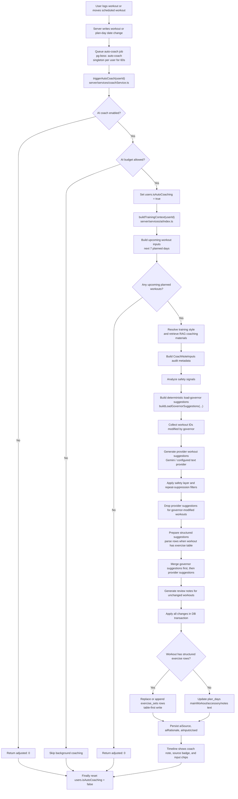
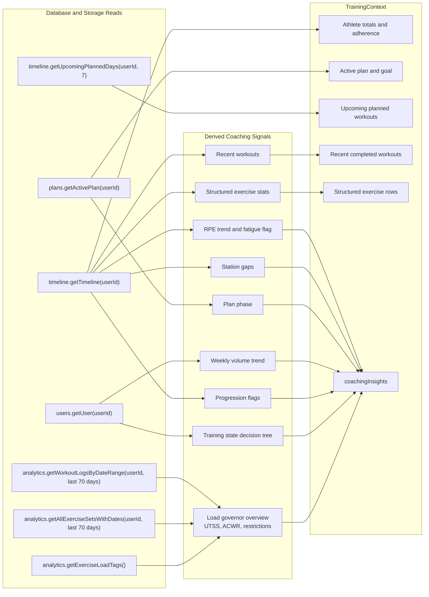
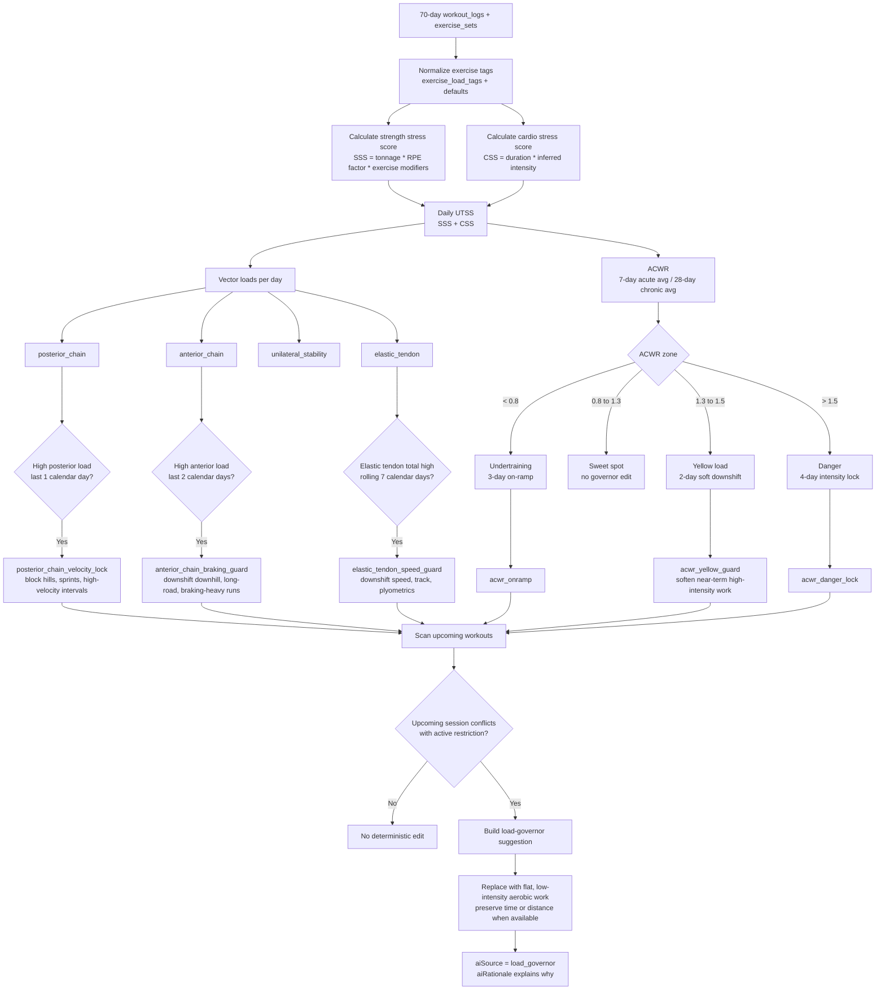
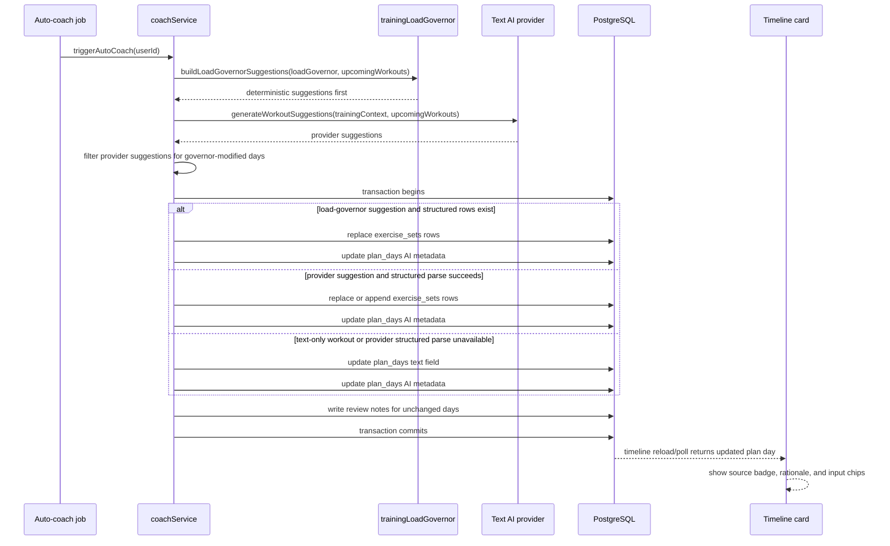

# AI Coach Auto-Regulation Flow

[Back to README](../README.md)

This document shows how the auto-coach updates workouts after new training evidence arrives. The current flow has two decision layers:

- **Load governor:** deterministic UTSS, ACWR, and biomechanical-overlap rules.
- **Provider coach:** AI-generated suggestions and review notes using the same training context, RAG materials, and training-style prompt rules.

The load governor runs first. If it modifies an upcoming workout, provider suggestions for that same workout are filtered out so deterministic safety edits are not overwritten by the model.

---

## End-To-End Flow

---

## Training Context Inputs

`buildTrainingContext` is the shared context builder used by auto-coach suggestions, review notes, and coach-facing prompt flows.

---

## Load Governor Decision Flow

The mechanical governor converts completed training history into a unified load model, then turns active restrictions into deterministic edits.

---

## Write Path And User Visibility

---

## Source Map

| Area | Primary files |
| --- | --- |
| Auto-coach job worker | `server/queue.ts` |
| Workout creation trigger | `server/services/workoutService/workouts.ts` |
| Reschedule trigger | `server/services/planService.ts` |
| Auto-coach orchestration | `server/services/coachService.ts` |
| Shared training context | `server/services/ai/index.ts`, `server/gemini/types.ts` |
| Provider suggestion prompt | `server/gemini/suggestionService.ts` |
| Deterministic load math + ACWR/restrictions | `server/services/trainingLoadService.ts` |
| Load-governor suggestion builder (`buildLoadGovernorSuggestions`) | `server/services/trainingLoadGovernor.ts` |
| Exercise load tag schema | `shared/schema/tables.ts`, `migrations/0049_exercise_load_tags.sql` |
| Coach-note metadata type | `shared/schema/types/plans.ts` |
| Timeline coach note UI | `client/src/components/timeline/timeline-workout-card/CoachNote.tsx` |
| Training overview load chart | `client/src/components/analytics/training-overview/AcwrTrendChart.tsx` |

---

## Important Behavior Guarantees

- Governor suggestions are prepared before provider suggestions.
- Governor-modified workouts are excluded from provider modification output.
- Load-governor edits stay table-first on structured workouts; if a structured governor write cannot be prepared, it does not silently fall back to text.
- Provider suggestions prefer structured `exercise_sets` writes when rows exist, but can still use the existing text fallback when parsing structured rows is unavailable.
- Deterministic governor writes use `aiSource: "load_governor"`.
- ACWR yellow now creates a medium-priority, short-window soft downshift for high-intensity sessions instead of only surfacing passive metadata.
- The visible timeline note keeps the rationale and input audit metadata on `plan_days.aiRationale` and `plan_days.aiInputsUsed`.
- Users can still manually edit any downshifted workout afterward.
