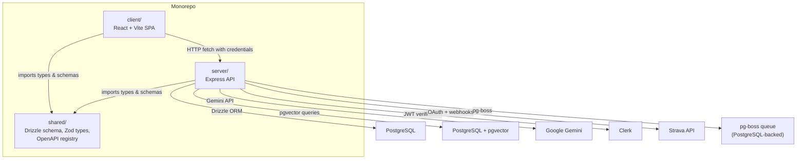
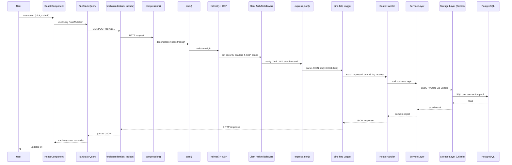
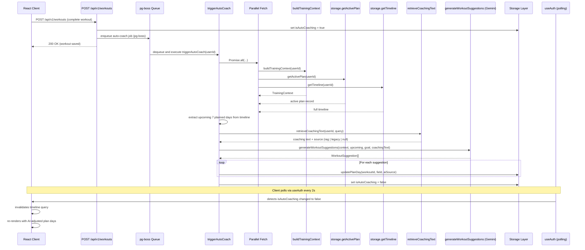
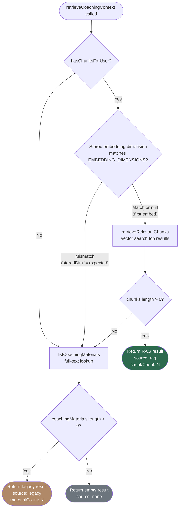
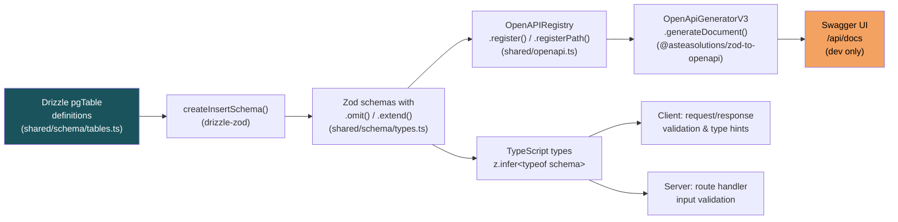
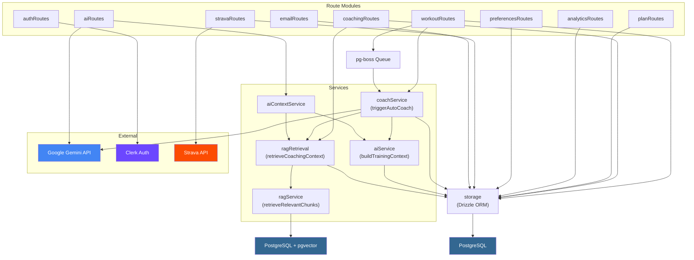

[Back to README](../README.md)

# Architecture Guide

This document describes the high-level architecture of the Hyrox Companion (fitai.coach) project -- a full-stack TypeScript monorepo combining a React frontend, an Express API server, PostgreSQL with pgvector, Google Gemini AI, Clerk authentication, and Strava integration.

---

## 1. Overview

The repository is organized into three top-level source directories that share a common TypeScript toolchain:

```
Hyrox-Companion/
  client/          React SPA (Vite, wouter, TanStack Query, Clerk React SDK)
  server/          Express API (Clerk Express SDK, Drizzle ORM, pg-boss, Gemini)
  shared/          Code shared between client and server (schema, OpenAPI, types)
```



**Key conventions:**
- All API routes live under `/api/v1/`.
- The client is served by Vite dev server in development and as static files in production (same origin as the API).
- `shared/` is imported directly by both `client/` and `server/` via TypeScript path aliases -- there is no separate build step.

---

## 2. Request Lifecycle

Every authenticated request follows this path from the browser to the database and back.



**Middleware stack order** (as registered in `server/index.ts`):

1. `compression()` -- gzip/brotli response compression
2. `cors()` -- origin allowlist with `credentials: true`
3. `helmet()` -- security headers (HSTS, X-Frame-Options, etc.)
4. CSP nonce middleware -- per-request nonce for `<script>` tags (production only)
5. Custom CSP override -- fine-grained Content-Security-Policy with Clerk and Strava domains
6. Permissions-Policy header
7. `express.json()` -- body parsing with 100kb default limit (2mb for `/api/v1/coaching-materials`)
8. `express.urlencoded()` -- form body parsing (100kb limit)
9. `pino-http` -- structured request logging with Clerk userId extraction
10. `doubleCsrfProtection` -- CSRF verification on mutating requests (double-submit cookie via `csrf-csrf`)
11. `idempotencyMiddleware` -- server-side idempotency enforcement via `X-Idempotency-Key` header (after auth)
12. Route handlers (registered via `registerRoutes`)

---

## 3. Auto-Coach Pipeline

When a user completes a workout, the auto-coach pipeline adjusts upcoming plan days using AI. The pipeline is queue-driven via pg-boss to avoid blocking the request.



**Key details:**
- `isAutoCoaching` is a boolean flag on the `users` table that the client polls to detect when coaching is complete.
- The pipeline uses a `try/finally` block to guarantee `isAutoCoaching` is reset to `false` even on failure.
- Suggestions can either `replace` or `append` content to `mainWorkout` or `accessory` fields on plan days.
- The `aiSource` field on each plan day records whether the AI used RAG chunks (`"rag"`), legacy materials (`"legacy"`), or neither (`null`).

---

## 4. RAG Retrieval Decision Tree

The RAG retrieval system (`server/services/ragRetrieval.ts`) determines whether to use vector search, legacy full-text materials, or neither when building coaching context.



**Fallback reasons tracked in `ragInfo.fallbackReason`:**
- `dimension_mismatch` -- stored embeddings were generated with a different model dimension; user must re-embed via settings.
- `no_embeddings` -- chunks exist but have no embedding vectors yet.
- `no_matching_chunks` -- vector search returned zero results for the query.
- `retrieval_error` -- an exception occurred during vector search.

In production, `sanitizeRagInfo` strips `chunks` and `fallbackReason` from API responses to avoid leaking internal diagnostics.

---

## 5. Schema Pipeline

Type safety flows from the database schema all the way to the Swagger UI documentation through a chain of code generation steps.



**Step-by-step:**

1. **Drizzle table definitions** (`shared/schema/tables.ts`) -- `pgTable()` calls define columns, types, indexes, and constraints. A custom `vector()` type maps PostgreSQL `vector(N)` to TypeScript `number[]`.
2. **drizzle-zod generation** -- `createInsertSchema()` auto-generates a Zod schema from each Drizzle table, handling column types, nullability, and defaults.
3. **Zod refinement** (`shared/schema/types.ts`) -- `.omit({ id: true })` removes server-generated fields; `.extend()` adds stricter validation (e.g., `z.number().min(1).max(14)`).
4. **OpenAPI registration** (`shared/openapi.ts`) -- Schemas are registered with `@asteasolutions/zod-to-openapi`'s `OpenAPIRegistry`, including path definitions with examples and security schemes.
5. **Document generation** -- `OpenApiGeneratorV3` produces an OpenAPI 3.0 JSON spec from the registry.
6. **Swagger UI** -- In development, `swagger-ui-express` serves interactive docs at `/api/docs` with a relaxed CSP.

---

## 6. Service Dependencies

The server is organized into route modules, service modules, and a storage layer. This diagram shows the dependency graph.



**Notable patterns:**
- **Route handlers** are thin orchestrators -- they validate input, delegate to use-case functions (e.g., `workoutUseCases.ts`), and return responses. The use-case layer separates transport concerns from business logic orchestration.
- **coachService** is the most connected service, depending on `aiService`, `ragRetrieval`, Gemini, and the storage layer.
- **ragRetrieval** delegates vector search to `ragService`, which queries the `pgvector` extension directly via a separate connection pool (`vectorPool`).
- **pg-boss** uses the same PostgreSQL database for its job queue, keeping infrastructure simple.
- **Storage** is a single abstraction layer over Drizzle ORM; all database access goes through it (including idempotency key caching via `IdempotencyStorage`).

---

## 7. Cross-References

Detailed documentation for each subsystem:

| Document | Description |
|---|---|
| [Client Architecture](./client.md) | React components, routing (wouter), lazy loading, theme, sidebar layout |
| [Server Architecture](./server.md) | Express setup, middleware stack, route registration, error handling |
| [Database](./database.md) | Drizzle schema, migrations, tables, indexes, pgvector setup |
| [AI and RAG](./ai-and-rag.md) | Gemini integration, embedding pipeline, vector search, prompt construction |
| [State Management](./state-management.md) | TanStack Query, cache invalidation, optimistic updates, polling |
| [API Reference](./api-reference.md) | Endpoint catalog, request/response shapes, status codes |
| [Authentication](./authentication.md) | Clerk setup, JWT verification, dev auth bypass, webhook sync |
| [Integrations](./integrations.md) | Strava OAuth, activity sync, pg-boss queue, Resend email, Sentry |
| [Testing](./testing.md) | Test strategy, Cypress E2E, Vitest unit tests, CI pipeline |
