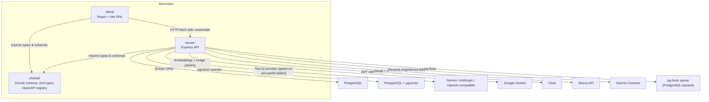
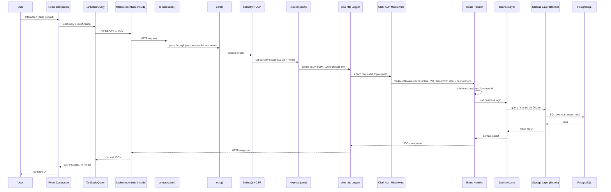
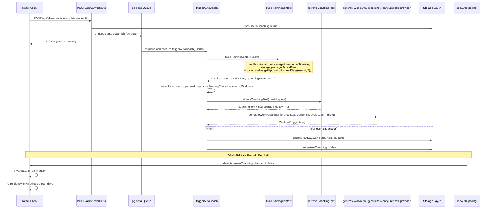
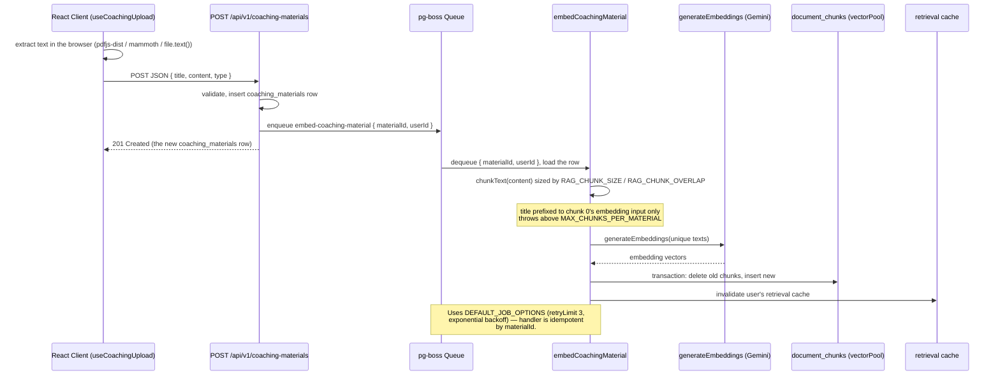
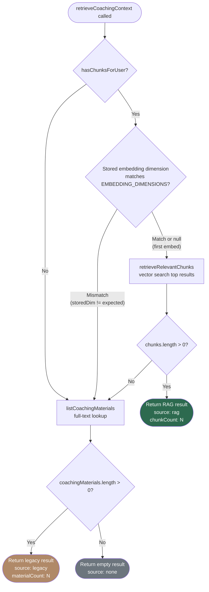
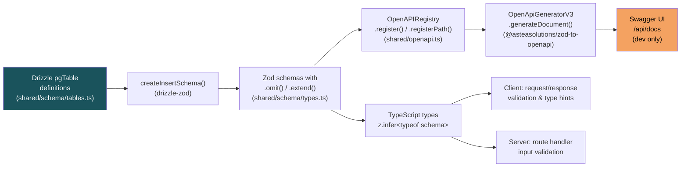
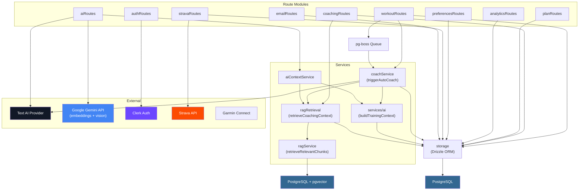
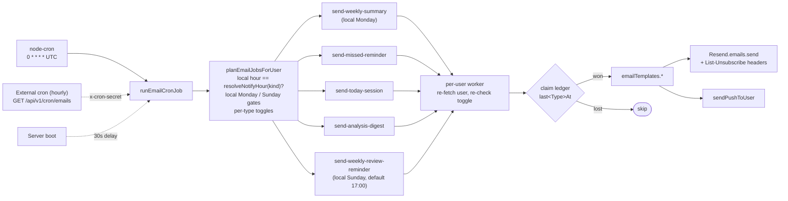

[Back to README](../README.md)

# Architecture Guide

This document describes the high-level architecture of the fitai.coach project -- a full-stack TypeScript monorepo combining a React frontend, an Express API server, PostgreSQL with pgvector, a modular text AI provider layer, Gemini embeddings and vision parsing, Clerk authentication, Strava and Garmin Connect activity sync, and a GDPR-compliant opt-in consent model for every outbound data flow.

---

## 1. Overview

The repository is organized into three top-level source directories that share a common TypeScript toolchain:

```
Hyrox-Companion/
  client/          React SPA (Vite, wouter, TanStack Query, Clerk React SDK)
  server/          Express API (Clerk Express SDK, Drizzle ORM, pg-boss, AI providers)
  shared/          Code shared between client and server (schema, OpenAPI, types)
```


```mermaid
graph TD
    subgraph Monorepo
        CLIENT["client/\nReact + Vite SPA"]
        SERVER["server/\nExpress API"]
        SHARED["shared/\nDrizzle schema, Zod types,\nOpenAPI registry"]
    end

    CLIENT -- "imports types & schemas" --> SHARED
    SERVER -- "imports types & schemas" --> SHARED
    CLIENT -- "HTTP fetch with credentials" --> SERVER

    SERVER -- "Drizzle ORM" --> PG["PostgreSQL"]
    SERVER -- "pgvector queries" --> PGVEC["PostgreSQL + pgvector"]
    SERVER -- "Text AI provider (gated on aiCoachEnabled)" --> AITEXT["Gemini / Anthropic / OpenAI-compatible"]
    SERVER -- "Embeddings + image parsing" --> GEMINI["Google Gemini"]
    SERVER -- "JWT verification" --> CLERK["Clerk"]
    SERVER -- "OAuth + webhooks" --> STRAVA["Strava API"]
    SERVER -- "Reverse-engineered SSO" --> GARMIN["Garmin Connect"]
    SERVER -- "pg-boss" --> PGBOSS["pg-boss queue\n(PostgreSQL-backed)"]
```

**Key conventions:**
- All API routes live under `/api/v1/`.
- The client is served by Vite dev server in development and as static files in production (same origin as the API).
- `shared/` is imported directly by both `client/` and `server/` via TypeScript path aliases -- there is no separate build step.

---

## 2. Request Lifecycle

Every authenticated request follows this path from the browser to the database and back.


```mermaid
sequenceDiagram
    participant User
    participant React as React Component
    participant TQ as TanStack Query
    participant Fetch as fetch (credentials: include)
    participant Compress as compression()
    participant CORS as cors()
    participant Helmet as helmet() + CSP
    participant Body as express.json()
    participant Log as pino-http Logger
    participant Auth as Clerk Auth Middleware
    participant Route as Route Handler
    participant Service as Service Layer
    participant Storage as Storage Layer (Drizzle)
    participant DB as PostgreSQL

    User->>React: Interaction (click, submit)
    React->>TQ: useQuery / useMutation
    TQ->>Fetch: GET/POST /api/v1/...
    Fetch->>Compress: HTTP request
    Compress->>CORS: pass through (compresses the response)
    CORS->>Helmet: validate origin
    Helmet->>Body: set security headers & CSP nonce
    Body->>Log: parse JSON body (100kb default limit)
    Log->>Auth: attach requestId, log request
    Auth->>Route: clerkMiddleware verifies Clerk JWT, then CSRF check on mutations
    Route->>Route: isAuthenticated resolves userId
    Route->>Service: call business logic
    Service->>Storage: query / mutate via Drizzle
    Storage->>DB: SQL over connection pool
    DB-->>Storage: rows
    Storage-->>Service: typed result
    Service-->>Route: domain object
    Route-->>Log: JSON response
    Log-->>Fetch: HTTP response
    Fetch-->>TQ: parsed JSON
    TQ-->>React: cache update, re-render
    React-->>User: updated UI
```

**Middleware stack order** (as registered in `server/index.ts`):

1. `compression()` -- gzip/brotli response compression (skipped for `text/event-stream`)
2. `GET /api/v1/health` -- health endpoint, registered **before CORS** so platform probes always reach it
3. `cors()` -- origin allowlist with `credentials: true`
4. CSP nonce middleware -- per-request nonce for `<script>` tags (production only)
5. `helmet()` -- security headers, including the full Content-Security-Policy (Clerk/Strava/Sentry origins + per-request nonce) built by `buildCspDirectives()` in `server/middleware/csp.ts`, plus HSTS with preload, X-Frame-Options, etc.
6. Permissions-Policy header
7. `express.json()` -- body parsing: 2mb for `/api/v1/coaching-materials`, 10mb for image-parse routes, 100kb default
8. `express.urlencoded()` -- form body parsing (100kb limit)
9. `cookieParser()` -- required by the CSRF double-submit middleware
10. `pino-http` -- structured request logging; it runs before Clerk auth, so `req.log` carries `userId: "anonymous"` and only the completion line of a failed (>= 400) request logs the real Clerk user id
11. request-context wiring -- async context carrying `requestId` only
12. Route handlers (registered via `registerRoutes`)

`registerRoutes()` first installs `clerkMiddleware()` via `setupAuth()` (`server/clerkAuth.ts`, when Clerk keys are configured), so Clerk JWT verification runs after everything above, then mounts `csrfProtection` on `/api/v1`; idempotency runs per protected mutating route via the `protectedRouteBuilder` guards rather than as a global middleware.

---

## 3. Auto-Coach Pipeline

When a user completes a workout, the auto-coach pipeline adjusts upcoming plan days using AI. The pipeline is queue-driven via pg-boss to avoid blocking the request.


```mermaid
sequenceDiagram
    participant Client as React Client
    participant API as POST /api/v1/workouts
    participant Queue as pg-boss Queue
    participant Coach as triggerAutoCoach
    participant AI as buildTrainingContext
    participant RAG as retrieveCoachingText
    participant TextAI as generateWorkoutSuggestions (configured text provider)
    participant Storage as Storage Layer
    participant Poll as useAuth (polling)

    Client->>API: POST /api/v1/workouts (complete workout)
    API->>Storage: set isAutoCoaching = true
    API->>Queue: enqueue auto-coach job (pg-boss)
    API-->>Client: 200 OK (workout saved)

    Queue->>Coach: dequeue and execute triggerAutoCoach(userId)

    Coach->>AI: buildTrainingContext(userId)
    Note over AI: one Promise.all over storage.timeline.getTimeline,<br/>storage.plans.getActivePlan,<br/>storage.timeline.getUpcomingPlannedDays(userId, 7), ...
    AI-->>Coach: TrainingContext (activePlan, upcomingWorkouts, ...)

    Coach->>Coach: take the upcoming planned days from TrainingContext.upcomingWorkouts

    Coach->>RAG: retrieveCoachingText(userId, query)
    RAG-->>Coach: coaching text + source (rag | legacy | null)

    Coach->>TextAI: generateWorkoutSuggestions(context, upcoming, goal, coachingText)
    TextAI-->>Coach: WorkoutSuggestion[]

    loop For each suggestion
        Coach->>Storage: updatePlanDay(workoutId, field, aiSource)
    end

    Coach->>Storage: set isAutoCoaching = false

    Note over Client,Poll: Client polls via useAuth every 2s
    Poll->>Client: detects isAutoCoaching changed to false
    Client->>Client: invalidates timeline query
    Client->>Client: re-renders with AI-adjusted plan days
```

**Key details:**
- `isAutoCoaching` is a boolean flag on the `users` table that the client polls to detect when coaching is complete.
- The pipeline uses a `try/finally` block to guarantee `isAutoCoaching` is reset to `false` even on failure.
- Suggestions can either `replace` or `append` content to `mainWorkout` or `accessory` fields on plan days.
- The `aiSource` field on each plan day records whether the AI used RAG chunks (`"rag"`), legacy materials (`"legacy"`), or neither (`null`).
- Suggestions pass through a safety layer (`aiSafety.ts`) and a repeat-modification guard (`aiModificationGuard.ts`) that suppresses repeated AI fatigue/volume reductions on an unchanged workout. See [AI and RAG](./ai-and-rag.md) for the guard's fingerprinting logic.

---

## 3b. RAG Ingest Pipeline

Coaching materials (typed principles, or `.txt` / `.md` / `.csv` / `.pdf` / `.docx` files) are reduced to plaintext **in the browser**, posted as JSON, then chunked, embedded, and persisted on the **vector** pool. The read path (§4 below) queries the same `document_chunks` table that this pipeline writes.


```mermaid
sequenceDiagram
    participant Client as React Client (useCoachingUpload)
    participant Upload as POST /api/v1/coaching-materials
    participant Queue as pg-boss Queue
    participant Embed as embedCoachingMaterial
    participant Gemini as generateEmbeddings (Gemini)
    participant Vector as document_chunks (vectorPool)
    participant Cache as retrieval cache

    Client->>Client: extract text in the browser (pdfjs-dist / mammoth / file.text())
    Client->>Upload: POST JSON { title, content, type }
    Upload->>Upload: validate, insert coaching_materials row
    Upload->>Queue: enqueue embed-coaching-material { materialId, userId }
    Upload-->>Client: 201 Created (the new coaching_materials row)

    Queue->>Embed: dequeue { materialId, userId }, load the row
    Embed->>Embed: chunkText(content) sized by RAG_CHUNK_SIZE / RAG_CHUNK_OVERLAP
    Note over Embed: title prefixed to chunk 0's embedding input only<br/>throws above MAX_CHUNKS_PER_MATERIAL

    Embed->>Gemini: generateEmbeddings(unique texts)
    Gemini-->>Embed: embedding vectors

    Embed->>Vector: transaction: delete old chunks, insert new
    Embed->>Cache: invalidate user's retrieval cache

    Note over Queue,Embed: Uses DEFAULT_JOB_OPTIONS (retryLimit 3,<br/>exponential backoff) — handler is idempotent<br/>by materialId.
```

**Key details:**
- **Parsing happens in the browser**: `useCoachingUpload` (`client/src/components/settings/coaching/useCoachingUpload.ts`) lazy-loads `pdfjs-dist` for PDF and `mammoth` for DOCX and reads other files with `file.text()`, then sends only the extracted text. The server never receives the original file; the route accepts JSON `{ title, content, type }` (`type` is `principles` or `document`) under a 2 MB body limit. `coaching_materials` has no status column: the response is the created row, and embedding progress is derived from `document_chunks` (per-material `chunkCount` / `hasEmbeddings` in `GET /api/v1/coaching-materials/rag-status`).
- **Chunking**: `chunkText()` in `server/services/ragService.ts` prefers paragraph / sentence boundaries (`\n\n`, `. `) to keep semantic units intact, with `RAG_CHUNK_OVERLAP` characters bridging adjacent chunks for context continuity.
- **Dimension awareness**: the embedding dimension is recorded per-chunk so the retrieval path (§4) can detect model upgrades and fall back to legacy full-text materials when dimensions mismatch.
- **Idempotency**: re-enqueuing the same `materialId` replaces the existing chunks in a single transaction so the UI never observes a material in a half-embedded state.

---


## Route Declaration Convention (Protected Mutations)

All protected mutating endpoints in `server/routes/` and `server/routes/workouts/` must be declared with `protectedRouteBuilder` helpers, not direct middleware stacks.

**Required builder usage**
- `protectedPost(router, path, options, handler)` for protected `POST` mutations.
- `protectedPatch(router, path, options, handler)` for protected `PATCH` mutations.
- `protectedDelete(router, path, options, handler)` for protected `DELETE` mutations.

**Canonical guard order (enforced by tests):**
1. auth/idempotency guards (`protectedMutationGuards`)
2. rate limiter
3. AI consent/budget guards (when enabled)
4. validation middleware
5. custom middleware
6. async handler wrapper

```ts
// ✅ Required pattern
protectedPost(router, "/api/v1/workouts", {
  limiter: rateLimiter("workout", 40),
  middleware: [validateBody(createWorkoutRouteSchema)],
}, async (req, res) => {
  // handler body
});

// ❌ Avoid direct stacking on protected mutations
router.post("/api/v1/workouts", isAuthenticated, rateLimiter("workout", 40), asyncHandler(handler));
```

A compliance test in `server/routes/__tests__/protectedRouteBuilderCompliance.test.ts` fails CI if protected mutating routes bypass the builder.

---

## 4. RAG Retrieval Decision Tree

The RAG retrieval system (`server/services/ragRetrieval.ts`) determines whether to use vector search, legacy full-text materials, or neither when building coaching context.


```mermaid
flowchart TD
    START([retrieveCoachingContext called]) --> HAS_CHUNKS{hasChunksForUser?}

    HAS_CHUNKS -- No --> FALLBACK_LEGACY

    HAS_CHUNKS -- Yes --> DIM_CHECK{Stored embedding dimension\nmatches EMBEDDING_DIMENSIONS?}

    DIM_CHECK -- "Mismatch\n(storedDim != expected)" --> FALLBACK_LEGACY
    DIM_CHECK -- "Match or null\n(first embed)" --> VECTOR_SEARCH[retrieveRelevantChunks\nvector search top results]

    VECTOR_SEARCH --> HAS_RESULTS{chunks.length > 0?}

    HAS_RESULTS -- Yes --> RETURN_RAG([Return RAG result\nsource: rag\nchunkCount: N])

    HAS_RESULTS -- No --> FALLBACK_LEGACY

    FALLBACK_LEGACY[listCoachingMaterials\nfull-text lookup] --> HAS_MATERIALS{coachingMaterials.length > 0?}

    HAS_MATERIALS -- Yes --> RETURN_LEGACY([Return legacy result\nsource: legacy\nmaterialCount: N])

    HAS_MATERIALS -- No --> RETURN_NONE([Return empty result\nsource: none])

    style RETURN_RAG fill:#2d6a4f,color:#fff
    style RETURN_LEGACY fill:#b08968,color:#fff
    style RETURN_NONE fill:#6c757d,color:#fff
```

**Fallback reasons tracked in `ragInfo.fallbackReason`:**
- `dimension_mismatch` -- stored embeddings were generated with a different model dimension; user must re-embed via settings.
- `no_embeddings` -- chunks exist but have no embedding vectors yet.
- `no_matching_chunks` -- vector search returned zero results for the query.
- `retrieval_error` -- an exception occurred during vector search.

In production, `sanitizeRagInfo` strips `chunks` and `fallbackReason` from API responses to avoid leaking internal diagnostics.

---

## 5. Schema Pipeline

Type safety flows from the database schema all the way to the Swagger UI documentation through a chain of code generation steps.


```mermaid
flowchart LR
    DRIZZLE["Drizzle pgTable\ndefinitions\n(shared/schema/tables.ts)"] --> DRIZZLE_ZOD["createInsertSchema()\n(drizzle-zod)"]

    DRIZZLE_ZOD --> ZOD_REFINE["Zod schemas with\n.omit() / .extend()\n(shared/schema/types.ts)"]

    ZOD_REFINE --> OPENAPI_REG["OpenAPIRegistry\n.register() / .registerPath()\n(shared/openapi.ts)"]

    OPENAPI_REG --> GENERATOR["OpenApiGeneratorV3\n.generateDocument()\n(@asteasolutions/zod-to-openapi)"]

    GENERATOR --> SWAGGER["Swagger UI\n/api/docs\n(dev only)"]

    ZOD_REFINE --> TS_TYPES["TypeScript types\nz.infer&lt;typeof schema&gt;"]

    TS_TYPES --> CLIENT_USE["Client: request/response\nvalidation & type hints"]
    TS_TYPES --> SERVER_USE["Server: route handler\ninput validation"]

    style DRIZZLE fill:#1a535c,color:#fff
    style SWAGGER fill:#f4a261,color:#000
```

**Step-by-step:**

1. **Drizzle table definitions** (`shared/schema/tables.ts`) -- `pgTable()` calls define columns, types, indexes, and constraints. A custom `vector()` type maps PostgreSQL `vector(N)` to TypeScript `number[]`.
2. **drizzle-zod generation** -- `createInsertSchema()` auto-generates a Zod schema from each Drizzle table, handling column types, nullability, and defaults.
3. **Zod refinement** (`shared/schema/types.ts`) -- `.omit({ id: true })` removes server-generated fields; `.extend()` adds stricter validation (e.g., `z.number().min(1).max(14)`).
4. **OpenAPI registration** (`shared/openapi.ts`) -- Schemas are registered with `@asteasolutions/zod-to-openapi`'s `OpenAPIRegistry`, including path definitions with examples and security schemes.
5. **Document generation** -- `OpenApiGeneratorV3` produces an OpenAPI 3.0 JSON spec from the registry.
6. **Swagger UI** -- In development, `swagger-ui-express` serves interactive docs at `/api/docs` with a relaxed CSP.

---

## 6. Service Dependencies

The server is organized into route modules, service modules, and a storage layer. This diagram shows the dependency graph.


```mermaid
graph TD
    subgraph Route Modules
        R_AUTH["authRoutes"]
        R_PREFS["preferencesRoutes"]
        R_EMAIL["emailRoutes"]
        R_AI["aiRoutes"]
        R_ANALYTICS["analyticsRoutes"]
        R_WORKOUTS["workoutRoutes"]
        R_PLANS["planRoutes"]
        R_COACHING["coachingRoutes"]
        R_STRAVA["stravaRoutes"]
    end

    subgraph Services
        S_COACH["coachService\n(triggerAutoCoach)"]
        S_AI["services/ai\n(buildTrainingContext)"]
        S_RAG["ragRetrieval\n(retrieveCoachingContext)"]
        S_RAG_SVC["ragService\n(retrieveRelevantChunks)"]
        S_AI_CTX["aiContextService"]
    end

    subgraph External
        AITEXT["Text AI Provider"]
        GEMINI["Google Gemini API\n(embeddings + vision)"]
        CLERK["Clerk Auth"]
        STRAVA_API["Strava API"]
        GARMIN_API["Garmin Connect"]
    end

    STORAGE["storage\n(Drizzle ORM)"]
    PG["PostgreSQL"]
    PGVEC["PostgreSQL + pgvector"]
    QUEUE["pg-boss Queue"]

    R_WORKOUTS --> S_COACH
    R_WORKOUTS --> STORAGE
    R_AI --> S_AI_CTX
    R_AI --> AITEXT
    R_AI --> GEMINI
    R_COACHING --> S_RAG
    R_COACHING --> STORAGE
    R_PLANS --> STORAGE
    R_ANALYTICS --> STORAGE
    R_PREFS --> STORAGE
    R_AUTH --> CLERK
    R_STRAVA --> STRAVA_API
    R_STRAVA --> STORAGE
    R_EMAIL --> STORAGE

    S_COACH --> S_AI
    S_COACH --> S_RAG
    S_COACH --> AITEXT
    S_COACH --> STORAGE

    S_AI_CTX --> S_AI
    S_AI_CTX --> S_RAG

    S_AI --> STORAGE
    S_RAG --> S_RAG_SVC
    S_RAG --> STORAGE
    S_RAG_SVC --> PGVEC

    STORAGE --> PG
    R_WORKOUTS --> QUEUE
    QUEUE --> S_COACH

    style AITEXT fill:#111827,color:#fff
    style GEMINI fill:#4285f4,color:#fff
    style CLERK fill:#6c47ff,color:#fff
    style STRAVA_API fill:#fc4c02,color:#fff
    style PG fill:#336791,color:#fff
    style PGVEC fill:#336791,color:#fff
```

**Notable patterns:**
- **Route handlers** are thin orchestrators -- they validate input, delegate to use-case functions (e.g., `workoutUseCases.ts`), and return responses. The use-case layer separates transport concerns from business logic orchestration.
- **coachService** is the most connected service, depending on `aiService`, `ragRetrieval`, the configured text AI provider, Gemini-specific embedding/vision helpers, and the storage layer.
- **ragRetrieval** delegates vector search to `ragService`, which queries the `pgvector` extension directly via a separate connection pool (`vectorPool`).
- **pg-boss** uses the same PostgreSQL database for its job queue, keeping infrastructure simple.
- **Storage** is a single abstraction layer over Drizzle ORM; all database access goes through it (including idempotency key caching via `IdempotencyStorage`).
- **Nutrition** is a self-contained subsystem (`server/routes/nutrition/*`, `server/services/nutrition/*`) over the same storage layer. Food search fans out to external providers (Edamam, USDA, Open Food Facts) behind a relevance gate, with local `pg_trgm` fuzzy/synonym matching and an optional semantic-embeddings tier that reuses the `pgvector` pool; per-meal fuel targets are computed by the pure, DB-free `shared/mealFuelling.ts`. See [Nutrition & Fuelling](./nutrition.md).

---

## 7. Cron → Notification Pipeline

The notification pipeline is split across three runtimes: `node-cron` ticks every hour in UTC, the tick plans and enqueues per-user jobs into pg-boss against each athlete's own wall clock, and the queue workers send email through Resend plus Web Push notifications for subscribed devices. Splitting the work this way means one user's slow send cannot block the next user, and a worker crash mid-batch only loses the in-flight job (the rest stay queued).


```mermaid
flowchart LR
    Cron["node-cron<br/>0 * * * * UTC"] --> Run[runEmailCronJob]
    Ext["External cron (hourly)<br/>GET /api/v1/cron/emails"] -. x-cron-secret .-> Run
    Startup["Server boot"] -. 30s delay .-> Run

    Run --> Plan["planEmailJobsForUser<br/>local hour == resolveNotifyHour(kind)?<br/>local Monday / Sunday gates<br/>per-type toggles"]

    Plan --> QW["send-weekly-summary<br/>(local Monday)"]
    Plan --> QM["send-missed-reminder"]
    Plan --> QT["send-today-session"]
    Plan --> QA["send-analysis-digest"]
    Plan --> QR["send-weekly-review-reminder<br/>(local Sunday, default 17:00)"]

    QW --> W["per-user worker<br/>re-fetch user, re-check toggle"]
    QM --> W
    QT --> W
    QA --> W
    QR --> W

    W --> Guard{"claim ledger<br/>last&lt;Type&gt;At"}
    Guard -- won --> Tmpl[emailTemplates.*]
    Guard -- lost --> Skip([skip])

    Tmpl --> Send["Resend.emails.send<br/>+ List-Unsubscribe headers"]
    Tmpl --> Push[sendPushToUser]
```

**Key details:**
- **Hourly UTC tick, per-athlete local gate**: `"0 * * * *"` in `server/cron.ts`. `planEmailJobsForUser()` (`server/emailScheduler.ts`) resolves each athlete's local hour and weekday from `users.user_timezone`. Each email kind has its own send hour, resolved by `resolveNotifyHour()` (`shared/notifyHours.ts`): the kind's optional `notify_hour_*` override, else the athlete's `notify_hour` (default 07:00). The exception is the weekly review reminder, which falls back to 17:00 instead. On top of the hour, the weekly summary only goes out on the athlete's local Monday and the review reminder only on their local Sunday. Fourteen other crons live in the same process (idempotency cleanup 03:30, AI-usage log cleanup 04:00, shared runtime state cleanup 04:15, structured exercise health rollup 02:10, RAG chunk prune daily at 03:50, recycle-bin purge daily at 03:45, analytics recompute hourly at :05 firing at each user's local midnight, account erasure sweep hourly at :35, nutrition push reminders hourly at :25, the food-embedding backfill every 30 minutes when semantic food search is enabled, stale `isAutoCoaching` recovery every 10 minutes, queue-depth telemetry every 5 minutes, the Strava auto-sync polling scan every 15 minutes, and the Strava webhook subscription check six-hourly and 30 s after boot). Each cron body runs under a Postgres advisory lock so only one replica performs the work even when `APP_INSTANCE_COUNT > 1`.
- **Startup catch-up**: `cron.ts` schedules one catch-up scan 30 s after every boot, as a one-shot timer (not a cron) under its own `startupEmailCatchUp` advisory lock. The per-user local-hour gate and the claim ledgers keep it idempotent, so it needs no time-of-day condition.
- **Claim before send**: every worker takes an atomic conditional `UPDATE` on its ledger column (`claimWeeklySummary` and friends in `server/storage/users.ts`) before building the email, with a window deliberately shorter than the cadence; only the winner sends.
- **Scoped retries**: the enqueue uses `sendJobNoRetry()` for the send legs because the ledger is stamped at claim time, so a retry after a post-send failure would deliver a duplicate email. Upstream jobs (parse / ingest) use `sendJob()` with the default `retryLimit: 3` because their handlers are idempotent by id.
- **No AI on the email path**: the analysis digest reads stored `analytics_results` rows only; recomputes stay with the `analyticsRecompute` cron.
- **Unsubscribe**: every send carries `List-Unsubscribe` / `List-Unsubscribe-Post` headers and a footer link to `/api/v1/emails/unsubscribe`, mounted ahead of the CSRF guard (see [integrations.md § One-Click Unsubscribe](integrations.md#one-click-unsubscribe)).
- **External trigger**: the same `runEmailCronJob` can be invoked via `GET /api/v1/cron/emails` guarded by the `CRON_SECRET` header — call it hourly when scheduling from Railway Cron or GitHub Actions instead of the in-process timer.
- **Per-job timeout**: every worker is wrapped in `runWithTimeout` (50 min, `JOB_TIMEOUT_MS`) so a hung Resend or Gemini call cannot leak a worker slot indefinitely.
- **Same pattern, different payload — stored-first analytics**: the `analyticsRecompute` cron reuses this exact fixed-UTC-tick → local-time-gate → pg-boss → worker shape. It ticks hourly, fires per user at local midnight, and enqueues `recompute-analytics` jobs that refresh the durable `analytics_results` row (Coach Insights / Race Prediction) so the next open paints a fresh result with no AI spend on the read path. See [integrations.md § Analytics Recompute](integrations.md#analytics-recompute-scan).
- See [integrations.md § Email](integrations.md#email-system-resend) for the prose walkthrough and [integrations.md § Job Queue](integrations.md#job-queue-pg-boss) for the queue-level details.

---

## 8. Cross-References

Detailed documentation for each subsystem:

| Document | Description |
|---|---|
| [Client Architecture](./client.md) | React components, routing (wouter), lazy loading, theme, sidebar layout |
| [Server Architecture](./server.md) | Express setup, middleware stack, route registration, error handling |
| [Database](./database.md) | Drizzle schema, migrations, tables, indexes, pgvector setup |
| [AI and RAG](./ai-and-rag.md) | Gemini integration, embedding pipeline, vector search, prompt construction |
| [Nutrition & Fuelling](./nutrition.md) | Food logging, search (fuzzy/synonym/semantic), per-meal fuel targets, external food sources, AI meal parsing |
| [State Management](./state-management.md) | TanStack Query, cache invalidation, optimistic updates, polling |
| [API Reference](./api-reference.md) | Endpoint catalog, request/response shapes, status codes |
| [Authentication](./authentication.md) | Clerk setup, JWT verification, dev auth bypass, webhook sync |
| [Integrations](./integrations.md) | Strava OAuth, activity sync, pg-boss queue, Resend email, Sentry |
| [Testing](./testing.md) | Test strategy, Cypress E2E, Vitest unit tests, CI pipeline |
