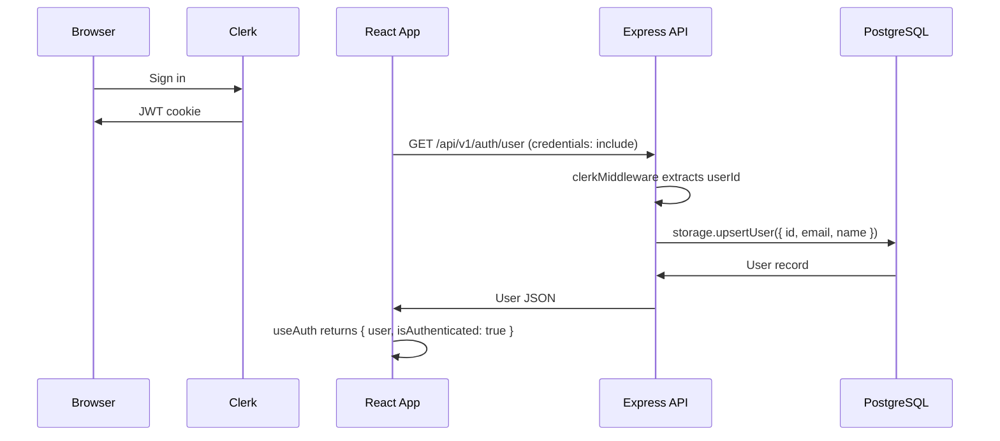

# Authentication System

## Overview

The Hyrox Companion app uses [Clerk](https://clerk.com) for authentication. Clerk provides JWT-based identity management on both the client (via `@clerk/react`) and the server (via `@clerk/express`). A development auth bypass mode exists for local development, Cypress testing, and iframe preview contexts.

The authentication flow works as follows:

1. The client authenticates the user through Clerk's hosted UI components.
2. Clerk issues a JWT that is automatically attached to every API request via session cookies.
3. The server validates the JWT using Clerk middleware and extracts the `userId`.
4. On the first authenticated API call, the server syncs the Clerk user profile into the application database.

---

## Client-Side Auth

**Key file:** `client/src/App.tsx`

### ClerkProvider

The entire application is wrapped in a `<ClerkProvider>` component from `@clerk/react`, initialized with the publishable key from the `VITE_CLERK_PUBLISHABLE_KEY` environment variable:

```tsx
<ClerkProvider publishableKey={clerkPubKey!}>
  <QueryClientProvider client={queryClient}>
    ...
  </QueryClientProvider>
</ClerkProvider>
```

When the dev auth bypass is active, `ClerkProvider` is omitted entirely and the app renders without any Clerk context.

### Conditional Rendering with Show

The `<Show>` component from `@clerk/react` gates access to the authenticated application. When the user is signed in, `<AuthenticatedLayout>` renders; otherwise, the `<Landing>` page is displayed:

```tsx
<Show when="signed-in" fallback={<Landing />}>
  <AuthenticatedLayout />
</Show>
```

### useAuth Hook

**Key file:** `client/src/hooks/useAuth.ts`

The custom `useAuth` hook abstracts over two implementations:

- **`useClerkAuthImpl`** -- The production path. Uses `useAuth` and `useUser` from `@clerk/react` to determine sign-in status. Once signed in, it fetches the database user record via a `useQuery` call to `/api/v1/auth/user`. Returns a composite user object that falls back to Clerk profile data while the database user loads.

- **`useTestAuthImpl`** -- The bypass path. Skips Clerk entirely and immediately fetches the database user from `/api/v1/auth/user`. Considers the user authenticated as soon as a database record is returned.

The hook export is selected at module load time:

```ts
export const useAuth = shouldBypassAuth ? useTestAuthImpl : useClerkAuthImpl;
```

### Request Credentials

All API requests include `credentials: "include"` so that Clerk session cookies are sent with every fetch. This is configured in the shared `apiRequest` function and the default `queryFn` in `client/src/lib/queryClient.ts`.



---

## Server-Side Auth

**Key file:** `server/clerkAuth.ts`

### setupAuth

The `setupAuth` function is called during server startup and configures authentication middleware on the Express app:

1. **Clerk keys present** -- Installs `clerkMiddleware()` from `@clerk/express`, which parses and validates Clerk JWTs on every incoming request.
2. **No Clerk keys, dev bypass enabled** -- Skips Clerk middleware and seeds a hardcoded dev user in the database.
3. **No Clerk keys, no bypass** -- Throws a fatal error, preventing the server from starting.

If the dev bypass is enabled (regardless of whether Clerk keys are also present), the dev user is always seeded as a fallback.

### isAuthenticated Middleware

The `isAuthenticated` request handler is applied to all protected routes. It runs in this order:

1. If Clerk keys are configured, call `getAuth(req)` from `@clerk/express` to extract the `userId` from the validated JWT. If a `userId` is present, sync the user to the database (see User Sync Flow below) and proceed.
2. If Clerk auth fails and the dev bypass is enabled, fall through to the dev user identity (unless the request carries an `x-test-no-bypass: true` header, used for testing 401 behavior).
3. Otherwise, return a `401 Unauthorized` JSON response.

### getUserId Helper

**Key file:** `server/types.ts`

The `getUserId(req)` function extracts the authenticated user's ID from a request:

```ts
export function getUserId(req: Request): string {
  try {
    const auth = getAuth(req);
    if (auth?.userId) return auth.userId;
  } catch {
    // fall through to dev user
  }

  if (isDev && env.ALLOW_DEV_AUTH_BYPASS === "true") {
    return DEV_USER_ID; // "dev-user"
  }

  throw new Error("User not authenticated");
}
```

Route handlers use this to obtain the current user's ID after the `isAuthenticated` middleware has already verified authentication.

---

## User Sync Flow

**Key files:** `server/clerkAuth.ts`, `server/storage/users.ts`

When a Clerk-authenticated request passes through `isAuthenticated`, the middleware calls `ensureUserExists(clerkUserId)`:

1. Check whether a user row with that ID already exists in the database.
2. If the user exists, return immediately (no remote call).
3. If the user does not exist, fetch the full profile from Clerk's API via `clerkClient.users.getUser(clerkUserId)`.
4. Upsert a row into the `users` table with:
   - `id` -- The Clerk user ID
   - `email` -- The primary email address
   - `firstName`, `lastName` -- Name fields
   - `profileImageUrl` -- Avatar URL

The `upsertUser` method in `UserStorage` uses an `INSERT ... ON CONFLICT DO UPDATE` query, so subsequent calls update the profile data if it has changed in Clerk.

For the dev bypass path, a similar `ensureDevUserExists` function creates a user with the hardcoded ID `"dev-user"`, email `dev@localhost`, and name `Dev User`.

---

## Dev Auth Bypass

The dev auth bypass allows the app to run without Clerk credentials. It is controlled by the `ALLOW_DEV_AUTH_BYPASS` environment variable and is protected by multiple guards to prevent accidental use in production.

### Activation Conditions

The bypass activates when any of the following client-side conditions are met (evaluated in `client/src/App.tsx` and `client/src/hooks/useAuth.ts`):

- **Cypress tests** -- `window.Cypress` is defined.
- **Dev preview** -- The app is running in Vite dev mode (`import.meta.env.DEV`) AND either the `VITE_CLERK_PUBLISHABLE_KEY` is missing or the page is loaded inside an iframe (`window.self !== window.top`).

On the server, the bypass activates when:

- `ALLOW_DEV_AUTH_BYPASS` is `"true"` AND `NODE_ENV` is `"development"` or `"test"`.

### Production Safety Guards

Three independent layers prevent the bypass from being used in production:

1. **Zod schema refinement** (`server/env.ts`) -- The environment variable schema includes a `.refine()` rule that rejects the combination of `NODE_ENV=production` and `ALLOW_DEV_AUTH_BYPASS=true`. The server will not start if this validation fails.

2. **Startup guard** (`server/index.ts`, lines 26-33) -- An explicit check at the top of the server entrypoint. If `ALLOW_DEV_AUTH_BYPASS=true` and `NODE_ENV=production`, the server logs a fatal message and calls `process.exit(1)`.

3. **Runtime guard** (`server/clerkAuth.ts`) -- The `isDevBypassEnabled()` function returns `false` unconditionally when `NODE_ENV` is `"production"`, regardless of the `ALLOW_DEV_AUTH_BYPASS` value.

### Hook Selection Logic

The `useAuth` export is determined at module load time (not runtime):

```typescript
const shouldBypassAuth = isCypressTest || isDevPreview;
export const useAuth = shouldBypassAuth ? useTestAuthImpl : useClerkAuthImpl;
```

- `useClerkAuthImpl`: Uses `@clerk/react` hooks (`useAuth`, `useUser`). Fetches DB user via React Query when `isSignedIn`. Falls back to Clerk profile while DB loads.
- `useTestAuthImpl`: Skips Clerk entirely. Fetches DB user directly (server uses hardcoded `dev-user` ID).
- Both implementations share `useCoachingPollInterval()` for auto-coach polling and `useAutoCoachWatcher()` for timeline invalidation.

### Behavior When Active

- **Client:** `ClerkProvider` is not rendered. The `<Show>` gate is skipped and `<AuthenticatedLayout>` renders directly. A yellow "DEV MODE" banner appears at the top of the page in dev preview mode. The `useTestAuthImpl` hook is used instead of `useClerkAuthImpl`.

- **Server:** The `isAuthenticated` middleware falls through to the dev user path when Clerk auth is not present. All requests are treated as coming from the `"dev-user"` identity. The `x-test-no-bypass: true` request header can be used to opt out of the bypass for specific requests (useful for testing unauthenticated behavior).

---

## Route Protection

**Key files:** `server/routes/auth.ts`, `server/clerkAuth.ts`, `server/routeUtils.ts`

All `/api/v1/*` routes are protected by the `isAuthenticated` middleware. Each route handler applies it explicitly:

```ts
router.get('/api/v1/auth/user', isAuthenticated, rateLimiter("auth", 20), asyncHandler(async (req, res) => {
  const userId = getUserId(req);
  const user = await storage.getUser(userId);
  res.json(user);
}));
```

The middleware chain for a typical protected route is:

1. `clerkMiddleware()` (global, if Clerk keys are present) -- Parses the JWT and attaches auth data to the request.
2. `isAuthenticated` (per-route) -- Validates that the request has a valid user identity and syncs the user to the database. Returns `401` if unauthenticated.
3. `rateLimiter(category, max)` (per-route) -- Applies per-user rate limiting, keyed by `userId`.
4. `asyncHandler(fn)` -- Wraps the route handler to catch async errors and forward them to Express error handling.

Unauthenticated requests receive:

```json
{ "error": "Unauthorized", "code": "UNAUTHORIZED" }
```

with HTTP status `401`.

---

## Session Management

Clerk manages session lifecycle entirely. The app does not implement custom token storage or refresh logic.

- **Token delivery:** Clerk session cookies are included in every request via `credentials: "include"` on all `fetch` calls.
- **Token refresh:** Handled automatically by the Clerk SDK. The `@clerk/react` provider monitors token expiration and refreshes tokens transparently.
- **Session state:** The `useAuth` / `useUser` hooks from `@clerk/react` expose reactive `isSignedIn` and `isLoaded` properties that update when the session state changes.

The server sets `trust proxy` to `1` in `setupAuth` to ensure correct client IP detection behind reverse proxies, which is important for rate limiting.

---

## Environment Variables

| Variable | Required | Side | Description |
|---|---|---|---|
| `CLERK_PUBLISHABLE_KEY` | Optional* | Server | Clerk publishable key. Passed to Clerk middleware on the server. |
| `CLERK_SECRET_KEY` | Optional* | Server | Clerk secret key. Used by `@clerk/express` to validate JWTs and by `clerkClient` to call the Clerk API. |
| `VITE_CLERK_PUBLISHABLE_KEY` | Optional* | Client | Clerk publishable key for the React client. Vite exposes this to the browser bundle. |
| `ALLOW_DEV_AUTH_BYPASS` | Optional | Both | Set to `"true"` to enable the dev auth bypass. Only permitted in `development` and `test` environments. Fatal in production. |

*The Clerk keys are optional in the Zod schema but are effectively required for production. If they are absent and `ALLOW_DEV_AUTH_BYPASS` is not `"true"`, the server will throw an error on startup.

---

See also: [Server -- Middleware Stack](server.md#middleware-stack), [Database -- Users Table](database.md#schema-tables)
