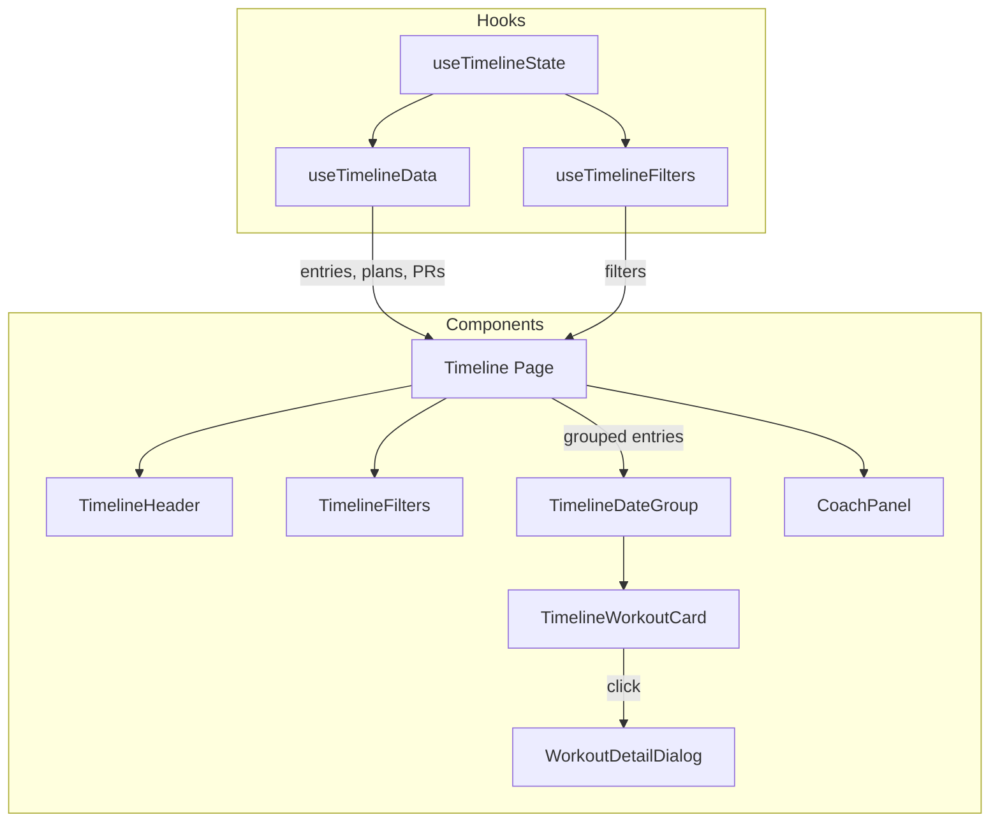

# Client Frontend Documentation

## Overview

The fitai.coach frontend is a single-page application for AI-powered fitness training planning, logging, and analytics. It is built with:

- **React 18** (via `react-dom/client` `createRoot`)
- **Vite 5** as the build tool and dev server
- **TypeScript 5.9**
- **Tailwind CSS 4** (using `@tailwindcss/vite` plugin)
- **shadcn/ui** (New York style, Radix UI primitives)
- **wouter** for client-side routing
- **TanStack React Query** for server state management
- **Clerk** for authentication
- **Sentry** for error tracking
- **vite-plugin-pwa** for Progressive Web App support

The app is branded as **fitai.coach** and serves as an AI fitness coach that lets users import training plans, log workouts (with voice input and Strava sync), view analytics with personal records, and interact with an AI coaching assistant.

---

## Entry Point and Bootstrapping

### `client/src/main.tsx`

This is the application entry point. It performs the following in order:

1. **Font imports** -- Loads Open Sans, Space Grotesk, Geist Sans, and Geist Mono at various weights via `@fontsource`.
2. **Sentry initialization** -- Conditionally initializes `@sentry/react` when the `VITE_SENTRY_DSN` environment variable is set.
3. **Root render** -- Calls `createRoot` on the `#root` DOM element and renders `<App />` wrapped in a `Sentry.ErrorBoundary` with `FallbackErrorBoundary` as its fallback UI.
4. **PWA service worker registration** -- Calls `registerSW()` from `virtual:pwa-register` with callbacks for `onNeedRefresh` (new version available) and `onOfflineReady` (app cached for offline use).

### `client/src/App.tsx`

The `App` component establishes the provider hierarchy. When Clerk authentication is active (production), the hierarchy is:

```
ClerkProvider
  QueryClientProvider
    ThemeProvider
      TooltipProvider
        AppContent
        Toaster
        OfflineIndicator
```

When auth is bypassed (dev mode or Cypress tests), ClerkProvider is omitted and the hierarchy starts at `QueryClientProvider`. A yellow `DevModeBanner` is rendered in dev preview mode.

`AppContent` uses Clerk's `<Show when="signed-in">` to conditionally render either the `AuthenticatedLayout` (sidebar + router) or the `Landing` page for unauthenticated users.

`AuthenticatedLayout` wraps the main content in a `SidebarProvider` and renders:
- A skip-to-content accessibility link
- `AppSidebar` (navigation sidebar)
- A mobile header with `SidebarTrigger` (visible on `md:hidden`)
- The `AuthenticatedRouter` as the main content area

---

## Routing

Routing uses **wouter** (`Switch` and `Route` components). There are four authenticated routes plus a catch-all 404:

| Path | Component | Feature Name | Loading |
|------|-----------|-------------|---------|
| `/` | `Timeline` | Timeline | Eagerly loaded |
| `/log` | `LogWorkout` | Log Workout | Lazy (`React.lazy`) |
| `/analytics` | `Analytics` | Analytics | Lazy (`React.lazy`) |
| `/settings` | `Settings` | Settings | Lazy (`React.lazy`) |
| `/privacy` | `Privacy` | Privacy | Lazy (`React.lazy`) — accessible signed-out |
| `*` | `NotFound` | -- | Eagerly loaded |

All routes except the 404 are wrapped in `FeatureErrorBoundaryWrapper` with a descriptive `featureName` prop. Lazy-loaded routes are wrapped in a shared `Suspense` boundary that renders a `Loader2` spinner as the fallback.

The `Landing` page is also lazy-loaded and rendered outside the authenticated layout when the user is not signed in.

---

## Pages

### Timeline (`client/src/pages/Timeline.tsx`)

The home page and primary view. Displays a chronological timeline of training plan days and logged workouts. Key features:

- **Onboarding wizard** -- Shown for new users via `OnboardingWizard` dialog.
- **AI Coach panel** -- A slide-out `CoachPanel` for chatting with the AI coach, visible as a sidebar on desktop and a fullscreen overlay on mobile.
- **Virtual scrolling** -- Uses `@tanstack/react-virtual` (`useVirtualizer`) to efficiently render large timeline lists.
- **Timeline filtering** -- Filter by plan and by workout status (completed, planned, skipped). Collapsible past/future groups with "show more" buttons.
- **Plan management** -- CSV import (`ImportPreviewDialog`), plan scheduling (`SchedulePlanDialog`), plan renaming, and goal setting.
- **Workout actions** -- Mark complete, change status, skip with confirmation (`SkipConfirmDialog`), view/edit details (`WorkoutDetailDialog`), delete, and combine workouts (`CombineWorkoutsDialog`).
- **Floating action button** -- Toggles the coach panel.

State management is centralized in the `useTimelineState` custom hook.

### Log Workout (`client/src/pages/LogWorkout.tsx`)

A form for logging new workouts. Features a two-column layout on desktop:

- **Left column** -- Workout title, date picker, RPE selector, notes (with voice input via `VoiceFieldButton`), and save button.
- **Right column** -- Workout content with a mode selector:
  - **Text mode** (`WorkoutTextMode`) -- Free-text workout description with voice dictation and AI parsing (`parseMutation`).
  - **Exercise mode** (`WorkoutExerciseMode`) -- Structured entry with drag-and-drop exercise blocks (via `@dnd-kit`), exercise selectors, sets/reps/weight inputs.

Uses `useWorkoutEditor` and `useWorkoutForm` custom hooks. Respects user unit preferences (kg/lb, km/mi) via `useUnitPreferences`.

### Analytics (`client/src/pages/Analytics.tsx`)

Displays training data analysis across four tabs:

- **Overview** (`TrainingOverviewTab`) -- Training volume summary, completion rates, streaks, weekly goal tracking, and workout heatmap. Four summary cards (total workouts, avg/week, total duration, avg duration) render a `DeltaIndicator` showing the percentage change versus the equal-length prior period (derived server-side — see [`previousStats` in `/training-overview`](api-reference.md#get-apiv1training-overview)). The weekly workout chart overlays shaded bands for any timeline annotations that intersect the visible window.
- **Progression** (`ExerciseProgressionTab`) -- Exercise-level progression charts over time.
- **Records** (`PersonalRecordsTab`) -- Personal records across all exercises.
- **Breakdown** (`CategoryBreakdownTab`) -- Category-level training distribution (functional, running, strength, conditioning).

A date range selector filters data across all tabs (30 days, 90 days, 6 months, 1 year, all time).

### Settings (`client/src/pages/Settings.tsx`)

User preferences and account management. Organized into sections:

- **ProfileSection** -- Displays user name and avatar.
- **StravaSection** -- Connect/disconnect Strava, view sync status. Handles OAuth callback query parameters (`?strava=connected` or `?strava=error`).
- **GarminSection** -- Email/password credential form for the Garmin Connect link, status/last-sync badge, and a manual "Sync now" button. Surfaces the `lastError` banner when a prior sync left the connection in a broken state and disables sync buttons when the global 429 circuit breaker is tripped.
- **PreferencesSection** -- Weight unit (kg/lb), distance unit (km/mi), weekly workout goal. Email toggles are now split: a master `emailNotifications` switch plus nested per-type toggles for the weekly summary and the missed-workout reminder (the nested pair is disabled and grayed out when the master is off). The AI-coach toggle is the **consent gate** for all Gemini calls — it defaults off for new users, and the AI features in the app are hidden or disabled until the user flips it on.
- **CoachingSection** -- AI coaching configuration and materials management.
- **DataToolsSection** -- Data export and account deletion. The "Delete account" flow confirms with a hold-to-delete button, then calls `DELETE /api/v1/account` and hard-redirects to the landing page after Clerk sign-out.

Changes are tracked locally and saved via a single "Save Settings" button.

### Privacy (`client/src/pages/Privacy.tsx`)

First-party privacy policy page. Lists each third-party processor the app sends data to (Clerk for auth, Google Gemini for AI features when `aiCoachEnabled`, Strava for activity sync when connected, Garmin for activity sync when connected, Resend for email when `emailNotifications`, Sentry for error telemetry) with a plain-language description of what data each receives. The Landing page footer and the Settings page both link here. The route is accessible while signed out so prospective users can read it before sign-up.

### Landing (`client/src/pages/Landing.tsx`)

Marketing/landing page for unauthenticated users. Contains:

- Sticky header with branding and "Log In" button (via Clerk `SignInButton`).
- Hero section with animated timeline mockup and CTA buttons.
- Feature highlights (AI Auto-Coach, Training Timeline, Strava Integration, Analytics & PRs).
- "How It Works" three-step flow (Import Plan, Train & Log, AI Adapts).
- Exercise category grid (Functional, Running, Strength, Conditioning).
- Final CTA section and footer.

Uses `IntersectionObserver` for fade-up scroll animations.

### Not Found (`client/src/pages/not-found.tsx`)

Simple 404 page rendered for unmatched routes.

---

## Component Architecture

Components are organized into subdirectories under `client/src/components/`:

### `ui/` -- shadcn/ui Primitives

Foundational UI building blocks generated via shadcn/ui CLI. Includes: `accordion`, `avatar`, `badge`, `button`, `card`, `dialog`, `input`, `select`, `sidebar`, `tabs`, `toast`, `toaster`, `tooltip`, and more. Also includes the custom `OfflineIndicator` component.

### `analytics/` -- Analytics Tab Components

- `TrainingOverviewTab` -- Summary cards, completion rates, workout heatmap.
- `DeltaIndicator` -- Arrow + percentage chip rendered on each of the four overview stat cards. Consumes `currentStats` / `previousStats` from `GET /api/v1/training-overview` and handles the "no prior data" case by rendering nothing.
- `ExerciseProgressionTab` -- Per-exercise charts.
- `PersonalRecordsTab` / `PersonalRecordItem` -- PR listings.
- `CategoryBreakdownTab` -- Training distribution by category.
- `MiniLineChart`, `MiniBarChart` -- Reusable small chart components.
- `WorkoutHeatmap` -- GitHub-style activity heatmap.
- `chartConstants.ts` -- Shared chart configuration.

### `coach/` -- AI Coach Panel Components

- `CoachPanelHeader` -- Title, clear history, close button. Action buttons include descriptive tooltips for accessibility.
- `CoachPanelStats` / `StatBadge` -- Training statistics summary.
- `CoachPanelChatArea` -- Chat message list with suggestion cards.
- `CoachPanelFooter` -- Quick actions and message input.
- `SuggestionCard` -- AI workout suggestion with apply/dismiss actions.
- `SuggestionsTab` -- Hook and logic for fetching/applying suggestions.

### `onboarding/` -- Onboarding Wizard Steps

- `WelcomeStep` -- Introduction screen.
- `UnitsStep` -- Weight and distance unit selection.
- `GoalStep` -- Fitness goal selection.
- `PlanStep` -- Plan choice (sample plan, import CSV, AI-generated, or skip).
- `ScheduleStep` -- Start date picker for the training plan.

### `plans/` -- Plan Management

- `GeneratePlanDialog` -- AI-powered training plan generation dialog.

### `settings/` -- Settings Page Sections

- `ProfileSection` -- User profile display.
- `StravaSection` -- Strava connection management.
- `GarminSection` -- Garmin Connect credential form, status display, manual sync button.
- `PreferencesSection` -- Unit preferences, weekly goal, master email toggle + nested per-type email toggles (`emailWeeklySummary`, `emailMissedReminder`), AI consent toggle (`aiCoachEnabled`).
- `DataToolsSection` -- Data export + account deletion (hold-to-confirm → `DELETE /api/v1/account`).
- `CoachingSection` -- AI coaching configuration.
- `coaching/CoachingMaterialList` -- Uploaded coaching materials list.
- `coaching/CoachingUploadDialog` -- Upload dialog for coaching materials.
- `coaching/RagStatusCard` -- RAG processing status indicator.
- `coaching/useCoachingUpload.ts` -- Upload logic hook.

### `timeline/` -- Timeline Page Components

The largest component group, further subdivided:

- **Top-level**: `TimelineHeader`, `TimelineSkeleton`, `TimelineEmptyState`, `TimelineDateGroup`, `FloatingActionButton`, `TimelineTodayIndicator` (jump-to-today pill; hidden when today is filtered out of the current view), `CoachReviewingIndicator`, `SuggestionsPanel`.
- **Annotations**: `AnnotationsDialog`, `TimelineAnnotationCard`, `AnnotationTypeIcon` — inline annotation rows rendered as first-class log entries on the Timeline for injury / illness / travel / rest periods.
- **Dialogs**: `SchedulePlanDialog`, `SkipConfirmDialog`, `ImportPreviewDialog`, `EditWorkoutDialog`, `ConfirmDialog`. (The workout detail dialog has graduated to its own top-level `workout-detail/` directory — see below.)
- **`timeline-filters/`**: `TimelineFilters`, `PlanSelector`, `GoalDialog`, `csv-utils.ts`.
- **`timeline-workout-card/`**: `TimelineWorkoutCard`, `ExerciseChips`, `WorkoutStravaStats`, utility and type files.
- **`combine-workouts-dialog/`**: `CombineWorkoutsDialog`, `FieldSelector`, `WorkoutCard`, `CombinedResultSummary`.

Barrel exports via `index.ts` files in each subdirectory.

### `workout-detail/` -- Workout Detail Dialog (v2)

The workout detail dialog lives in its own top-level directory so it can be shared between Timeline, Log Workout, and Coach surfaces.

- `WorkoutDetailDialogV2` -- Current implementation of the workout detail dialog (view + edit modes in one surface, with AI coach rail).
- `WorkoutDetailHeaderV2` -- Dialog header (title, date, menu, close button).
- `ExerciseTable` -- Responsive exercise + set table with per-row load/reps/time cells, dense mobile layout, readable exercise names.
- `CoachPrescriptionCollapsible` -- Collapsible panel showing the coach's prescribed exercises for the day; integrates free-text parse + photo-parse entry points.
- `CoachTakePanel` / `InDialogCoachChat` -- Inline AI coach rail for asking questions about the open workout.
- `AthleteNoteInput` -- Free-text note capture scoped to the workout.
- `HistoryPanel` -- Previous completions of the same exercise for context.
- `SaveStatePill` / `SaveWorkoutButton` -- Autosave indicator + explicit save button.
- `WorkoutStatsRow` -- Summary row (duration, RPE, set totals) shown at the top of the dialog.
- `useDialogParseControls` -- Hook that orchestrates text + photo parse state inside the dialog (preview URL lifecycle, dispatch-time entry-id guards to avoid stale callbacks, cancel-in-flight semantics when a photo starts while a text parse is mid-flight).

### `exercise-input/` -- Exercise Entry Widgets

Structured exercise entry surfaces shared across logging and detail:

- `ExerciseHeader` -- Exercise title, category icon, action menu.
- `ExerciseWarnings` -- Inline validation hints (e.g. implausible load or time).
- `MultiSetTable` -- Tabular editor for multi-set exercises (load × reps × rest × time).
- `SingleSetFields` -- Flat editor used when an exercise has a single prescribed set.
- `types.ts` / `index.ts` -- Shared types + barrel exports.

### `exercise-row/` -- Exercise Row Renderer

- `InlineSetEditor` -- Inline per-row set editor used from the exercise table.
- `fieldMeta.ts` -- Shared metadata describing which fields are relevant per exercise category (reps-primary vs. time-primary vs. distance-primary).

### `icons/` -- Integration Icons

- `StravaIcon`, `GarminIcon` -- Brand-color SVG icons used in Settings and on timeline cards.

### `workout/` -- Log Workout Page Components

- `WorkoutHeader` -- Page title.
- `WorkoutDetailsCard` -- Title, date, RPE inputs.
- `WorkoutNotesCard` -- Notes textarea with voice input.
- `WorkoutSaveButton` -- Save action button.
- `WorkoutComposer` -- Unified log-workout surface: structured exercise list with a collapsible "Describe / dictate" panel. Auto-parses the text panel's contents into the exercise list via Gemini on a debounce, preserving cells the user has already edited.
- `WorkoutTextMode` -- Textarea + voice dictation used inside the composer's collapsible panel. Also mounts `ImageCaptureButton` for photo-to-workout parsing; the voice button is hidden while a photo preview is active to avoid conflicting input surfaces.
- `WorkoutExerciseMode` -- Structured exercise block editor / picker.
- `ExerciseRow` / `SortableExerciseBlock` -- Draggable exercise block primitives used by the composer.
- `ExerciseImagePreview` -- Thumbnail + remove control rendered after a user captures a workout photo but before the parsed exercises are committed.

### Root-level Components

- `AppSidebar` -- Main navigation sidebar with Training and Analytics links, user avatar, settings/logout/theme toggle in footer.
- `Breadcrumbs` -- Route breadcrumb trail driven by `useNavigationBreadcrumb`.
- `CoachPanel` -- AI coach chat panel (described above).
- `OnboardingWizard` -- Multi-step onboarding dialog.
- `ThemeProvider` -- Dark/light theme context provider.
- `ThemeToggle` -- Theme switcher button.
- `FallbackErrorBoundary` -- Global error fallback UI.
- `FeatureErrorBoundaryWrapper` -- Per-feature Sentry error boundary.
- `FeatureErrorBoundary` -- Feature-scoped error fallback UI.
- `ChatMessage` -- Chat bubble rendering.
- `ChatInput` -- Chat text input.
- `ExerciseSelector` -- Exercise picker.
- `ExerciseInput` -- Individual exercise input fields.
- `ImageCaptureButton` -- Camera + file-input wrapper that opens the device camera (or falls back to file chooser), compresses the picked image via `lib/image.ts`, and exposes the result as a base64 payload. Used by the Log Workout flow and by `CoachPrescriptionCollapsible` in the workout detail dialog.
- `MetricCard` -- Reusable stat/metric card.
- `PrivacyConsentBanner` -- AI-consent gate shown on first entry when `aiCoachEnabled` is `false`; opens the relevant Settings section on "Manage".
- `RagDebugBadge` -- Dev-only indicator that surfaces which RAG chunks (if any) were injected into the last chat response; gated behind a dev flag.
- `RpeSelector` -- Rate of Perceived Exertion selector.
- `VoiceButton` / `VoiceFieldButton` -- Voice input controls.
- `WeeklySummary` -- Weekly training summary.
- `QuickActions` -- Quick action buttons.
- `WorkoutCard` -- Workout display card.

### Photo-to-Workout Parsing

A user flow introduced in April 2026 that lets athletes snap a photo of a whiteboard / coach printout / phone screenshot and have Gemini extract exercises and sets.

- **Entry points**: `ImageCaptureButton` mounted inside `WorkoutTextMode` (Log Workout) and inside `CoachPrescriptionCollapsible` (Workout Detail dialog, for re-parsing an existing workout against a new photo).
- **Client-side compression**: `compressImage()` in `client/src/lib/image.ts` resizes the captured image to a max edge of 1600px and re-encodes as JPEG at quality 0.8 before base64 upload, keeping payloads OCR-ready while staying inside the Gemini request limit. Centralized `getImageMimeType()` ensures the same mime-type handling on both call sites.
- **Orchestration hook**: `useDialogParseControls` (in `client/src/components/workout-detail/`) manages preview URL lifecycle (`URL.createObjectURL` is revoked on unmount via `useLayoutEffect`), cancels any in-flight text auto-parse when a photo capture starts, guards success callbacks against stale dispatches via a dispatch-time entry-id comparison, and preserves the current capture when a parse call resolves with an empty exercise list.
- **Server endpoints**: `POST /api/v1/parse-exercises-from-image` (new workout) and `POST /api/v1/workouts/:id/reparse-from-image` (existing workout). Both accept `{ imageBase64, mimeType }` and are rate-limited under the AI category. See [API Reference](api-reference.md).

### Component Communication Patterns

- **Props drilling**: Parent pages pass data to child components (e.g., Timeline passes `entries` to TimelineWorkoutCard)
- **Shared hooks**: Multiple components use the same React Query hook (e.g., `useTimelineData` consumed by both timeline and coach panel)
- **Query invalidation**: After mutations, hooks call `queryClient.invalidateQueries()` to trigger refetches (e.g., `useWorkoutActions` invalidates timeline after creating a workout)
- **Event-driven updates**: `useAutoCoachWatcher` detects when `isAutoCoaching` transitions from true to false, then invalidates the timeline query



---

## Styling

### Tailwind CSS 4

The project uses Tailwind CSS 4 integrated via the `@tailwindcss/vite` plugin (not PostCSS). Configuration is in `tailwind.config.ts`.

### Dark Mode

Dark mode uses the **class strategy** (`darkMode: ["class"]`). The `ThemeProvider` component manages a `class` on the root element. Users toggle themes via `ThemeToggle` in the sidebar footer.

### Color System

All colors are defined as HSL CSS custom variables (e.g., `--background`, `--foreground`, `--primary`, etc.) and referenced in Tailwind config using the `hsl(var(--name) / <alpha-value>)` pattern. This enables opacity modifiers on all semantic colors.

Key color tokens:
- `background`, `foreground` -- Base page colors.
- `card`, `popover` -- Surface colors with optional `border` variants.
- `primary`, `secondary`, `muted`, `accent`, `destructive` -- Semantic UI colors, each with `foreground` and `border` variants.
- `success` -- Success state color (used for completed workouts).
- `chart-1` through `chart-5` -- Chart palette.
- `sidebar`, `sidebar-primary`, `sidebar-accent` -- Sidebar-specific tokens.
- `status` -- Online/away/busy/offline indicator colors.

### Typography

Custom font families are defined via CSS variables:
- `--font-sans` (Open Sans / Geist Sans)
- `--font-heading` (Space Grotesk)
- `--font-mono` (Geist Mono)
- `--font-serif`

### Plugins

- `tailwindcss-animate` -- Animation utilities for transitions and keyframes (accordion, etc.).
- `@tailwindcss/typography` -- Prose styling for rendered markdown content.

### shadcn/ui Configuration

Configured via `components.json` at the project root:
- **Style**: `new-york`
- **Base color**: `neutral`
- **CSS variables**: enabled
- **RSC**: disabled (client-side React)
- **TSX**: enabled

### Accessibility

- Skip-to-content link in `AuthenticatedLayout` (`<a href="#main-content" className="skip-to-content">`)
- ARIA roles on chat panel: `role="log"`, `aria-live="polite"` for screen reader updates
- ARIA live region on Timeline coach-reviewing banner: `role="status"` with `aria-live="polite"` announces
  background auto-coach activity
- Keyboard navigation: All interactive elements are focusable; dialog components trap focus via Radix
- Semantic HTML: `<main>`, `<header>`, `<nav>` landmark elements
- Color contrast: HSL-based theme with light/dark variants designed for WCAG compliance
- `prefers-reduced-motion`: Global CSS override in `client/src/index.css` reduces animation duration,
  transition duration, and scroll-behavior to near-instant for users who opt in at the OS level.
  Covers the Landing fade-up / float animations, coach thinking dots, pulsing voice indicator,
  and sidebar transitions.
- Onboarding wizard progress bar: exposes step count via both the visible "Step N of M" counter
  and the `sr-only` `<progress>` element with `aria-label`.

**Automated accessibility coverage (runs in CI via `pnpm test`):**

- `jest-axe` matcher registered in `vitest.setup.ts` — component tests use
  `expect(results).toHaveNoViolations()` against rendered containers.
- Axe regression tests on:
  - `NotFound` (404 page)
  - `SuggestionCard` (default, applying, and RAG-citation states)
  - `WorkoutHeader`
  - `CoachReviewingIndicator` (inactive + active states)
  - `TimelineWorkoutCard`
- Keyboard activation tests on `TimelineWorkoutCard` asserting the
  `role="button"` card responds to both Enter and Space when focused.
- Static regression test on `prefers-reduced-motion` — fails if the global
  override is removed from `client/src/index.css`.

**Outstanding manual work (tracked in #768):**

These items require a real browser, screen reader, or physical device and
can't run headless in CI. Summary of what's still needed:

- **WCAG AA contrast audit** with axe DevTools against Timeline, Log Workout,
  Analytics, Settings, Coach panel, Onboarding wizard, and Landing — in both
  light and dark themes.
- **Screen reader pass** with NVDA (Windows) and VoiceOver (macOS) over the
  virtualized Timeline (`@tanstack/react-virtual` drops off-viewport rows),
  Onboarding wizard step transitions, Coach chat live region, and toast
  action buttons.
- **Mobile real-device testing** — touch-target sizes (WCAG 2.5.5), Coach
  bottom sheet focus trap/return, reduced-motion effect at the OS level.
- **Focus-return spot checks** after dialog close, skip-link activation,
  and onboarding wizard close.

File findings on issue #768 or open focused follow-up PRs referencing it.

---

## PWA Support

PWA is enabled via `vite-plugin-pwa` in `vite.config.ts`:

- **Register type**: `prompt` -- Users are prompted when a new version is available (not auto-updated).
- **Manifest**: App name "fitai.coach", standalone display mode, dark background (`#0a0a0a`).
- **Workbox configuration**:
  - Caches `js`, `css`, `html`, `ico`, `png`, `svg`, `woff`, `woff2` files.
  - `cleanupOutdatedCaches: true` removes stale cache entries on update.
- **Service worker registration**: Called in `main.tsx` after render, with `onNeedRefresh` and `onOfflineReady` callbacks.
- **Offline indicator**: The `OfflineIndicator` component (`client/src/components/ui/OfflineIndicator.tsx`) displays a banner when the browser is offline.

---

## Error Tracking

### Sentry Integration

- **Initialization**: `@sentry/react` is initialized in `main.tsx` when `VITE_SENTRY_DSN` is set.
- **Global boundary**: The entire `<App />` is wrapped in `Sentry.ErrorBoundary` with `FallbackErrorBoundary` as the fallback. This catches any unhandled React errors at the top level.

### FallbackErrorBoundary (`client/src/components/FallbackErrorBoundary.tsx`)

A full-page error screen with:
- Error icon and user-friendly message.
- "Try again" button (calls `resetError`) and "Refresh Page" button.
- In non-production environments, displays the raw error message in a monospaced block.

### FeatureErrorBoundaryWrapper (`client/src/components/FeatureErrorBoundaryWrapper.tsx`)

A per-feature error boundary that wraps each route and the Coach panel. Uses `Sentry.ErrorBoundary` internally so errors are reported to Sentry with the feature name as context. Falls back to `FeatureErrorBoundary`, a scoped error UI that only affects the broken feature, not the entire app.

---

## Code Splitting

Vite's Rollup configuration in `vite.config.ts` defines manual chunks for optimized bundle splitting:

| Chunk Name | Contents |
|-----------|----------|
| `vendor-react` | `react`, `react-dom`, `wouter` |
| `vendor-ui` | `lucide-react` |
| `vendor-query` | `@tanstack/react-query` |

Additionally, route-level code splitting is achieved via `React.lazy`:
- `LogWorkout`, `Settings`, `Analytics`, and `Landing` are lazy-loaded, each producing a separate chunk.
- `Timeline` is eagerly loaded since it is the home page.

Build output goes to `dist/public`.

---

## Auth Bypass

The app includes two auth bypass mechanisms for development and testing, controlled by the `shouldBypassAuth()` function in `App.tsx`:

### Dev Preview Mode (`isDevPreview`)

Active when **all** of these are true:
- `import.meta.env.DEV` is `true` (Vite dev mode).
- Either `VITE_CLERK_PUBLISHABLE_KEY` is not set, **or** the window is inside an iframe (`window.self !== window.top`).

When active, Clerk is completely skipped and a yellow "DEV MODE -- Auth bypass active (Clerk skipped)" banner is displayed at the top of the page.

### Cypress Test Mode (`isCypressTest`)

Active when `"Cypress"` exists as a property on `globalThis.window`. This allows end-to-end tests to bypass authentication entirely.

In both bypass modes, the app renders the `AuthenticatedLayout` directly (skipping `ClerkProvider` and the `<Show when="signed-in">` gate), allowing full access to all authenticated routes without signing in.

---

## Key Configuration Files

### `vite.config.ts`

Root-level Vite configuration:
- **Plugins**: `@tailwindcss/vite`, `@vitejs/plugin-react`, `vite-plugin-pwa`.
- **Path aliases**: `@` maps to `client/src`, `@shared` maps to `shared/`, `@assets` maps to `attached_assets/`.
- **Root**: `client/` directory.
- **Build output**: `dist/public/`.
- **Manual chunks**: `vendor-react`, `vendor-ui`, `vendor-query` (see Code Splitting above).
- **Dev server**: Strict file system access with dotfile denial (`deny: ["**/.*"]`).

### `tailwind.config.ts`

Root-level Tailwind CSS configuration:
- **Dark mode**: Class-based (`["class"]`).
- **Content paths**: `client/index.html` and all `client/src/**/*.{js,jsx,ts,tsx}` files.
- **Custom theme**: HSL color variables, custom border radii, font families, accordion keyframes.
- **Plugins**: `tailwindcss-animate`, `@tailwindcss/typography`.

### `components.json`

shadcn/ui CLI configuration:
- **Style**: `new-york`.
- **RSC**: `false`.
- **TSX**: `true`.
- **Tailwind config**: `tailwind.config.ts`.
- **CSS**: `client/src/index.css`.
- **Base color**: `neutral`.
- **CSS variables**: enabled.
- **Aliases**: `@/components`, `@/lib/utils`, `@/components/ui`, `@/lib`, `@/hooks`.

---

### CSRF Token Handling

The API client layer fetches a CSRF token from `GET /api/v1/csrf-token` on initialization and attaches it as the `x-csrf-token` header on all mutating requests (POST/PUT/PATCH/DELETE). The token is cached in memory and automatically refreshed on 403 CSRF errors or after Clerk sign-in events.

See also: [Authentication -- CSRF Protection](authentication.md#csrf-protection), [State Management -- API Client Layer](state-management.md#api-client-layer)

---

See also: [State Management -- Custom Hooks](state-management.md#custom-hooks-catalog), [API Reference](api-reference.md)
