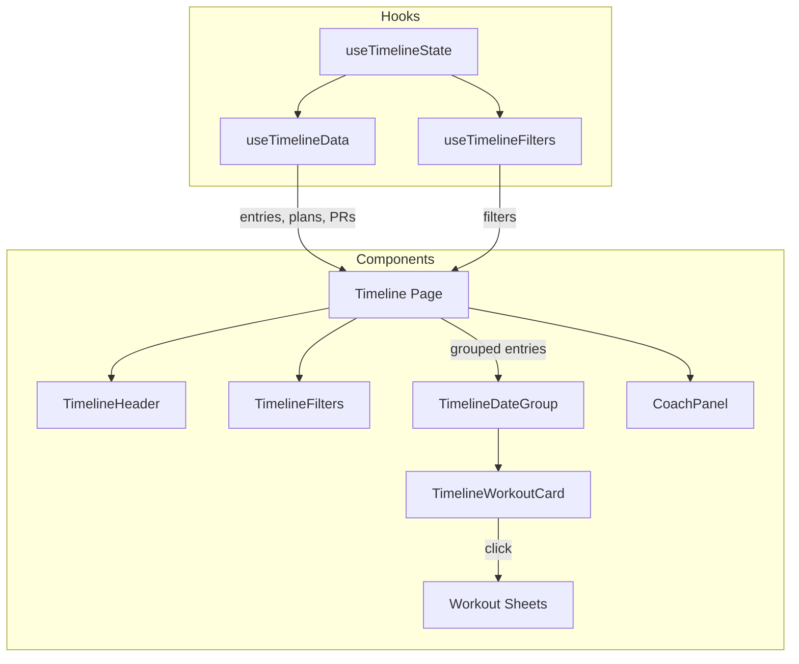

# Client Frontend Documentation

## Overview

The fitai.coach frontend is a single-page application for AI-powered fitness training planning, logging, and analytics. It is built with:

- **React 19** (via `react-dom/client` `createRoot`)
- **Vite 8** as the build tool and dev server
- **TypeScript 7** (native compiler for type-checking; TS 6 is kept installed for typescript-eslint — see CONTRIBUTING.md)
- **Tailwind CSS 4** (using `@tailwindcss/vite` plugin)
- **shadcn/ui** (New York style, Radix UI primitives)
- **wouter** for client-side routing
- **TanStack React Query** for server state management
- **Clerk** for authentication
- **Sentry** for error tracking
- **vite-plugin-pwa** for Progressive Web App support

The app is branded as **fitai.coach** and serves as an AI fitness coach that lets users import training plans, log workouts (with voice input and Strava sync), view analytics with personal records, and interact with an AI coaching assistant.

---

## Entry Point and Bootstrapping

### `client/src/main.tsx`

This is the application entry point. It performs the following in order:

1. **Font imports** -- Loads Open Sans, Space Grotesk, Geist Sans, and Geist Mono at various weights via `@fontsource`.
2. **Sentry initialization** -- Conditionally initializes `@sentry/react` when the `VITE_SENTRY_DSN` environment variable is set.
3. **Root render** -- Calls `createRoot` on the `#root` DOM element and renders `<App />` wrapped in a `Sentry.ErrorBoundary` with `FallbackErrorBoundary` as its fallback UI.
4. **PWA service worker registration** -- Calls `registerSW()` from `virtual:pwa-register` with callbacks for `onNeedRefresh` (new version available) and `onOfflineReady` (app cached for offline use).

### `client/src/App.tsx`

The `App` component establishes the provider hierarchy. When Clerk authentication is active (production), the hierarchy is:

```
ClerkProvider
  QueryClientProvider
    ThemeProvider
      TooltipProvider
        AppContent
        Toaster
        OfflineIndicator
```

When auth is bypassed (dev mode or Cypress tests), ClerkProvider is omitted and the hierarchy starts at `QueryClientProvider`. A yellow `DevModeBanner` is rendered in dev preview mode.

`AppContent` uses Clerk's `<Show when="signed-in">` to conditionally render either the `AuthenticatedLayout` (sidebar + router) or the `Landing` page for unauthenticated users.

`AuthenticatedLayout` wraps the main content in a `SidebarProvider` and renders:

- A skip-to-content accessibility link
- `AppSidebar` (navigation sidebar)
- A mobile header with `SidebarTrigger` (visible on `md:hidden`)
- The `AuthenticatedRouter` as the main content area
- `MobileTabBar` -- Bottom tab bar for the five primary destinations, visible on `md:hidden`; shares `PRIMARY_NAV_ITEMS` with `AppSidebar` (`client/src/lib/navItems.ts`)

---

## Routing

Routing uses **wouter** (`Switch` and `Route` components). `AuthenticatedRouter` mounts six authenticated routes, the signed-out-accessible privacy page, and a catch-all 404:

| Path         | Component    | Feature Name  | Loading                                                                 |
| ------------ | ------------ | ------------- | ----------------------------------------------------------------------- |
| `/`          | `Timeline`   | Timeline      | Lazy (`React.lazy`)                                                     |
| `/log`       | `LogWorkout` | Log Workout   | Lazy (`React.lazy`)                                                     |
| `/analytics` | `Analytics`  | Analytics     | Lazy (`React.lazy`)                                                     |
| `/review`    | `Review`     | Weekly Review | Lazy (`React.lazy`)                                                     |
| `/nutrition` | `Nutrition`  | Nutrition     | Lazy (`React.lazy`) — only mounted when `featureFlags.nutritionEnabled` |
| `/settings`  | `Settings`   | Settings      | Lazy (`React.lazy`)                                                     |
| `/privacy`   | `Privacy`    | --            | Lazy (`React.lazy`) — accessible signed-out                             |
| `*`          | `NotFound`   | --            | Eagerly loaded                                                          |

`/nutrition` is gated at build time: `featureFlags.nutritionEnabled` (`client/src/lib/featureFlags.ts`) defaults to `true` and is turned off with `VITE_NUTRITION_ENABLED=false`. When it is off the `Route` is never mounted, so the path falls through to the 404.

Every route except `/privacy` and the 404 is wrapped in `FeatureErrorBoundaryWrapper` with a descriptive `featureName` prop. The whole `Switch` sits inside one shared `Suspense` boundary whose fallback is a centred `LoadingSpinner`.

The `Landing` page is also lazy-loaded and rendered outside the authenticated layout when the user is not signed in.

---

## Pages

### Timeline (`client/src/pages/Timeline.tsx`)

The home page and primary view. Displays a chronological timeline of training plan days and logged workouts. Key features:

- **Onboarding wizard** -- Shown for new users via `OnboardingWizard` dialog.
- **AI Coach panel** -- A slide-out `CoachPanel` for chatting with the AI coach, visible as a sidebar on desktop and a fullscreen overlay on mobile.
- **Virtual scrolling** -- Uses `@tanstack/react-virtual` (`useVirtualizer`) to efficiently render large timeline lists.
- **Timeline filtering** -- Filter by plan and by workout status (completed, planned, missed, skipped; deep-linkable as `?status=`). Collapsible past/future groups with "show more" buttons.
- **Plan management** -- CSV import (`ImportPreviewDialog`), plan scheduling (`SchedulePlanDialog`), plan renaming, and goal setting.
- **Workout actions** -- Mark complete, change status, skip with confirmation (`SkipConfirmDialog`), open the sheet-based planned/logged/skipped workout surfaces, edit workout titles inline from sheet headers, delete, and combine workouts (`CombineWorkoutsDialog`).
- **Floating action button** -- Toggles the coach panel.

State management is centralized in the `useTimelineState` custom hook, with `TimelineWorkoutSurfaces` wiring the log/review/preview/skipped workout sheets.

### Log Workout (`client/src/pages/LogWorkout.tsx`)

`LogWorkout.tsx` is a thin page wrapper that gates rendering on auth resolution and mounts `LogWorkoutForm` (keyed by user ID so an in-place account switch fully remounts the form and discards the previous user's draft). The form itself lives under `client/src/pages/log-workout/` and is a three-step stepper rendered by `LogWorkoutStepperLayout`:

1. **Capture** (`steps/CaptureStep.tsx`) -- Workout title and date (`WorkoutDateFields`) plus the `WorkoutComposer`: a structured exercise list with a collapsible "Describe / dictate" panel that auto-parses free text or a photo into exercises.
2. **Confirm** (`steps/ConfirmStep.tsx`) -- Review and correct the parsed exercise rows in a `DraftExerciseTable` before saving.
3. **Reflect** (`steps/ReflectStep.tsx`) -- Capture effort (RPE) and notes for the session.

A `StepIndicator` allows jumping between steps. Drafts are persisted client-side via `useLogWorkoutDraftPersistence`, and `useDuplicateLastWorkout` can prefill the form from the most recent workout. The form respects user unit preferences (kg/lb, km/mi) via `useUnitPreferences`.

### Analytics (`client/src/pages/Analytics.tsx`)

Displays training data analysis across five base tabs plus two conditional ones — **MAF Trend** for athletes on the MAF training style, and **Fuelling** whenever `featureFlags.nutritionEnabled` is on (the default) — so six tabs by default and seven for MAF athletes:

- **Overview** (`TrainingOverviewTab`) -- Training volume summary, completion rates, streaks, weekly goal tracking, and workout heatmap. Six summary cards (avg/week, total workouts, running distance, avg duration, avg RPE, avg adherence) render a `DeltaIndicator` showing the percentage change versus the equal-length prior period (derived server-side — see [`previousStats` in `/training-overview`](api-reference.md#get-apiv1training-overview)). The weekly workout chart overlays shaded bands for any timeline annotations that intersect the visible window.
- **Breakdown** (`CategoryBreakdownTab`) -- Category-level training distribution (functional, running, strength, conditioning).
- **PRs & Trends** (`ProgressTab`) -- A nested tab pair: personal records across all exercises (`PersonalRecordsTab`) and exercise-level progression charts over time (`ExerciseProgressionTab`).
- **Coach Insights** (`CoachInsightsTab`) -- AI-surfaced coaching signals: RPE trends, plan phase, weekly volume, station gaps, and fatigue/progression flags. Paints the last stored result instantly and shows a `LastUpdatedNote` (see [stored-first Coach Insights](api-reference.md#get-apiv1coach-insights)).
- **Race Predictor** (`RacePredictorTab`) -- Predicted HYROX finish time from logged history; also stored-first with instant paint and a manual refresh button.
- **MAF Trend** (`MafTrendTab`, MAF training style only) -- Pace-at-MAF-ceiling trend across MAF tests over time.
- **Fuelling** (`FuellingTab`, nutrition flag only) -- The nutrition block view for the selected range: daily intake vs. training load (`IntakeVsTrainingChart`) plus a `FuellingCorrelationCard` comparing session RPE and workout compliance on days the load-adjusted carb target was hit vs. missed. "All time" is capped to the last 365 days.

A date range selector (`?range=`; 30 days, 90 days (default), 6 months, 1 year, all time) filters the Overview, Breakdown, PRs & Trends and Fuelling tabs. Coach Insights, Race Predictor and MAF Trend do not take the range.

### Weekly Review (`client/src/pages/Review.tsx`)

A per-week retrospective at `/review`, deep-linkable through `?week=<any date in the week>` (`useUrlQueryState`). The server anchors the requested date to its Monday and returns `weekStart` plus `isCurrentWeek`, and the page pages from **the server's** anchor rather than the requested string — they differ by a day when the athlete's stored timezone is not the browser's, and stepping from the local value would skip or repeat a week. Composed of `WeeklyReviewSummary`, `WeeklyReviewSessions`, `WeeklyReviewHighlights`, and `WeeklyReviewIntent` (the one thing to carry into next week), over `useWeeklyReview`. An empty week renders a neutral `EmptyWeek` card rather than a 0%-adherence report card. See [Weekly Review spec](weekly-review-spec.md).

### Nutrition (`client/src/pages/Nutrition.tsx`)

Food logging and fuelling at `/nutrition`, mounted only when `featureFlags.nutritionEnabled` is on. A date navigator drives one day at a time: `DailyTotalsHeader` → `EnergyBalanceCard` (shown when the profile supports a BMR) → `FoodSearch` + `QuickAddBar` → a single `LogFoodActions` sheet (describe / snap / scan label / barcode, plus custom food, recipe and targets entry points) → one `MealSection` per meal → `MicronutrientPanel` → `MyFoodsSection` → `NutritionInsightsPanel`. Data access is centralised in `client/src/hooks/useNutrition.ts`. The component-by-component map, the AI parse flows, and the per-meal fuel targets live in [Nutrition & Fuelling § Client UI map](nutrition.md#6-client-ui-map).

### Settings (`client/src/pages/Settings.tsx`)

User preferences and account management. Organized into six deep-linkable tabs (`?tab=account|training|integrations|notifications|data|recycle-bin`, default `account`) driven by `useUrlQueryState` and mirroring the Analytics tab pattern. The sticky "Save Settings" bar and the unsaved-changes guard live **outside** the tabs, so preference edits made on any tab are tracked together, saved by one button, and persist across tab switches.

- **Account** (`?tab=account`, default) -- **ProfileSection** (user name and avatar), **UnitsPreferencesCard** (weight unit kg/lb, distance unit km/mi), a "Getting Started" card to re-run onboarding, and the account **DangerZone** (delete account → hold-to-confirm → `DELETE /api/v1/account`, then hard-redirect to the landing page after Clerk sign-out).
- **Training** (`?tab=training`) -- **AthleteProfileCard** (division/gender/age), **BodyCompositionCard** (bodyweight, height, activity level, weight goal), **HealthMetricsCard** (optional resting HR, max HR and FTP that sharpen hrTSS/TSS training load; left blank, max HR is estimated from age), **NutritionPreferencesCard** (meals per day — 3, 4 or 5 — that the per-meal fuel targets are spread across), **TrainingGoalsCard** (weekly workout goal), **TrainingConstraintsCard** (free-text injuries & limitations, up to 500 characters, used when generating a plan), **TrainingStyleSection** (Balanced vs. MAF Method selection, MAF setup gating, style-transition messaging, and a local audit trail of style changes), **WorkoutReviewCard** (adherence insights), **AiCoachCard** (the **consent gate** for AI provider calls -- defaults off for new users; AI features stay hidden/disabled until enabled -- plus the auto-apply-chat-plan-changes toggle), and **CoachingSection** (AI coaching configuration and materials management).
- **Integrations** (`?tab=integrations`) -- **StravaSection** (connect/disconnect, sync status; handles the `?strava=connected`/`?strava=error` OAuth callback and lands the user on this tab) and **GarminSection** (Garmin Connect credential form, status/last-sync badge, manual "Sync now"; surfaces the `lastError` banner and disables sync when the global 429 circuit breaker is tripped).
- **Notifications** (`?tab=notifications`) -- **EmailNotificationsCard** (master `emailNotifications` switch; nested under it, a default send hour (`notifyHour`, 07:00 unless changed) and per-type toggles for the weekly summary, missed-workout reminder, weekly review reminder, session brief and analysis digest. The nested group is grayed and the per-type toggles disabled while the master is off. Each type that is switched on shows its own "Send at" hour override, which defaults to following the default send hour — except the weekly review reminder, whose fallback is 17:00, Sunday evening) and **PushNotificationSection** (Web Push opt-in, unsubscribe, denied-permission messaging, and a test notification when the browser + server VAPID config support push).
- **Data & Privacy** (`?tab=data`) -- **DataToolsSection** (`StructureOldWorkoutsCard`, `ExportDataCard`, and the error-reporting consent card).
- **Recycle bin** (`?tab=recycle-bin`) -- **RecycleBinCard** (deleted workouts, plan days and training plans, restorable for 90 days, with per-item _Delete forever_ and _Empty bin_ behind confirm dialogs).

### Privacy (`client/src/pages/Privacy.tsx`)

First-party privacy policy page. Lists each third-party processor the app sends data to (Clerk for auth, the configured AI provider for AI features when `aiCoachEnabled`, Strava for activity sync when connected, Garmin for activity sync when connected, Resend for email when `emailNotifications`, Sentry for error telemetry) with a plain-language description of what data each receives. The Landing page footer and the Settings page both link here. The route is accessible while signed out so prospective users can read it before sign-up.

### Landing (`client/src/pages/Landing.tsx`)

Marketing/landing page for unauthenticated users. Contains:

- Sticky header with branding and "Log In" button (via Clerk `SignInButton`).
- Hero section with animated timeline mockup and CTA buttons.
- Social-proof strip (200+ Exercises, Strava & Garmin Sync, AI-Powered Coaching, Voice & Photo Logging, plus Nutrition & Macros when the nutrition flag is on).
- Feature highlights (AI Auto-Coach, Training Timeline, Voice & Photo Logging, Strava & Garmin Sync, Analytics & PRs, AI Plan Builder, Nutrition & Fuelling when the nutrition flag is on, and Your Coaching Playbook).
- "How It Works" three-step flow (Set Up Your Plan, Train & Log, AI Adapts).
- Exercise category grid (Functional, Running, Strength, Conditioning) with Gap Analysis, Pacing Strategy, Personal Records and Chat with Your Coach highlights.
- "Fuel Every Session" nutrition showcase (`NutritionShowcase`), rendered only when `featureFlags.nutritionEnabled` is on.
- FAQ accordion (a nutrition question is appended when the flag is on).
- Final CTA section and footer (Features, How It Works, FAQ and Privacy links).

Uses `IntersectionObserver` for fade-up scroll animations.

### Not Found (`client/src/pages/not-found.tsx`)

Simple 404 page rendered for unmatched routes.

---

## Component Architecture

Components are organized into subdirectories under `client/src/components/`:

### `ui/` -- shadcn/ui Primitives

Foundational UI building blocks generated via shadcn/ui CLI. Includes: `accordion`, `avatar`, `badge`, `button`, `card`, `dialog`, `input`, `select`, `sidebar`, `tabs`, `toast`, `toaster`, `tooltip`, and more. Also includes the custom `OfflineIndicator` component.

### `analytics/` -- Analytics Tab Components

- `TrainingOverviewTab` -- Summary cards, completion rates, workout heatmap.
- `DeltaIndicator` -- Arrow + percentage chip rendered on each of the six overview stat cards (`OverviewStatsGrid`). Fed from the `currentStats` / `previousStats` of `GET /api/v1/training-overview`; nothing renders when there is no previous period or both periods are zero, and a muted "new" label replaces the percentage when only the previous value is zero.
- `ProgressTab` -- "PRs & Trends" tab; a nested `Tabs` wrapping `PersonalRecordsTab` and `ExerciseProgressionTab`.
- `ExerciseProgressionTab` -- Per-exercise charts.
- `PersonalRecordsTab` / `PersonalRecordItem` -- PR listings.
- `CategoryBreakdownTab` -- Training distribution by category.
- `RacePredictorTab` -- Predicted HYROX finish time; stored-first with instant paint and a manual refresh (uses `useRacePrediction`).
- `MafTrendTab` -- Pace-at-MAF-ceiling trend across MAF tests (MAF training style only).
- `LastUpdatedNote` -- Shared "Last updated … / New activity since — refresh to update" note rendered by the stored-first Coach Insights and Race Predictor tabs.
- `MiniLineChart`, `MiniBarChart` -- Reusable small chart components.
- `WorkoutHeatmap` -- GitHub-style activity heatmap.
- `MuscleHeatMapCard` -- Muscle-group coverage heatmap card.
- `CoachInsightsTab` -- AI coaching-signal tab (RPE trends, plan phase, fatigue/progression flags); stored-first with instant paint.
- `ExerciseProgressionCharts` -- Per-exercise progression chart group used by the Trends tab.
- `FuellingTab` -- Fuelling tab (nutrition flag only): `IntakeVsTrainingChart` and `FuellingCorrelationCard` over the nutrition block view, loaded by `useFuellingAnalytics`.
- `chartConstants.ts` -- Shared chart configuration.
- `training-overview/` -- Overview-tab building blocks: `OverviewStatsGrid`, `OverviewTrendCharts`, `WeeklyWorkoutsChart`, and the `useTrainingOverviewData` hook.

### `coach/` -- AI Coach Panel Components

- `CoachPanelHeader` -- Title, clear history, close button. Action buttons include descriptive tooltips for accessibility.
- `CoachPanelStats` / `StatBadge` -- Training statistics summary.
- `CoachPanelChatArea` -- Chat message list with suggestion cards.
- `CoachPanelFooter` -- Quick actions and message input.
- `SuggestionCard` -- AI workout suggestion with apply/dismiss actions.
- `SuggestionsTab` -- Hook and logic for fetching/applying suggestions.
- `AIConsentDialog` -- Opt-in consent dialog shown before the first AI coach interaction.

### `onboarding/` -- Onboarding Wizard Steps

- `WelcomeStep` -- Introduction screen.
- `UnitsStep` -- Weight and distance unit selection.
- `GoalStep` -- Fitness goal selection.
- `FuellingStep` -- Optional body profile (weight, height, age, activity, goal) → suggested nutrition target; shown only when the nutrition module is enabled.
- `PlanStep` -- Plan choice (sample plan, import CSV, AI-generated, or skip).
- `ScheduleStep` -- Start date picker for the training plan.

### `plans/` -- Plan Management

- `GeneratePlanDialog` -- AI-powered training plan generation dialog.
- `generate-plan/` -- Multi-step generation form: `GeneratePlanGoalStep`, `GeneratePlanScheduleStep`, `GeneratePlanDetailsStep`, and the `useGeneratePlanForm` hook.

### `settings/` -- Settings Page Sections

- `ProfileSection` -- User profile display.
- `StravaSection` -- Strava connection management.
- `GarminSection` -- Garmin Connect credential form, status display, manual sync button.
- `AccountDangerZone` -- Account deletion (hold-to-confirm → `DELETE /api/v1/account`, then hard-redirect to the landing page after Clerk sign-out).
- `TrainingStyleSection` -- Balanced/MAF style selector, MAF setup dialog, style transition notice, and local settings audit.
- `PushNotificationSection` -- Web Push subscribe/unsubscribe and test-notification controls.
- `DataToolsSection` -- Structure old workouts, data export, and error-reporting consent. The recycle bin is not part of it: Settings mounts `RecycleBinCard` directly on its own Recycle bin tab.
- `CoachingSection` -- AI coaching configuration.
- `coaching/CoachingMaterialList` -- Uploaded coaching materials list.
- `coaching/CoachingUploadDialog` -- Upload dialog for coaching materials.
- `coaching/RagStatusCard` -- RAG processing status indicator.
- `coaching/useCoachingUpload.ts` -- Upload logic hook.
- `data-tools/` -- `StructureOldWorkoutsCard`, `ExportDataCard`, `ErrorReportingConsentCard` and the `useWorkoutReparseTools` hook (together backing `DataToolsSection`), plus `RecycleBinCard` for the Recycle bin tab (backed by the `useRecycleBin` hooks: list, restore, purge, empty).
- `garmin/` -- `GarminConnectForm`, `GarminErrorBanner`, `GarminStatusRow`, and the `useGarminConnectionController` hook backing `GarminSection`.
- `preferences/` -- `UnitsPreferencesCard`, `AthleteProfileCard`, `BodyCompositionCard`, `HealthMetricsCard`, `NutritionPreferencesCard`, `TrainingGoalsCard`, `TrainingConstraintsCard`, `EmailNotificationsCard`, `WorkoutReviewCard`, `AiCoachCard`, and the shared `PreferenceRows`. These cards are composed directly into the Settings tabs.

### `timeline/` -- Timeline Page Components

The largest component group, further subdivided:

- **Top-level**: `TimelineHeader`, `TimelineSkeleton`, `TimelineEmptyState`, `TimelineDateGroup`, `FloatingActionButton`, `TimelineTodayIndicator` (jump-to-today pill; hidden when today is filtered out of the current view), `CoachReviewingIndicator`, `SuggestionsPanel`.
- **Annotations**: `AnnotationsDialog`, `TimelineAnnotationCard`, `AnnotationTypeIcon` — inline annotation rows rendered as first-class log entries on the Timeline for injury / illness / travel / rest periods.
- **Dialogs and surfaces**: `SchedulePlanDialog`, `SkipConfirmDialog`, `ImportPreviewDialog`, and `ConfirmDialog`. `TimelineWorkoutSurfaces`, which wires the workout-detail sheet surfaces from `workout-detail/`, lives beside the page in `client/src/pages/timeline/` rather than in this directory.
- **`timeline-filters/`**: `TimelineFilters`, `PlanSelector`, `GoalDialog`, `csv-utils.ts`.
- **`timeline-workout-card/`**: `TimelineWorkoutCard`, `ExerciseChips`, `WorkoutStravaStats`, utility and type files.
- **`combine-workouts-dialog/`**: `CombineWorkoutsDialog`, `FieldSelector`, `WorkoutCard`, `CombinedResultSummary`.

Barrel exports via `index.ts` files in each subdirectory.

### `workout-detail/` -- Workout Sheet Surfaces

Workout detail surfaces live in their own top-level directory so Timeline, Log Workout, and Coach flows can share the same sheet/header/table building blocks.

- `ReviewSurface` -- Completed/logged workout review surface, including inline title editing and embedded coach access.
- `LogSheet` -- Planned or missed workout logging surface, plus future planned edit mode.
- `PreviewSheet` -- Future planned workout preview surface.
- `SkippedSheet` -- Skipped workout review, undo, and delete surface.
- `AdhocLogSheet` -- Quick timeline entry surface for logging a new workout.
- `ReadOnlyWorkoutDetailSheet` -- Shared responsive sheet shell for read-only workout detail surfaces.
- `EditableWorkoutTitle` -- Inline sheet-header title editor backed by the existing `focus` field on workout logs or plan days.
- `ExerciseTable` -- Responsive exercise + set table with per-row load/reps/time cells, dense mobile layout, readable exercise names.
- `CoachPrescriptionCollapsible` -- Collapsible panel showing the coach's prescribed exercises for the day; integrates free-text parse + photo-parse entry points.
- `WorkoutCoachPanel`, `EmbeddedWorkoutCoachChat`, and `MobileCoachToggle` -- Embedded AI coach surfaces for asking questions about the open workout.
- `AthleteNoteInput` -- Free-text note capture scoped to the workout.
- `SaveStatePill` -- Autosave indicator for structured table and note edits.

### `exercise-row/` -- Exercise Row Renderer

- `InlineSetEditor` -- Inline per-row set editor used from the exercise table.
- `fieldMeta.ts` -- `getFields` (which per-set fields an exercise surfaces, from its definition) and `getFieldLabel` (unit-aware field labels).

### `icons/` -- Integration Icons

- `StravaIcon`, `GarminIcon` -- Brand-color SVG icons used in Settings and on timeline cards.

### `workout/` -- Workout Composer Components

Shared building blocks for the Log Workout stepper's Capture and Confirm steps:

- `WorkoutHeader` -- Page title.
- `WorkoutDateFields` -- Workout title and date inputs.
- `WorkoutNotesCard` -- Notes textarea with voice input.
- `WorkoutComposer` -- Unified log-workout surface: structured exercise list with a collapsible "Describe / dictate" panel. Auto-parses the text panel's contents into the exercise list on a debounce, preserving cells the user has already edited.
- `WorkoutTextMode` -- Textarea + voice dictation used inside the composer's collapsible panel. Also mounts `ImageCaptureButton` for photo-to-workout parsing; the voice button is hidden while a photo preview is active to avoid conflicting input surfaces.
- `DraftExerciseTable` -- Editable draft exercise/set table shown on the Confirm step.
- `ParseStatusStrip` -- Inline status indicator for the auto-parse pipeline.
- `ExerciseImagePreview` -- Thumbnail + remove control rendered after a user captures a workout photo but before the parsed exercises are committed.

### `workout-structure/` -- Structured Format Editor

Editing surfaces for structured workout formats (EMOM, AMRAP, rounds, intervals):

- `WorkoutStructureEditor` -- Top-level editor for a workout's structure blocks and steps.
- `StructureBlocksEditor` -- Block-list editor for adding, ordering, and configuring structure blocks.
- `configToStructureBlocks.ts` -- Converts editor config into the persisted `structureBlocks` shape.
- `emomPreview.ts` -- Builds a minute-by-minute preview for EMOM blocks.

### Root-level Components

- `AppSidebar` -- Main navigation sidebar rendering `PRIMARY_NAV_ITEMS` (Training, Log Workout, Nutrition when the nutrition flag is on, Analytics, Settings); the footer holds the user avatar and name, the theme toggle, and a log-out button.
- `MobileTabBar` -- Bottom tab bar mirroring the sidebar's `PRIMARY_NAV_ITEMS` for phones (`md:hidden`).
- `Breadcrumbs` -- Route breadcrumb trail driven by `useNavigationBreadcrumb`; desktop-only (`hidden md:block`) since the tab bar covers "where am I" on phones.
- `CoachPanel` -- AI coach chat panel (described above).
- `OnboardingWizard` -- Multi-step onboarding dialog.
- `ThemeProvider` -- Dark/light theme context provider.
- `ThemeToggle` -- Theme switcher button.
- `FallbackErrorBoundary` -- Global error fallback UI.
- `FeatureErrorBoundaryWrapper` -- Per-feature Sentry error boundary.
- `FeatureErrorBoundary` -- Feature-scoped error fallback UI.
- `ChatMessage` -- Chat bubble rendering.
- `ChatInput` -- Chat text input.
- `ExerciseSelector` -- Exercise picker.
- `ImageCaptureButton` -- Camera + file-input wrapper that opens the device camera (or falls back to file chooser), compresses the picked image via `lib/image.ts`, and exposes the result as a base64 payload. Used by the Log Workout flow and by `CoachPrescriptionCollapsible` in workout detail surfaces.
- `PrivacyConsentBanner` -- First-load privacy notice listing the third-party processors. "Accept" keeps error reporting on and "Decline analytics" turns Sentry off; either records the `privacy_notice` consent (server-side too, for signed-in athletes) and the banner links to `/privacy`. The AI consent gate is separate (`aiCoachEnabled`).
- `RagDebugBadge` -- In production, an athlete-facing "Cited N sources" chip shown only when a response actually used RAG; in development, a debug view of which retrieval path (RAG, legacy materials, none) fed the response.
- `RpeSelector` -- Rate of Perceived Exertion selector.
- `VoiceButton` / `VoiceFieldButton` -- Voice input controls.
- `QuickActions` -- Quick action buttons.

### Photo-to-Workout Parsing

A user flow introduced in April 2026 that lets athletes snap a photo of a whiteboard / coach printout / phone screenshot and have Gemini extract exercises and sets.

- **Entry points**: `ImageCaptureButton` mounted inside `WorkoutTextMode` (Log Workout) and inside `CoachPrescriptionCollapsible` (workout detail surfaces, for re-parsing an existing workout against a new photo).
- **Client-side compression**: `compressImage()` in `client/src/lib/image.ts` resizes the captured image to a max edge of 1600px and re-encodes as JPEG at quality 0.8 before base64 upload, keeping payloads OCR-ready while staying inside the Gemini request limit. Because it always re-encodes, the `CompressedImage` it returns carries a literal `mimeType: "image/jpeg"` — every call site reads the mime type off that result rather than deriving it from the source `File`, so both paths agree by construction.
- **Orchestration surface**: `shared/PrescriptionEditor` manages the text/photo parse controls for workout detail surfaces, including preview URL lifecycle, Retake/Parse confirmation, and clearing transient preview state after dispatch.
- **Server endpoints**: `POST /api/v1/parse-exercises-from-image` (new workout) and `POST /api/v1/workouts/:id/reparse-from-image` (existing workout). Both accept `{ imageBase64, mimeType }` and are rate-limited under the AI category. See [API Reference](api-reference.md).

### Component Communication Patterns

- **Props drilling**: Parent pages pass data to child components (e.g., Timeline passes `entries` to TimelineWorkoutCard)
- **Shared hooks**: Multiple components use the same React Query hook (e.g., `useTimelineData` consumed by both timeline and coach panel)
- **Query invalidation**: After mutations, hooks call `queryClient.invalidateQueries()` to trigger refetches (e.g., `useWorkoutActions` invalidates timeline after creating a workout)
- **Event-driven updates**: `useAutoCoachWatcher` detects when `isAutoCoaching` transitions from true to false, then invalidates the timeline query


```mermaid
flowchart TD
    subgraph Hooks
        UTD[useTimelineData]
        UTF[useTimelineFilters]
        UTS[useTimelineState]
    end

    subgraph Components
        TL[Timeline Page]
        TH[TimelineHeader]
        TF[TimelineFilters]
        TDG[TimelineDateGroup]
        TWC[TimelineWorkoutCard]
        WDS[Workout Sheets]
        CP[CoachPanel]
    end

    UTS --> UTD
    UTS --> UTF
    UTD -->|entries, plans, PRs| TL
    UTF -->|filters| TL
    TL --> TH
    TL --> TF
    TL -->|grouped entries| TDG
    TDG --> TWC
    TWC -->|click| WDS
    TL --> CP
```

---

## Styling

### Tailwind CSS 4

The project uses Tailwind CSS 4 integrated via the `@tailwindcss/vite` plugin (not PostCSS). Configuration is in `tailwind.config.ts`.

### Dark Mode

Dark mode uses the **class strategy** (`darkMode: ["class"]`). The `ThemeProvider` component manages a `class` on the root element. Users toggle themes via `ThemeToggle` in the sidebar footer.

### Color System

All colors are defined as HSL CSS custom variables (e.g., `--background`, `--foreground`, `--primary`, etc.) and referenced in Tailwind config using the `hsl(var(--name) / <alpha-value>)` pattern. This enables opacity modifiers on all semantic colors.

Key color tokens:

- `background`, `foreground` -- Base page colors.
- `card`, `popover` -- Surface colors with optional `border` variants.
- `primary`, `secondary`, `muted`, `accent`, `destructive` -- Semantic UI colors, each with `foreground` and `border` variants.
- `success` -- Success state color (used for completed workouts).
- `chart-1` through `chart-5` -- Chart palette.
- `sidebar`, `sidebar-primary`, `sidebar-accent` -- Sidebar-specific tokens.
- `status` -- Online/away/busy/offline indicator colors.

### Typography

Custom font families are defined via CSS variables:

- `--font-sans` (Open Sans / Geist Sans)
- `--font-heading` (Space Grotesk)
- `--font-mono` (Geist Mono)
- `--font-serif`

### Plugins

- `tailwindcss-animate` -- Animation utilities for transitions and keyframes (accordion, etc.).
- `@tailwindcss/typography` -- Prose styling for rendered markdown content.

### shadcn/ui Configuration

Configured via `components.json` at the project root:

- **Style**: `new-york`
- **Base color**: `neutral`
- **CSS variables**: enabled
- **RSC**: disabled (client-side React)
- **TSX**: enabled

### Accessibility

- Skip-to-content link in `AuthenticatedLayout` (`<a href="#main-content" className="skip-to-content">`)
- ARIA roles on chat panel: `role="log"`, `aria-live="polite"` for screen reader updates
- ARIA live region on Timeline coach-reviewing banner: `role="status"` with `aria-live="polite"` announces
  background auto-coach activity
- Keyboard navigation: All interactive elements are focusable; dialog components trap focus via Radix
- Semantic HTML: `<main>`, `<header>`, `<nav>` landmark elements
- Color contrast: HSL-based theme with light/dark variants designed for WCAG compliance
- `prefers-reduced-motion`: Global CSS override in `client/src/index.css` reduces animation duration,
  transition duration, and scroll-behavior to near-instant for users who opt in at the OS level.
  Covers the Landing fade-up / float animations, coach thinking dots, pulsing voice indicator,
  and sidebar transitions.
- Onboarding wizard progress bar: exposes step count via both the visible "Step N of M" counter
  and the `sr-only` `<progress>` element with `aria-label`.
- `aria-busy` on async action buttons (e.g. the Garmin sync/disconnect buttons in
  `GarminStatusRow`) so assistive tech announces the in-progress state while a request is running.
- Live region for empty results: the `ExerciseSelector` "no exercises match" state uses
  `role="status"` with `aria-live="polite"` so screen readers announce when a search yields nothing.

**Automated accessibility coverage (runs in CI via `pnpm test`):**

- `jest-axe` matcher registered in `vitest.setup.ts` — component tests use
  `expect(results).toHaveNoViolations()` against rendered containers.
- Axe regression tests on:
  - `NotFound` (404 page)
  - `SuggestionCard` (default, applying, and RAG-citation states)
  - `WorkoutHeader`
  - `CoachReviewingIndicator` (inactive + active states)
  - `TimelineWorkoutCard`
- Keyboard activation tests on `TimelineWorkoutCard` asserting the
  `role="button"` card responds to both Enter and Space when focused.
- Static regression test on `prefers-reduced-motion` — fails if the global
  override is removed from `client/src/index.css`.

**Outstanding manual work (tracked in #768):**

These items require a real browser, screen reader, or physical device and
can't run headless in CI. Summary of what's still needed:

- **WCAG AA contrast audit** with axe DevTools against Timeline, Log Workout,
  Analytics, Settings, Coach panel, Onboarding wizard, and Landing — in both
  light and dark themes.
- **Screen reader pass** with NVDA (Windows) and VoiceOver (macOS) over the
  virtualized Timeline (`@tanstack/react-virtual` drops off-viewport rows),
  Onboarding wizard step transitions, Coach chat live region, and toast
  action buttons.
- **Mobile real-device testing** — touch-target sizes (WCAG 2.5.5), Coach
  bottom sheet focus trap/return, reduced-motion effect at the OS level.
- **Focus-return spot checks** after dialog close, skip-link activation,
  and onboarding wizard close.

File findings on issue #768 or open focused follow-up PRs referencing it.

---

## PWA Support

PWA is enabled via `vite-plugin-pwa` in `vite.config.ts`:

- **Register type**: `prompt` -- Users are prompted when a new version is available (not auto-updated).
- **Manifest**: App name "fitai.coach", standalone display mode, dark background (`#0a0a0a`).
- **Workbox configuration**:
  - Caches `js`, `css`, `html`, `ico`, `png`, `svg`, `woff`, `woff2` files.
  - `cleanupOutdatedCaches: true` removes stale cache entries on update.
  - `importScripts: ["sw-push.js"]` pulls the push handlers into this same worker — see [Push notifications](#push-notifications-and-the-service-worker) below.
  - Runtime caching for `/api/` responses — see [Cached API data](#cached-api-data-and-sign-out).
- **Service worker registration**: Called in `main.tsx` after render, with `onNeedRefresh` and `onOfflineReady` callbacks. There is exactly **one** registration.
- **Offline indicator and replay state**: The `OfflineIndicator` component (`client/src/components/ui/OfflineIndicator.tsx`) displays offline status, the count of queued writes awaiting replay (workout creates, plan-day status changes and food logs — see [Offline Queue](state-management.md#offline-queue)), and sync/drop feedback after replay attempts.

### Push notifications and the service worker

The push and `notificationclick` handlers live in `client/public/sw-push.js` but
are **not registered separately**. The Workbox config imports them into the
generated worker via `importScripts`.

This matters: both had previously been registered at the default scope `/`, and
a scope admits only one worker, so the second registration replaced the first.
Depending on which won, the app silently lost either offline caching or push
delivery. It also decided what `navigator.serviceWorker.ready` resolved to,
which is the registration `usePushNotifications` subscribes through. One worker
owning both removes the race.

The worker resolves the push payload's `url` against its own origin and falls
back to `/` if it points elsewhere, so a notification tap can only navigate
within the app.

### Cached API data and sign-out

Workbox applies `NetworkFirst` to programmatic `/api/` requests (50 entries,
5-minute TTL, 10-second network timeout). Two things follow from Cache Storage
being keyed by URL with **no per-user partition**:

- Identity and bulk-export endpoints (`/api/v1/auth/`, `/api/v1/export`) are
  excluded outright. They are worthless offline and are the two that most
  directly identify the athlete.
- `clearUserLocalData()` (`client/src/lib/userLocalData.ts`) deletes the whole
  `api-cache` on sign-out and on account deletion, alongside the localStorage and
  sessionStorage sweep. It returns a promise; the sign-out path awaits it so the
  purge completes before the session ends. Without this, on a shared device the
  next athlete to sign in could be served the previous one's cached responses
  while the network was slow or offline.

The same sweep clears the per-user analytics snapshots (coach insights, race
prediction, overview analysis, MAF heart-rate tests) and the weekly-review
dismissal keys, which hold AI-written narratives and health data and previously
survived both sign-out and account deletion.

---

## Error Tracking

### Sentry Integration

- **Initialization**: `@sentry/react` is initialized in `client/src/lib/errorReporting.ts` when `VITE_SENTRY_DSN` is set. Init is deferred until the first-load privacy notice is acknowledged, and is additionally subject to the per-user opt-out in Settings.
- **Global boundary**: The entire `<App />` is wrapped in `Sentry.ErrorBoundary` with `FallbackErrorBoundary` as the fallback. This catches any unhandled React errors at the top level.
- **Scrubbing**: `sendDefaultPii: false` only stops the SDK attaching identity — it does not stop the app's own payloads. `client/src/lib/errorReportingScrub.ts` is wired in as both `beforeSend` and `beforeBreadcrumb` (the browser counterpart to `scrubSentryEvent` on the server) and covers three channels:
  - `apiRequest` throws ``new Error(`${status}: ${body}`)``, so a raw 4xx response body became the exception message — and Zod validation errors echo the values the athlete submitted. The body half is replaced with `[redacted]`, keeping the status code.
  - Navigation breadcrumbs record `pathname?search` (`/nutrition?date=…&meal=…`), and the SDK's own fetch/xhr breadcrumbs record request URLs. Query strings are stripped everywhere they appear.
  - The fetch/xhr integrations attach request and response bodies to breadcrumb `data`; those keys are dropped.

  Scrubbing runs at `beforeBreadcrumb` as well as `beforeSend` so a payload never sits in the in-memory breadcrumb buffer waiting for an error that may never come.

### FallbackErrorBoundary (`client/src/components/FallbackErrorBoundary.tsx`)

A full-page error screen with:

- Error icon and user-friendly message.
- "Try again" button (calls `resetError`) and "Refresh Page" button.
- In non-production environments, displays the raw error message in a monospaced block.

### FeatureErrorBoundaryWrapper (`client/src/components/FeatureErrorBoundaryWrapper.tsx`)

A per-feature error boundary that wraps each route and the Coach panel. Uses `Sentry.ErrorBoundary` internally so errors are reported to Sentry with the feature name as context. Falls back to `FeatureErrorBoundary`, a scoped error UI that only affects the broken feature, not the entire app.

---

## Code Splitting

Vite 8 bundles with Rolldown, and `vite.config.ts` groups vendor code through
`build.rollupOptions.output.codeSplitting.groups`:

| Chunk Name      | Contents                                                                    |
| --------------- | --------------------------------------------------------------------------- |
| `vendor-clsx`   | `clsx`, `tailwind-merge` — priority 10, so it claims them before `vendor-charts` |
| `vendor-react`  | `react`, `react-dom`, `wouter`                                              |
| `vendor-ui`     | `lucide-react`                                                              |
| `vendor-query`  | `@tanstack/react-query`                                                     |
| `vendor-charts` | `recharts`                                                                  |
| `vendor-dnd`    | `@dnd-kit/*`                                                                |

`vendor-clsx` exists because a group captures its package's dependencies recursively: without it,
`clsx` (a `recharts` dependency that the eager UI shell also imports) lands in `vendor-charts`, and
every first paint — including the signed-out Landing page — statically imports the charts chunk.
`pnpm check:bundle` (`script/bundle-check.ts`) fails CI if that regresses.

Route-level code splitting is achieved via `React.lazy`: every page — `Timeline`, `LogWorkout`,
`Settings`, `Analytics`, `Nutrition`, `Review`, `Landing`, and `Privacy` — is lazy-loaded in
`App.tsx`, each producing its own chunk.

Build output goes to `dist/public`.

---

## Auth Bypass

The app includes two auth bypass mechanisms for development and testing, controlled by the `shouldBypassAuth()` function in `App.tsx`:

### Dev Preview Mode (`isDevPreview`)

Active when **all** of these are true:

- `import.meta.env.DEV` is `true` (Vite dev mode).
- Either `VITE_CLERK_PUBLISHABLE_KEY` is not set, **or** the window is inside an iframe (`window.self !== window.top`).

When active, Clerk is completely skipped and a yellow "DEV MODE -- Auth bypass active (Clerk skipped)" banner is displayed at the top of the page.

### Cypress Test Mode (`isCypressTest`)

Active when `"Cypress"` exists as a property on `globalThis.window`. This allows end-to-end tests to bypass authentication entirely.

In both bypass modes, the app renders the `AuthenticatedLayout` directly (skipping `ClerkProvider` and the `<Show when="signed-in">` gate), allowing full access to all authenticated routes without signing in.

---

## Key Configuration Files

### `vite.config.ts`

Root-level Vite configuration:

- **Plugins**: `@tailwindcss/vite`, `@vitejs/plugin-react`, `vite-plugin-pwa`, and `@sentry/vite-plugin` (source-map upload; disabled unless `SENTRY_AUTH_TOKEN` is set).
- **Path aliases**: `@` maps to `client/src`, `@shared` maps to `shared/`.
- **Root**: `client/` directory.
- **Build output**: `dist/public/`.
- **Vendor chunk groups**: `vendor-clsx`, `vendor-react`, `vendor-ui`, `vendor-query`, `vendor-charts`, `vendor-dnd` (see Code Splitting above).
- **Dev server**: Strict file system access with dotfile denial (`deny: ["**/.*"]`).

### `tailwind.config.ts`

Root-level Tailwind CSS configuration, loaded by the `@config` directive in `client/src/index.css`
(Tailwind 4 is otherwise configured CSS-first):

- **Dark mode**: Class-based (`["class"]`).
- **Content paths**: `client/index.html` and all `client/src/**/*.{js,jsx,ts,tsx}` files.
- **Custom theme**: HSL color variables, custom border radii, font families, accordion keyframes.
- **Plugins**: none here. `tailwindcss-animate` and `@tailwindcss/typography` are registered by the
  `@plugin` directives in `client/src/index.css`; listing them in both places registers each twice
  and emits every `.prose` rule and animation keyframe twice.

### `components.json`

shadcn/ui CLI configuration:

- **Style**: `new-york`.
- **RSC**: `false`.
- **TSX**: `true`.
- **Tailwind config**: `tailwind.config.ts`.
- **CSS**: `client/src/index.css`.
- **Base color**: `neutral`.
- **CSS variables**: enabled.
- **Aliases**: `@/components`, `@/lib/utils`, `@/components/ui`, `@/lib`, `@/hooks`.

---

### CSRF Token Handling

The API client layer fetches a CSRF token from `GET /api/v1/csrf-token` on initialization and attaches it as the `x-csrf-token` header on all mutating requests (POST/PUT/PATCH/DELETE). The token is cached in memory and automatically refreshed on 403 CSRF errors or after Clerk sign-in events.

See also: [Authentication -- CSRF Protection](authentication.md#csrf-protection), [State Management -- API Client Layer](state-management.md#api-client-layer)

---

See also: [State Management -- Custom Hooks](state-management.md#custom-hooks-catalog), [API Reference](api-reference.md)
