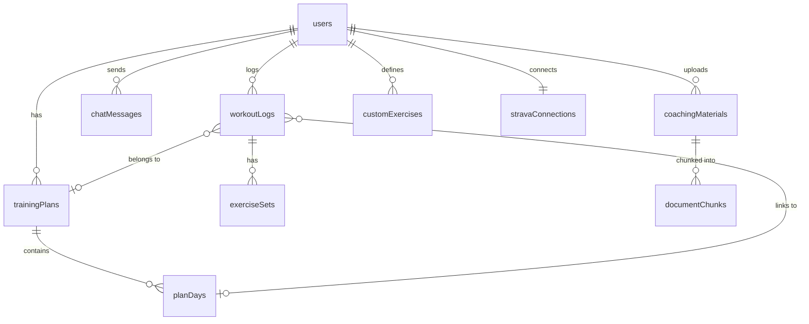

# Database Layer

## Overview

The Hyrox Companion app uses **PostgreSQL** as its primary datastore, accessed through the **Drizzle ORM** for type-safe query building. A separate **pgvector**-enabled database (optionally Neon) handles vector embeddings for the RAG-based AI coaching pipeline. The schema is defined in TypeScript using Drizzle's `pgTable` builder, and migrations are managed by Drizzle Kit.

Key technology choices:

- **Drizzle ORM** (`drizzle-orm/node-postgres`) -- type-safe schema, query builder, and migration tooling
- **node-postgres (`pg`)** -- connection pooling for both the main database and the vector database
- **pgvector** -- PostgreSQL extension for storing and querying high-dimensional embedding vectors
- **drizzle-zod** -- automatic Zod validation schema generation from Drizzle table definitions
- **drizzle-kit** -- CLI for generating and running SQL migrations

---

## Schema Tables

All table definitions live in `shared/schema/tables.ts`. Every table uses `varchar(255)` primary keys with `gen_random_uuid()` defaults.

### users

User accounts and preferences.

| Column | Type | Constraints |
|---|---|---|
| `id` | `varchar(255)` | PK, default `gen_random_uuid()` |
| `email` | `varchar(255)` | UNIQUE, nullable |
| `first_name` | `varchar(255)` | nullable |
| `last_name` | `varchar(255)` | nullable |
| `profile_image_url` | `varchar(255)` | nullable |
| `weight_unit` | `varchar(255)` | default `'kg'` |
| `distance_unit` | `varchar(255)` | default `'km'` |
| `weekly_goal` | `integer` | default `5` |
| `email_notifications` | `boolean` | default `false` — **master** email toggle (GDPR opt-in) |
| `email_weekly_summary` | `boolean` | default `false` — per-type toggle for the weekly training summary |
| `email_missed_reminder` | `boolean` | default `false` — per-type toggle for the missed-workout reminder |
| `ai_coach_enabled` | `boolean` | default `false` — **AI consent gate**; no workout data is sent to Gemini while this is `false` |
| `is_auto_coaching` | `boolean` | default `false` |
| `last_weekly_summary_at` | `timestamp` | nullable |
| `last_missed_reminder_at` | `timestamp` | nullable |
| `created_at` | `timestamp` | default `now()` |
| `updated_at` | `timestamp` | default `now()` |

No additional indexes (queries are by PK).

**Consent columns.** The four boolean columns above default to `false` at the DB layer so new accounts are opted-out of every third-party data flow by default. The application reads them as follows:

- No email is ever sent unless `email_notifications = true` **and** the per-type toggle for the category is `true`. The scheduler in `server/emailScheduler.ts` enforces both checks.
- No Gemini call is issued unless `ai_coach_enabled = true`. The auto-coach service short-circuits (`server/services/coachService.ts`) and the chat / parsing routes check the flag before composing a prompt.

---

### training_plans

Multi-week training plans, either imported from CSV or generated by AI.

| Column | Type | Constraints |
|---|---|---|
| `id` | `varchar(255)` | PK, default `gen_random_uuid()` |
| `user_id` | `varchar(255)` | NOT NULL, FK -> `users.id` ON DELETE CASCADE |
| `name` | `text` | NOT NULL |
| `source_file_name` | `text` | nullable |
| `total_weeks` | `integer` | NOT NULL |
| `goal` | `text` | nullable |
| `start_date` | `date` | nullable |
| `end_date` | `date` | nullable |

**Indexes:**
- `idx_training_plans_user_id` on (`user_id`)

---

### plan_days

Individual workout days within a training plan.

| Column | Type | Constraints |
|---|---|---|
| `id` | `varchar(255)` | PK, default `gen_random_uuid()` |
| `plan_id` | `varchar(255)` | NOT NULL, FK -> `training_plans.id` ON DELETE CASCADE |
| `week_number` | `integer` | NOT NULL |
| `day_name` | `text` | NOT NULL |
| `focus` | `text` | NOT NULL |
| `main_workout` | `text` | NOT NULL |
| `accessory` | `text` | nullable |
| `notes` | `text` | nullable |
| `scheduled_date` | `date` | nullable |
| `status` | `text` | default `'planned'` |
| `ai_source` | `text` | nullable |

**Check constraints:**
- `status_check`: `status IN ('planned', 'completed', 'missed', 'skipped')`

**Indexes:**
- `idx_plan_days_plan_id` on (`plan_id`)
- `idx_plan_days_scheduled_date` on (`scheduled_date`)
- `idx_plan_days_status` on (`status`)
- `idx_plan_days_plan_week` on (`plan_id`, `week_number`) -- composite
- `idx_plan_days_plan_status` on (`plan_id`, `status`) -- composite

---

### workout_logs

Logged workouts, either entered manually or synced from Strava.

| Column | Type | Constraints |
|---|---|---|
| `id` | `varchar(255)` | PK, default `gen_random_uuid()` |
| `user_id` | `varchar(255)` | NOT NULL, FK -> `users.id` ON DELETE CASCADE |
| `date` | `date` | NOT NULL |
| `focus` | `text` | NOT NULL |
| `main_workout` | `text` | NOT NULL |
| `accessory` | `text` | nullable |
| `notes` | `text` | nullable |
| `duration` | `integer` | nullable (minutes) |
| `rpe` | `integer` | nullable |
| `plan_day_id` | `varchar(255)` | FK -> `plan_days.id` ON DELETE SET NULL |
| `plan_id` | `varchar(255)` | FK -> `training_plans.id` ON DELETE SET NULL |
| `source` | `varchar(255)` | default `'manual'` |
| `strava_activity_id` | `varchar(255)` | nullable |
| `garmin_activity_id` | `varchar(255)` | nullable |
| `calories` | `integer` | nullable |
| `distance_meters` | `real` | nullable |
| `elevation_gain` | `real` | nullable |
| `avg_heartrate` | `integer` | nullable |
| `max_heartrate` | `integer` | nullable |
| `avg_speed` | `real` | nullable |
| `max_speed` | `real` | nullable |
| `avg_cadence` | `real` | nullable |
| `avg_watts` | `integer` | nullable |
| `suffer_score` | `integer` | nullable |

**Indexes:**
- `idx_workout_logs_user_id` on (`user_id`)
- `idx_workout_logs_date` on (`date`)
- `idx_workout_logs_user_date` on (`user_id`, `date`) -- composite
- `idx_workout_logs_plan_day_id` on (`plan_day_id`)
- `idx_workout_logs_plan_id` on (`plan_id`)
- `idx_workout_logs_strava_activity_id` on (`strava_activity_id`)
- `idx_workout_logs_garmin_activity_id` on (`garmin_activity_id`)
- `idx_workout_logs_source` on (`source`)
- `idx_workout_logs_user_strava_unique` on (`user_id`, `strava_activity_id`) -- partial unique where `strava_activity_id IS NOT NULL`, guarantees per-user dedupe of Strava imports
- `idx_workout_logs_user_garmin_unique` on (`user_id`, `garmin_activity_id`) -- partial unique where `garmin_activity_id IS NOT NULL`, same guarantee for Garmin imports

**Check constraints:**
- `rpe_range_check`: `rpe IS NULL OR (rpe >= 1 AND rpe <= 10)`

---

### exercise_sets

Individual exercise sets recorded within a workout log.

| Column | Type | Constraints |
|---|---|---|
| `id` | `varchar(255)` | PK, default `gen_random_uuid()` |
| `workout_log_id` | `varchar(255)` | NOT NULL, FK -> `workout_logs.id` ON DELETE CASCADE |
| `exercise_name` | `varchar(255)` | NOT NULL |
| `custom_label` | `text` | nullable |
| `category` | `varchar(255)` | NOT NULL |
| `set_number` | `integer` | NOT NULL, default `1` |
| `reps` | `integer` | nullable |
| `weight` | `real` | nullable |
| `distance` | `real` | nullable |
| `time` | `real` | nullable |
| `notes` | `text` | nullable |
| `confidence` | `integer` | nullable |
| `sort_order` | `integer` | default `0` |

**Check constraints:**
- `set_number_check`: `set_number > 0`

**Indexes:**
- `idx_exercise_sets_workout_log_id` on (`workout_log_id`)
- `idx_exercise_sets_exercise_name` on (`exercise_name`)
- `idx_exercise_sets_workout_sort` on (`workout_log_id`, `sort_order`) -- composite
- `idx_exercise_sets_workout_exercise` on (`workout_log_id`, `exercise_name`) -- composite

---

### custom_exercises

User-defined exercises for AI recognition beyond the built-in list.

| Column | Type | Constraints |
|---|---|---|
| `id` | `varchar(255)` | PK, default `gen_random_uuid()` |
| `user_id` | `varchar(255)` | NOT NULL, FK -> `users.id` ON DELETE CASCADE |
| `name` | `text` | NOT NULL |
| `category` | `varchar(255)` | NOT NULL, default `'conditioning'` |
| `created_at` | `timestamp` | default `now()` |

**Indexes:**
- `idx_custom_exercises_user_id` on (`user_id`)
- `idx_custom_exercises_user_name` on (`user_id`, `name`) -- UNIQUE composite index

---

### chat_messages

Persisted AI coach conversation history.

| Column | Type | Constraints |
|---|---|---|
| `id` | `varchar(255)` | PK, default `gen_random_uuid()` |
| `user_id` | `varchar(255)` | NOT NULL, FK -> `users.id` ON DELETE CASCADE |
| `role` | `varchar(20)` | NOT NULL |
| `content` | `text` | NOT NULL |
| `timestamp` | `timestamp` | default `now()` |

**Indexes:**
- `idx_chat_messages_user_id` on (`user_id`)
- `idx_chat_messages_user_time` on (`user_id`, `timestamp`) -- composite

---

### coaching_materials

Reference documents uploaded by users that feed the RAG pipeline.

| Column | Type | Constraints |
|---|---|---|
| `id` | `varchar(255)` | PK, default `gen_random_uuid()` |
| `user_id` | `varchar(255)` | NOT NULL, FK -> `users.id` ON DELETE CASCADE |
| `title` | `text` | NOT NULL |
| `content` | `text` | NOT NULL |
| `type` | `varchar(50)` | NOT NULL, default `'principles'` |
| `created_at` | `timestamp` | default `now()` |
| `updated_at` | `timestamp` | default `now()` |

**Indexes:**
- `idx_coaching_materials_user_id` on (`user_id`)

---

### document_chunks

Chunked and embedded fragments of coaching materials for vector similarity search. This table lives on the **vector database** (configured via `VECTOR_DATABASE_URL`), not the main database.

| Column | Type | Constraints |
|---|---|---|
| `id` | `varchar(255)` | PK, default `gen_random_uuid()` |
| `material_id` | `varchar(255)` | NOT NULL, FK -> `coaching_materials.id` ON DELETE CASCADE |
| `user_id` | `varchar(255)` | NOT NULL, FK -> `users.id` ON DELETE CASCADE |
| `content` | `text` | NOT NULL |
| `chunk_index` | `integer` | NOT NULL |
| `embedding` | `vector(3072)` | nullable |
| `created_at` | `timestamp` | default `now()` |

**Indexes:**
- `idx_document_chunks_material_id` on (`material_id`)
- `idx_document_chunks_user_id` on (`user_id`)

---

### strava_connections

OAuth credentials for Strava integration. Tokens are encrypted at rest via `encryptToken()`/`decryptToken()`.

| Column | Type | Constraints |
|---|---|---|
| `id` | `varchar(255)` | PK, default `gen_random_uuid()` |
| `user_id` | `varchar(255)` | NOT NULL, UNIQUE, FK -> `users.id` ON DELETE CASCADE |
| `strava_athlete_id` | `varchar(255)` | NOT NULL |
| `access_token` | `text` | NOT NULL (encrypted) |
| `refresh_token` | `text` | NOT NULL (encrypted) |
| `expires_at` | `timestamp` | NOT NULL |
| `scope` | `text` | nullable |
| `last_synced_at` | `timestamp` | nullable |
| `created_at` | `timestamp` | default `now()` |

The `user_id` column has a UNIQUE constraint, enforcing one Strava connection per user. Upserts use `onConflictDoUpdate` targeting this unique constraint.

---

### garmin_connections

Garmin Connect session storage. Unlike Strava, Garmin has no public OAuth — authentication uses email/password against the reverse-engineered SSO flow ([@flow-js/garmin-connect](https://www.npmjs.com/package/@flow-js/garmin-connect)). Credentials and OAuth token blobs are encrypted at rest with the shared `encryptToken`/`decryptToken` helpers (AES-256-GCM). The `lastError` column is plaintext (generated message, non-secret) and is surfaced to the UI as a reconnect banner.

| Column | Type | Constraints |
|---|---|---|
| `id` | `varchar(255)` | PK, default `gen_random_uuid()` |
| `user_id` | `varchar(255)` | NOT NULL, UNIQUE, FK -> `users.id` ON DELETE CASCADE |
| `garmin_display_name` | `varchar(255)` | nullable (hashed/opaque display name from `getUserProfile()`) |
| `encrypted_email` | `text` | NOT NULL (encrypted AES-256-GCM) |
| `encrypted_password` | `text` | NOT NULL (encrypted AES-256-GCM) |
| `encrypted_oauth1_token` | `text` | nullable, `JSON.stringify(IOauth1Token)` encrypted |
| `encrypted_oauth2_token` | `text` | nullable, `JSON.stringify(IOauth2Token)` encrypted |
| `token_expires_at` | `timestamp` | nullable — derived from `oauth2.expires_at` |
| `last_synced_at` | `timestamp` | nullable |
| `last_error` | `text` | nullable — plaintext reconnect-needed message; cleared on success |
| `created_at` | `timestamp` | default `now()` |

One Garmin connection per user (UNIQUE on `user_id`). **Important:** This approach does not support Garmin two-step verification; users with 2SV must disable it to connect. See [Integrations → Garmin Connect](integrations.md#garmin-connect-integration).

---

### timeline_annotations

User-authored bands that mark date ranges as injury, illness, travel, or rest so volume dips remain legible when looking back at Timeline history or sharing Analytics. Stored as inclusive `[start_date, end_date]` date strings and rendered as shaded bands on Analytics charts and as a banner above the Timeline filters.

| Column | Type | Constraints |
|---|---|---|
| `id` | `varchar(255)` | PK, default `gen_random_uuid()` |
| `user_id` | `varchar(255)` | NOT NULL, FK -> `users.id` ON DELETE CASCADE |
| `start_date` | `date` | NOT NULL |
| `end_date` | `date` | NOT NULL |
| `type` | `varchar(50)` | NOT NULL |
| `note` | `text` | nullable (max 500 chars, enforced in Zod) |
| `created_at` | `timestamp` | default `now()` |
| `updated_at` | `timestamp` | default `now()` |

**Check constraints:**
- `timeline_annotation_type_check`: `type IN ('injury', 'illness', 'travel', 'rest')`
- `timeline_annotation_range_check`: `end_date >= start_date`

**Indexes:**
- `idx_timeline_annotations_user_id` on (`user_id`)
- `idx_timeline_annotations_user_range` on (`user_id`, `start_date`, `end_date`) -- composite, used for overlap queries against the visible timeline window

---

### idempotency_keys

Server-side idempotency cache for mutating API requests. Uses a composite primary key on `(user_id, key)`.

| Column | Type | Constraints |
|---|---|---|
| `user_id` | `varchar(255)` | NOT NULL, FK -> `users.id` ON DELETE CASCADE, composite PK |
| `key` | `varchar(255)` | NOT NULL, composite PK |
| `method` | `varchar(10)` | NOT NULL |
| `path` | `text` | NOT NULL |
| `status_code` | `integer` | NOT NULL |
| `response_body` | `jsonb` | NOT NULL |
| `created_at` | `timestamp` | NOT NULL, default `now()` |
| `expires_at` | `timestamp` | NOT NULL |

**Indexes:**
- Composite primary key on (`user_id`, `key`)
- `idx_idempotency_keys_expires_at` on (`expires_at`) -- for TTL cleanup

Entries expire after 24 hours. The `idempotencyMiddleware` checks this table before executing mutating handlers and caches responses for duplicate keys.

---

## Drizzle Relations

All tables have explicit Drizzle relation definitions in `shared/schema/tables.ts`, enabling the `db.query.<table>.findMany({ with: { ... } })` relational query pattern. This replaces several manual JOIN queries with cleaner, type-safe relation-based queries.

**Defined relations:**

| Relation | Type | Description |
|---|---|---|
| `usersRelations` | `many` | trainingPlans, workoutLogs, chatMessages, coachingMaterials, customExercises, timelineAnnotations; `one` stravaConnection, garminConnection |
| `trainingPlansRelations` | `one` user, `many` planDays |
| `planDaysRelations` | `one` trainingPlan, `many` workoutLogs |
| `workoutLogsRelations` | `one` user, planDay (optional), trainingPlan (optional); `many` exerciseSets |
| `exerciseSetsRelations` | `one` workoutLog |
| `customExercisesRelations` | `one` user |
| `chatMessagesRelations` | `one` user |
| `coachingMaterialsRelations` | `one` user, `many` documentChunks |
| `documentChunksRelations` | `one` coachingMaterial |
| `stravaConnectionsRelations` | `one` user |
| `garminConnectionsRelations` | `one` user |
| `timelineAnnotationsRelations` | `one` user |

---

## Entity Relationships

```
users
  |-- 1:N --> training_plans
  |             |-- 1:N --> plan_days
  |
  |-- 1:N --> workout_logs
  |             |-- 1:N --> exercise_sets
  |             |-- N:1 --> plan_days        (optional link, ON DELETE SET NULL)
  |             |-- N:1 --> training_plans   (optional link, ON DELETE SET NULL)
  |
  |-- 1:N --> coaching_materials
  |             |-- 1:N --> document_chunks
  |
  |-- 1:1 --> strava_connections
  |-- 1:1 --> garmin_connections
  |
  |-- 1:N --> chat_messages
  |
  |-- 1:N --> custom_exercises
  |
  |-- 1:N --> timeline_annotations
  |
  |-- 1:N --> idempotency_keys
```



Key relationships:

- **users -> training_plans -> plan_days**: A user owns multiple training plans, each containing plan days organized by week number and day name. All cascade on user/plan deletion.
- **users -> workout_logs -> exercise_sets**: A user logs workouts, each containing multiple exercise sets. Exercise sets cascade on workout deletion.
- **workout_logs -> plan_days** (optional): A workout log may be linked to a plan day via `plan_day_id`. When a workout is logged against a plan day, the plan day's status is automatically set to `"completed"`. This FK uses `ON DELETE SET NULL` so deleting a plan day does not remove the workout log.
- **workout_logs -> training_plans** (optional): Direct link to the plan for fast lookups, also `ON DELETE SET NULL`.
- **users -> coaching_materials -> document_chunks**: Coaching materials are chunked and embedded for RAG. Deleting a material cascades to its chunks.
- **users -> strava_connections**: One-to-one relationship enforced by UNIQUE constraint on `user_id`.
- **users -> chat_messages**: Conversation history for the AI coach, ordered by timestamp.
- **users -> custom_exercises**: User-defined exercises with a unique constraint on `(user_id, name)` to prevent duplicates.


---

## Drizzle ORM Setup

### Main Database Connection (`server/db.ts`)

```typescript
const pool = new Pool({
  connectionString: env.DATABASE_URL,
  max: 20,
  idleTimeoutMillis: 30_000,       // DB_IDLE_TIMEOUT_MS
  connectionTimeoutMillis: 5_000,  // DB_CONNECTION_TIMEOUT_MS
  statement_timeout: 30_000,       // DB_STATEMENT_TIMEOUT_MS
});

export const db = drizzle(pool, { schema });
```

The `db` instance is the single Drizzle client used by all storage classes except for vector operations. The full schema is imported from `@shared/schema` and passed to `drizzle()` for relational query support.

### Drizzle Kit Configuration (`drizzle.config.ts`)

```typescript
export default defineConfig({
  out: "./migrations",
  schema: "./shared/schema/tables.ts",
  dialect: "postgresql",
  dbCredentials: {
    url: process.env.DATABASE_URL,
  },
});
```

- **Schema source**: `shared/schema/tables.ts`
- **Migration output**: `./migrations/`
- **Dialect**: PostgreSQL

---

## pgvector

### Custom Type Definition

The pgvector `vector(N)` type is mapped to TypeScript `number[]` via a custom Drizzle type defined in `shared/schema/tables.ts`:

```typescript
const vector = customType<{
  data: number[];
  driverData: string;
  config: { dimensions: number };
}>({
  dataType(config) {
    return `vector(${config?.dimensions ?? 1536})`;
  },
  fromDriver(value: string): number[] {
    return value.slice(1, -1).split(",").map(Number);
  },
  toDriver(value: number[]): string {
    return `[${value.join(",")}]`;
  },
});
```

The `fromDriver` function parses the PostgreSQL `[0.1,0.2,...]` text representation into a JavaScript `number[]`, and `toDriver` serializes it back.

### Embedding Dimensions

The embedding column uses **3072 dimensions**, matching the output of the Gemini embedding model. This is configured in the table definition:

```typescript
embedding: vector("embedding", { dimensions: 3072 }),
```

### Separate Vector Database Pool (`server/vectorDb.ts`)

Vector operations use a dedicated connection pool that can point to a separate database (e.g., Neon with pgvector):

```typescript
const vectorUrl = env.VECTOR_DATABASE_URL || env.DATABASE_URL;

export const vectorPool = new Pool({
  connectionString: vectorUrl,
  max: 5,
  idleTimeoutMillis: 30_000,
  connectionTimeoutMillis: 10_000,
  statement_timeout: 30_000,
});
```

- When `VECTOR_DATABASE_URL` is set, vector operations go to a separate Neon instance.
- When unset, it falls back to `DATABASE_URL` (single-DB mode).
- The pool is smaller (`max: 5`) since vector queries are less frequent but potentially longer-running.

### Vector Similarity Search

The `CoachingStorage.searchChunksByEmbedding()` method performs cosine distance similarity search using pgvector's `<=>` operator:

```sql
SELECT ... FROM document_chunks
WHERE user_id = $1 AND embedding IS NOT NULL
ORDER BY embedding::vector <=> $2::vector
LIMIT $3
```

### Schema Bootstrapping

The `document_chunks` table is **not** managed by Drizzle migrations on the main database. Instead, it is created at application startup by `ensureVectorSchema()` in `server/maintenance.ts`, which:

1. Checks if the `document_chunks` table exists on the vector database
2. Creates it if missing, with the `vector(3072)` column type
3. Creates btree indexes on `material_id` and `user_id`
4. Migrates the `embedding` column from `text` to `vector` type if needed (for upgrades from earlier versions)

The pgvector extension itself is ensured via `CREATE EXTENSION IF NOT EXISTS vector` at startup.

---

## Storage Layer

### Architecture

## Transaction Patterns

Drizzle transactions are used for atomic multi-table operations. Example from `workoutService.ts`:

```typescript
// Replace exercise sets atomically -- delete old, insert new
await db.transaction(async (tx) => {
  await tx.delete(exerciseSets)
    .where(eq(exerciseSets.workoutLogId, workoutId));
  if (setRows.length > 0) {
    await tx.insert(exerciseSets).values(setRows);
  }
});
```

The workout creation flow uses multiple related operations:
1. Insert `workoutLogs` record
2. If linked to a plan day, update `planDays` status to "completed"
3. Expand parsed exercises into `exerciseSets` rows
4. Upsert `customExercises` for any new custom exercise names

These run in a service-level orchestration (not a single DB transaction) because some steps involve external calls (AI parsing). The exercise set replacement uses a proper transaction to avoid partial state.

---

### Architecture

The storage layer follows a **repository pattern** with domain-oriented classes. The `IStorage` type (defined in `server/storage/IStorage.ts`) is a composed object exposing each domain class as a property:

```typescript
interface IStorage {
  users: UserStorage;
  workouts: WorkoutStorage;
  plans: PlanStorage;
  timeline: TimelineStorage;
  analytics: AnalyticsStorage;
  coaching: CoachingStorage;
}
```

### Storage Classes

Each domain class owns a cohesive slice of functionality:

| Class | File | Responsibility |
|---|---|---|
| `UserStorage` | `server/storage/users.ts` | Users, chat, Strava connection, custom exercises, notification bookkeeping |
| `WorkoutStorage` | `server/storage/workouts.ts` | Workout logs, exercise sets, Strava activity dedupe |
| `PlanStorage` | `server/storage/plans.ts` | Training plans, plan days, scheduling, missed-day marking |
| `TimelineStorage` | `server/storage/timeline.ts` | Unified timeline and upcoming planned days |
| `AnalyticsStorage` | `server/storage/analytics.ts` | Weekly stats, date-range queries, missed-workout reporting |
| `CoachingStorage` | `server/storage/coaching.ts` | Coaching materials and RAG document chunks |
| `IdempotencyStorage` | `server/storage/idempotency.ts` | Idempotency key caching (get, set, cleanup) |

Shared query logic (e.g., joining exercise sets with workout dates) is extracted into `server/storage/shared.ts`.

### Composed Facade (`server/storage/index.ts`)

`server/storage/index.ts` composes the domain classes into a single `storage` object. Callers reach domains by name:

```typescript
const workouts = new WorkoutStorage();

export const storage: IStorage = {
  users: new UserStorage(),
  workouts,
  plans: new PlanStorage(),
  timeline: new TimelineStorage(workouts),
  analytics: new AnalyticsStorage(),
  coaching: new CoachingStorage(),
};
```

Usage from routes and services:

```typescript
await storage.users.getUser(userId);
await storage.workouts.createWorkoutLog(log);
await storage.plans.getActivePlan(userId);
await storage.timeline.getTimeline(userId);
await storage.analytics.getWeeklyStats(userId, start, end);
await storage.coaching.searchChunksByEmbedding(userId, embedding, topK);
```

Adding a new storage method means editing exactly one file — the owning domain class — rather than also wiring it through a central facade.

### Notable Storage Patterns

- **Upserts**: `UserStorage.upsertUser()` and `upsertStravaConnection()` use Drizzle's `onConflictDoUpdate` for idempotent writes.
- **Cascading status updates**: `WorkoutStorage.createWorkoutLog()` automatically marks the linked plan day as `"completed"` using a JOIN-based update.
- **Token encryption**: Strava access and refresh tokens are encrypted before storage and decrypted on read.
- **Batch operations**: `CoachingStorage.insertChunks()` and `replaceChunks()` batch inserts in groups of 100 using raw SQL through the vector pool.
- **Transactions**: `PlanStorage.deleteTrainingPlan()` and `schedulePlan()` use Drizzle transactions. `CoachingStorage.replaceChunks()` uses raw `BEGIN/COMMIT/ROLLBACK` on the vector pool.

---

## Migrations

### Drizzle Kit Workflow

Three npm scripts manage migrations:

| Command | Description |
|---|---|
| `npm run db:generate` | Generates a new SQL migration from schema changes (`drizzle-kit generate`) |
| `npm run db:migrate` | Applies pending migrations to the database (`drizzle-kit migrate`) |
| `npm run db:check` | Validates that the schema and migrations are in sync (`drizzle-kit check`) |

### Migration Files

Migrations are stored in the `migrations/` directory as numbered `.sql` files:

```
migrations/
  0000_huge_sentry.sql
  0001_flippant_shriek.sql
  0002_handy_living_lightning.sql
  ...
  0015_thin_nextwave.sql
  0016_rename_hyrox_station_to_functional.sql
  0017_workout_logs_strava_unique.sql
  0018_backfill_plan_dates_and_workout_links.sql
  0019_add_idempotency_keys.sql
  meta/
    _journal.json
    0000_snapshot.json
    ...
    0019_snapshot.json
```

- **SQL files**: Each migration contains the raw SQL statements (20 total).
- **`meta/_journal.json`**: Tracks migration ordering and versions.
- **`meta/NNNN_snapshot.json`**: Full schema snapshots at each migration point.

Migrations `0008` through `0014` relating to `document_chunks` are no-ops on the main database (the vector DB schema is managed at startup). They contain only `SELECT 1;` placeholders.

Notable recent migrations:
- `0016`: Renames exercise category from "hyrox" to "functional"
- `0017`: Adds unique constraint on `strava_activity_id` in `workout_logs`
- `0018`: Backfills `plan_dates` and `workout-to-plan` links
- `0019`: Creates the `idempotency_keys` table for server-side idempotency

### Startup Migration

In addition to Drizzle Kit migrations, `server/maintenance.ts` runs at application startup to:

1. Execute Drizzle migrations (`runDrizzleMigrations`)
2. Ensure schema is up to date (`ensureSchemaUpToDate`)
3. Enable the pgvector extension (`ensurePgvectorExtension`)
4. Bootstrap the vector schema (`ensureVectorSchema`)
5. Clean orphaned data and backfill missing fields

---

## Transaction Patterns

Drizzle transactions are used for atomic multi-table operations. Example from `server/services/workoutService.ts`:

```typescript
// Replace exercise sets atomically — delete old, insert new
await db.transaction(async (tx) => {
  await tx.delete(exerciseSets)
    .where(eq(exerciseSets.workoutLogId, workoutId));
  if (setRows.length > 0) {
    await tx.insert(exerciseSets).values(setRows);
  }
});
```

The workout creation flow orchestrates multiple related operations:

1. Insert `workoutLogs` record
2. If linked to a plan day, update `planDays` status to `"completed"` via JOIN-based update
3. Expand parsed exercises into `exerciseSets` rows (using `expandExercisesToSetRows()`)
4. Upsert `customExercises` for any new custom exercise names

These run as service-level orchestration (not a single DB transaction) because some steps involve external API calls (Gemini AI parsing). The exercise set replacement uses a proper transaction to avoid partial state where old sets are deleted but new ones fail to insert.

**Custom exercise deduplication** uses a `Map` with "last-wins" strategy:

```typescript
// Single-pass deduplication using Map (O(N) instead of O(N^2))
const uniqueCustomExs = new Map<string, { userId: string; name: string; category: string }>();
for (const ex of exercises) {
  if (ex.exerciseName === "custom" && ex.customLabel) {
    uniqueCustomExs.set(ex.customLabel, {
      userId, name: ex.customLabel, category: ex.category || "conditioning",
    });
  }
}
```

---

## Indexing Strategy

### Summary by Table

**plan_days** (5 indexes -- most heavily indexed):
- Single-column: `plan_id`, `scheduled_date`, `status`
- Composite: `(plan_id, week_number)` for week-based queries, `(plan_id, status)` for filtering by plan and completion state

**workout_logs** (7 indexes):
- Single-column: `user_id`, `date`, `plan_day_id`, `plan_id`, `strava_activity_id`, `source`
- Composite: `(user_id, date)` for the most common query pattern (user's workouts by date)

**exercise_sets** (4 indexes):
- Single-column: `workout_log_id`, `exercise_name`
- Composite: `(workout_log_id, sort_order)` for ordered display, `(workout_log_id, exercise_name)` for per-exercise lookups within a workout

**chat_messages** (2 indexes):
- Single-column: `user_id`
- Composite: `(user_id, timestamp)` for chronological retrieval per user

**document_chunks** (3 indexes):
- Single-column: `material_id`, `user_id`
- `idx_document_chunks_embedding_hnsw` — HNSW index on `embedding vector_cosine_ops` for fast approximate cosine similarity search. Created on boot by `server/maintenance.ts` after the `vector` extension is confirmed, so the index lives on the vector database regardless of migration history.

**training_plans**, **coaching_materials**, **custom_exercises** (1 index each):
- All indexed on `user_id`

**custom_exercises** also has:
- Unique composite: `(user_id, name)` to prevent duplicate exercise names per user

---

## Performance Considerations

**Coalesced Analytics Cache:**
The analytics routes (`server/routes/analytics.ts`) use two in-memory promise caches — one for exercise sets (`getExerciseSetsCoalesced`) and one for workout logs (`getWorkoutLogsCoalesced`) — to prevent redundant DB queries. The cache entry stores the *pending* promise, so concurrent callers share the same in-flight query.

```typescript
// Multiple concurrent requests for the same user's analytics data
// share a single database query via a cached Promise
const cacheKey = `${userId}-${from || 'none'}-${to || 'none'}`;
const entry = cache.get(cacheKey);
if (entry && (now - entry.timestamp < CACHE_TTL_MS)) {
  return entry.promise; // Return the same Promise to all callers
}
```

| Knob | Value | Source |
|---|---|---|
| TTL | 5 minutes (`ANALYTICS_CACHE_TTL_MS`) | `server/constants.ts` |
| Max entries per cache | 500 (`MAX_CACHE_SIZE`) | `server/routes/analytics.ts` |
| Eviction | Expired entries first, then oldest-by-timestamp once over the size cap | `evictStale()` |
| Failure handling | Rejected promises are removed from the cache so the next caller retries immediately | `.catch` in the coalescer |

This coalescing pattern means three concurrent `/training-overview` requests for the same user/window result in one DB query, not three — and the week-over-week delta computation (which fetches both the current and previous windows in parallel via `Promise.all`) reuses the cached promise for the prior window on subsequent requests within the TTL.

**N+1 Avoidance:**
- `getExerciseSetsByWorkoutLogs(ids[])`: Batch-fetches exercise sets for multiple workouts in a single query, avoiding per-workout queries on the timeline.
- `getAllExerciseSetsWithDates(userId, from?, to?)`: Fetches all sets in a date range in one query for analytics computation.

**Key Index Usage:**
- `idx_workout_logs_user_date` -- Most-used index. Powers timeline queries (WHERE userId = ? ORDER BY date).
- `idx_exercise_sets_workout_sort` -- Powers ordered exercise display within a workout.
- `idx_plan_days_plan_status` -- Composite index for "find all planned days in a plan" (used by auto-coach).

---

## Type Safety

### drizzle-zod Integration

Insert schemas are generated from Drizzle table definitions using `createInsertSchema()` from `drizzle-zod`, then refined with Zod extensions:

```typescript
// Auto-generated from the table, omitting server-managed fields
export const insertTrainingPlanSchema = createInsertSchema(trainingPlans).omit({
  id: true,
}).extend({
  goal: z.string().max(500).nullable().optional(),
});
```

This pattern is used for all entity insert/update schemas in `shared/schema/types.ts`.

### Inferred Types

Drizzle's `$inferSelect` and `$inferInsert` utilities generate TypeScript types directly from table definitions:

```typescript
export type User = typeof users.$inferSelect;        // Row read from DB
export type UpsertUser = typeof users.$inferInsert;   // Data for insert/upsert
```

These types are used throughout the storage layer and API routes, ensuring that column names, types, and nullability are always in sync with the database schema.

### Validation Schemas

Request-level validation schemas are defined alongside the types in `shared/schema/types.ts`:

- `updateUserPreferencesSchema` -- validates preference updates with enum constraints
- `chatRequestSchema` -- validates chat messages with length limits, truncates history to last 20 messages
- `parseExercisesRequestSchema` -- validates free-text exercise parsing input
- `importPlanRequestSchema` -- validates CSV import payloads (up to 100K characters)
- `schedulePlanRequestSchema` -- validates start date format
- `exercisesPayloadSchema` -- validates arrays of exercise data (up to 200 exercises)
- `generatePlanInputSchema` -- validates AI plan generation parameters
- `insertCoachingMaterialSchema` -- validates coaching material uploads (up to 1.5M characters)

### Enums

Type-safe enums are defined in `shared/schema/enums.ts`:

- `WorkoutStatus`: `"planned" | "completed" | "missed" | "skipped"`
- `ExerciseCategory`: `"functional" | "running" | "strength" | "conditioning"`

### Exercise Definitions

The canonical exercise list is defined in `shared/schema/exercises.ts` as `EXERCISE_DEFINITIONS`, mapping exercise keys (e.g., `skierg`, `back_squat`) to their display labels, categories, and applicable measurement fields. The `ExerciseName` type is derived from the keys of this object.

---

See also: [Server -- Storage Layer Usage](server.md), [AI and RAG -- documentChunks](ai-and-rag.md#rag-pipeline), [Architecture -- Schema Pipeline](architecture.md#schema-pipeline)
