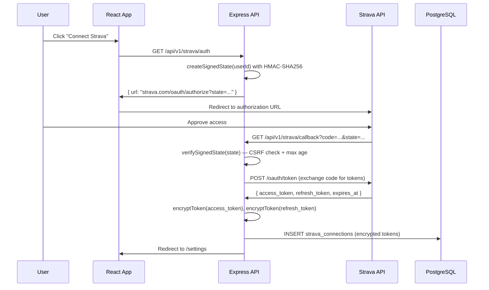

# External Integrations

This document covers the external service integrations used by the Hyrox Companion application: Strava activity syncing, Resend transactional email, pg-boss job queue, and node-cron scheduling.

---

## Table of Contents

1. [Overview](#overview)
2. [Strava Integration](#strava-integration)
3. [Email System (Resend)](#email-system-resend)
4. [Job Queue (pg-boss)](#job-queue-pg-boss)
5. [Cron Scheduling (node-cron)](#cron-scheduling-node-cron)
6. [Startup Maintenance](#startup-maintenance)

---

## Overview

The application relies on four external integration layers:

- **Strava** -- OAuth 2.0 integration for importing workout activities from athletes' Strava accounts.
- **Resend** -- Transactional email delivery for weekly training summaries and missed workout reminders.
- **pg-boss** -- PostgreSQL-backed persistent job queue for background processing (auto-coaching, embedding generation).
- **node-cron** -- In-process cron scheduler that triggers the daily email pipeline.

All integrations are configured through environment variables and initialized during server startup.

---

## Strava Integration

**Key files:**

- `server/strava.ts` -- OAuth routes, token management, activity sync endpoint
- `server/services/stravaMapper.ts` -- Maps Strava activity JSON to the internal `WorkoutLog` shape
- `server/crypto.ts` -- AES-256-GCM encryption/decryption for tokens at rest
- `shared/schema/tables.ts` -- `stravaConnections` table definition

### Strava OAuth Flow Diagram



### Environment Variables

| Variable | Required | Description |
|---|---|---|
| `STRAVA_CLIENT_ID` | Yes | Strava API application client ID |
| `STRAVA_CLIENT_SECRET` | Yes | Strava API application client secret |
| `STRAVA_STATE_SECRET` | Recommended | HMAC secret for signing OAuth state tokens. If not set, a random secret is generated at boot (not safe across multiple server instances). |
| `APP_URL` | Recommended | Base URL of the application (e.g. `https://fitai.coach`). Used to construct the OAuth redirect URI. Defaults to `http://localhost:5000`. |
| `ENCRYPTION_KEY` | Yes | 32-byte hex string used for AES-256-GCM encryption of stored tokens. If not valid hex or wrong length, a SHA-256 hash of the value is derived. |

### OAuth 2.0 Flow

1. **Authorization URL generation** (`GET /api/v1/strava/auth`): The authenticated user requests an authorization URL. The server creates a signed state token containing the user ID, a timestamp (base-36 encoded), and a random nonce. The state is HMAC-SHA256 signed with `STRAVA_STATE_SECRET`. The Strava authorization URL is returned with scope `activity:read_all`.

2. **Callback handling** (`GET /api/v1/strava/callback`): Strava redirects the user back with a `code` and `state` parameter. The server verifies the signed state using timing-safe comparison (via double-hashing with `crypto.timingSafeEqual`) and checks that the state is not older than 10 minutes (`STRAVA_STATE_MAX_AGE_MS`).

3. **Token exchange**: The authorization code is exchanged for an access token, refresh token, and athlete information via a POST to `https://www.strava.com/oauth/token` with `grant_type: authorization_code`.

4. **Connection storage**: The token set and athlete ID are persisted to the `strava_connections` table via `storage.upsertStravaConnection()`.

### CSRF State Verification

The OAuth state parameter serves as a CSRF token. It is structured as `userId:timestamp:nonce:signature` where:

- `timestamp` is base-36 encoded `Date.now()`
- `nonce` is 8 random bytes (hex)
- `signature` is a full 256-bit HMAC-SHA256 over the payload

Verification uses timing-safe comparison by hashing both the received and expected signatures with SHA-256, then comparing with `crypto.timingSafeEqual`. This prevents timing attacks and safely handles inputs of different lengths.

### Encrypted Token Storage

Tokens are encrypted at rest using AES-256-GCM (`server/crypto.ts`):

- **Algorithm**: `aes-256-gcm`
- **IV**: 12 random bytes per encryption (recommended size for GCM)
- **Storage format**: `iv:authTag:ciphertext` (all hex-encoded)
- **Graceful migration**: If stored data does not match the `iv:authTag:ciphertext` format (e.g., legacy plaintext), the decryptor returns the raw value, allowing gradual migration.

The encryption key is lazy-loaded so the server can boot in CI environments without performing crypto operations immediately.

### Token Refresh

When `getValidAccessToken()` is called and the current token's `expiresAt` has passed, the server automatically refreshes the token:

1. POST to `https://www.strava.com/oauth/token` with `grant_type: refresh_token`
2. The new token set (access token, refresh token, expiration) is persisted back to the database
3. The fresh access token is returned for use

All external Strava API calls use `AbortSignal.timeout(15000)` (the `EXTERNAL_API_TIMEOUT_MS` constant).

### Token Refresh Flow

```typescript
// From server/strava.ts — getValidAccessToken()
async function getValidAccessToken(userId: string): Promise<string | null> {
  const connection = await storage.getStravaConnection(userId);
  if (!connection) return null;

  // Token still valid — return decrypted token
  if (connection.expiresAt > new Date()) {
    return connection.accessToken; // auto-decrypted by storage layer
  }

  // Token expired — refresh via Strava API
  const refreshed = await refreshStravaToken(connection.refreshToken);
  if (!refreshed) return null;

  // Store new encrypted tokens
  await storage.upsertStravaConnection({
    userId,
    stravaAthleteId: connection.stravaAthleteId,
    accessToken: refreshed.access_token,   // encrypted on write
    refreshToken: refreshed.refresh_token,  // encrypted on write
    expiresAt: new Date(refreshed.expires_at * 1000),
    scope: connection.scope,
    lastSyncedAt: connection.lastSyncedAt,
  });

  return refreshed.access_token;
}
```

### Activity Sync

Triggered by `POST /api/v1/strava/sync` (rate-limited to 5 requests per 15 minutes):

1. Fetches the 30 most recent activities from `GET https://www.strava.com/api/v3/athlete/activities?per_page=30`
2. Checks which activity IDs already exist in the database via `storage.getExistingStravaActivityIds()` to avoid duplicates
3. New activities are mapped through `mapStravaActivityToWorkout()` which extracts:
   - Date (from `start_date_local`)
   - Focus (from `sport_type` or `type`)
   - Main workout description (distance + duration, or duration-only for non-distance activities)
   - Accessory data (elevation gain, pace)
   - Notes (activity name, heart rate data)
   - Metrics: calories, distance (meters), elevation gain, avg/max heart rate, avg/max speed, cadence, watts, suffer score
4. Distance and pace are formatted according to the user's preferred `distanceUnit` (km or miles)
5. All new workouts are batch-inserted via `storage.createWorkoutLogs()`
6. The `lastSyncedAt` timestamp on the Strava connection is updated

The response includes counts of imported, skipped, and total activities.

### Disconnect Flow

`DELETE /api/v1/strava/disconnect` removes the Strava connection record from the database via `storage.deleteStravaConnection()`. Previously imported workout logs are not deleted.

### Rate Limiting

- Auth and callback endpoints: 20 requests per 15 minutes per IP
- Sync endpoint: 5 requests per 15 minutes per IP

### Registered Routes

| Method | Path | Auth | Description |
|---|---|---|---|
| GET | `/api/v1/strava/status` | Required | Check if user has an active Strava connection |
| GET | `/api/v1/strava/auth` | Required | Generate Strava OAuth authorization URL |
| GET | `/api/v1/strava/callback` | None (state-verified) | OAuth callback from Strava |
| DELETE | `/api/v1/strava/disconnect` | Required | Remove Strava connection |
| POST | `/api/v1/strava/sync` | Required | Import recent activities from Strava |

### Database Schema

The `strava_connections` table (`shared/schema/tables.ts`):

| Column | Type | Notes |
|---|---|---|
| `id` | varchar(255) | Primary key, auto-generated UUID |
| `user_id` | varchar(255) | Unique, foreign key to `users.id` (cascade delete) |
| `strava_athlete_id` | varchar(255) | Strava's numeric athlete ID (stored as string) |
| `access_token` | text | Encrypted with AES-256-GCM |
| `refresh_token` | text | Encrypted with AES-256-GCM |
| `expires_at` | timestamp | Token expiration time |
| `scope` | text | OAuth scope granted |
| `last_synced_at` | timestamp | Nullable; updated after each successful sync |
| `created_at` | timestamp | Auto-set on creation |

---

## Email System (Resend)

**Key files:**

- `server/email.ts` -- Resend client initialization and send functions
- `server/emailTemplates.ts` -- HTML template builders for each email type
- `server/emailScheduler.ts` -- Logic for deciding which emails to send to which users
- `server/routes/email.ts` -- HTTP endpoints for triggering email checks

### Environment Variables

| Variable | Required | Description |
|---|---|---|
| `RESEND_API_KEY` | Yes | API key for the Resend email service |
| `RESEND_FROM_EMAIL` | No | Sender address. Defaults to `fitai.coach <Timmy@fitai.coach>` |
| `CRON_SECRET` | Yes (for HTTP trigger) | Shared secret for authenticating the external cron HTTP endpoint |

### Email Types

#### 1. Weekly Training Summary

- **Trigger**: Sent on Mondays (day of week = 1), no more than once per 7 days per user
- **Guard**: Checks `user.lastWeeklySummaryAt` to prevent duplicates
- **Data gathered**: Completed/missed/skipped workout counts for the prior week, completion rate, current streak, total training duration
- **Subject line**: `Your Week in Review: X workout(s) completed`
- **Template**: Full HTML email with stat cards (completed count, completion rate, total time), a progress bar, streak display, and a CTA linking to the app timeline

#### 2. Missed Workout Reminder

- **Trigger**: Sent daily, no more than once per 24 hours per user
- **Guard**: Checks `user.lastMissedReminderAt` to prevent duplicates
- **Data gathered**: Plan days from yesterday that have "missed" status
- **Subject line**: `X missed workout(s) -- get back on track`
- **Template**: HTML email listing each missed workout with focus area, description (truncated to 120 chars), date, and plan name. Includes a CTA to the timeline.

### User Opt-In

Emails are only sent to users who meet all of these conditions:

1. `user.email` is set (non-null)
2. `user.emailNotifications` (the master toggle) is `true`
3. The per-type toggle for the specific email is `true`:
   - Weekly summary: `user.emailWeeklySummary` (default `true`)
   - Missed workout reminder: `user.emailMissedReminder` (default `true`)

The per-type toggles default to `true` so existing users maintain the
pre-migration behavior (receiving both categories) without an explicit
opt-in. Users can manage all three toggles from `/settings` — the
per-type switches are nested under the master toggle and are disabled
(grayed out) when the master is off. The email footer links back to
the settings page.

### Email Sending Pipeline

The `sendEmail()` function in `server/email.ts`:

1. Instantiates a `Resend` client with the API key
2. Calls `client.emails.send()` with from, to, subject, and HTML body
3. Returns `true` on success, `false` on error (errors are logged but not thrown)

### Batch Processing

`runEmailCronJob()` in `server/emailScheduler.ts`:

1. Calls `storage.markMissedPlanDays()` to mark past planned days as missed before checking
2. Fetches all users with `emailNotifications` enabled via `storage.getUsersWithEmailNotifications()`
3. Processes users in batches of 5 (concurrency limit) using `Promise.allSettled`
4. For each user, calls `checkAndSendEmailsForUser()` which independently checks and sends both email types
5. Returns a summary: users checked, emails sent, and detail strings

### HTTP Endpoints

| Method | Path | Auth | Description |
|---|---|---|---|
| POST | `/api/v1/emails/check` | User auth | Trigger email check for the authenticated user (rate-limited to 5 per window) |
| GET | `/api/v1/cron/emails` | `x-cron-secret` header | External cron trigger for the full email pipeline. Secret is verified with timing-safe comparison. |

The external cron endpoint (`/api/v1/cron/emails`) allows platforms like Railway or external cron services to trigger the email job via HTTP, as an alternative to the internal node-cron scheduler.

### Encryption at Rest

All Strava tokens are encrypted at rest using AES-256-GCM (`server/crypto.ts`):

- **Algorithm**: AES-256-GCM with random 12-byte IV per encryption
- **Key**: 32-byte key from `ENCRYPTION_KEY` env var. Accepts hex-encoded or raw string (SHA-256 hashed to 32 bytes as fallback).
- **Format**: Stored as `${iv}:${authTag}:${encryptedText}` (all hex-encoded)
- **Legacy detection**: If stored value doesn't match the `iv:tag:data` format (3 colon-separated parts), it's treated as unencrypted legacy data -- enabling graceful migration.
- **Lazy key loading**: Key is loaded on first use, not at boot. This allows the server to start in CI environments without `ENCRYPTION_KEY`.
- **Failure mode**: Decryption failures throw (strict) -- never return corrupted data.

---

## Job Queue (pg-boss)

**Key file:** `server/queue.ts`

### Overview

The application uses [pg-boss](https://github.com/timgit/pg-boss), a PostgreSQL-backed job queue, for durable background processing. pg-boss stores jobs in dedicated PostgreSQL tables, providing persistence, retries, and distributed-safe job claiming.

### Initialization

```
const queue = new PgBoss(env.DATABASE_URL);
```

The queue is started via `startQueue()`, which:

1. Calls `queue.start()` to initialize pg-boss tables and begin polling
2. Creates named queues
3. Registers worker functions for each queue

Errors on the queue emit to a global error handler that logs via the application logger.

### Job Types

#### `auto-coach`

- **Purpose**: Triggers the AI auto-coaching pipeline for a user
- **Payload**: `{ userId: string }`
- **Worker**: Calls `triggerAutoCoach(userId)` from `server/services/coachService.ts`
- **On failure**: The error is re-thrown so pg-boss handles retries automatically

#### `embed-coaching-material`

- **Purpose**: Generates vector embeddings for user-uploaded coaching materials (used by the RAG pipeline)
- **Payload**: `{ materialId: string, userId: string }`
- **Worker**: Fetches the material from storage, then calls `embedCoachingMaterial()` from `server/services/ragService.ts`
- **On failure**: If the material is not found, the job is skipped with a warning. Other errors are re-thrown for pg-boss retry handling.
- **Batch behavior**: Jobs are processed via `Promise.allSettled`. If any jobs in the batch fail, a summary error is thrown.

### Job Processing Pattern

Both workers receive an array of `Job[]` objects and process them concurrently with `Promise.all` or `Promise.allSettled`. Failed jobs throw errors to leverage pg-boss's built-in retry mechanism.

### Queue Enqueue Reliability

All `queue.send()` calls are properly `await`-ed to ensure job enqueue operations complete before reporting counts. This prevents mismatches between reported and actual enqueue counts (e.g., email scheduler reporting "2 emails queued" when the jobs haven't been committed yet).

---

## Cron Scheduling (node-cron)

**Key file:** `server/cron.ts`

### Overview

The application uses [node-cron](https://github.com/node-cron/node-cron) for in-process scheduled task execution. Currently there is a single cron job registered.

### Registered Cron Jobs

#### Daily Email Check

- **Schedule**: `0 9 * * *` (every day at 09:00 UTC)
- **Timezone**: `Etc/UTC`
- **Action**: Calls `runEmailCronJob(storage)` which handles both weekly summaries (Mondays only) and missed workout reminders (daily)
- **Idempotency**: The email scheduler has built-in guards (`lastWeeklySummaryAt`, `lastMissedReminderAt`) that prevent duplicate sends even if the job runs multiple times

### Startup Catch-Up

If the server starts after 09:00 UTC (e.g., due to a deployment restart on Railway), a catch-up run is triggered after a 30-second delay:

```
const currentHour = new Date().getUTCHours();
if (currentHour >= 9) {
  setTimeout(async () => {
    await runEmailCronJob(storage);
  }, 30_000);
}
```

This ensures emails are not missed due to server restarts. The idempotency guards prevent double-sending if the scheduled run already completed before the restart.

### Lifecycle

- `startCron(storage)` -- Initializes the cron schedule. Includes a guard against duplicate starts.
- `stopCron()` -- Stops the cron task (used during graceful shutdown).

---

## Startup Maintenance

**Key file:** `server/maintenance.ts`

The `runStartupMaintenance(storage)` function runs a consolidated sequence of checks and migrations every time the server starts. These ensure the database is in a consistent state before the application begins serving requests. The maintenance logic was consolidated from multiple scattered startup functions into a single sequential pipeline.

### Execution Order

1. **Test database connection** -- Attempts to connect to PostgreSQL and run `SELECT 1`. Times out after 15 seconds. If this fails, the server startup is aborted (fatal error).

2. **Run Drizzle migrations** -- Executes pending migrations from the `migrations/` folder using `drizzle-orm/node-postgres/migrator`. In production where `drizzle-kit push` is used, "already exists" errors are expected and treated as non-fatal.

3. **Ensure schema is up to date** -- Checks for and applies incremental schema changes that may not be covered by migrations:
   - Adds `ai_coach_enabled` column to `users` if missing
   - Converts `email_notifications` from integer to boolean if needed
   - Adds `goal` column to `training_plans` if missing
   - Adds `is_auto_coaching` column to `users` if missing
   - Adds `ai_source` column to `plan_days` if missing
   - Creates the `coaching_materials` table if it does not exist (with foreign key to `users` and index on `user_id`)

4. **Ensure pgvector extension** -- Runs `CREATE EXTENSION IF NOT EXISTS vector` on the vector database to enable vector similarity search.

5. **Ensure vector schema** -- Creates the `document_chunks` table on the vector database if it does not exist. Also checks that the `embedding` column uses the native `vector` type (not `text`) and converts it if needed.

6. **Clean orphaned data** -- Within a transaction, nullifies `plan_day_id` on `workout_logs` where the referenced `plan_days` row no longer exists.

7. **Backfill plan dates and workout links** -- Runs three backfill queries:
   - Sets `start_date` and `end_date` on `training_plans` from the min/max `scheduled_date` of their plan days
   - Sets `plan_id` on `workout_logs` that have a `plan_day_id` but no `plan_id`
   - Sets `plan_id` on standalone `workout_logs` (no `plan_day_id`) that fall within a training plan's date range

8. **Mark missed plan days** -- Calls `storage.markMissedPlanDays()` to flag any past planned days that were never completed.

All steps after the database connection test are non-fatal: failures are logged as warnings and the server continues to start.

---

See also: [Database -- stravaConnections Table](database.md#schema-tables), [Authentication](authentication.md), [Architecture -- Service Dependencies](architecture.md#service-dependencies)
