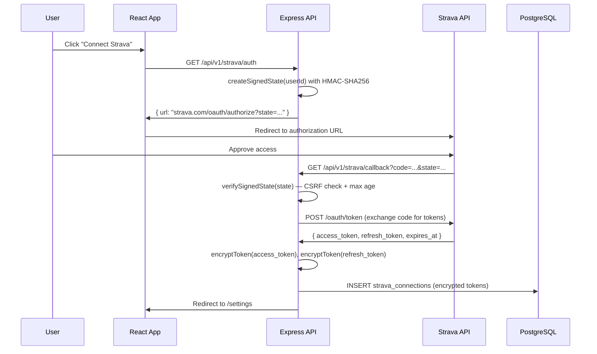
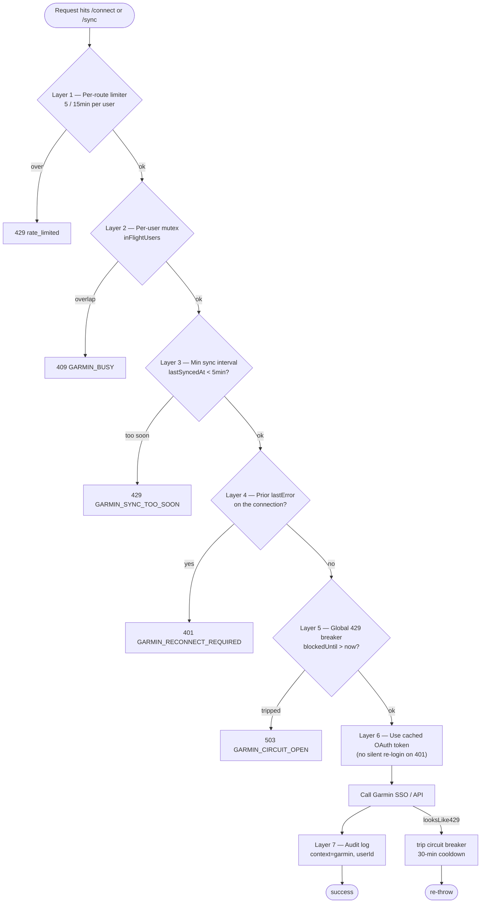

# External Integrations

This document covers the external service integrations used by the fitai.coach application: Strava and Garmin activity syncing, Resend transactional email, pg-boss job queue, node-cron scheduling, and Sentry error tracking.

---

## Table of Contents

1. [Overview](#overview)
2. [Strava Integration](#strava-integration)
3. [Garmin Connect Integration](#garmin-connect-integration)
4. [Email System (Resend)](#email-system-resend)
5. [Job Queue (pg-boss)](#job-queue-pg-boss)
6. [Cron Scheduling (node-cron)](#cron-scheduling-node-cron)
7. [Error Tracking (Sentry)](#error-tracking-sentry)
8. [Startup Maintenance](#startup-maintenance)

---

## Overview

The application relies on six external integration layers:

- **Strava** -- OAuth 2.0 integration for importing workout activities from athletes' Strava accounts.
- **Garmin Connect** -- Email/password sign-in against Garmin's reverse-engineered SSO (no public OAuth) to import activities. Wrapped in a strict safety stack because every request goes out through the same shared server IP.
- **Resend** -- Transactional email delivery for weekly training summaries and missed workout reminders.
- **pg-boss** -- PostgreSQL-backed persistent job queue for background processing (auto-coaching, embedding generation, and the two transactional email sends). Retries are scoped to idempotent handlers only.
- **node-cron** -- In-process cron scheduler that triggers the daily email pipeline and a set of maintenance/telemetry jobs.
- **Sentry** -- Server- and client-side error tracking. Completely optional; a missing DSN disables reporting without affecting the rest of the app.

All integrations are configured through environment variables and initialized during server startup.

Gemini AI provider behavior — model names, retry/jitter, circuit breaker, embedding setup, AI consent middleware, and AI-budget guard — is documented separately in [`docs/ai-and-rag.md`](ai-and-rag.md). This document covers everything else.

---

## Strava Integration

**Key files:**

- `server/strava.ts` -- OAuth routes, token management, activity sync endpoint
- `server/services/stravaMapper.ts` -- Maps Strava activity JSON to the internal `WorkoutLog` shape
- `server/crypto.ts` -- AES-256-GCM encryption/decryption for tokens at rest
- `shared/schema/tables.ts` -- `stravaConnections` table definition

### Strava OAuth Flow Diagram


```mermaid
sequenceDiagram
    participant User
    participant Client as React App
    participant Server as Express API
    participant Strava as Strava API
    participant DB as PostgreSQL
    
    User->>Client: Click "Connect Strava"
    Client->>Server: GET /api/v1/strava/auth
    Server->>Server: createSignedState(userId) with HMAC-SHA256
    Server->>Client: { url: "strava.com/oauth/authorize?state=..." }
    Client->>Strava: Redirect to authorization URL
    User->>Strava: Approve access
    Strava->>Server: GET /api/v1/strava/callback?code=...&state=...
    Server->>Server: verifySignedState(state) — CSRF check + max age
    Server->>Strava: POST /oauth/token (exchange code for tokens)
    Strava->>Server: { access_token, refresh_token, expires_at }
    Server->>Server: encryptToken(access_token), encryptToken(refresh_token)
    Server->>DB: INSERT strava_connections (encrypted tokens)
    Server->>Client: Redirect to /settings
```

### Environment Variables

| Variable | Required | Description |
|---|---|---|
| `STRAVA_CLIENT_ID` | Yes | Strava API application client ID |
| `STRAVA_CLIENT_SECRET` | Yes | Strava API application client secret |
| `STRAVA_STATE_SECRET` | Recommended | HMAC secret for signing OAuth state tokens. If not set, a random secret is generated at boot (not safe across multiple server instances). |
| `APP_URL` | Recommended | Base URL of the application (e.g. `https://fitai.coach`). Used to construct the OAuth redirect URI. Defaults to `http://localhost:5000`. |
| `ENCRYPTION_KEY` | Yes | 32-byte hex string used for AES-256-GCM encryption of stored tokens. If not valid hex or wrong length, a SHA-256 hash of the value is derived. |

### OAuth 2.0 Flow

1. **Authorization URL generation** (`GET /api/v1/strava/auth`): The authenticated user requests an authorization URL. The server creates a signed state token containing the user ID, a timestamp (base-36 encoded), and a random nonce. The state is HMAC-SHA256 signed with `STRAVA_STATE_SECRET`. The Strava authorization URL is returned with scope `activity:read_all`.

2. **Callback handling** (`GET /api/v1/strava/callback`): Strava redirects the user back with a `code` and `state` parameter. The server verifies the signed state using timing-safe comparison (via double-hashing with `crypto.timingSafeEqual`) and checks that the state is not older than 10 minutes (`STRAVA_STATE_MAX_AGE_MS`).

3. **Token exchange**: The authorization code is exchanged for an access token, refresh token, and athlete information via a POST to `https://www.strava.com/oauth/token` with `grant_type: authorization_code`.

4. **Connection storage**: The token set and athlete ID are persisted to the `strava_connections` table via `storage.upsertStravaConnection()`.

### CSRF State Verification

The OAuth state parameter serves as a CSRF token. It is structured as `userId:timestamp:nonce:signature` where:

- `timestamp` is base-36 encoded `Date.now()`
- `nonce` is 8 random bytes (hex)
- `signature` is a full 256-bit HMAC-SHA256 over the payload

Verification uses timing-safe comparison by hashing both the received and expected signatures with SHA-256, then comparing with `crypto.timingSafeEqual`. This prevents timing attacks and safely handles inputs of different lengths.

### Encrypted Token Storage

Tokens are encrypted at rest using AES-256-GCM (`server/crypto.ts`):

- **Algorithm**: `aes-256-gcm`
- **IV**: 12 random bytes per encryption (recommended size for GCM)
- **Storage format**: `v1:iv:authTag:ciphertext` (all hex-encoded). The legacy unversioned `iv:authTag:ciphertext` (3-part) format is still accepted on read for backward compatibility.
- **Strict decryption**: The plaintext passthrough has been removed — data that matches neither format throws `Malformed encrypted data`, as does a wrong-length (non-16-byte) auth tag or any GCM authentication failure.

The encryption key is lazy-loaded so the server can boot in CI environments without performing crypto operations immediately.

### Token Refresh

When `getValidAccessToken()` is called and the current token's `expiresAt` is within a 60-second safety window (`STRAVA_REFRESH_SAFETY_WINDOW_MS`), the server automatically refreshes the token so an in-flight request never races a just-expired token:

1. POST to `https://www.strava.com/oauth/token` with `grant_type: refresh_token`
2. The new token set (access token, refresh token, expiration) is persisted back to the database
3. The fresh access token is returned for use

Refresh requests retry on `429` and `5xx` responses.

All external Strava API calls use `AbortSignal.timeout(15000)` (the `EXTERNAL_API_TIMEOUT_MS` constant).

### Token Refresh Flow

```typescript
// From server/strava.ts — getValidAccessToken()
async function getValidAccessToken(userId: string): Promise<string | null> {
  const connection = await storage.getStravaConnection(userId);
  if (!connection) return null;

  // Token still valid (with a 60s safety window) — return decrypted token
  const refreshAt = new Date(Date.now() + STRAVA_REFRESH_SAFETY_WINDOW_MS);
  if (connection.expiresAt > refreshAt) {
    return connection.accessToken; // auto-decrypted by storage layer
  }

  // Token expired — refresh via Strava API
  const refreshed = await refreshStravaToken(connection.refreshToken);
  if (!refreshed) return null;

  // Store new encrypted tokens
  await storage.upsertStravaConnection({
    userId,
    stravaAthleteId: connection.stravaAthleteId,
    accessToken: refreshed.access_token,   // encrypted on write
    refreshToken: refreshed.refresh_token,  // encrypted on write
    expiresAt: new Date(refreshed.expires_at * 1000),
    scope: connection.scope,
    lastSyncedAt: connection.lastSyncedAt,
  });

  return refreshed.access_token;
}
```

### Activity Sync

Triggered by `POST /api/v1/strava/sync` (rate-limited to 5 requests per 15 minutes):

1. Fetches the 30 most recent activities from `GET https://www.strava.com/api/v3/athlete/activities?per_page=30`
2. Checks which activity IDs already exist in the database via `storage.getExistingStravaActivityIds()` to avoid duplicates
3. New activities are mapped through `mapStravaActivityToWorkout()` which extracts:
   - Date (from `start_date_local`)
   - Focus (from `sport_type` or `type`)
   - Main workout description (distance + duration, or duration-only for non-distance activities)
   - Accessory data (elevation gain, pace)
   - Notes (activity name, heart rate data)
   - Metrics: calories, distance (meters), elevation gain, avg/max heart rate, avg/max speed, cadence, watts, suffer score
4. Distance and pace are formatted according to the user's preferred `distanceUnit` (km or miles)
5. All new workouts are batch-inserted via `storage.createWorkoutLogs()`
6. The `lastSyncedAt` timestamp on the Strava connection is updated

The response includes counts of imported, skipped, and total activities.

### Disconnect Flow

`DELETE /api/v1/strava/disconnect` removes the Strava connection record from the database via `storage.deleteStravaConnection()`. Previously imported workout logs are not deleted.

### Rate Limiting

- Auth and callback endpoints: 20 requests per 15 minutes per IP
- Sync endpoint: 5 requests per 15 minutes per IP

### Registered Routes

| Method | Path | Auth | Description |
|---|---|---|---|
| GET | `/api/v1/strava/status` | Required | Check if user has an active Strava connection |
| GET | `/api/v1/strava/auth` | Required | Generate Strava OAuth authorization URL |
| GET | `/api/v1/strava/callback` | None (state-verified) | OAuth callback from Strava |
| DELETE | `/api/v1/strava/disconnect` | Required | Remove Strava connection |
| POST | `/api/v1/strava/sync` | Required | Import recent activities from Strava |

### Database Schema

The `strava_connections` table (`shared/schema/tables.ts`):

| Column | Type | Notes |
|---|---|---|
| `id` | varchar(255) | Primary key, auto-generated UUID |
| `user_id` | varchar(255) | Unique, foreign key to `users.id` (cascade delete) |
| `strava_athlete_id` | varchar(255) | Strava's numeric athlete ID (stored as string) |
| `access_token` | text | Encrypted with AES-256-GCM |
| `refresh_token` | text | Encrypted with AES-256-GCM |
| `expires_at` | timestamp | Token expiration time |
| `scope` | text | OAuth scope granted |
| `last_synced_at` | timestamp | Nullable; updated after each successful sync |
| `created_at` | timestamp | Auto-set on creation |

---

## Garmin Connect Integration

> **Caveat — unofficial integration.** Garmin Connect uses an unofficial, reverse-engineered SSO library ([`@flow-js/garmin-connect`](https://www.npmjs.com/package/@flow-js/garmin-connect)). There is no official Garmin OAuth application flow for end users; users provide their email + password directly. The integration is inherently fragile against upstream Garmin changes, and does **not** support accounts with 2-step verification (2SV) enabled. The safety stack below exists specifically because every outbound call shares the server's IP, so a single misbehaving code path could earn a Garmin-side ban that affects every user.

**Key files:**

- `server/garmin.ts` -- Route handlers, safety layers, circuit breaker, per-user mutex
- `server/services/garminMapper.ts` -- Maps a Garmin activity payload to the internal `WorkoutLog` shape
- `server/crypto.ts` -- AES-256-GCM encryption/decryption (shared with Strava; see [Encryption at Rest](#encryption-at-rest))
- `shared/schema/tables.ts` -- `garminConnections` table definition

### Why This Is Different From Strava

Garmin does not offer a public OAuth application flow for end users. The only way the application can fetch a user's activities is to log into Garmin Connect on their behalf using their email and password, via the reverse-engineered SSO flow implemented by the [`@flow-js/garmin-connect`](https://www.npmjs.com/package/@flow-js/garmin-connect) library. This has three important consequences:

1. **Credentials are stored at rest** (encrypted with AES-256-GCM) so the server can re-login after the cached OAuth2 token expires (~1 year).
2. **Every outbound call shares the same server IP.** A single misbehaving user or buggy code path could earn the application's IP a Garmin-side ban that affects *every* user. The safety stack below is intentionally strict to prevent that.
3. **2-step verification is not supported.** The SSO library cannot pass Garmin's 2FA challenge; users with 2SV enabled must temporarily disable it to connect.

No server-side Garmin client/secret is needed -- there is nothing to configure in `.env` for this integration.

### HTTP Endpoints

| Method | Path | Description |
|---|---|---|
| GET | `/api/v1/garmin/status` | Returns `{ connected, garminDisplayName?, lastSyncedAt?, lastError? }` for the authenticated user. |
| POST | `/api/v1/garmin/connect` | Body `{ email, password }`. Attempts a fresh login *before* persisting credentials; stores the row only on success. Rate-limited to 5 per 15-minute window per user. |
| DELETE | `/api/v1/garmin/disconnect` | Removes the user's `garmin_connections` row (tokens, credentials, display name). |
| POST | `/api/v1/garmin/sync` | Imports the 20 most recent activities via `getActivities()`, dedupes against `(user_id, garmin_activity_id)`, and returns `{ success, imported, skipped, total }`. Rate-limited to 5 per 15-minute window per user. |

All mutating routes go through `protectedMutationGuards` (authentication + CSRF + idempotency).

### Safety Stack

The order matters: each layer is designed to short-circuit requests before they cost the application a Garmin round-trip.


```mermaid
flowchart TD
    Req([Request hits /connect or /sync]) --> L1{"Layer 1 — Per-route limiter<br/>5 / 15min per user"}
    L1 -- over --> R429a["429 rate_limited"]
    L1 -- ok --> L2{"Layer 2 — Per-user mutex<br/>inFlightUsers"}
    L2 -- overlap --> R409["409 GARMIN_BUSY"]
    L2 -- ok --> L3{"Layer 3 — Min sync interval<br/>lastSyncedAt &lt; 5min?"}
    L3 -- too soon --> R429b["429 GARMIN_SYNC_TOO_SOON"]
    L3 -- ok --> L4{"Layer 4 — Prior lastError<br/>on the connection?"}
    L4 -- yes --> R401["401 GARMIN_RECONNECT_REQUIRED"]
    L4 -- no --> L5{"Layer 5 — Global 429 breaker<br/>blockedUntil &gt; now?"}
    L5 -- tripped --> R503["503 GARMIN_CIRCUIT_OPEN"]
    L5 -- ok --> L6["Layer 6 — Use cached OAuth token<br/>(no silent re-login on 401)"]
    L6 --> Call[Call Garmin SSO / API]
    Call --> Audit["Layer 7 — Audit log<br/>context=garmin, userId"]
    Call -- looksLike429 --> Trip[trip circuit breaker<br/>30-min cooldown]
    Trip --> Fail([re-throw])
    Audit --> Ok([success])
```

| Layer | Mechanism | File location |
|---|---|---|
| 1. Per-route rate limiter | 5 requests per 15 minutes per authenticated user on `/connect` and `/sync` | `garminConnectLimiter`, `garminSyncLimiter` in `server/garmin.ts` |
| 2. Per-user in-flight mutex | Rejects overlapping `/connect` or `/sync` calls for the same user with HTTP 409 `GARMIN_BUSY`. Catches the gap between the rate limiter and completion. | `withUserLock()` + `inFlightUsers: Set<string>` |
| 3. Minimum sync interval | Rejects `/sync` with HTTP 429 `GARMIN_SYNC_TOO_SOON` if `lastSyncedAt` is under 5 minutes old. | `MIN_SYNC_INTERVAL_MS = 5 * 60 * 1000` |
| 4. Fail-fast on `lastError` | If a previous sync left `lastError` set, refuse to retry automatically and return HTTP 401 `GARMIN_RECONNECT_REQUIRED`. The user must disconnect + reconnect, which caps the cost of a broken connection to one failed login attempt. | `handleGarminSync` preflight + `getGarminClient` |
| 5. Global 429 circuit breaker | On *any* Garmin response that looks like a 429 ("429", "too many", "rate limit"), trip the breaker for 30 minutes. While tripped, every Garmin route returns HTTP 503 `GARMIN_CIRCUIT_OPEN` -- across all users on the instance. | `garminCircuitBreaker`, `GLOBAL_429_COOLDOWN_MS` |
| 6. No silent re-login | Cached OAuth tokens live ~1 year. If a fresh-looking token unexpectedly 401s, the error surfaces to the user instead of auto-triggering a new login. | `getGarminClient()` does not fall through from the cached-token path back to login |
| 7. Audit logging | Every Garmin API call and login is logged at `info` level with the user ID and a `context: "garmin"` tag so bans are traceable. | `logger.info({ userId, context: LOG_CTX }, ...)` throughout `server/garmin.ts` |

### Error Translation

`translateGarminError()` converts the library's stringly-typed errors into user-facing messages. Notable mappings:

- "429" / "too many" / "rate limit" → circuit breaker tripped, surface the 30-minute cooldown message.
- "401" / "unauthor" → invalid credentials, suggest disconnect + reconnect.
- "ticket" / "csrf" / "mfa" / "2fa" / "verification" → 2SV is enabled on the Garmin account; library cannot continue.

### Token Storage

The `garmin_connections` row stores four encrypted fields. All four are encrypted with `encryptToken()`/`decryptToken()` and share the same AES-256-GCM scheme used for Strava -- see [Encryption at Rest](#encryption-at-rest).

| Column | Purpose |
|---|---|
| `encrypted_email` | The user's Garmin login email, needed for forced re-login after token expiry. |
| `encrypted_password` | The user's Garmin password (same reason). |
| `encrypted_oauth1_token` | `JSON.stringify(IOauth1Token)` returned by `client.exportToken()` after login. |
| `encrypted_oauth2_token` | `JSON.stringify(IOauth2Token)` returned by `client.exportToken()` after login. |
| `token_expires_at` | UNIX-seconds-to-Date of `oauth2.expires_at`. When `now + 5 min >= token_expires_at`, the next request performs a fresh login. |
| `last_error` | Plaintext (non-secret) error message. Surfaced to the UI as a "reconnect needed" banner. Cleared on successful sync. |

A partial unique index on `workout_logs(user_id, garmin_activity_id) WHERE garmin_activity_id IS NOT NULL` guarantees dedupe at the DB layer even under concurrent imports. `createGarminWorkoutLogs()` uses `onConflictDoNothing`, and the route reports the true insert count (`imported`) plus anything swallowed by the partial index as `skipped`.

---

## Email System (Resend)

**Key files:**

- `server/email.ts` -- Resend client initialization and send functions
- `server/emailTemplates.ts` -- HTML template builders for each email type
- `server/emailScheduler.ts` -- Logic for deciding which emails to send to which users
- `server/routes/email.ts` -- HTTP endpoints for triggering email checks

### Environment Variables

| Variable | Required | Description |
|---|---|---|
| `RESEND_API_KEY` | Yes | API key for the Resend email service |
| `RESEND_FROM_EMAIL` | No | Sender address. Defaults to `fitai.coach <Timmy@fitai.coach>` |
| `CRON_SECRET` | Yes (for HTTP trigger) | Shared secret for authenticating the external cron HTTP endpoint |

### Email Types

#### 1. Weekly Training Summary

- **Trigger**: Sent on Mondays (day of week = 1), no more than once per 7 days per user
- **Guard**: Checks `user.lastWeeklySummaryAt` to prevent duplicates
- **Data gathered**: Completed/missed/skipped workout counts for the prior week, completion rate, current streak, total training duration
- **Subject line**: `Your Week in Review: X workout(s) completed`
- **Template**: Full HTML email with stat cards (completed count, completion rate, total time), a progress bar, streak display, and a CTA linking to the app timeline

#### 2. Missed Workout Reminder

- **Trigger**: Sent daily, no more than once per 24 hours per user
- **Guard**: Checks `user.lastMissedReminderAt` to prevent duplicates
- **Data gathered**: Plan days from yesterday that have "missed" status
- **Subject line**: `X missed workout(s) -- get back on track`
- **Template**: HTML email listing each missed workout with focus area, description (truncated to 120 chars), date, and plan name. Includes a CTA to the timeline.

### User Opt-In

Emails are only sent to users who meet all of these conditions:

1. `user.email` is set (non-null)
2. `user.emailNotifications` (the master toggle) is `true`
3. The per-type toggle for the specific email is `true`:
   - Weekly summary: `user.emailWeeklySummary` (default `false`)
   - Missed workout reminder: `user.emailMissedReminder` (default `false`)

All three email toggles default to `false`, and legacy nullable values are
serialized as `false` by the preferences API. Users must explicitly opt in
from `/settings`; the per-type switches are nested under the master toggle
and are disabled (grayed out) when the master is off. The email footer links
back to the settings page.

### Email Sending Pipeline

For an end-to-end diagram covering the cron tick → pg-boss enqueue → per-user worker → Resend send flow (including the scoped-retry invariant and startup catch-up), see [architecture.md § 7 — Cron → Email Pipeline](architecture.md#7-cron--email-pipeline).

The `sendEmail()` function in `server/email.ts`:

1. Instantiates a `Resend` client with the API key
2. Calls `client.emails.send()` with from, to, subject, and HTML body
3. Returns `true` on success, `false` on error (errors are logged but not thrown)

### Cron Enqueue

`runEmailCronJob()` in `server/emailScheduler.ts` does **not** send email directly — it enqueues one pg-boss job per user per email type, and the per-user worker performs the actual send:

1. Calls `storage.plans.markMissedPlanDays()` to mark past planned days as missed before checking
2. Fetches all users with `emailNotifications` enabled via `storage.users.getUsersWithEmailNotifications()`
3. For each user, enqueues a `send-weekly-summary` job (only on Mondays, only if the per-type toggle is on) and/or a `send-missed-reminder` job (if its toggle is on), respecting per-type opt-ins so no job is queued for an email the user opted out of
4. Every `sendJobNoRetry()` enqueue is `await`-ed via `Promise.allSettled` so the returned counts reflect what actually committed to the queue
5. Returns a summary: users checked, jobs enqueued, and detail strings

The pg-boss workers (`send-weekly-summary`, `send-missed-reminder`) then call `processWeeklySummary()` / `processMissedWorkoutReminder()`, which re-check the per-user idempotency guards and call `sendEmail()`. `checkAndSendEmailsForUser()` is the synchronous equivalent used by the per-user `POST /api/v1/emails/check` route.

### HTTP Endpoints

| Method | Path | Auth | Description |
|---|---|---|---|
| POST | `/api/v1/emails/check` | User auth | Trigger email check for the authenticated user (rate-limited to 5 per window) |
| GET | `/api/v1/cron/emails` | `x-cron-secret` header | External cron trigger for the full email pipeline. Secret is verified with timing-safe comparison. |

The external cron endpoint (`/api/v1/cron/emails`) allows platforms like Railway or external cron services to trigger the email job via HTTP, as an alternative to the internal node-cron scheduler.

### Encryption at Rest

Strava and Garmin tokens are encrypted at rest using AES-256-GCM (`server/crypto.ts`):

- **Algorithm**: AES-256-GCM with random 12-byte IV per encryption
- **Key**: 32-byte key from `ENCRYPTION_KEY` env var. Accepts a 64-char hex string, or any other string (SHA-256 hashed to 32 bytes as fallback).
- **Format**: Stored as `v1:${iv}:${authTag}:${encryptedText}` (all hex-encoded). The legacy 3-part `${iv}:${authTag}:${encryptedText}` format is still accepted on read.
- **No plaintext fallback**: A stored value matching neither format throws `Malformed encrypted data`. The unencrypted-legacy passthrough has been removed.
- **Lazy key loading**: Key is loaded on first use, not at boot. This allows the server to start in CI environments without `ENCRYPTION_KEY`.
- **Failure mode**: Decryption failures throw (strict) -- never return corrupted data. The auth tag must be exactly 16 bytes.

---

## Job Queue (pg-boss)

**Key file:** `server/queue.ts`

### Overview

The application uses [pg-boss](https://github.com/timgit/pg-boss), a PostgreSQL-backed job queue, for durable background processing. pg-boss stores jobs in dedicated PostgreSQL tables, providing persistence, retries, and distributed-safe job claiming.

### Initialization

```
const queue = new PgBoss(env.DATABASE_URL);
```

The queue is started via `startQueue()`, which:

1. Calls `queue.start()` to initialize pg-boss tables and begin polling (wrapped in a 30s timeout that calls `queue.stop()` on failure to avoid leaking the connection pool)
2. Creates the four named queues: `auto-coach`, `embed-coaching-material`, `send-weekly-summary`, `send-missed-reminder`
3. Registers a worker function for each queue

Errors on the queue emit to a global error handler that logs via the application logger.

### Job Types

#### `auto-coach`

- **Purpose**: Triggers the AI auto-coaching pipeline for a user
- **Payload**: `{ userId: string }`
- **Worker**: Calls `triggerAutoCoach(userId)` from `server/services/coachService.ts`
- **On failure**: The error is re-thrown so pg-boss handles retries automatically

#### `embed-coaching-material`

- **Purpose**: Generates vector embeddings for user-uploaded coaching materials (used by the RAG pipeline)
- **Payload**: `{ materialId: string, userId: string }`
- **Worker**: Fetches the material from storage, then calls `embedCoachingMaterial()` from `server/services/ragService.ts`
- **On failure**: If the material is not found, the job is skipped with a warning. Other errors are re-thrown for pg-boss retry handling.
- **Batch behavior**: Jobs are processed via `Promise.allSettled`. If any jobs in the batch fail, a summary error is thrown.

#### `send-weekly-summary`

- **Purpose**: Sends one user's weekly training summary email
- **Payload**: `{ userId: string }`
- **Worker**: Resolves the user, then calls `processWeeklySummary()` from `server/emailScheduler.ts`
- **Enqueued via**: `sendJobNoRetry()` — email sending is not safely replayable, so `retryLimit: 0` (see [Scoped Retries](#scoped-retries-idempotent-vs-side-effectful-jobs)). The `lastWeeklySummaryAt` "sent" marker prevents duplicates.

#### `send-missed-reminder`

- **Purpose**: Sends one user's missed-workout reminder email
- **Payload**: `{ userId: string }`
- **Worker**: Resolves the user, then calls `processMissedWorkoutReminder()` from `server/emailScheduler.ts`
- **Enqueued via**: `sendJobNoRetry()` — `retryLimit: 0` for the same reason. The `lastMissedReminderAt` "sent" marker prevents duplicates.

### Job Processing Pattern

Every worker receives an array of `Job[]` objects and processes them concurrently via the shared `runBatch()` helper, which uses a bounded `p-limit` pool (`IN_BATCH_CONCURRENCY = 2`) and `Promise.allSettled` semantics so a single poison job does not discard the whole batch. Failed jobs still aggregate into a thrown summary error so pg-boss sees the batch as failed and can retry only the failed ones on the next poll. Each job is additionally wrapped in a 50-minute wall-clock timeout (`JOB_TIMEOUT_MS`) that aborts the job — deliberately 10 minutes below the 60-minute `expireInMinutes` so an orphaned upstream call can tear down before pg-boss treats the job as re-dispatchable.

### Scoped Retries (Idempotent vs. Side-Effectful Jobs)

`server/queue.ts` exposes two enqueue helpers with different retry policies. **Use the matching helper for your handler's idempotency guarantees** -- this is the project's contract for what "safe to retry" means:

| Helper | Retries | Use for |
|---|---|---|
| `sendJob(name, data)` | `retryLimit: 3`, `retryBackoff: true`, `expireInMinutes: 60` (`DEFAULT_JOB_OPTIONS`) | Handlers that are safe to invoke multiple times for the same payload: pure DB reads/writes keyed by an ID, operations protected by DB-level uniqueness, embedding generation. |
| `sendJobNoRetry(name, data)` | `retryLimit: 0`, `expireInMinutes: 60` (`NO_RETRY_JOB_OPTIONS`) | Handlers with side effects that cannot be safely replayed. The canonical case is email sending: the "sent" marker is persisted *after* the external send, so a retry after a post-send DB failure would deliver a duplicate. |

### Queue Enqueue Reliability

All `queue.send()` calls are properly `await`-ed to ensure job enqueue operations complete before reporting counts. This prevents mismatches between reported and actual enqueue counts (e.g., email scheduler reporting "2 emails queued" when the jobs haven't been committed yet).

---

## Cron Scheduling (node-cron)

**Key file:** `server/cron.ts`

### Overview

The application uses [node-cron](https://github.com/node-cron/node-cron) for in-process scheduled task execution. There are **seven recurring** scheduled jobs (the daily email check plus six maintenance/telemetry jobs) and one **conditional startup catch-up** that only fires when the server starts after 09:00 UTC. Cron is safe for multi-replica production because each job body is wrapped in a PostgreSQL advisory lock (`runCronJobWithLock()`, keyed via `CRON_LOCK_KEYS`), so duplicate schedulers skip work when more than one app instance is running. Route rate limits and short-lived auth/AI/RAG caches are also backed by Postgres shared state.

### Registered Cron Jobs

#### Daily Email Check

- **Schedule**: `0 9 * * *` (every day at 09:00 UTC)
- **Timezone**: `Etc/UTC`
- **Action**: Calls `runEmailCronJob(storage)` which handles both weekly summaries (Mondays only) and missed workout reminders (daily)
- **Idempotency**: The email scheduler has built-in guards (`lastWeeklySummaryAt`, `lastMissedReminderAt`) that prevent duplicate sends even if the job runs multiple times
- **Advisory lock**: `dailyEmail`

#### Maintenance and Telemetry

| Job | Schedule | Advisory lock |
|---|---|---|
| Idempotency cleanup | `30 3 * * *` UTC | `idempotencyCleanup` |
| AI usage cleanup | `0 4 * * *` UTC | `aiUsageCleanup` |
| Shared runtime state cleanup | `15 4 * * *` UTC | `sharedRuntimeCleanup` |
| Stale auto-coach recovery | `*/10 * * * *` UTC | `staleAutoCoaching` |
| pg-boss queue-depth telemetry | `*/5 * * * *` UTC | `queueDepthTelemetry` |
| Structured exercise health rollup | `10 2 * * *` UTC | `structuredExerciseRollup` |

### Startup Catch-Up

If the server starts after 09:00 UTC (e.g., due to a deployment restart on Railway), a catch-up run is triggered after a 30-second delay:

```
const currentHour = new Date().getUTCHours();
if (currentHour >= 9) {
  setTimeout(async () => {
    await runEmailCronJob(storage);
  }, 30_000);
}
```

This ensures emails are not missed due to server restarts. The startup catch-up uses its own advisory lock (`startupEmailCatchUp`), and the email scheduler's idempotency guards prevent double-sending if the scheduled run already completed before the restart.

### Lifecycle

- `startCron(storage)` -- Initializes the cron schedule. Includes a guard against duplicate starts.
- `stopCron()` -- Stops the cron task (used during graceful shutdown).

---

## Error Tracking (Sentry)

Sentry provides centralized error tracking for both server and client. It is entirely optional: a missing DSN disables initialization without affecting the rest of the app.

**Key files:**

- `server/bootstrap/observability.ts` -- Server-side Sentry initialization. `configureObservability()` skips `Sentry.init` entirely when `SENTRY_DSN` is unset; `registerProcessErrorHandlers()` wires uncaught exceptions and unhandled rejections to `Sentry.captureException`. Both are invoked from `server/index.ts`.
- `client/src/main.tsx` -- Client-side Sentry initialization with `@sentry/react`, gated on `VITE_SENTRY_DSN`. The root `<App />` is wrapped in `Sentry.ErrorBoundary` with `FallbackErrorBoundary` as its fallback UI.
- `client/src/components/FeatureErrorBoundaryWrapper.tsx` -- Per-feature error boundary that reports to Sentry with a `featureName` tag so regressions can be attributed to a specific page.

### Environment Variables

| Variable | Required | Description |
|---|---|---|
| `SENTRY_DSN` | No | Server DSN. When absent, the `@sentry/node` init is skipped. |
| `VITE_SENTRY_DSN` | No | Client DSN. When absent, `Sentry.init` on the client is skipped. |
| `SENTRY_AUTH_TOKEN` | No (build-time) | Personal/organization auth token (scopes: `project:releases`, `org:read`). When set alongside `SENTRY_ORG` + `SENTRY_PROJECT_CLIENT` + `SENTRY_PROJECT_SERVER`, the build uploads sourcemaps and tags a release. |
| `SENTRY_ORG` | No (build-time) | Sentry organization slug. |
| `SENTRY_PROJECT_CLIENT` | No (build-time) | Sentry project slug for the browser bundle. |
| `SENTRY_PROJECT_SERVER` | No (build-time) | Sentry project slug for the Node bundle. |

The server Sentry environment tag derives from `NODE_ENV`; the client tag derives
from Vite's `MODE`. There is no separate `SENTRY_ENVIRONMENT` variable. Because
the app ships without a bundled DSN, local development does not report to Sentry
unless the developer explicitly opts in by setting the DSN variables.

### What Is Reported

- **Server**: unhandled errors thrown from routes (via the Express error handler), rejected promises inside `asyncHandler`, and fatal errors from `runStartupMaintenance` before the HTTP listener binds.
- **Client**: render-time errors caught by `Sentry.ErrorBoundary` / `FeatureErrorBoundaryWrapper`, plus any explicit `Sentry.captureException` calls inside fetch wrappers.

PII-sensitive payloads are scrubbed before being sent. The server `beforeSend` hook in `server/bootstrap/observability.ts` strips request body and query string, cookies, the `authorization`/`cookie`/`x-csrf-token`/`x-idempotency-key` headers, and the user's `email`, `username`, and `ip_address`. The server trace sample rate is `0.1` in production and `1.0` otherwise; `sendDefaultPii` is `false`.

### Sourcemap Upload and Release Tagging (Build-Time)

Both bundles emit hidden sourcemaps (`build.sourcemap: "hidden"` in `vite.config.ts`, `sourcemap: true` in `script/build.ts`) and run through the official Sentry build plugins:

- `@sentry/vite-plugin` is the last plugin in `vite.config.ts` and handles the client bundle.
- `@sentry/esbuild-plugin` is the only plugin in the esbuild call in `script/build.ts` and handles the server bundle.

When `SENTRY_AUTH_TOKEN` is unset, both plugins are explicitly disabled (`disable: !sentryAuthToken`) and the build proceeds identically to today — sourcemaps are emitted locally but not uploaded. When the auth token is present alongside `SENTRY_ORG` and the appropriate `SENTRY_PROJECT_*` slugs, the plugins upload the sourcemaps to Sentry, create a release identified by the current git SHA, and delete the local `.map` files (`filesToDeleteAfterUpload`) so they are not shipped to the runtime artifact.

Both Sentry inits also pass an explicit `release` field:

- Server (`server/bootstrap/observability.ts`): reads `process.env.SENTRY_RELEASE` first (the value injected by the esbuild plugin at build time), then falls back to `fitai-coach@${npm_package_version}`.
- Client (`client/src/main.tsx`): reads `import.meta.env.VITE_SENTRY_RELEASE` first (a manual override), then `import.meta.env.SENTRY_RELEASE` (the value injected by the Vite plugin at build time). Resolves to `undefined` in dev/contributor builds; Sentry buckets such events as releaseless, which is acceptable.

**Railway:** the production build runs on Railway (`pnpm install --frozen-lockfile && pnpm run build` via `railway.toml`). To enable sourcemap upload, set `SENTRY_AUTH_TOKEN`, `SENTRY_ORG`, `SENTRY_PROJECT_CLIENT`, and `SENTRY_PROJECT_SERVER` as build-time environment variables in the Railway service settings. They are not required at runtime.

---

## Startup Maintenance

**Key file:** `server/maintenance.ts`

The `runStartupMaintenance(storage)` function runs a consolidated sequence of checks and migrations every time the server starts. These ensure the database is in a consistent state before the application begins serving requests. The maintenance logic was consolidated from multiple scattered startup functions into a single sequential pipeline.

### Execution Order

1. **Test database connection** -- Attempts to connect to PostgreSQL and run `SELECT 1`. Times out after 15 seconds. If this fails, the server startup is aborted (fatal error).

2. **Run Drizzle migrations** -- Executes pending migrations from the `migrations/` folder using `drizzle-orm/node-postgres/migrator`. "Already exists" errors are expected in environments where `drizzle-kit push` has previously run and are treated as non-fatal.

3. **Ensure pgvector extension** -- Runs `CREATE EXTENSION IF NOT EXISTS vector` on the vector database to enable vector similarity search.

4. **Ensure vector schema** -- Creates the `document_chunks` table on the vector database if it does not exist. Also checks that the `embedding` column uses the native `vector` type (not `text`) and converts it if needed. This step runs on the separate `vectorPool` that Drizzle migrations do not manage.

5. **Mark missed plan days** -- Calls `storage.plans.markMissedPlanDays()` to flag any past planned days that were never completed. Non-fatal; logged as a warning if it fails.

6. **Reset stale auto-coaching flags** -- Calls `storage.users.resetStaleAutoCoaching()` to clear the `is_auto_coaching` flag on any user whose previous server process died mid-coach. Non-fatal; logged as a warning if it fails.

Historical schema-patching steps (defensive `ALTER TABLE` adds for `ai_coach_enabled`, `email_notifications`, `goal`, `is_auto_coaching`, `ai_source`, and the `coaching_materials` table) were removed once those columns and tables became part of the Drizzle migration sequence; see the resolution of `TECHNICAL_DEBT.md` #8.

---

See also: [Database -- stravaConnections Table](database.md#schema-tables), [Authentication](authentication.md), [Architecture -- Service Dependencies](architecture.md#service-dependencies)
