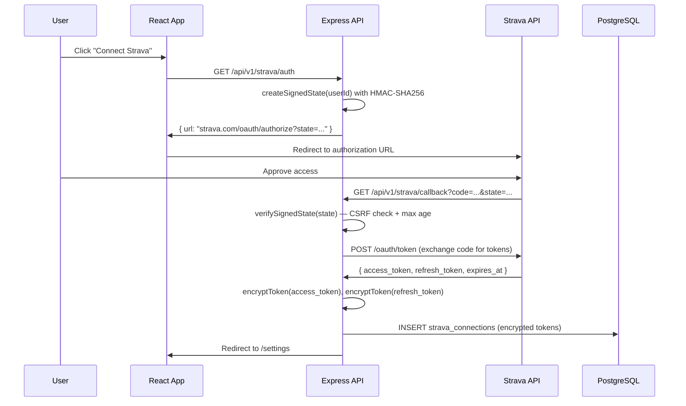
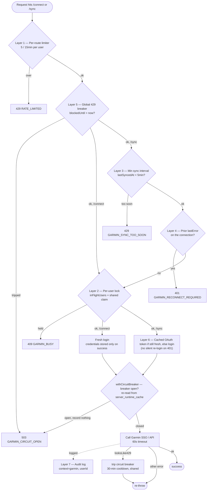

# External Integrations

This document covers the external service integrations used by the fitai.coach application: Strava and Garmin activity syncing, Resend transactional email, Web Push notifications, pg-boss job queue, node-cron scheduling, and Sentry error tracking.

---

## Table of Contents

1. [Overview](#overview)
2. [Strava Integration](#strava-integration)
3. [Garmin Connect Integration](#garmin-connect-integration)
4. [Email System (Resend)](#email-system-resend)
5. [Web Push Notifications](#web-push-notifications)
6. [Job Queue (pg-boss)](#job-queue-pg-boss)
7. [Cron Scheduling (node-cron)](#cron-scheduling-node-cron)
8. [Error Tracking (Sentry)](#error-tracking-sentry)
9. [Startup Maintenance](#startup-maintenance)

---

## Overview

The application relies on seven external integration layers:

- **Strava** -- OAuth 2.0 integration for importing workout activities from athletes' Strava accounts, kept current automatically by Strava's webhook push plus a polling fallback.
- **Garmin Connect** -- Email/password sign-in against Garmin's reverse-engineered SSO (no public OAuth) to import activities. Wrapped in a strict safety stack because every request goes out through the same shared server IP.
- **Resend** -- Transactional email delivery for the six athlete emails: weekly training summary, missed workout reminder, weekly review reminder, session brief, analysis digest, and MAF test reminder.
- **Web Push** -- Browser push notifications (VAPID, via the `web-push` library) that ride along with those emails and carry the push-only nutrition reminders. Optional; disabled unless all three VAPID variables are set.
- **pg-boss** -- PostgreSQL-backed persistent job queue for background processing (auto-coaching, embedding generation, the six per-user email sends, plan generation, analytics recompute, and Strava sync). Retries are scoped to idempotent handlers only.
- **node-cron** -- In-process cron scheduler that triggers the hourly email scan and a set of maintenance/telemetry/sync jobs.
- **Sentry** -- Server- and client-side error tracking. Completely optional; a missing DSN disables reporting without affecting the rest of the app.

All integrations are configured through environment variables and initialized during server startup.

Gemini AI provider behavior — model names, retry/jitter, circuit breaker, embedding setup, AI consent middleware, and AI-budget guard — is documented separately in [`docs/ai-and-rag.md`](ai-and-rag.md). This document covers everything else.

---

## Strava Integration

**Key files:**

- `server/strava.ts` -- OAuth routes, token management, the sync engine (`syncStravaForUser()`) and the manual sync endpoint
- `server/stravaWebhook.ts` -- Webhook push subscription: callback validation, event receipt, idempotent subscription registration
- `server/services/stravaSyncQueue.ts` -- `strava-sync` queue producer (per-athlete debounce)
- `server/services/stravaAutoSync.ts` -- `strava-sync` worker, polling-fallback scan, shared 429 cooldown
- `server/services/stravaMapper.ts` -- Maps Strava activity JSON to the internal `WorkoutLog` shape
- `server/services/stravaReconciler.ts` -- Matches each synced activity to the day's logged workouts and open plan days before anything is inserted
- `server/services/deviceActivityMatcher.ts` -- The pure scoring engine behind that matching (no DB, no clock)
- `server/services/deviceActivityLink.ts` -- Attach / create-from-plan-day / manual link / lossless unlink, with the invariants in one place
- `server/routes/workouts/workoutsDeviceLink.routes.ts` -- `POST`/`DELETE /api/v1/workouts/:id/device-link`, the athlete's override of the matcher
- `server/crypto.ts` -- AES-256-GCM encryption/decryption for tokens at rest
- `shared/schema/tables.ts` -- `stravaConnections` table definition

### Strava OAuth Flow Diagram


```mermaid
sequenceDiagram
    participant User
    participant Client as React App
    participant Server as Express API
    participant Strava as Strava API
    participant DB as PostgreSQL
    
    User->>Client: Click "Connect Strava"
    Client->>Server: GET /api/v1/strava/auth
    Server->>Server: createSignedState(userId) with HMAC-SHA256
    Server->>Client: { url: "strava.com/oauth/authorize?state=..." }
    Client->>Strava: Redirect to authorization URL
    User->>Strava: Approve access
    Strava->>Server: GET /api/v1/strava/callback?code=...&state=...
    Server->>Server: verifySignedState(state) — CSRF check + max age
    Server->>Strava: POST /oauth/token (exchange code for tokens)
    Strava->>Server: { access_token, refresh_token, expires_at }
    Server->>Server: encryptToken(access_token), encryptToken(refresh_token)
    Server->>DB: INSERT strava_connections (encrypted tokens)
    Server->>Client: Redirect to /settings
```

### Environment Variables

| Variable | Required | Description |
|---|---|---|
| `STRAVA_CLIENT_ID` | Yes | Strava API application client ID |
| `STRAVA_CLIENT_SECRET` | Yes | Strava API application client secret |
| `STRAVA_STATE_SECRET` | **Required in production** | HMAC secret for signing OAuth state tokens. Unset, a random secret is generated per process, which is not safe across multiple instances — so `server/env.ts` now refuses to boot a production deploy that has `STRAVA_CLIENT_ID` but no state secret. |
| `APP_URL` | Recommended | Base URL of the application (e.g. `https://fitai.coach`). Used to construct the OAuth redirect URI and the webhook callback URL. Defaults to `http://localhost:5000`; the push subscription is only registered when this is a public `https://` origin. |
| `STRAVA_AUTO_SYNC_ENABLED` | Optional (default `true`) | Master switch for [automatic sync](#automatic-sync): webhook push, polling fallback and the post-connect import. `false` leaves only the manual Sync button. |
| `STRAVA_AUTO_SYNC_INTERVAL_MINUTES` | Optional (default `60`) | Polling fallback: how stale a connection's `last_synced_at` may get before it is re-synced (minimum 5). Each connected athlete costs about `1440 / interval` Strava reads a day. |
| `STRAVA_WEBHOOKS_ENABLED` | Optional (default `true`) | `false` stops the server from registering, and acting on, the Strava push subscription; polling still runs. |
| `STRAVA_WEBHOOK_VERIFY_TOKEN` | Optional | Token Strava echoes back when validating the callback URL (8+ chars). Derived from `STRAVA_CLIENT_SECRET` when unset, so it only needs setting to pin a specific value. |
| `ENCRYPTION_KEY` | Yes | 32-byte hex string used for AES-256-GCM encryption of stored tokens. If not valid hex or wrong length, a SHA-256 hash of the value is derived. |

### OAuth 2.0 Flow

1. **Authorization URL generation** (`GET /api/v1/strava/auth`): The authenticated user requests an authorization URL. The server creates a signed state token containing the user ID, a timestamp (base-36 encoded), and a random nonce. The state is HMAC-SHA256 signed with `STRAVA_STATE_SECRET`. The Strava authorization URL is returned with scope `activity:read_all`.

2. **Callback handling** (`GET /api/v1/strava/callback`): Strava redirects the user back with a `code` and `state` parameter. The server verifies the signed state using timing-safe comparison (via double-hashing with `crypto.timingSafeEqual`) and checks that the state is not older than 10 minutes (`STRAVA_STATE_MAX_AGE_MS`). The state is then **atomically claimed** in the shared runtime cache (`claimRuntimeCacheKey`, cross-instance) so a captured callback URL cannot be replayed within the validity window — a second callback with the same state redirects to `/settings?strava=error`.

3. **Token exchange**: The authorization code is exchanged for an access token, refresh token, and athlete information via a POST to `https://www.strava.com/oauth/token` with `grant_type: authorization_code`.

4. **Connection storage**: The token set and athlete ID are persisted to the `strava_connections` table via `storage.users.upsertStravaConnection()`.

### CSRF State Verification

The OAuth state parameter serves as a CSRF token. It is structured as `userId:timestamp:nonce:signature` where:

- `timestamp` is base-36 encoded `Date.now()`
- `nonce` is 8 random bytes (hex)
- `signature` is a full 256-bit HMAC-SHA256 over the payload

Verification uses timing-safe comparison by hashing both the received and expected signatures with SHA-256, then comparing with `crypto.timingSafeEqual`. This prevents timing attacks and safely handles inputs of different lengths.

States are additionally **single-use**: on a successful callback the state is claimed in the `server_runtime_cache` table (TTL = the state max age, swept by the shared-runtime cleanup cron), so replaying a valid state fails even inside the 10-minute window.

### Encrypted Token Storage

Tokens are encrypted at rest using AES-256-GCM (`server/crypto.ts`):

- **Algorithm**: `aes-256-gcm`
- **IV**: 12 random bytes per encryption (recommended size for GCM)
- **Storage format**: `<version>:iv:authTag:ciphertext` (all hex-encoded), where the version is `v1` (`ENCRYPTION_KEY`) or, once `ENCRYPTION_KEY_V2` is set, `v2` for new writes. The legacy unversioned `iv:authTag:ciphertext` (3-part) format is still accepted on read and decrypted with the v1 key.
- **Strict decryption**: The plaintext passthrough has been removed — data that matches neither format throws `Malformed encrypted data`; a wrong-length (non-16-byte) auth tag or any GCM authentication failure throws `Failed to decrypt token`.

The encryption key is lazy-loaded so the server can boot in CI environments without performing crypto operations immediately.

### Token Refresh

When `getValidAccessToken()` is called and the current token's `expiresAt` is within a 60-second safety window (`STRAVA_REFRESH_SAFETY_WINDOW_MS`), the server automatically refreshes the token so an in-flight request never races a just-expired token:

1. POST to `https://www.strava.com/oauth/token` with `grant_type: refresh_token`
2. The new token set (access token, refresh token, expiration) is persisted back to the database via `updateStravaTokens()` (a narrow UPDATE that cannot clobber `strava_athlete_id`, `scope`, or the `last_synced_at` cursor)
3. The fresh access token is returned for use

Refresh requests retry on `429` and `5xx` responses.

**Concurrency**: Strava *rotates* the refresh token on every refresh and invalidates the old one, so two concurrent refreshes with the same stored token would brick the connection. The refresh is therefore serialized under a **per-user Postgres advisory lock** (`withPgAdvisoryLock`, key = SHA-256 of `strava-refresh:<userId>` truncated to int64 — cross-instance safe) with a re-read inside the lock: the loser of the race finds the winner's freshly-stored token and skips its own refresh. A request that fails the try-lock polls the connection briefly (3 × 500ms) for the winner's result before giving up with a transient error.

**Permanent failure / reauth tombstone**: if the token endpoint answers with a non-retryable `4xx` (e.g. `invalid_grant` after the user revoked the app on strava.com), the connection's `requires_reauth` flag is set instead of leaving a zombie row. From then on `/status` reports `requiresReauth: true`, `/sync` fails fast with the `STRAVA_REAUTH_REQUIRED` code, and the client shows a **Reconnect** button. The flag is cleared by a successful reconnect (upsert) or any successful refresh. A `401`/`403` from the activities API mid-sync sets the same flag. This mirrors the Garmin `lastError` fail-fast pattern.

All external Strava API calls use `AbortSignal.timeout(15000)` (the `EXTERNAL_API_TIMEOUT_MS` constant).

### Activity Sync

The engine is `syncStravaForUser()` in `server/strava.ts`, shared by the manual `POST /api/v1/strava/sync` route (rate-limited to 5 requests per 15 minutes) and the background `strava-sync` jobs described under [Automatic Sync](#automatic-sync), so a background import lands exactly as a manual one would. Every sync is **incremental**:

1. Computes an `after` cursor (`computeSyncAfterEpoch()`, epoch seconds):
   - First sync (`last_synced_at` is null): `now − 90 days` (`STRAVA_FIRST_SYNC_BACKFILL_DAYS`)
   - Subsequent syncs: `last_synced_at − 7 days` (`STRAVA_SYNC_OVERLAP_MS`) — the overlap catches activities uploaded late by a device (e.g. a watch synced days after the workout); the DB dedup absorbs the re-fetched rows
2. Fetches `GET https://www.strava.com/api/v3/athlete/activities?after=…&per_page=200&page=N`, paginating up to 5 pages per sync (`STRAVA_MAX_SYNC_PAGES`, ≤1000 activities / ≤5 read requests — well inside Strava's 100-reads-per-15-min app budget). With `after`, Strava returns activities in **ascending** `start_date` order. A short page ends pagination; 5 full pages sets `hasMore: true` in the response.
3. Checks which activity IDs already exist in the database via `storage.workouts.getExistingStravaActivityIds()` to avoid duplicates. This dedup is also what makes a manual link or unlink sticky: either way the activity's id is already on a row, so a re-sync never revisits it
4. New activities are mapped through `mapStravaActivityToWorkout()` which extracts:
   - Date (from `start_date_local`)
   - Focus (from `sport_type` or `type`)
   - Main workout description (distance + duration, or duration-only for non-distance activities)
   - Accessory data (elevation gain, pace)
   - Notes (activity name, heart rate data)
   - Metrics: calories, distance (meters), elevation gain, avg/max heart rate, avg/max speed, cadence, watts, suffer score
5. **Calorie enrichment**: the list endpoint never returns `calories` (and `kilojoules` only exists for power-meter rides), so the newest ≤25 imported activities (`STRAVA_CALORIE_DETAIL_LIMIT`) get a best-effort `GET /api/v3/activities/{id}` detail fetch to fill in calories. Failures are non-fatal; a `429` stops the enrichment loop without failing the sync.
6. Distance and pace are formatted according to the user's preferred `distanceUnit` (km or miles)
7. **Reconciliation** (`server/services/stravaReconciler.ts`): a recording is a *measurement* of a session the athlete planned or logged, not a workout of its own, so before anything is inserted each new activity is scored against that local calendar day's rows — the day's workout logs that carry no device activity yet (`storage.workouts.listDeviceUnlinkedLogsForDates()`) and its open plan days (planned or missed, unlogged, plan still live — `storage.plans.listOpenPlanDaysForDates()`); two queries for the whole batch. The matcher (`deviceActivityMatcher.ts`, pure functions) classifies the Strava `sport_type` and the prescription text (Hyrox-aware: sled, wall ball, ski erg and "sim" read as conditioning, so "8 x 1 km" inside a sim is not a run) and takes a weighted mean over the signals available for the pair — type compatibility 0.4, duration 0.35, time of day 0.15, distance 0.2 (only when the prescription names one unambiguous "8 km"), activity-name overlap 0.05. Incompatible types are damped so the numbers cannot rescue a ride onto a strength day, rest days score zero, and activities under 5 minutes never match. Across a batch the assignment is one-to-one, greedy by score (a warm-up and the session itself cannot both claim the plan day). Then, per activity:
   - **link → workout log** (score ≥ 0.75): the athlete already logged it. The recording is attached to that row, filling only the metric columns that are NULL — nothing the athlete typed is overwritten — and the raw activity plus the list of filled columns is snapshotted into `device_activity` so the link can be undone exactly.
   - **link → plan day** (score ≥ 0.75): not logged yet. The activity becomes the day's log, built the way a manual confirm builds one (`createWorkoutInTx`: prescription text, copied sets and structure, adherence snapshot, day marked completed) with the recording's metrics on top. RPE stays NULL — a watch cannot say how it felt. The plan day's row is locked first, so a confirm racing the sync attaches to the athlete's log instead of creating a second one.
   - **suggest** (0.45 ≤ score < 0.75): imported standalone, with the candidate recorded in `suggested_plan_day_id` / `suggested_workout_log_id` / `suggested_link_confidence` for the timeline to offer as a one-tap link.
   - **none**: imported standalone, with no suggestion attached.

   Standalone rows are batch-inserted via `storage.workouts.createWorkoutLogs()` (`onConflictDoNothing` on the per-user Strava unique index, so a concurrent sync shows up as `skipped` rather than as a duplicate), and each one then gets the single cardio exercise set its recording describes via `storage.workouts.createDeviceActivitySets()` (`server/services/deviceActivitySets.ts`) — roughly half the Analytics tab aggregates sets rather than logs, so without it a Strava-only athlete saw no Running slice and an empty PR list. The thresholds are the one constant `DEFAULT_MATCH_THRESHOLDS`.
8. The `lastSyncedAt` cursor is updated: to *now* after a complete sync, or — when the page cap was hit — to the newest fetched activity's `start_date`, so the next sync resumes exactly where this one stopped and nothing is ever silently skipped

The response reports `imported` (activities now on the timeline, wherever they landed) broken down into `enriched` (attached to workouts the athlete had logged), `completedPlanDays`, `suggested` and `standalone`, plus `skipped` (already imported, or claimed by a concurrent sync), `total`, and `hasMore` (true when a capped sync left older activities to fetch — the client hints to run Sync again).

**Manual override.** The athlete's judgement outranks the matcher. `POST /api/v1/workouts/:id/device-link` merges a standalone Strava import into a plan day or a workout they logged themselves (`device_link_source = 'manual'`, which the sync never revisits), and `DELETE /api/v1/workouts/:id/device-link` unlinks losslessly: an enriched manual log gets exactly the filled columns set back to NULL, a plan-day log the sync created is deleted and the day's status re-derived, and either way the activity comes back as its own row (`server/services/deviceActivityLink.ts`). `DELETE /api/v1/workouts/:id/device-link/suggestion` is "not this one": it drops a suggestion the athlete rejects. "Reopen workout" on a completed day whose log carries a recording folds the athlete's edits back onto the day as it always has, but releases the recording as its own row (`releaseStravaActivityInTx`, the same step unlink uses) instead of deleting it with the log, dropping the `Strava: <name>` line from the folded notes; the released row keeps the activity id, so a re-sync neither re-imports it nor re-completes the day just reopened. On the timeline, a standalone import that carries a suggestion shows "Was this your <session>?" with Link / Not this one; the Strava badge on a linked entry opens a menu with "Unlink Strava activity", and on an import with no suggestion it lists the day's planned sessions and manual logs to link to (`client/src/components/timeline/timeline-workout-card/DeviceLinkControls.tsx`, `useDeviceLinkMutations`). The badge and device stats key off `stravaActivityId` rather than `source`, so an enriched manual log shows them too. On the review sheet a device import is as editable as any other logged workout — title, description, exercise rows, structure, RPE and notes — because a Strava "Workout" often arrives as a generic stub the athlete has to fill in; the recording's stats sit alongside, and the description's provenance hint reads "from Strava" rather than "from coach text". Garmin still uses the older bulk-insert path; the matcher is provider-agnostic, so wiring it is a normaliser plus the same reconciler call.

### Disconnect Flow

`DELETE /api/v1/strava/disconnect` first performs a **best-effort upstream revocation** (`POST https://www.strava.com/oauth/deauthorize` via `deauthorizeStravaBestEffort()` — failures are logged and ignored so a Strava outage can never block disconnect), then removes the Strava connection record via `storage.users.deleteStravaConnection()`. Previously imported workout logs are not deleted. Account deletion reuses the same helper.

### Rate Limiting

Every limiter comes from `rateLimiter()` in `server/routeUtils.ts`, which keys its bucket by the Clerk user id when one resolves and by client IP otherwise. All routes except the callback run `isAuthenticated` before the limiter, so their buckets are per user.

- Auth and callback endpoints: 20 requests per 15 minutes from one shared `stravaAuth` limiter. `/auth` is keyed by user; `/callback` has no auth guard, so it counts against the same user's budget when the redirect carries a Clerk session and against the client IP when it does not
- Sync endpoint: 5 requests per 15 minutes per user
- Status endpoint: 60 requests per 15 minutes per user
- Disconnect endpoint: 10 requests per 15 minutes per user

The Garmin equivalents mirror these: connect and sync at 5 per 15 minutes,
status at 60, disconnect at 10.

### Registered Routes

| Method | Path | Auth | Description |
|---|---|---|---|
| GET | `/api/v1/strava/status` | Required | Check if user has an active Strava connection |
| GET | `/api/v1/strava/auth` | Required | Generate Strava OAuth authorization URL |
| GET | `/api/v1/strava/callback` | None (state-verified) | OAuth callback from Strava |
| DELETE | `/api/v1/strava/disconnect` | Required | Remove Strava connection |
| POST | `/api/v1/strava/sync` | Required | Import recent activities from Strava |

### Automatic Sync

Connected athletes no longer need the Sync button: activities are imported in the background by three cooperating paths, all of which end in the same `strava-sync` pg-boss job (`server/services/stravaSyncQueue.ts` → `server/services/stravaAutoSync.ts`) and therefore in the same engine as a manual sync.

1. **Webhook push** (`server/stravaWebhook.ts`) — near real time. Strava's Webhook Events API POSTs one event per activity create/update/delete (and per athlete deauthorization) to `POST /api/v1/strava/webhook`. The receiver answers `200` immediately (Strava expects it within two seconds and retries anything else up to three times), then maps `owner_id` → connected accounts (`storage.users.listStravaConnectionUsersByAthleteId()`) and enqueues a debounced sync for each. Events are unsigned, so nothing in the payload is trusted: an event only ever *triggers an incremental sync for the athlete it names*, which fetches with that athlete's own token and dedups like any other sync. The worst a forged event can do is one extra debounced sync, bounded by a 300-per-minute-per-IP limiter. Athlete deauthorizations get the same treatment — the sync's own 401 handling tombstones the connection — and `delete` events are ignored (see Known Limitations). Events whose `subscription_id` differs from the verified subscription are dropped.
   - **Subscription registration** is automatic and idempotent (`ensureStravaWebhookSubscription()`): 30 seconds after boot and every six hours (cron `stravaWebhookEnsure`), the server lists the application's push subscriptions via `GET https://www.strava.com/api/v3/push_subscriptions`, verifies the one pointing at `${APP_URL}/api/v1/strava/webhook`, and creates it when none exists (`POST …/push_subscriptions` with `client_id`, `client_secret`, `callback_url`, `verify_token`; Strava validates the callback synchronously with `GET …/webhook?hub.mode=subscribe&hub.verify_token=…&hub.challenge=…`, which the receiver answers with `{ "hub.challenge": … }` when the token matches). Strava allows **one subscription per API application**: an existing subscription for a different callback URL is never replaced — it is logged as a mismatch and the deployment stays on the polling fallback until an operator resolves it with `pnpm strava:webhook delete`. Registration is skipped (polling only) unless `STRAVA_CLIENT_ID`/`STRAVA_CLIENT_SECRET` are set and `APP_URL` is a public `https://` origin, or when `STRAVA_WEBHOOKS_ENABLED=false`.
   - The **verify token** is `STRAVA_WEBHOOK_VERIFY_TOKEN` when set, otherwise an HMAC-SHA256 of a fixed label keyed by `STRAVA_CLIENT_SECRET` — stable across restarts and replicas with nothing extra to configure.
   - The verified subscription (id + callback URL) is memoised in-process and shared across replicas through `server_runtime_cache` (`strava:webhook-subscription`), which is also what `/status` reports as `autoSync.webhook`.
2. **Polling fallback** (cron `stravaAutoSync`, every 15 minutes) — covers deployments that cannot receive webhooks (no public https `APP_URL`), any event Strava drops, and a job that hit a transient failure. `runStravaAutoSyncScan()` selects working connections (no `requires_reauth` tombstone) whose `last_synced_at` is older than `STRAVA_AUTO_SYNC_INTERVAL_MINUTES` (default 60) or null, never-synced first and then stalest first (`storage.users.listStravaConnectionsDueForSync()`), capped at **10 per tick** (`STRAVA_AUTO_SYNC_MAX_USERS_PER_TICK`), and enqueues a sync for each.
3. **Post-connect import** — the OAuth callback enqueues a sync the moment the connection is stored, so the 90-day backfill runs without a trip to the Sync button.

**Debounce.** `enqueueStravaSync()` uses pg-boss's `sendDebounced` with `singletonKey: strava-sync:<userId>` and a 60-second window (`STRAVA_SYNC_DEBOUNCE_SECONDS`): at most one job per athlete per window, and a request that lands in a window whose job already exists (queued, running or done) schedules exactly one more run in the next window. A Strava upload typically fires a `create` and one or more `update` events seconds apart; they collapse into one sync, and an activity that finished uploading after the running sync listed activities is still picked up by the follow-up run. Webhook, poll and connect triggers share the key, so they coalesce with each other too.

**Budget.** Strava meters the whole application — 100 read requests per 15 minutes and 1,000 per day, shared by every athlete and every manual Sync. A sync costs one `athlete/activities` read when nothing is new, plus one activity-detail read per newly imported activity (≤25). The per-tick cap keeps the fallback under 40 reads an hour; each connected athlete costs about `1440 / STRAVA_AUTO_SYNC_INTERVAL_MINUTES` polling reads a day, so raise the interval as the athlete base grows (webhooks make polling a safety net, not the primary path). When any background sync gets a `429`, `runStravaSyncJob()` records a shared **cooldown** in `server_runtime_cache` (`strava:sync-cooldown`) for `max(Retry-After, 15 minutes)`; jobs and scan ticks skip until it lapses. Manual syncs are not gated by the cooldown (they have their own 5-per-15-minutes route limit).

**Failure handling in the worker.** Strava-side outcomes never fail the job: `rate_limited` starts the cooldown; `reauth_required` means the engine already tombstoned the connection (Settings shows Reconnect, and the scan's query excludes the row); `not_connected` means the athlete disconnected between enqueue and run; `transient` is left for the next scan tick — the cursor is untouched, so the athlete is still due. Only unexpected errors (a DB failure inside the reconciler) propagate, and pg-boss retries them with backoff (`DEFAULT_JOB_OPTIONS`). Account erasure purges pending `strava-sync` jobs like every other queue (`userId` is top-level in the payload).

**Kill switch.** `STRAVA_AUTO_SYNC_ENABLED=false` disables all three paths (no subscription registration, no polling, no post-connect job; events are still acknowledged but ignored), leaving the manual Sync button as the only import path. `GET /api/v1/strava/status` reports the active mode as `autoSync: { enabled, webhook, intervalMinutes }`, which the Settings page turns into "usually within a minute of finishing" vs "checked every hour" copy.

**Operator tool.** `pnpm strava:webhook status | register | delete` (`script/strava-webhook.ts`) shows what Strava holds for the application, forces a registration, or removes the current subscription.

### Database Schema

The `strava_connections` table (`shared/schema/tables.ts`):

| Column | Type | Notes |
|---|---|---|
| `id` | varchar(255) | Primary key, auto-generated UUID |
| `user_id` | varchar(255) | Unique, foreign key to `users.id` (cascade delete) |
| `strava_athlete_id` | varchar(255) | Strava's numeric athlete ID (stored as string) |
| `access_token` | text | Encrypted with AES-256-GCM |
| `refresh_token` | text | Encrypted with AES-256-GCM |
| `expires_at` | timestamp | Token expiration time |
| `scope` | text | OAuth scope granted |
| `last_synced_at` | timestamp | Nullable; incremental-sync cursor, updated after each successful sync (to the newest fetched activity when the page cap was hit) |
| `requires_reauth` | boolean | Default false. Set when Strava permanently rejects our credentials (user revoked the app); cleared on reconnect or successful refresh. Kept as a tombstone so the UI can offer "Reconnect" |
| `created_at` | timestamp | Auto-set on creation |

### Known Limitations / Future Work

- **Deletions do not propagate**: a `delete` webhook event is acknowledged and ignored. The athlete may have enriched their own log with that recording, so removing it is left to the timeline's unlink control.
- **One push subscription per Strava application**: a staging deployment sharing the production client id cannot receive webhooks at the same time. Whichever deployment registered first keeps the subscription; the other logs a mismatch and stays on the polling fallback (see [Automatic Sync](#automatic-sync)).
- **Garmin parity**: the incremental-cursor and pagination semantics added to Strava sync have no Garmin equivalent yet.

---

## Garmin Connect Integration

> **Caveat — unofficial integration.** Garmin Connect uses an unofficial, reverse-engineered SSO library ([`@flow-js/garmin-connect`](https://www.npmjs.com/package/@flow-js/garmin-connect)). There is no official Garmin OAuth application flow for end users; users provide their email + password directly. The integration is inherently fragile against upstream Garmin changes, and does **not** support accounts with 2-step verification (2SV) enabled. The safety stack below exists specifically because every outbound call shares the server's IP, so a single misbehaving code path could earn a Garmin-side ban that affects every user.

**Key files:**

- `server/garmin.ts` -- Route handlers, safety layers, circuit breaker, per-user mutex
- `server/services/garminMapper.ts` -- Maps a Garmin activity payload to the internal `WorkoutLog` shape
- `server/crypto.ts` -- AES-256-GCM encryption/decryption (shared with Strava; see [Encryption at Rest](#encryption-at-rest))
- `shared/schema/tables.ts` -- `garminConnections` table definition

### Why This Is Different From Strava

Garmin does not offer a public OAuth application flow for end users. The only way the application can fetch a user's activities is to log into Garmin Connect on their behalf using their email and password, via the reverse-engineered SSO flow implemented by the [`@flow-js/garmin-connect`](https://www.npmjs.com/package/@flow-js/garmin-connect) library. This has three important consequences:

1. **Credentials are stored at rest** (encrypted with AES-256-GCM) so the server can re-login after the cached OAuth2 token expires (~1 year).
2. **Every outbound call shares the same server IP.** A single misbehaving user or buggy code path could earn the application's IP a Garmin-side ban that affects *every* user. The safety stack below is intentionally strict to prevent that.
3. **2-step verification is not supported.** The SSO library cannot pass Garmin's 2FA challenge; users with 2SV enabled must temporarily disable it to connect.

No server-side Garmin client/secret is needed -- there is nothing to configure in `.env` for this integration.

### HTTP Endpoints

| Method | Path | Description |
|---|---|---|
| GET | `/api/v1/garmin/status` | Returns `{ connected, garminDisplayName?, lastSyncedAt?, lastError? }` for the authenticated user. |
| POST | `/api/v1/garmin/connect` | Body `{ email, password }`. Attempts a fresh login *before* persisting credentials; stores the row only on success. Rate-limited to 5 per 15-minute window per user. |
| DELETE | `/api/v1/garmin/disconnect` | Removes the user's `garmin_connections` row (tokens, credentials, display name). |
| POST | `/api/v1/garmin/sync` | Imports the 20 most recent activities via `getActivities()`, dedupes against `(user_id, garmin_activity_id)`, and returns `{ success, imported, skipped, total }`. Rate-limited to 5 per 15-minute window per user. |

All mutating routes go through `protectedMutationGuards` (authentication + idempotency, `server/routeGuards.ts`). CSRF protection is not part of that guard: it comes from the global `csrfProtection` middleware that `server/routes.ts` mounts on `/api/v1` before the Garmin routes are registered.

### Safety Stack

The order matters: each layer is designed to short-circuit requests before they cost the application a Garmin round-trip. The layer numbers are the ones the header comment in `server/garmin.ts` uses, not the order the checks run in. The diagram shows the run order. After the per-route limiter, both routes check the global breaker (`rejectIfCircuitOpen()`), so on `/sync` it runs before the connection row is even read. `/sync` then runs its preflight on the stored connection (`rejectSyncPreflight()`: not connected, minimum interval, prior `lastError`). The per-user lock is taken last and held for the Garmin work itself. `/connect` skips layers 3, 4 and 6, because it has no stored connection to check and always performs a fresh login.


```mermaid
flowchart TD
    Req([Request hits /connect or /sync]) --> L1{"Layer 1 — Per-route limiter<br/>5 / 15min per user"}
    L1 -- over --> R429a["429 RATE_LIMITED"]
    L1 -- ok --> L5{"Layer 5 — Global 429 breaker<br/>blockedUntil &gt; now?"}
    L5 -- tripped --> R503["503 GARMIN_CIRCUIT_OPEN"]
    L5 -- "ok, /connect" --> L2
    L5 -- "ok, /sync" --> L3{"Layer 3 — Min sync interval<br/>lastSyncedAt &lt; 5min?"}
    L3 -- too soon --> R429b["429 GARMIN_SYNC_TOO_SOON"]
    L3 -- ok --> L4{"Layer 4 — Prior lastError<br/>on the connection?"}
    L4 -- yes --> R401["401 GARMIN_RECONNECT_REQUIRED"]
    L4 -- no --> L2{"Layer 2 — Per-user lock<br/>inFlightUsers + shared claim"}
    L2 -- held --> R409["409 GARMIN_BUSY"]
    L2 -- "ok, /connect" --> Login["Fresh login<br/>credentials stored only on success"]
    L2 -- "ok, /sync" --> L6["Layer 6 — Cached OAuth token if still fresh, else login<br/>(no silent re-login on 401)"]
    Login --> Gate
    L6 --> Gate{"withCircuitBreaker — breaker open?<br/>re-read from server_runtime_cache"}
    Gate -- "open, record nothing" --> R503
    Gate -- closed --> Call["Call Garmin SSO / API<br/>60s timeout"]
    Call -. logged .-> Audit["Layer 7 — Audit log<br/>context=garmin, userId"]
    Call -- looksLike429 --> Trip["trip circuit breaker<br/>30-min cooldown, shared"]
    Call -- other error --> Fail
    Trip --> Fail([re-throw])
    Call -- ok --> Ok([success])
```

Two checks outside the numbered layers also answer early. `/connect` validates its body after the limiter and before the breaker check (400 `VALIDATION_ERROR`). `/sync` answers 404 `GARMIN_NOT_CONNECTED` ahead of layer 3 when the user has no stored connection.

| Layer | Mechanism | File location |
|---|---|---|
| 1. Per-route rate limiter | 5 requests per 15 minutes per authenticated user on `/connect` and `/sync` | `garminConnectLimiter`, `garminSyncLimiter` in `server/garmin.ts` |
| 2. Per-user in-flight mutex | Rejects overlapping `/connect` or `/sync` calls for the same user with HTTP 409 `GARMIN_BUSY`. Catches the gap between the rate limiter and completion. Taken after the route-level checks and held for the Garmin work itself. The claim is held in the in-process `inFlightUsers` set and also as a `garmin:inflight:<userId>` key in `server_runtime_cache`, which is atomic across instances, so a double-tap that lands on two instances is caught too. That key has a 150-second TTL in case the process dies mid-call. If the shared store is unreachable, the local set alone decides. | `withUserLock()` + `inFlightUsers: Set<string>` + `claimSharedUserLock()` |
| 3. Minimum sync interval | Rejects `/sync` with HTTP 429 `GARMIN_SYNC_TOO_SOON` if `lastSyncedAt` is under 5 minutes old. | `MIN_SYNC_INTERVAL_MS = 5 * 60 * 1000` |
| 4. Fail-fast on `lastError` | If a previous sync left `lastError` set, refuse to retry automatically and return HTTP 401 `GARMIN_RECONNECT_REQUIRED`. The user must disconnect + reconnect, which caps the cost of a broken connection to one failed login attempt. | `rejectSyncPreflight()` (called by `handleGarminSync`) + `getGarminClient()` |
| 5. Global 429 circuit breaker | On any Garmin error that looks like a 429, trip the breaker for 30 minutes. That means an HTTP status of 429, or, when the error carries no status, a message containing a standalone "429", "too many requests" or "rate limit". While it is tripped, `/connect` and `/sync` return HTTP 503 `GARMIN_CIRCUIT_OPEN` for every user (`/status` and `/disconnect` are not gated). That route-level check reads only the instance's in-process copy. The trip is also written to `server_runtime_cache` (key `garmin:breaker`, expiring with the cooldown), and `withCircuitBreaker()` reads it back before every Garmin call, so a 429 seen by one instance blocks Garmin calls on all instances. A request that gets past the route-level check anyway (another instance tripped the breaker, or it tripped mid-request) is stopped at that per-call check, which throws `GarminCircuitOpenError`. `/connect` and `/sync` answer that with the same 503 and record nothing: Garmin never saw the request, so it is not stored as `lastError`, and the credentials are kept. | `garminCircuitBreaker`, `GLOBAL_429_COOLDOWN_MS`, `withCircuitBreaker()`, `rejectIfCircuitOpen()` |
| 6. No silent re-login | Cached OAuth tokens live ~1 year. If a fresh-looking token unexpectedly 401s, the error surfaces to the user instead of auto-triggering a new login. Applies to `/sync` only, since `/connect` always logs in fresh. | `getGarminClient()` returns the cached-token client with no login fallback. Only unparseable token JSON falls through to a fresh login. |
| 7. Audit logging | Each login and each activity fetch is logged at `info` level, with the user ID and a `context: "garmin"` tag, before it goes out. Each successful `/connect` and `/sync` is logged the same way when it completes, so bans are traceable. Failed calls are logged at `warn` or `error` under the same tag. | `logger.info({ userId, context: LOG_CTX }, ...)` throughout `server/garmin.ts` |

### Error Translation

`translateGarminError()` converts the library's stringly-typed errors into user-facing messages. Notable mappings:

A structured HTTP status on the error wins; the message is consulted only when there is none, and digit matches are standalone (an activity id containing "429" does not count).

- 429 / "too many requests" / "rate limit" → circuit breaker tripped, surface the 30-minute cooldown message.
- 401 or 403 / "unauthor" / "forbidden" → invalid credentials, suggest disconnect + reconnect.
- "ticket" / "csrf" / "mfa" / "2fa" / "verification" → 2SV is enabled on the Garmin account; library cannot continue.

### Token Storage

The `garmin_connections` row stores four encrypted fields. All four are encrypted with `encryptToken()`/`decryptToken()` and share the same AES-256-GCM scheme used for Strava -- see [Encryption at Rest](#encryption-at-rest).

| Column | Purpose |
|---|---|
| `encrypted_email` | The user's Garmin login email, needed for forced re-login after token expiry. |
| `encrypted_password` | The user's Garmin password (same reason). |
| `encrypted_oauth1_token` | `JSON.stringify(IOauth1Token)` returned by `client.exportToken()` after login. |
| `encrypted_oauth2_token` | `JSON.stringify(IOauth2Token)` returned by `client.exportToken()` after login. |
| `token_expires_at` | UNIX-seconds-to-Date of `oauth2.expires_at`. When `now + 5 min >= token_expires_at`, the next request performs a fresh login. |
| `last_error` | Plaintext (non-secret) error message. Surfaced to the UI as a "reconnect needed" banner. Cleared on successful sync. |

**Why the password is retained (and the risk that carries).** Garmin has no
public OAuth flow for this, so the integration drives an unofficial login client.
The stored OAuth tokens expire and there is no refresh grant, so the email and
password are kept in order to re-login automatically. That makes this the one
place in the app where a credential is stored **reversibly** — AES-256-GCM is
encryption, not hashing, so anything holding the ciphertext and `ENCRYPTION_KEY`
recovers the athlete's real Garmin password, not a scoped token.

The 2026-09-19 security audit flagged this as an accepted design risk rather than
a defect. Mitigations in place: credentials are wiped on authentication failure,
the connect route is limited to 5 attempts per 15 minutes, a per-user mutex and a
global 429 breaker bound retry pressure, the request body is Zod-validated, and
no credential field is ever returned to the client (status responses carry only
booleans and a display name). Removing the password would mean asking the athlete
to reconnect whenever tokens expire — a product decision about the integration's
behaviour, not a code change, and so left to the repo owner.

A partial unique index on `workout_logs(user_id, garmin_activity_id) WHERE garmin_activity_id IS NOT NULL` guarantees dedupe at the DB layer even under concurrent imports. `createGarminWorkoutLogs()` uses `onConflictDoNothing`, and the route reports the true insert count (`imported`) plus anything swallowed by the partial index as `skipped`.

---

## Email System (Resend)

**Key files:**

- `server/email.ts` -- Resend client initialization and send functions
- `server/emailTemplates.ts` -- HTML template builders for each email type
- `server/emailScheduler.ts` -- Logic for deciding which emails to send to which users
- `server/routes/email.ts` -- HTTP endpoints for triggering email checks

### Environment Variables

| Variable | Required | Description |
|---|---|---|
| `RESEND_API_KEY` | Yes | API key for the Resend email service |
| `RESEND_FROM_EMAIL` | No | Sender address. Defaults to `fitai.coach <Timmy@fitai.coach>` |
| `CRON_SECRET` | Yes (for HTTP trigger) | Shared secret for authenticating the external cron HTTP endpoint |

### Email Types

Each scheduled email goes out at its own **send hour** (0–23 in the athlete's timezone), resolved by `resolveNotifyHour()` in `shared/notifyHours.ts`: the email's per-type override column (`notify_hour_weekly_summary`, `notify_hour_missed_reminder`, `notify_hour_weekly_review_reminder`, `notify_hour_today_session`, `notify_hour_analysis_digest`; null means no override) when set, otherwise the athlete's default **notify hour** (`users.notify_hour`, default 07:00). The weekly review reminder is the exception to that fallback: with no override it goes out at 17:00 (`WEEKLY_REVIEW_SUNDAY_EVENING_HOUR` in `shared/weeklyReview.ts`, the same hour the in-app Timeline prompt opens). The default and the per-email hours are all picked in Settings. The cron ticks hourly and `planEmailJobsForUser()` resolves each athlete's hours and weekday against their `user_timezone`. The MAF test reminder (6, below) is not tied to a send hour.

#### 1. Weekly Training Summary

- **Trigger**: Sent on the athlete's local Monday at its send hour, no more than once per 7 days per user
- **Guard**: Checks `user.lastWeeklySummaryAt` to prevent duplicates
- **Data gathered**: Completed/missed/skipped workout counts for the prior week, completion rate, current streak, total training duration
- **Subject line**: `Your Week in Review: X workout(s) completed`
- **Template**: Full HTML email with stat cards (completed count, completion rate, total time), a progress bar, streak display, and a CTA linking to the app timeline

#### 2. Missed Workout Reminder

- **Trigger**: Sent daily at its send hour, no more than once per 24 hours per user
- **Guard**: Checks `user.lastMissedReminderAt` to prevent duplicates
- **Data gathered**: Plan days from yesterday that have "missed" status
- **Subject line**: `X missed workout(s) -- get back on track`
- **Template**: HTML email listing each missed workout with focus area, description (truncated to 120 chars), date, and plan name. Includes a CTA to the timeline.

#### 3. Weekly Review Reminder

- **Trigger**: Sunday at its send hour — 17:00 local unless the athlete has given it an hour of its own (it never falls back to the default notify hour) — for athletes with `emailWeeklyReviewReminder` on
- **Guard**: Skipped — without burning the claim — when a `weekly_reviews` row already exists for the closing week (the review page writes that row), otherwise claims `user.lastWeeklyReviewReminderAt` (6-day window)
- **Data gathered**: `buildWeeklyReview()` for the in-progress week: sessions logged vs `weeklyGoal`, plan days done of planned, missed count, total time, average RPE, named PRs, and last week's intent
- **Subject line**: `Your week is wrapping up — N session(s) so far`
- **Template**: Stat cards for the week so far, the PRs, "Last week you said: …", and a CTA into `/review?week=<weekStart>`. A push with the same deep link rides along.

#### 4. Session Brief

- **Trigger**: Daily at its send hour, for athletes with `emailTodaySession` on, when a session is still `planned` on the target date. A send hour from 12:00 onward (`BRIEF_TOMORROW_FROM_HOUR`) briefs **tomorrow** instead of today.
- **Guard**: Claims `user.lastTodaySessionAt` (20-hour window) only when there is something to send; rest-like days (`isRestLikePlanDay` in `shared/planDayKind.ts`), days inside a declared absence, and retired plans send nothing
- **Data gathered**: `storage.analytics.getPlannedSessionsForDate()` — focus, expected duration/RPE, planned time of day, the prescription text, plan name
- **Subject line**: `Today: <focus>` / `Tomorrow: <focus>` (or `Today: N sessions`)
- **Template**: One card per session and a CTA that deep-links to `/?workout=<planDayId>` for a single session (the timeline root for several). The push mirrors the missed-workout push.

#### 5. Analysis Digest

- **Trigger**: Daily at its send hour, for athletes with `emailAnalysisDigest` on, when a stored `analytics_results` row (`race_prediction` or `coach_insights`) is newer than `user.lastAnalysisDigestAt`
- **Guard**: Claims `user.lastAnalysisDigestAt` (6-day window) — so at most about one digest a week however often the analyses refresh. **Never spends AI budget**: it reads stored rows only, so an athlete who has not opened those surfaces has no rows and gets no email. Malformed rows are ignored rather than treated as new.
- **Data gathered**: Predicted finish time, confidence, cohort percentile and race readiness from the stored prediction; the coach's Markdown rendered through `server/utils/markdownToEmailHtml.ts` (escaped first; headings, bold, lists and paragraphs only)
- **Subject line**: `Your training analysis: predicted finish H:MM:SS` (or `Your coach insights are ready`)
- **Template**: Headline card, readiness note, the rendered insights, and a CTA to `/analytics`.

#### 6. MAF Test Reminder

- **Trigger**: One-shot, for athletes on the MAF training style (`training_style_id = 'maf_method'`) once `users.maf_baseline_test_scheduled_at` has passed — the Settings form sets it seven days out when the athlete switches to that style. The hourly scan finds these athletes with its own query (`storage.users.getUsersWithDueMafBaselineTest()`) rather than through `planEmailJobsForUser()`, so the reminder has no send hour and no per-type toggle.
- **Guard**: `storage.users.claimMafBaselineTest()` clears the schedule in one conditional UPDATE, and only the job that wins that claim sends. A claimed reminder that fails to deliver is not retried.
- **Data gathered**: None beyond the athlete's name
- **Subject line**: `Time for your MAF test`
- **Template**: How to run the test (a fixed distance or time at or just under the MAF heart-rate ceiling) and a CTA to `/log`. The email needs only an address and the master toggle; the push that accompanies it (same `/log` link) goes out even when email is off.

### User Opt-In

Emails are only sent to users who meet all of these conditions:

1. `user.email` is set (non-null)
2. `user.emailNotifications` (the master toggle) is `true`
3. The per-type toggle for the specific email is `true`:
   - Weekly summary: `user.emailWeeklySummary` (default `false`)
   - Missed workout reminder: `user.emailMissedReminder` (default `false`)
   - Weekly review reminder: `user.emailWeeklyReviewReminder` (default `false`)
   - Session brief: `user.emailTodaySession` (default `false`)
   - Analysis digest: `user.emailAnalysisDigest` (default `false`)

The MAF test reminder is the exception to condition 3: it has no per-type
toggle, so conditions 1 and 2 are enough.

All six email toggles default to `false`, and legacy nullable values are
serialized as `false` by the preferences API. Users must explicitly opt in
from `/settings`; the per-type switches are nested under the master toggle
and are disabled (grayed out) when the master is off, below the **Default
send time** picker (`notifyHour`). Each enabled email also shows its own
**Send at** picker, whose "Default" option clears that email's override.
Every email footer links to the settings page and carries a login-free
**Unsubscribe** link (below).

### One-Click Unsubscribe

Every athlete email carries `List-Unsubscribe: <url>` and
`List-Unsubscribe-Post: List-Unsubscribe=One-Click` headers (RFC 2369 /
RFC 8058 — what Gmail and Yahoo require of bulk senders) plus the same URL in
its footer. The URL is `/api/v1/emails/unsubscribe?token=…`, where the token is
the athlete's id and an HMAC over it, keyed by a value derived from
`ENCRYPTION_KEY` under a fixed label (`server/emailUnsubscribeToken.ts`), so no
extra secret is configured and a forged link cannot turn someone else's email
off. Tokens do not expire; after an `ENCRYPTION_KEY_V2` rotation, links signed
with the old key keep verifying until that key is dropped.

`server/routes/emailUnsubscribe.ts` mounts **ahead of the CSRF guard** (like
the Strava webhook) because mail clients POST with neither cookie nor token:

- `GET` only renders a confirm page with a form — link-scanning mail security
  products prefetch every URL in an email, so a GET that unsubscribed would opt
  athletes out silently. An invalid token gets a 400 page pointing at Settings.
- `POST` flips the master `email_notifications` off (per-type choices are kept
  so re-enabling restores them) and answers 200, for both the RFC 8058 one-click
  POST and the confirm page's form.

### Email Sending Pipeline

For an end-to-end diagram covering the cron tick → pg-boss enqueue → per-user worker → Resend send flow (including the scoped-retry invariant and startup catch-up), see [architecture.md § 7 — Cron → Notification Pipeline](architecture.md#7-cron--notification-pipeline).

The `sendEmail()` function in `server/email.ts`:

1. Instantiates a `Resend` client with the API key
2. Calls `client.emails.send()` with from, to, subject, HTML body and any custom headers
3. Returns `true` on success, `false` on error (errors are logged but not thrown)

The per-type wrappers go through `sendEmailToUser()`, which attaches the
`List-Unsubscribe` headers for that athlete; templates render the matching
footer via `renderEmailFooter()` in `server/emailTemplates.ts`.

### Cron Enqueue

`runEmailCronJob()` in `server/emailScheduler.ts` does **not** send email directly — it enqueues one pg-boss job per user per email type, and the per-user worker performs the actual send:

1. Runs three queries concurrently: `storage.plans.markMissedPlanDays()` marks past planned days as missed, `storage.users.getUsersWithEmailNotifications()` fetches all users with `emailNotifications` enabled, and `storage.users.getUsersWithDueMafBaselineTest(now)` fetches MAF athletes whose baseline test is due
2. For each email user, `planEmailJobsForUser(user, now)` decides which jobs this tick owes them from their local hour and weekday: `send-weekly-summary` (local Monday only), `send-missed-reminder`, `send-today-session`, `send-analysis-digest` and `send-weekly-review-reminder` (local Sunday only), each when the local hour equals that email's send hour (`resolveNotifyHour()`) and its per-type toggle is on. An athlete whose stored timezone is unusable is logged and skipped rather than aborting the scan.
3. For each due MAF athlete, one `send-maf-test-reminder` job. This is a separate scan because those athletes may be push-only and so missing from the email-notifications set.
4. Every `sendJobNoRetry()` enqueue is `await`-ed via `Promise.allSettled` so the returned counts reflect what actually committed to the queue
5. Returns a summary: users checked, jobs enqueued, and detail strings

The pg-boss workers then call the matching `process*()` function (`processWeeklySummary`, `processMissedWorkoutReminder`, `processWeeklyReviewReminder`, `processTodaySessionBrief`, `processAnalysisDigest`), which re-fetch the user, re-check the toggles and the claim ledger, and call the send wrapper. `processMafTestReminder` instead re-checks the training style and takes the one-shot schedule claim. `checkAndSendEmailsForUser()` is the synchronous equivalent used by the per-user `POST /api/v1/emails/check` route; it covers the weekly summary and missed reminder only.

### HTTP Endpoints

| Method | Path | Auth | Description |
|---|---|---|---|
| POST | `/api/v1/emails/check` | User auth | Trigger email check for the authenticated user (rate-limited to 5 per window) |
| GET | `/api/v1/cron/emails` | `x-cron-secret` header | External cron trigger for the full email pipeline. Secret is verified with timing-safe comparison. |
| GET | `/api/v1/emails/unsubscribe?token=…` | Signed token | Confirm page for the footer/header unsubscribe link. Side-effect free. |
| POST | `/api/v1/emails/unsubscribe?token=…` | Signed token | Turns the master email toggle off (RFC 8058 one-click, and the confirm page's form). Mounted ahead of the CSRF guard. |

The external cron endpoint (`/api/v1/cron/emails`) allows platforms like Railway or external cron services to trigger the email scan via HTTP, as an alternative to the internal node-cron scheduler. Because the scan gates per athlete on their local hour, an external scheduler must call it **hourly** (a once-a-day call would only ever reach the athletes whose send hours happen to match).

### Encryption at Rest

Strava and Garmin tokens are encrypted at rest using AES-256-GCM (`server/crypto.ts`):

- **Algorithm**: AES-256-GCM with random 12-byte IV per encryption
- **Key**: 32-byte key from `ENCRYPTION_KEY` env var. Accepts a 64-char hex string, or any other string (SHA-256 hashed to 32 bytes as fallback).
- **Format**: Stored as `${version}:${iv}:${authTag}:${encryptedText}` (all hex-encoded), with version `v1`, or `v2` for data written while `ENCRYPTION_KEY_V2` is set. The legacy 3-part `${iv}:${authTag}:${encryptedText}` format is still accepted on read.
- **No plaintext fallback**: A stored value matching neither format throws `Malformed encrypted data`. The unencrypted-legacy passthrough has been removed.
- **Lazy key loading**: The key is derived on first use and cached, not at boot, so startup performs no crypto work. `ENCRYPTION_KEY` itself is still mandatory: `server/env.ts` refuses to boot without it (minimum 32 characters).
- **Failure mode**: Decryption failures throw (strict) -- never return corrupted data. The auth tag must be exactly 16 bytes.

---

## Web Push Notifications

**Key files:**

- `server/pushNotifications.ts` -- VAPID setup (`web-push` library), `isPushEnabled()` and `sendPushToUser()`
- `server/routes/push.ts` -- VAPID-key, subscribe, unsubscribe and test endpoints
- `server/storage/push.ts` -- `push_subscriptions` rows and the per-user device cap
- `client/src/hooks/usePushNotifications.ts` -- The browser subscription flow behind the Settings toggle

Web Push is the second delivery channel next to email. It needs `VAPID_PUBLIC_KEY`, `VAPID_PRIVATE_KEY` and `VAPID_EMAIL` (see [Environment Variable Reference → Web Push (VAPID)](env-reference.md#web-push-vapid)); `isPushEnabled()` requires all three, and without them every send is a no-op and `GET /api/v1/push/vapid-key` returns `404 PUSH_NOT_CONFIGURED`.

- **Who sends**: each of the six email jobs in `server/emailScheduler.ts` also sends a push once it has claimed its send, fire-and-forget, with a `url` deep link (the payload is `{ title, body, url }`). Only the MAF test reminder pushes when the athlete's email is off. The hourly `nutritionReminders` cron (`server/services/nutrition/reminders.ts`) sends the push-only post-workout refuel and 20:00-local logging reminders, and skips its scan entirely when push is not configured. `POST /api/v1/push/test` sends a test notification to the caller's devices.
- **Subscriptions**: `POST /api/v1/push/subscribe` accepts only an `https://` endpoint that does not point at a local or private address. An athlete keeps at most 10 subscriptions (`MAX_PUSH_SUBSCRIPTIONS_PER_USER`); registering an eleventh evicts the oldest rather than refusing the new one.
- **Sending**: `sendPushToUser()` sends to all of the athlete's subscriptions in parallel and returns how many succeeded. Each endpoint's host is re-resolved just before the send (`assertResolvedHostIsPublic`); a subscription that now resolves to a private address, or that the push service answers with 404 or 410, is deleted.

---

## Job Queue (pg-boss)

**Key file:** `server/queue.ts`

### Overview

The application uses [pg-boss](https://github.com/timgit/pg-boss), a PostgreSQL-backed job queue, for durable background processing. pg-boss stores jobs in dedicated PostgreSQL tables, providing persistence, retries, and distributed-safe job claiming.

### Initialization

```
const queue = new PgBoss(env.DATABASE_URL);
```

The queue is started via `startQueue()`, which:

1. Calls `queue.start()` to initialize pg-boss tables and begin polling (wrapped in a 30s timeout that calls `queue.stop()` on failure to avoid leaking the connection pool)
2. Creates the ten named queues: `auto-coach`, `embed-coaching-material`, `send-weekly-summary`, `send-missed-reminder`, `send-maf-test-reminder`, `send-weekly-review-reminder`, `send-today-session`, `send-analysis-digest`, `plan-generation`, `recompute-analytics`. An eleventh, `strava-sync`, is created by `registerStravaAutoSyncWorker()`, which `server/index.ts` calls right after `startQueue()` — the worker imports the sync engine in `server/strava.ts`, which must stay out of `server/queue.ts`'s import graph.
3. Registers a worker function for each queue

Errors on the queue emit to a global error handler that logs via the application logger.

### Job Types

#### `auto-coach`

- **Purpose**: Triggers the AI auto-coaching pipeline for a user
- **Payload**: `{ userId: string, trigger: AutoCoachTrigger }` — enqueued through `server/services/autoCoachQueue.ts`. The `trigger` records why the pass was queued (see [What Triggers A Pass](ai-coach-auto-regulation-flow.md#what-triggers-a-pass)) and is log-only; the worker reads just `userId`.
- **Worker**: Calls `triggerAutoCoach(userId)` from `server/services/coachService.ts`
- **On failure**: The error is re-thrown so pg-boss handles retries automatically

#### `embed-coaching-material`

- **Purpose**: Generates vector embeddings for user-uploaded coaching materials (used by the RAG pipeline)
- **Payload**: `{ materialId: string, userId: string }`
- **Worker**: Fetches the material from storage, then calls `embedCoachingMaterial()` from `server/services/ragService.ts`
- **On failure**: If the material is not found, the job is skipped with a warning. Other errors are re-thrown for pg-boss retry handling.
- **Batch behavior**: Jobs are processed via `Promise.allSettled`. If any jobs in the batch fail, a summary error is thrown.

#### `send-weekly-summary`

- **Purpose**: Sends one user's weekly training summary email
- **Payload**: `{ userId: string }`
- **Worker**: Resolves the user, then calls `processWeeklySummary()` from `server/emailScheduler.ts`
- **Enqueued via**: `sendJobNoRetry()` — email sending is not safely replayable, so `retryLimit: 0` (see [Scoped Retries](#scoped-retries-idempotent-vs-side-effectful-jobs)). The `lastWeeklySummaryAt` "sent" marker prevents duplicates.

#### `send-missed-reminder`

- **Purpose**: Sends one user's missed-workout reminder email
- **Payload**: `{ userId: string }`
- **Worker**: Resolves the user, then calls `processMissedWorkoutReminder()` from `server/emailScheduler.ts`
- **Enqueued via**: `sendJobNoRetry()` — `retryLimit: 0` for the same reason. The `lastMissedReminderAt` "sent" marker prevents duplicates.

#### `send-maf-test-reminder`

- **Purpose**: Sends one user's MAF baseline-test reminder email (MAF training style only)
- **Payload**: `{ userId: string }`
- **Worker**: Resolves the user, then calls `processMafTestReminder()` from `server/emailScheduler.ts`
- **Enqueued via**: `sendJobNoRetry()` — `retryLimit: 0` like the other email jobs; the "sent" marker prevents duplicates.

#### `send-weekly-review-reminder`

- **Purpose**: Sends one user's Sunday weekly review reminder (17:00 local unless the athlete picked another hour)
- **Payload**: `{ userId: string }`
- **Worker**: Resolves the user, then calls `processWeeklyReviewReminder()` from `server/emailScheduler.ts`
- **Enqueued via**: `sendJobNoRetry()` — `retryLimit: 0`; the `lastWeeklyReviewReminderAt` claim prevents duplicates, and an existing `weekly_reviews` row for the week skips the send entirely.

#### `send-today-session`

- **Purpose**: Sends one user's session brief for today (or tomorrow, when the brief's send hour is 12:00 or later)
- **Payload**: `{ userId: string }`
- **Worker**: Resolves the user, then calls `processTodaySessionBrief()` from `server/emailScheduler.ts`
- **Enqueued via**: `sendJobNoRetry()` — `retryLimit: 0`; the `lastTodaySessionAt` claim prevents duplicates and is only taken when a session is actually planned.

#### `send-analysis-digest`

- **Purpose**: Sends one user's digest of the stored race prediction and coach insights — reads `analytics_results` only, never triggers a recompute
- **Payload**: `{ userId: string }`
- **Worker**: Resolves the user, then calls `processAnalysisDigest()` from `server/emailScheduler.ts`
- **Enqueued via**: `sendJobNoRetry()` — `retryLimit: 0`; the `lastAnalysisDigestAt` claim (6-day window) caps the digest at about one a week.

#### `plan-generation`

- **Purpose**: Runs an AI training-plan generation in the background so the request returns immediately
- **Payload**: `{ planId: string, userId: string, input: GeneratePlanInput }`
- **Worker**: Calls `executePlanGeneration(planId, input, userId, signal)`; the in-flight plan row is reconciled if the job fails, and a new generation is rejected while one is already running for the user (see [API Reference — `POST /api/v1/plans/generate`](api-reference.md))
- **Enqueued via**: `sendJobNoRetry()` from `POST /api/v1/plans/generate` — `retryLimit: 0`, so a failed generation is not replayed. `executePlanGeneration()` marks the plan `failed` when it throws, and a plan left in `pending`/`generating` by a crashed worker is failed on the next boot once its generation started more than an hour ago (`storage.plans.failStalePlanGenerations()`; see [Startup Maintenance](#startup-maintenance)).

#### `recompute-analytics`

- **Purpose**: Refreshes a user's **stored** Coach Insights / Race Prediction (the durable `analytics_results` row) when a workout was logged after it was generated, so the next open paints a fresh result. Enqueued by the `analyticsRecompute` cron at each user's local midnight (see [Cron Scheduling](#cron-scheduling-node-cron)).
- **Payload**: `{ userId: string, feature: "coach_insights" | "race_prediction", localDate: string }`
- **Worker**: Performs an atomic once-per-day claim via `storage.analyticsResults.markRecomputedOn(userId, feature, localDate)` (skips silently if already claimed today or the row was deleted), then regenerates: `regenerateAndStoreRacePrediction()` for `race_prediction` (always refreshes — deterministic fallback when AI is unavailable) or `generateCoachInsightsIfAllowed()` for `coach_insights` (self-gates on AI consent/budget, leaving the previous insight intact when skipped).
- **Enqueued via**: `queue.send()` with `DEFAULT_JOB_OPTIONS` plus `singletonKey: recompute:<feature>:<userId>` and `singletonSeconds: 3600`, which coalesces duplicate enqueues for the same user+feature within the hour. Combined with the per-day claim, this makes the job safely idempotent. See [API Reference — Coach Insights / Race Prediction](api-reference.md) for the stored-first read endpoints this keeps warm.

#### `strava-sync`

- **Purpose**: One incremental Strava sync for one athlete, in the background — the automatic-sync counterpart of `POST /api/v1/strava/sync`, running the same `syncStravaForUser()` engine (see [Strava → Automatic Sync](#automatic-sync)).
- **Payload**: `{ userId: string, trigger: "webhook" | "poll" | "connect" }`
- **Worker**: `registerStravaAutoSyncWorker()` in `server/services/stravaAutoSync.ts`. Calls `runStravaSyncJob()`, which skips during the shared 429 cooldown, runs the engine, and absorbs Strava-side outcomes (`rate_limited` starts the cooldown; `reauth_required`, `not_connected` and `transient` are logged and left for the next polling scan) rather than failing the job.
- **Enqueued via**: `enqueueStravaSync()` → `queue.sendDebounced()` with `DEFAULT_JOB_OPTIONS`, `singletonKey: strava-sync:<userId>` and a 60-second window (`singletonNextSlot` on), so bursts collapse to one job per athlete per window plus one follow-up. Retries apply only to unexpected errors (DB failures); the engine's dedup and reconciler make a replay safe.

### Job Processing Pattern

Every worker receives an array of `Job[]` objects and processes them concurrently via the shared `runBatch()` helper, which uses a bounded `p-limit` pool (`IN_BATCH_CONCURRENCY = 2`) and `Promise.allSettled` semantics so a single poison job does not discard the whole batch. Failed jobs still aggregate into a thrown summary error so pg-boss sees the batch as failed and can retry only the failed ones on the next poll. Each job is additionally wrapped in a 50-minute wall-clock timeout (`JOB_TIMEOUT_MS`) that aborts the job — deliberately 10 minutes below the 60-minute `expireInMinutes` so an orphaned upstream call can tear down before pg-boss treats the job as re-dispatchable.

### Scoped Retries (Idempotent vs. Side-Effectful Jobs)

`server/queue.ts` exposes two enqueue helpers with different retry policies. **Use the matching helper for your handler's idempotency guarantees** -- this is the project's contract for what "safe to retry" means:

| Helper | Retries | Use for |
|---|---|---|
| `sendJob(name, data)` | `retryLimit: 3`, `retryBackoff: true`, `expireInMinutes: 60` (`DEFAULT_JOB_OPTIONS`) | Handlers that are safe to invoke multiple times for the same payload: pure DB reads/writes keyed by an ID, operations protected by DB-level uniqueness, embedding generation. |
| `sendJobNoRetry(name, data)` | `retryLimit: 0`, `expireInMinutes: 60` (`NO_RETRY_JOB_OPTIONS`) | Handlers with side effects that cannot be safely replayed. The canonical case is email sending: the "sent" marker is persisted *after* the external send, so a retry after a post-send DB failure would deliver a duplicate. |

### Queue Enqueue Reliability

All `queue.send()` calls are properly `await`-ed to ensure job enqueue operations complete before reporting counts. This prevents mismatches between reported and actual enqueue counts (e.g., email scheduler reporting "2 emails queued" when the jobs haven't been committed yet).

---

## Cron Scheduling (node-cron)

**Key file:** `server/cron.ts`

### Overview

The application uses [node-cron](https://github.com/node-cron/node-cron) for in-process scheduled task execution. There are **fifteen recurring** scheduled jobs (the hourly email scan plus fourteen maintenance/telemetry/sync jobs), a one-shot **startup email catch-up** scan 30 seconds after every boot, and a one-shot Strava webhook subscription check on the same delay. Cron is safe for multi-replica production because each job body is wrapped in a PostgreSQL advisory lock (`runCronJobWithLock()`, keyed via `CRON_LOCK_KEYS`), so duplicate schedulers skip work when more than one app instance is running. Route rate limits and short-lived auth/AI/RAG caches are also backed by Postgres shared state.

### Registered Cron Jobs

#### Email Scheduler

- **Schedule**: `0 * * * *` (every hour, on the hour)
- **Timezone**: `Etc/UTC`
- **Action**: Calls `runEmailCronJob(storage)`, which plans jobs per athlete against their own wall clock: each email at its own send hour (the per-email override, else `notify_hour`; the weekly review reminder falls back to 17:00 instead), with the weekly summary only on the local Monday and the weekly review reminder only on the local Sunday, plus a `send-maf-test-reminder` job for every MAF athlete whose baseline test has come due. See [Email System → Email Types](#email-types).
- **Idempotency**: Each email has a claim ledger on `users` (`last_weekly_summary_at`, `last_missed_reminder_at`, `last_weekly_review_reminder_at`, `last_today_session_at`, `last_analysis_digest_at`) that prevents duplicate sends even if the scan runs several times in an hour; the MAF test reminder's claim clears `maf_baseline_test_scheduled_at` instead
- **Advisory lock**: `emailScheduler` (the numeric key is the one the old `dailyEmail` lock used, so mixed-version replicas still contend on it)

#### Maintenance and Telemetry

| Job | Schedule | Advisory lock |
|---|---|---|
| Idempotency cleanup | `30 3 * * *` UTC | `idempotencyCleanup` |
| AI usage cleanup | `0 4 * * *` UTC | `aiUsageCleanup` |
| Shared runtime state cleanup | `15 4 * * *` UTC | `sharedRuntimeCleanup` |
| Stale auto-coach recovery | `*/10 * * * *` UTC | `staleAutoCoaching` |
| pg-boss queue-depth telemetry | `*/5 * * * *` UTC | `queueDepthTelemetry` |
| Structured exercise health rollup | `10 2 * * *` UTC | `structuredExerciseRollup` |
| Analytics recompute | `5 * * * *` UTC (hourly; fires per-user at local midnight) | `analyticsRecompute` |
| Food embedding backfill | `*/30 * * * *` UTC (every 30 min; only when `NUTRITION_SEMANTIC_ENABLED=true` and AI is configured) | `nutritionEmbeddingBackfill` |
| RAG chunk prune | `50 3 * * *` UTC | `ragChunkPrune` |
| Account erasure sweep | `35 * * * *` UTC (hourly) | `accountErasureSweep` |
| Nutrition push reminders | `25 * * * *` UTC (hourly; per-user refuel window + 20:00 local logging nudge) | `nutritionReminders` |
| Strava auto-sync polling scan | `7,22,37,52 * * * *` UTC (every 15 minutes) | `stravaAutoSync` |
| Strava webhook subscription check | `20 */6 * * *` UTC (six-hourly, plus 30 s after boot) | `stravaWebhookEnsure` |
| Recycle bin purge | `45 3 * * *` UTC (drops `recycle_bin_items` past their 90-day expiry; see [database.md](database.md#recycle_bin_items)) | `recycleBinPurge` |

#### Analytics Recompute Scan

- **Schedule**: `5 * * * *` (hourly at :05) in `Etc/UTC`
- **Action**: Calls `runAnalyticsRecomputeScan(storage, now)` (`server/services/analyticsRecomputeScheduler.ts`). The scan ticks every hour but gates per user on their **local** hour being `0` (using `getLocalHour()` in `server/timezone.ts`), mirroring the email scheduler's per-timezone approach, so each user is processed once around their local midnight.
- **Scope**: Only users who already have a stored `analytics_results` row (i.e. who have opened Coach Insights or the Race Predictor) **and** whose stored result is stale — a workout was logged after `last_workout_date_at_generation`, or the workout-log count no longer matches `entry_count_at_generation` (catches a change, like a same-day second session, that leaves the date untouched). AI is therefore never spent for users who never used the feature.
- **Effect**: Enqueues a [`recompute-analytics`](#job-types) job per stale (user, feature). The job's atomic per-day claim plus the queue `singletonKey` prevent duplicate recomputes (e.g. from a DST-doubled local hour or at-least-once delivery).
- **Advisory lock**: `analyticsRecompute`

#### Strava Automatic Sync

- **Polling scan** — `7,22,37,52 * * * *` (every 15 minutes) in `Etc/UTC`, advisory lock `stravaAutoSync`. Calls `runStravaAutoSyncScan(storage, now)` (`server/services/stravaAutoSync.ts`), which enqueues a [`strava-sync`](#strava-sync) job for up to 10 connections whose cursor is older than `STRAVA_AUTO_SYNC_INTERVAL_MINUTES`, stalest first. No-ops under `STRAVA_AUTO_SYNC_ENABLED=false` and while the shared 429 cooldown is in force. See [Strava → Automatic Sync](#automatic-sync).
- **Webhook subscription check** — `20 */6 * * *` (six-hourly) in `Etc/UTC`, advisory lock `stravaWebhookEnsure`, plus a one-shot run 30 seconds after every boot under the same lock. Calls `ensureStravaWebhookSubscription()` (`server/stravaWebhook.ts`): verifies the push subscription for this deployment's callback URL and creates it when missing. It runs after boot rather than as a startup phase because Strava validates the callback synchronously while creating the subscription, so the server must already be serving requests.

### Startup Catch-Up

Thirty seconds after every boot (e.g. a deployment restart on Railway that straddled the top of an hour), one catch-up scan runs:

```
emailCatchUpTimer = setTimeout(() => {
  void runCronJobWithLock("startupEmailCatchUp", () => runEmailCronJob(storage));
}, 30_000);
emailCatchUpTimer.unref();
```

It needs no time-of-day condition: the scan gates every email on the athlete's local hour, and the claim ledgers prevent a second send if the hourly tick already ran. The catch-up uses its own advisory lock (`startupEmailCatchUp`) and is cancelled by `stopCron()` on shutdown.

### Lifecycle

- `startCron(storage)` -- Initializes the cron schedule. Includes a guard against duplicate starts.
- `stopCron()` -- Stops the cron task (used during graceful shutdown).

---

## Error Tracking (Sentry)

Sentry provides centralized error tracking for both server and client. It is entirely optional: a missing DSN disables initialization without affecting the rest of the app.

**Key files:**

- `server/bootstrap/observability.ts` -- Server-side Sentry initialization. `configureObservability()` skips `Sentry.init` entirely when `SENTRY_DSN` is unset; `registerProcessErrorHandlers()` wires uncaught exceptions and unhandled rejections to `Sentry.captureException`. Both are invoked from `server/index.ts`.
- `client/src/main.tsx` -- Client-side Sentry initialization with `@sentry/react`, gated on `VITE_SENTRY_DSN`. The root `<App />` is wrapped in `Sentry.ErrorBoundary` with `FallbackErrorBoundary` as its fallback UI.
- `client/src/components/FeatureErrorBoundaryWrapper.tsx` -- Per-feature error boundary that reports to Sentry with a `featureName` tag so regressions can be attributed to a specific page.

### Environment Variables

| Variable | Required | Description |
|---|---|---|
| `SENTRY_DSN` | No | Server DSN. When absent, the `@sentry/node` init is skipped. |
| `VITE_SENTRY_DSN` | No | Client DSN. When absent, `Sentry.init` on the client is skipped. |
| `SENTRY_AUTH_TOKEN` | No (build-time) | Personal/organization auth token (scopes: `project:releases`, `org:read`). When set alongside `SENTRY_ORG` + `SENTRY_PROJECT_CLIENT` + `SENTRY_PROJECT_SERVER`, the build uploads sourcemaps and tags a release. |
| `SENTRY_ORG` | No (build-time) | Sentry organization slug. |
| `SENTRY_PROJECT_CLIENT` | No (build-time) | Sentry project slug for the browser bundle. |
| `SENTRY_PROJECT_SERVER` | No (build-time) | Sentry project slug for the Node bundle. |

The server Sentry environment tag derives from `NODE_ENV`; the client tag derives
from Vite's `MODE`. There is no separate `SENTRY_ENVIRONMENT` variable. Because
the app ships without a bundled DSN, local development does not report to Sentry
unless the developer explicitly opts in by setting the DSN variables.

### What Is Reported

- **Server**: unhandled errors thrown from routes (via the Express error handler), rejected promises inside `asyncHandler`, and any error that fails a startup phase (including `runStartupMaintenance`). `server/index.ts` binds the HTTP listener *before* running those phases, so a startup failure is captured while the process keeps running, with its health endpoints answering 503, rather than exiting.
- **Client**: render-time errors caught by `Sentry.ErrorBoundary` / `FeatureErrorBoundaryWrapper`, plus any explicit `Sentry.captureException` calls inside fetch wrappers.

PII-sensitive payloads are scrubbed before being sent. The server `beforeSend` hook (`scrubSentryEvent()` in `server/bootstrap/observability.ts`) strips the request body, query string and cookies; the `SENSITIVE_REQUEST_HEADERS` it shares with the pino log redaction in `server/logger.ts` (`authorization`, `cookie`, `x-csrf-token`, `x-idempotency-key`, `x-cron-secret`, `x-internal-analytics-secret`); the user's `email`, `username`, and `ip_address`; the `body`/`payload`/`request_body`/`response_body` data and URL query strings on breadcrumbs; and the `request`/`response` contexts. The server trace sample rate is `0.1` in production and `1.0` otherwise; `sendDefaultPii` is `false`.

### Sourcemap Upload and Release Tagging (Build-Time)

Both bundles emit hidden sourcemaps (`build.sourcemap: "hidden"` in `vite.config.ts`, `sourcemap: true` in `script/build.ts`) and run through the official Sentry build plugins:

- `@sentry/vite-plugin` is the last plugin in `vite.config.ts` and handles the client bundle.
- `@sentry/esbuild-plugin` is the only plugin in the esbuild call in `script/build.ts` and handles the server bundle.

When `SENTRY_AUTH_TOKEN` is unset, both plugins are explicitly disabled (`disable: !sentryAuthToken`) and the build proceeds identically to today — sourcemaps are emitted locally but not uploaded. When the auth token is present alongside `SENTRY_ORG` and the appropriate `SENTRY_PROJECT_*` slugs, the plugins upload the sourcemaps to Sentry and create a release identified by the current git SHA.

**Sourcemaps never reach the deployed artifact, with or without a token.** The
plugins' own `filesToDeleteAfterUpload` only runs when an upload happens, so a
build without the token used to leave `dist/public/assets/*.map` in place — where
`express.static` served them at `/assets/*.map` with a one-year immutable cache,
since `sourcemap: "hidden"` omits the `//# sourceMappingURL` comment but still
writes the files. `script/build.ts` now sweeps `dist/**/*.map` unconditionally
after the Sentry step, so the outcome no longer depends on whether the upload
ran. Anything destined for Sentry has already been uploaded by that point, so no
symbolicated stack trace is lost. The build prints how many files it removed.

Both Sentry inits also pass an explicit `release` field:

- Server (`server/bootstrap/observability.ts`): reads `process.env.SENTRY_RELEASE` first (the value injected by the esbuild plugin at build time), then falls back to `fitai-coach@${npm_package_version}`.
- Client (`client/src/main.tsx`): reads `import.meta.env.VITE_SENTRY_RELEASE` first (a manual override), then `import.meta.env.SENTRY_RELEASE` (the value injected by the Vite plugin at build time). Resolves to `undefined` in dev/contributor builds; Sentry buckets such events as releaseless, which is acceptable.

**Railway:** the production build runs on Railway (`pnpm install --frozen-lockfile && pnpm run build` via `railway.toml`). To enable sourcemap upload, set `SENTRY_AUTH_TOKEN`, `SENTRY_ORG`, `SENTRY_PROJECT_CLIENT`, and `SENTRY_PROJECT_SERVER` as build-time environment variables in the Railway service settings. They are not required at runtime.

---

## Startup Maintenance

**Key file:** `server/maintenance.ts`

The `runStartupMaintenance(storage)` function runs a consolidated sequence of checks and migrations every time the server starts. These ensure the database is in a consistent state before the API routes are registered. The HTTP listener is already bound by then, so the readiness probe (`/api/v1/health`) answers 503 `starting` meanwhile; a step that throws fails startup (both health endpoints then answer 503) without exiting the process. The maintenance logic was consolidated from multiple scattered startup functions into a single sequential pipeline.

### Execution Order

1. **Test database connection** -- Attempts to connect to PostgreSQL and run `SELECT 1`, up to 4 times; each attempt times out after 15 seconds, with exponential backoff between attempts (2 s, 4 s, 8 s). If every attempt fails, the server startup is aborted (fatal error).

2. **Run Drizzle migrations** -- Executes pending migrations from the `migrations/` folder using `drizzle-orm/node-postgres/migrator`, under a Postgres advisory lock (`drizzleMigrations`, key `42_010_010`): an instance that finds the lock held skips `migrate()`, since the holder applies the same migrations. Idempotency errors ("already exists", "duplicate key", "duplicate object") are expected in environments where `drizzle-kit push` has previously run and are treated as non-fatal; any other migration error is reported to Sentry and aborts startup.

3. **Assert critical tables exist** -- `assertCriticalTablesExist()` (`server/migrationGuards.ts`) throws if any of `users`, `workout_logs`, `plan_days`, `foods` or `analytics_results` is missing, so a failed or skipped migration cannot boot against an empty or partial schema.

4. **Ensure pgvector extension** -- Runs `CREATE EXTENSION IF NOT EXISTS vector` on the vector database to enable vector similarity search. A failure is logged as a warning.

5. **Ensure vector schema** -- Creates the `document_chunks` and `food_embeddings` tables on the vector database if they do not exist, converts a `text` `embedding` column on `document_chunks` to the native `vector` type, and creates the halfvec HNSW indexes (`idx_document_chunks_embedding_hnsw`, `idx_food_embeddings_hnsw`). Non-fatal: an index that cannot be created leaves search on a sequential scan (status `degraded`), and any other failure is reported to Sentry (status `failed`); `/api/v1/health` reports the status as `vectorSchema` but does not gate readiness on it. This step runs on the separate `vectorPool` that Drizzle migrations do not manage.

6. **Mark missed plan days** -- Calls `storage.plans.markMissedPlanDays()` to flag any past planned days that were never completed. Non-fatal; logged as a warning if it fails.

7. **Reset stale auto-coaching flags** -- Calls `storage.users.resetStaleAutoCoaching()` to clear the `is_auto_coaching` flag on any user whose previous server process died mid-coach. Non-fatal; logged as a warning if it fails.

8. **Fail stale plan generations** -- Calls `storage.plans.failStalePlanGenerations()` to mark plans still `pending`/`generating` whose generation started more than an hour ago as `failed` (the `plan-generation` job is not retried, so a worker that crashed mid-job would otherwise leave them loading forever). Non-fatal; logged as a warning if it fails.

9. **Restore AI circuit-breaker state** -- `loadPersistedBreakerState()` (`server/ai/circuitBreaker.ts`) reloads the breaker snapshot from `server_runtime_cache`, so a deploy in the middle of a provider outage does not reset it to closed (see [AI and RAG → Circuit Breaker](ai-and-rag.md#circuit-breaker)). Swallows its own errors.

10. **Optional key-rotation sweep** -- `maybeReencryptOnBoot()` (`server/services/keyRotation.ts`) re-encrypts stored Strava and Garmin credentials to the active key version. A no-op unless `ENCRYPTION_KEY_V2` is set and `ENCRYPTION_REENCRYPT_ON_BOOT=true`; swallows its own errors.

Historical schema-patching steps (defensive `ALTER TABLE` adds for `ai_coach_enabled`, `email_notifications`, `goal`, `is_auto_coaching`, `ai_source`, and the `coaching_materials` table) were removed once those columns and tables became part of the Drizzle migration sequence; see the resolution of `TECHNICAL_DEBT.md` #8.

---

See also: [Database -- stravaConnections Table](database.md#schema-tables), [Authentication](authentication.md), [Architecture -- Service Dependencies](architecture.md#6-service-dependencies)
