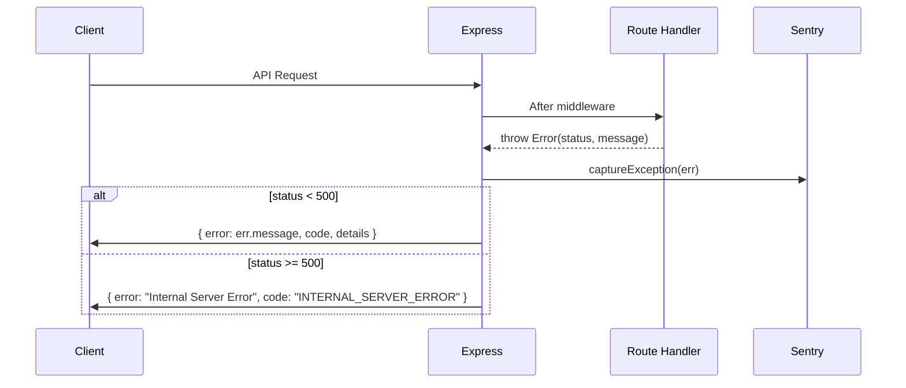

# Express Server Documentation

## Overview

The Hyrox Companion backend is an Express 4 REST API running on Node.js with TypeScript. It serves both the JSON API (under `/api/v1/`) and the Vite-built SPA client. Key technologies:

- **Express 4** -- HTTP framework
- **Drizzle ORM** with **node-postgres** (`pg`) -- primary database access
- **pgvector** on a separate (or shared) Neon PostgreSQL instance -- vector/RAG storage
- **pg-boss** -- PostgreSQL-backed job queue
- **node-cron** -- scheduled tasks
- **Clerk** -- authentication
- **Pino** -- structured logging
- **Helmet** -- security headers
- **csrf-csrf** -- CSRF protection (double-submit cookie pattern)
- **Sentry** -- error tracking
- **Zod** -- request validation and OpenAPI schema generation

Source entry point: `server/index.ts`

---

## Server Bootstrap

The startup sequence in `server/index.ts` proceeds as follows:

1. **Environment validation** -- `server/env.ts` is imported first. It parses `process.env` against a Zod schema and throws immediately on invalid configuration. A structured JSON boot log line is emitted to stdout before any validation runs.

2. **Dev auth bypass guard** -- If `ALLOW_DEV_AUTH_BYPASS` is `"true"` in production, the process exits with `logger.fatal`. In development it logs a warning.

3. **Sentry initialization** -- If `SENTRY_DSN` is set, `@sentry/node` is initialized with the current `NODE_ENV`. PII sending is disabled.

4. **Express app creation** -- `express()` is created, `x-powered-by` header is disabled, and a raw `http.Server` is created via `createServer(app)`.

5. **Middleware stack setup** -- See the Middleware Stack section below.

6. **Health check endpoint** -- `GET /api/v1/health` is registered before async startup work. It returns `{ status: "starting" }` while startup is in progress, `{ status: "ok" }` once ready, or `503` with `{ status: "error" }` if startup failed. This allows CI tooling (`wait-on`) to poll the health endpoint while the server finishes initializing.

7. **HTTP server listen** -- The server begins listening on `0.0.0.0:<PORT>` (default `5000`) early, so the health endpoint is reachable during the remaining startup steps.

8. **Startup maintenance** -- `runStartupMaintenance(storage)` from `server/maintenance.ts` runs sequentially:
   - Test database connectivity (15 s timeout)
   - Run Drizzle migrations
   - Ensure schema columns are up to date (additive ALTER TABLE statements)
   - Enable the `pgvector` extension on the vector DB
   - Create the `document_chunks` table on the vector DB if missing
   - Clean orphaned data (e.g. dangling `plan_day_id` references)
   - Backfill plan dates and workout-to-plan links
   - Mark missed plan days

9. **Queue start** -- `startQueue()` starts pg-boss and registers job workers (`auto-coach`, `embed-coaching-material`).

10. **Cron start** -- `startCron(storage)` schedules recurring tasks via `node-cron`.

11. **Route registration** -- `registerRoutes(httpServer, app)` sets up Clerk auth middleware, Strava routes, and all API route modules.

12. **Swagger UI** (dev only) -- Mounted at `/api/docs`.

13. **Error handler** -- Global Express error handler that sanitizes 500 errors and reports to Sentry.

14. **Static / Vite serving** -- In production, `serveStatic(app)` serves the built SPA from `server/public/`. In development, Vite dev server middleware is attached via `server/vite.ts`.

15. **Ready flag** -- `isReady` is set to `true` and the health endpoint begins returning `"ok"`.

---

## Middleware Stack

Middleware is applied in the following order in `server/index.ts`:

| Order | Middleware | Description |
|-------|-----------|-------------|
| 1 | `compression({ filter })` | Gzip/Brotli response compression. **Skipped for `text/event-stream` responses** so Gemini streaming chat is not held in the compression buffer. |
| 2 | `cors()` | CORS with origin whitelist (see below) |
| 3 | `cspNonceMiddleware` | Per-request CSP nonce generation (production only) |
| 4 | `helmet()` | Security headers (CSP baseline, referrer policy, etc.) |
| 5 | Custom CSP override | Replaces Helmet's CSP with a per-request nonce-based policy |
| 6 | `Permissions-Policy` | Sets `camera=(), microphone=(self), geolocation=()` |
| 7 | `express.json({ limit: "2mb" })` | Body parsing for `/api/v1/coaching-materials` only |
| 8 | `express.json({ limit: "100kb" })` | Default JSON body parsing with raw body capture |
| 9 | `express.urlencoded()` | URL-encoded body parsing (100 kb limit) |
| 10 | Health check route | `GET /api/v1/health` (registered inline, not in routes.ts) |
| 11 | `pino-http` | Structured request logging with request ID and user context |
| 12 | `doubleCsrfProtection` | CSRF verification on mutating requests (POST/PUT/PATCH/DELETE) via `csrf-csrf` |
| 13 | `idempotencyMiddleware` | Server-side idempotency enforcement via `X-Idempotency-Key` header (after auth) |

### Middleware Ordering Rationale

Middleware is ordered intentionally:
1. **compression** first -- compresses all responses including error pages, **except** `text/event-stream` responses. `compression`'s internal gzip buffer holds chunks indefinitely when the producer is slow (e.g. Gemini with `thinkingLevel: HIGH`), which breaks SSE. The filter in `server/index.ts` checks `res.getHeader("Content-Type")` for `text/event-stream` and falls through to `compression.filter` for everything else.
2. **CORS** early -- rejects disallowed origins before any processing
3. **CSP nonce + Helmet** before route handlers -- security headers on every response
4. **Custom CSP override** -- refines Helmet defaults with Clerk domains and nonce
5. **Body parsing** after security -- limits apply to parsed bodies only
6. **pino-http** last in pre-route stack -- logs after auth context is available (extracts userId from Clerk)

### CORS allowed origins

- `APP_URL` (from environment)
- `https://fitai.coach`
- `http://localhost:5000` and `http://localhost:5173` (development only)

Same-origin requests (no `Origin` header) are always allowed. Credentials are enabled.

---

## Route Registration

`server/routes.ts` exports `registerRoutes(httpServer, app)` which performs:

1. **Clerk auth setup** -- `setupAuth(app)` from `server/clerkAuth.ts`
2. **Strava OAuth routes** -- `registerStravaRoutes(app)` from `server/strava.ts`
3. **API route modules** -- Each mounted via `app.use(router)`:

| Module | File |
|--------|------|
| Auth | `server/routes/auth.ts` |
| Preferences | `server/routes/preferences.ts` |
| Email | `server/routes/email.ts` |
| AI | `server/routes/ai.ts` |
| Analytics | `server/routes/analytics.ts` |
| Workouts | `server/routes/workouts.ts` |
| Plans | `server/routes/plans.ts` |
| Coaching | `server/routes/coaching.ts` |

All API routes are prefixed with `/api/v1/` by convention within each router file.

Route handlers follow a **thin controller** pattern -- they validate input, then delegate to a use-case or service function. For workouts, `server/services/workoutUseCases.ts` provides a use-case layer that splits route payloads into service-level arguments, keeping transport concerns in routes and orchestration in services.

---

## Security

### Helmet

Helmet is configured with a baseline CSP that is immediately overridden by a custom middleware to support per-request nonces. Additional settings:

- `crossOriginEmbedderPolicy: false`
- `referrerPolicy: "strict-origin-when-cross-origin"`
- `x-powered-by` header disabled on the Express app directly

### CSP Nonces

In production, `server/middleware/cspNonce.ts` generates a 128-bit random nonce (base64-encoded) per request, stored in `res.locals.cspNonce`. The nonce is injected into the `script-src` CSP directive and into `<script>` tags in the served HTML (see `server/static.ts`). In development, `'unsafe-inline'` and `'unsafe-eval'` are used instead.

### CORS

A strict origin whitelist is enforced. Requests from unlisted origins receive a CORS error. See the allowed origins table above.

### Rate Limiting

`server/routeUtils.ts` exports a `rateLimiter(category, maxRequests, windowMs)` factory. Key properties:

- Per-user keying (falls back to IP for unauthenticated requests), namespaced by category
- Default window: 60 seconds (`DEFAULT_RATE_LIMIT_WINDOW_MS`)
- Standard `RateLimit-*` headers (RFC 6585)
- Returns `429` with `Retry-After` header and `RATE_LIMITED` error code
- Limiter instances are cached per `(category, maxRequests, windowMs)` tuple
- The SPA fallback route in `server/static.ts` has its own rate limiter (100 requests per 15 minutes)

### Body Size Limits

- `/api/v1/coaching-materials`: 2 MB (coaching documents can be large)
- All other routes: 100 KB for both JSON and URL-encoded bodies

### Request ID Validation

Client-supplied `X-Request-ID` headers are validated against the pattern `^[\w.:-]+$` with a 64-character maximum length to prevent log injection. Invalid or missing IDs are replaced with a `randomUUID()`.

### CSRF Protection

**File:** `server/middleware/csrf.ts`

CSRF protection uses the **double-submit cookie pattern** via the `csrf-csrf` library. This prevents cross-site request forgery on all state-changing endpoints.

**Flow:**

1. Client calls `GET /api/v1/csrf-token` (safe method, exempt from verification). The server sets a signed `__Host-hyrox.x-csrf` cookie (production) or `hyrox.x-csrf` cookie (development) and returns the paired token in JSON.
2. Client attaches the token as the `x-csrf-token` header on all mutating requests (POST/PUT/PATCH/DELETE).
3. The `doubleCsrfProtection` middleware verifies the header matches the cookie HMAC before forwarding the request.

**Session binding:** The CSRF token is bound to the Clerk `userId` when authenticated, so tokens issued pre-login are invalidated after sign-in and tokens cannot be replayed across users. Falls back to client IP for the pre-login window.

**Configuration:**

- Cookie: `httpOnly: true`, `sameSite: "strict"`, `secure: true` (production)
- Secret: `CSRF_SECRET` env var. **Required in production** and **must differ from `ENCRYPTION_KEY`** — both invariants are enforced at startup by `server/env.ts` Zod `.refine()` guards that abort boot with `❌ FATAL:` messages. Falls back to `ENCRYPTION_KEY` only in dev/test. See [Authentication → Key Separation](authentication.md#key-separation-csrf_secret-vs-encryption_key).
- Safe methods (GET/HEAD/OPTIONS) are exempt from verification

### Idempotency Middleware

**File:** `server/middleware/idempotency.ts`

Server-side enforcement for the `X-Idempotency-Key` header sent by the client's offline queue on replay.

**Behavior:**

- Applies to mutating methods only (POST/PUT/PATCH/DELETE)
- Requests without the header pass through untouched
- On first request with a given `(userId, key)` pair, the response is cached in the `idempotency_keys` table with a 24-hour TTL
- On repeat requests with the same key, the cached response (status code + body) is returned without re-executing the handler
- Key length is capped at 255 characters (returns 400 if exceeded)
- Must be mounted after `isAuthenticated` so `getUserId()` can resolve the caller
- Storage failures are logged and the request proceeds without idempotency guarantees (graceful degradation)

### Dev Auth Bypass Guard

`ALLOW_DEV_AUTH_BYPASS=true` causes an immediate `process.exit(1)` if `NODE_ENV` is `"production"`. This is enforced both by the Zod schema refinement in `server/env.ts` and by a runtime check in `server/index.ts`.

### Error Sanitization

The global error handler returns generic `"Internal Server Error"` messages for 500-status errors. Error details (`err.details`) are only included in the response for non-500 errors. All errors are reported to Sentry.

### Error Handling Flow

---

## Logging

Structured logging is provided by **Pino** (`server/logger.ts`).

### Configuration

- Log level is set via `LOG_LEVEL` environment variable (default: `"info"`)
- Sensitive headers are redacted: `authorization`, `cookie`, `x-cron-secret`
- In development, `pino-pretty` is used for human-readable colorized output
- In production, raw JSON is emitted (suitable for log aggregation)

### pino-http Middleware

The `pino-http` middleware adds structured context to every request log:

- **requestId** -- from validated `X-Request-ID` header or generated UUID
- **userId** -- extracted from Clerk auth (falls back to `"anonymous"`)
- **route** -- the request URL path (query string stripped)
- **context** -- set to `"http"`

Auto-logging is filtered to API routes only (`req.url` starting with `/api/v1`). Non-API requests (static assets, SPA fallback) are not logged by pino-http.

---

## Graceful Shutdown

`server/index.ts` registers handlers for `SIGTERM` and `SIGINT`. The shutdown sequence:

1. **Force-exit timer** -- A 30-second timeout (`SHUTDOWN_TIMEOUT_MS`) is set. If graceful shutdown does not complete within this window, `process.exit(1)` is called. The timer is `unref()`-ed so it does not keep the event loop alive.

2. **Stop cron** -- `stopCron()` halts the `node-cron` scheduler.

3. **Close HTTP server** -- `httpServer.close()` stops accepting new connections and waits for existing connections to drain.

4. **Stop queue** -- `queue.stop()` shuts down the pg-boss job queue.

5. **Drain database pools** -- `pool.end()` (main DB) and `vectorPool.end()` (vector DB) are called in parallel.

6. **Exit** -- `process.exit(0)` on success, `process.exit(1)` on error.

### Health Check Lifecycle

- `isReady` starts as `false`, `startupError` as `null`
- Server listens on port BEFORE routes register (allows health check during startup)
- `GET /api/v1/health` returns `{ status: "starting" }` while bootstrapping
- After `registerRoutes()` completes, `isReady = true` -- returns `{ status: "ok" }`
- If startup throws, `startupError` is set -- returns `{ status: "error", error: "..." }` with 503
- CI tools (wait-on) poll this endpoint to know when the server is ready

---

## Swagger / OpenAPI

In development only (`NODE_ENV !== "production"`), Swagger UI is served at `/api/docs`.

- The OpenAPI document is generated by `generateOpenApiDocument()` from `shared/openapi.ts`, which uses `zod-to-openapi` to derive schemas from Zod types.
- A relaxed CSP is applied to the Swagger UI route (`unsafe-inline` for scripts and styles).
- The Swagger top bar is hidden via custom CSS.
- The page title is set to "Workout API Documentation".

This endpoint is deliberately blocked in production to avoid exposing the full API schema and to prevent the need for a relaxed CSP.

---

## Environment Variables

All environment variables are validated at startup by a Zod schema in `server/env.ts`. The validated object is exported as `env`.

| Variable | Required | Description |
|----------|----------|-------------|
| `DATABASE_URL` | Yes | PostgreSQL connection string (main database) |
| `ENCRYPTION_KEY` | Yes | Minimum 32 characters, used for encrypting sensitive data |
| `NODE_ENV` | No | `"development"` (default), `"production"`, or `"test"` |
| `PORT` | No | Server listen port (default: `"5000"`) |
| `CLERK_PUBLISHABLE_KEY` | No | Clerk frontend key |
| `CLERK_SECRET_KEY` | No | Clerk backend key |
| `SENTRY_DSN` | No | Sentry error tracking DSN |
| `RESEND_API_KEY` | No | Resend email delivery API key (email disabled if unset) |
| `RESEND_FROM_EMAIL` | No | Sender address for outbound emails |
| `GEMINI_API_KEY` | No | Google Gemini API key for AI features |
| `CRON_SECRET` | No | Secret for authenticating external cron triggers |
| `STRAVA_CLIENT_ID` | No | Strava OAuth client ID |
| `STRAVA_CLIENT_SECRET` | No | Strava OAuth client secret |
| `STRAVA_STATE_SECRET` | No | Secret for signing Strava OAuth state tokens |
| `APP_URL` | No | Public application URL (used for CORS, OAuth callbacks) |
| `VECTOR_DATABASE_URL` | No | Separate Neon PostgreSQL URL for vector storage; falls back to `DATABASE_URL` |
| `ALLOW_DEV_AUTH_BYPASS` | No | Set to `"true"` to bypass auth in development (fatal in production) |
| `LOG_LEVEL` | No | Pino log level (default: `"info"`) |
| `RAG_CHUNK_SIZE` | No | Character count per RAG chunk (default: `600`) |
| `RAG_CHUNK_OVERLAP` | No | Overlap characters between RAG chunks (default: `100`) |
| `CSRF_SECRET` | Yes (production) | Minimum 32 characters, used for CSRF token HMAC. In production it is **required** and **must differ** from `ENCRYPTION_KEY`. Falls back to `ENCRYPTION_KEY` in dev/test only. |

---

## Key Configuration

### Database Pools

**Main pool** (`server/db.ts`):
- Connection string: `DATABASE_URL`
- Max connections: 20
- Idle timeout: 30 s (`DB_IDLE_TIMEOUT_MS`)
- Connection timeout: 5 s (`DB_CONNECTION_TIMEOUT_MS`)
- Statement timeout: 30 s (`DB_STATEMENT_TIMEOUT_MS`)
- **SSL selection:** Enabled in production (`rejectUnauthorized: true`) **unless** the `DATABASE_URL` hostname ends in `.railway.internal`. Railway's internal Postgres network stays on private IPv6 and does not speak SSL, so forcing TLS on an internal-host URL breaks connections. The hostname is parsed via `new URL(env.DATABASE_URL)` with a try/catch fallback.
- Drizzle ORM wraps the pool with the shared schema

**Vector pool** (`server/vectorDb.ts`):
- Connection string: `VECTOR_DATABASE_URL` (falls back to `DATABASE_URL`)
- Max connections: 5
- Idle timeout: 30 s
- Connection timeout: 10 s (`VECTOR_DB_CONNECTION_TIMEOUT_MS`)
- Statement timeout: 30 s
- Used for `pgvector` similarity search on document chunks

Both pools log unexpected errors on idle clients.

### Job Queue

pg-boss (`server/queue.ts`) is initialized with the `DATABASE_URL` connection string. Two queues are registered:

| Queue | Worker | Description |
|-------|--------|-------------|
| `auto-coach` | `triggerAutoCoach(userId)` | Runs AI-driven coaching adjustments for a user |
| `embed-coaching-material` | `embedCoachingMaterial(material)` | Generates and stores vector embeddings for coaching documents |

Failed jobs are re-thrown to let pg-boss handle retries.

### Cron Scheduling

`server/cron.ts` uses `node-cron` to run a single scheduled task:

- **Schedule**: Daily at 09:00 UTC (`"0 9 * * *"`)
- **Task**: `runEmailCronJob(storage)` -- checks users and sends scheduled emails
- **Catch-up**: If the server starts after 09:00 UTC, a catch-up run is triggered after a 30-second delay. The email scheduler has built-in idempotency guards to prevent duplicate sends.

### Route Utilities

`server/routeUtils.ts` provides shared utilities used across route modules:

- `rateLimiter(category, max, windowMs)` -- per-route rate limiting factory
- `validateBody(schema)` -- Zod-based request body validation middleware
- `asyncHandler(fn)` -- wraps async route handlers with error forwarding to `next(err)`
- `formatValidationErrors(error)` -- formats Zod errors into safe client-facing messages
- `calculateStreak(completedDates)` -- calculates consecutive workout day streaks

### Static File Serving

In production (`server/static.ts`):

- `/assets/*` is served with `Cache-Control: max-age=1y, immutable` (fingerprinted build artifacts)
- Other static files are served with `max-age=0` and no index
- The SPA fallback (`*`) reads `index.html` once at startup and injects the per-request CSP nonce into all `<script>` tags
- The fallback route is rate-limited to 100 requests per 15-minute window

---

See also: [Authentication](authentication.md), [Database -- Storage Layer](database.md#storage-layer), [Architecture -- Request Lifecycle](architecture.md#request-lifecycle)
