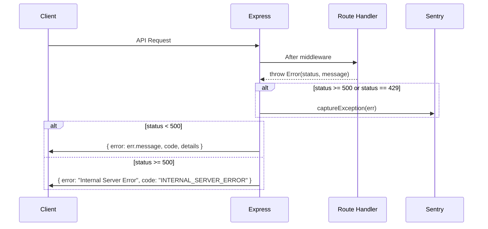

# Express Server Documentation

## Overview

The fitai.coach backend is an Express 5 REST API running on Node.js with TypeScript. It serves both the JSON API (under `/api/v1/`) and the Vite-built SPA client. Key technologies:

- **Express 5** -- HTTP framework
- **Drizzle ORM** with **node-postgres** (`pg`) -- primary database access
- **pgvector** on a separate (or shared) Neon PostgreSQL instance -- vector/RAG storage
- **pg-boss** -- PostgreSQL-backed job queue
- **node-cron** -- scheduled tasks
- **Clerk** -- authentication
- **Pino** -- structured logging
- **Helmet** -- security headers
- **csrf-csrf** -- CSRF protection (double-submit cookie pattern)
- **Sentry** -- error tracking
- **Zod** -- request validation and OpenAPI schema generation

Source entry point: `server/index.ts`

---

## Server Bootstrap

The startup sequence in `server/index.ts` proceeds as follows:

1. **Environment validation** -- `server/env.ts` is imported first. Before any validation runs it writes a plain-text `[env] Validating environment pid=… at=…` line to stderr (the pino logger does not exist yet). It then parses `process.env` against a Zod schema and throws immediately on invalid configuration, after writing the formatted errors to stderr and a structured JSON `fatal` line to stdout.
2. **Dev auth bypass guard** -- If `ALLOW_DEV_AUTH_BYPASS` is `"true"` in production, the process exits with `logger.fatal`. In development it logs a warning.
3. **Sentry initialization** -- If `SENTRY_DSN` is set, `@sentry/node` is initialized with the current `NODE_ENV`. PII sending is disabled.
4. **Express + HTTP server creation** -- `express()` is created, `x-powered-by` is disabled, and a raw `http.Server` is created via `createServer(app)`.
5. **Core middleware wiring** -- Compression, the health endpoint, CORS, CSP/Helmet, body parsers, the cookie parser, request logging, and request-context wiring are registered in `server/index.ts` in deterministic order (see Middleware Stack below). App-level concerns (`trust proxy`, `x-powered-by`), the health endpoint, observability, and shutdown handlers are factored into `server/bootstrap/` (`appConfig.ts`, `health.ts`, `observability.ts`, `lifecycle.ts`). CSRF protection is mounted later inside `registerRoutes`; idempotency is applied per protected route.
6. **Health endpoint registration** -- `GET /api/v1/health` (readiness) and `GET /api/v1/health/live` (liveness) are registered before async startup tasks and before CORS so platform probes are always reachable.
7. **Early server bind** -- `httpServer.listen()` happens before startup tasks. This keeps `/api/v1/health` reachable while dependencies warm up.

After listening, startup advances from the initial `initializing` phase through explicit phases exposed by the health endpoint's `phase` field:

8. **`ssrf_guard` phase** (only when `AI_TEXT_BASE_URL` is set) -- `assertResolvedHostIsPublic(env.AI_TEXT_BASE_URL)` resolves the host and aborts startup if it resolves to a private/loopback address (see [SSRF Guard](#ssrf-guard)).
9. **`db_maintenance` phase** -- `runStartupMaintenance(storage)` executes DB connectivity checks, migrations, schema/extension guards, and cleanup/backfill tasks.
10. **`queue` phase** -- `startQueue()` starts pg-boss and registers the workers defined in `server/queue.ts`; `registerStravaAutoSyncWorker()` (`server/services/stravaAutoSync.ts`) then registers the `strava-sync` worker.
11. **`cron` phase** -- `startCron(storage)` schedules recurring jobs, and a warning is logged if `RESEND_API_KEY` is unset.
12. **`routes` phase** -- `registerRoutes(httpServer, app)` mounts auth + API routes.
13. **Post-route runtime wiring** -- Dev-only Swagger UI (`/api/docs`), global Express error handler, Sentry Express error handler, and static/Vite serving are attached.
14. **`ready` phase** -- `isReady` flips to `true`; health transitions from `starting` to `ok` (or `degraded` when a database probe fails).

If any phase throws, `startupError` is set, the process stays bound, and `/api/v1/health` returns `503` with `{ status: "error", phase, ... }`.

---

## Middleware Stack

Middleware is applied in the following order in `server/index.ts`:

| Order | Middleware | Description |
|-------|-----------|-------------|
| 1 | `compression({ filter })` | Gzip/Brotli response compression. **Skipped for `text/event-stream` responses** so streaming chat is not held in the compression buffer. |
| 2 | Health check route | `GET /api/v1/health` -- registered **before CORS** so platform healthchecks (requests with no `Origin` header) always reach it. |
| 3 | `cors()` | CORS with origin allowlist (see below) |
| 4 | `cspNonceMiddleware` | Per-request CSP nonce generation (production only) |
| 5 | `helmet()` | Security headers, including the full **Content-Security-Policy** (per-request nonce) built by `buildCspDirectives()` in `server/middleware/csp.ts`, plus HSTS with preload and referrer policy. |
| 6 | `Permissions-Policy` | Sets `camera=(), microphone=(self), geolocation=()` |
| 7 | `express.json({ limit: "2mb" })` | Body parsing for `/api/v1/coaching-materials` only |
| 8 | `express.json({ limit: "10mb" })` | Body parsing for image-parse routes only (base64 image payloads; matched via `isImageParsePath`) |
| 9 | `express.json({ limit: "100kb" })` | Default JSON body parsing with raw body capture |
| 10 | `express.urlencoded()` | URL-encoded body parsing (100 kb limit) |
| 11 | `cookieParser()` | Cookie parsing -- required by the CSRF double-submit middleware mounted in `registerRoutes` |
| 12 | `pino-http` | Structured request logging with request ID. Runs before Clerk auth, so user identity is limited (see [pino-http Middleware](#pino-http-middleware)) |
| 13 | request-context wiring | Runs the remainder of the request inside an async context carrying `requestId` only -- Clerk auth has not run yet at this point |

Clerk auth, CSRF protection and idempotency are **not** part of this global chain. `clerkMiddleware()` is installed by `setupAuth()` (when Clerk keys are configured) at the start of `registerRoutes()`, and `csrfProtection` is mounted on `/api/v1` after it; idempotency is applied per protected mutating route through the `protectedRouteBuilder` guards (`protectedMutationGuards = [isAuthenticated, idempotencyMiddleware]`).

### Middleware Ordering Rationale

Middleware is ordered intentionally:
1. **compression** first -- compresses all responses including error pages, **except** `text/event-stream` responses. `compression`'s internal gzip buffer holds chunks indefinitely when the producer is slow (e.g. Gemini with `thinkingLevel: HIGH`), which breaks SSE. The filter in `server/index.ts` checks `res.getHeader("Content-Type")` for `text/event-stream` and falls through to `compression.filter` for everything else.
2. **CORS** early -- rejects disallowed origins before any processing
3. **CSP nonce + Helmet** before route handlers -- security headers (including the nonce-based CSP from `buildCspDirectives()`) on every response
4. **Body parsing** after security -- limits apply to parsed bodies only
5. **pino-http** then **request-context** last in the pre-route stack -- both run **before** Clerk auth (`clerkMiddleware()` is registered later, inside `registerRoutes()`), so `req.log` is bound with `userId: "anonymous"` and the request context carries `requestId` only

### CORS allowed origins

- `APP_URL` (from environment)
- `https://fitai.coach`
- Any origins listed in `ALLOWED_ORIGINS` (comma-separated)
- `http://localhost:5000` and `http://localhost:5173` (development only)

Same-origin requests (no `Origin` header) are always allowed. Credentials are enabled.

---

## Route Registration

`server/routes.ts` exports `registerRoutes(httpServer, app)` which performs:

1. **Clerk auth setup** -- `setupAuth(app)` from `server/clerkAuth.ts`
2. **CSRF token endpoint** -- `GET /api/v1/csrf-token` is mounted before the protecting middleware so the safe-method request can set the cookie.
3. **CSRF protection** -- `app.use("/api/v1", csrfProtection)` guards every mutating `/api/v1` request. Two exceptions mount just before it, because their callers send neither a session cookie nor a CSRF token: `registerStravaWebhookRoutes(app)` from `server/stravaWebhook.ts` registers `GET`/`POST /api/v1/strava/webhook`, which Strava calls without a token (see [Integrations → Automatic Sync](integrations.md#automatic-sync)), and `registerEmailUnsubscribeRoutes(app)` from `server/routes/emailUnsubscribe.ts` registers `GET`/`POST /api/v1/emails/unsubscribe`, which mail clients POST to for one-click unsubscribe and which is authorised by its signed token alone (see [Integrations → One-Click Unsubscribe](integrations.md#one-click-unsubscribe)).
4. **Strava + Garmin OAuth routes** -- `registerStravaRoutes(app)` from `server/strava.ts` and `registerGarminRoutes(app)` from `server/garmin.ts`.
5. **API route modules** -- Each mounted via `app.use(router)`:

Listed in mount order:

| Module | File |
|--------|------|
| Account | `server/routes/account.ts` |
| Auth | `server/routes/auth.ts` |
| Preferences | `server/routes/preferences.ts` |
| Email | `server/routes/email.ts` |
| AI | `server/routes/ai.ts` |
| Analytics | `server/routes/analytics.ts` |
| Workouts | `server/routes/workouts/` (composite router in `index.ts` over the CRUD, AI, device-link, timeline, export, MAF, and migration sub-route modules) |
| Plans | `server/routes/plans.ts` |
| Plan proposals | `server/routes/planProposals.ts` |
| Coaching | `server/routes/coaching.ts` |
| Consent | `server/routes/consent.ts` |
| Push | `server/routes/push.ts` |
| Timeline annotations | `server/routes/timelineAnnotations.ts` |
| Recycle bin | `server/routes/recycleBin.ts` |
| Nutrition | `server/routes/nutrition/` (composite router: `index.ts` mounts the `NUTRITION_ENABLED` 404 gate, then `nutrition.routes.ts` registers the foods, favorites, logs, summary, parse, targets, insights, and recipes sub-route modules) |

All API routes are prefixed with `/api/v1/` by convention within each router file.

Protected mutating endpoints are declared with the `protectedRouteBuilder` helpers (`protectedPost` / `protectedPatch` / `protectedDelete`) in `server/routes/_helpers/`. The builder applies a canonical guard order -- auth + idempotency (`protectedMutationGuards`), rate limiter, AI consent/budget (when enabled), validation, then the async handler. A compliance test in `server/routes/__tests__/` fails CI if a protected mutation bypasses the builder.

Route handlers follow a **thin controller** pattern -- they validate input, then delegate to a use-case or service function. For workouts, `server/services/workoutUseCases.ts` provides a use-case layer that splits route payloads into service-level arguments; newer use cases also live under `server/usecases/`.

---

## Security

### Helmet

Helmet is configured with the application's full Content-Security-Policy via `buildCspDirectives()` (`server/middleware/csp.ts`), including a per-request nonce in `script-src` (production). Additional settings:

- `crossOriginEmbedderPolicy: false`
- `referrerPolicy: "strict-origin-when-cross-origin"`
- `x-powered-by` header disabled on the Express app directly

### CSP Nonces

In production, `server/middleware/cspNonce.ts` generates a 128-bit random nonce (base64url-encoded, so it never contains `+`, `/` or `=`) per request, stored in `res.locals.cspNonce`. The nonce is injected into the `script-src` CSP directive and into `<script>` tags in the served HTML (see `server/static.ts`). In development, `'unsafe-inline'` and `'unsafe-eval'` are used instead.

### CORS

A strict origin whitelist is enforced. Requests from unlisted origins receive a CORS error. See the allowed origins table above.

### Rate Limiting

`server/routeUtils.ts` exports a `rateLimiter(category, maxRequests, windowMs)` factory. Key properties:

- Per-user keying (falls back to IP for unauthenticated requests), namespaced by category
- Default window: 60 seconds (`DEFAULT_RATE_LIMIT_WINDOW_MS`)
- Standard `RateLimit-*` headers (RFC 6585)
- Returns `429` with `Retry-After` header and `RATE_LIMITED` error code
- Limiter instances are cached per `(category, maxRequests, windowMs)` tuple
- Uses PostgreSQL-backed `rate_limit_buckets` outside tests so limits are shared across app replicas
- **Store-error behaviour is split by method** (`passOnStoreError` is chosen per request in `server/routeUtils.ts`): safe methods (`GET`, `HEAD`, `OPTIONS`) fail **open**, so a Postgres blip cannot 500 the entire read surface; everything else — every mutation, and therefore every auth, AI-spend and write route — fails **closed**, where allowing unthrottled requests during a store outage is the bigger risk. An attacker cannot defeat the limiter on a mutating route by inducing store errors. Counts stay unified per category because both limiter instances share the same Postgres key.
- Every authenticated `/api/v1` route carries a limiter, including plain reads such as `GET /api/v1/plans`, `GET /api/v1/plans/:id`, `GET /api/v1/preferences` and the Strava/Garmin status and disconnect routes.
- The SPA fallback route in `server/static.ts` has its own rate limiter (100 requests per 15 minutes)

### Body Size Limits

- `/api/v1/coaching-materials`: 2 MB JSON (coaching documents can be large)
- Image-parse routes: 10 MB JSON, for base64 image payloads. The paths are matched by `isImageParsePath()` in `server/imageParsePaths.ts`: the stateless `parse-exercises-from-image` and `parse-workout-structure-from-image` parsers, the workout and plan-day `reparse-from-image` routes, and `nutrition/parse/photo` and `nutrition/parse/label`
- All other routes: 100 KB JSON
- URL-encoded bodies: 100 KB on every route

### Request ID Validation

Client-supplied `X-Request-ID` headers are validated against `^[A-Za-z0-9._-]{1,36}$` to prevent log injection. The colon was deliberately dropped — it is adjacent to log-parser delimiters — and 36 characters fits a UUID or ULID with no room for padding. Invalid or missing IDs are replaced with a `randomUUID()`.

### CSRF Protection

**File:** `server/middleware/csrf.ts`

CSRF protection uses the **double-submit cookie pattern** via the `csrf-csrf` library. This prevents cross-site request forgery on all state-changing endpoints.

**Flow:**

1. Client calls `GET /api/v1/csrf-token` (safe method, exempt from verification). The server sets a signed `__Host-fitai.x-csrf` cookie (production) or `fitai.x-csrf` cookie (development) and returns the paired token in JSON.
2. Client attaches the token as the `x-csrf-token` header on all mutating requests (POST/PUT/PATCH/DELETE).
3. The `csrfProtection` middleware verifies the header matches the cookie HMAC before forwarding the request.

**Session binding:** The CSRF token is bound to the Clerk `userId` when authenticated, so tokens issued pre-login are invalidated after sign-in and tokens cannot be replayed across users. Falls back to client IP for the pre-login window.

**Configuration:**

- Cookie: `httpOnly: true`, `sameSite: "strict"`, `secure: true` (production)
- Secret: `CSRF_SECRET` env var. **Required in production** and **must differ from `ENCRYPTION_KEY`** — both invariants are enforced at startup by `server/env.ts` Zod `.refine()` guards that abort boot with `❌ FATAL:` messages. When unset in dev/test, `resolveCsrfSecret()` generates a random per-process secret (it is **not** aliased to `ENCRYPTION_KEY`). See [Authentication → Key Separation](authentication.md#key-separation-csrf_secret-vs-encryption_key).
- Safe methods (GET/HEAD/OPTIONS) are exempt from verification

### Idempotency Middleware

**File:** `server/middleware/idempotency.ts`

Server-side enforcement for the `X-Idempotency-Key` header sent by the client's offline queue on replay.

**Behavior:**

- Applies to mutating methods only (POST/PUT/PATCH/DELETE)
- Requests without the header pass through untouched
- Before the handler runs, the `(userId, key)` pair is atomically claimed in the `idempotency_keys` table as an in-progress row with a 60-second TTL, so a crashed or aborted request frees the key quickly. A concurrent duplicate that finds a live claim gets `409` with code `IDEMPOTENT_REQUEST_IN_PROGRESS`
- Only a `2xx` response sent through `res.json` is cached (status code + body, 7-day TTL). Any other outcome, including a response that finishes without `res.json`, releases the claim so the same key can be retried
- Response bodies over 64 KB are cached as a `{ idempotencyReplayed: true }` sentinel instead of the full payload
- On repeat requests with the same key, the cached response (status code + body) is returned without re-executing the handler
- Key length is capped at 255 characters (returns 400 if exceeded)
- Must be mounted after `isAuthenticated` so `getUserId()` can resolve the caller
- Storage failures are logged and the request proceeds without idempotency guarantees (graceful degradation)

### Dev Auth Bypass Guard

`ALLOW_DEV_AUTH_BYPASS=true` causes an immediate `process.exit(1)` if `NODE_ENV` is `"production"`. This is enforced both by the Zod schema refinement in `server/env.ts` and by a runtime check in `server/index.ts`.

### Error Sanitization

The global error handler returns generic `"Internal Server Error"` messages for 500-status errors. Error details (`err.details`) are only included in the response for non-500 errors. Only 5xx errors and 429s are reported to Sentry (`shouldReportToSentry()`); every other status is still logged and returned but not sent upstream.

The same rule applies to errors that are **stored** and read back later, not just
those returned inline. `training_plans.generation_error` is surfaced verbatim by
`GET /api/v1/plans/:id/generation-status`, so plan generation records only an
`AppError` message (already written for users); any other thrown error — provider,
database driver, HTTP layer, all of which can name internal hosts, models or query
fragments — is stored as a generic message while the full error goes to the logs
and Sentry.

### SSRF Guard

**File:** `server/ssrfGuard.ts`

Two layers protect outbound requests to any URL the app did not hard-code:

1. `checkSafeOutboundUrl(url)` — synchronous, rejects literal loopback, private,
   link-local, carrier-grade-NAT (`100.64.0.0/10`, which carries Alibaba's
   instance metadata at `100.100.100.200`), multicast and reserved addresses;
   `localhost` in all its spellings, including a trailing dot and any
   `*.localhost` subdomain, since RFC 6761 reserves that whole tree; the
   unspecified addresses `0.0.0.0` and `::`; IPv4-mapped IPv6; and NAT64
   (`64:ff9b::/96`) embedding a private IPv4. Documentation ranges such as
   TEST-NET are deliberately **allowed** — they are unroutable rather than
   internal, so blocking them buys nothing.
2. `assertResolvedHostIsPublic(url)` — resolves a non-literal hostname's A/AAAA
   records and refuses if any resolved address is private. Run at startup for
   `AI_TEXT_BASE_URL`; DNS errors are non-fatal so a resolver hiccup does not
   block an otherwise-healthy boot.

Callers: `AI_TEXT_BASE_URL` at env-parse time and again at startup, and every
web-push endpoint at both subscribe and send time. Both AI provider adapters also
set `redirect: "error"` on their `fetch` calls, because following a redirect
would re-POST the request body to a host that never passed the guard.

### Error Handling Flow

```mermaid
sequenceDiagram
    participant Client
    participant Express
    participant Handler as Route Handler
    participant Sentry
    
    Client->>Express: API Request
    Express->>Handler: After middleware
    Handler-->>Express: throw Error(status, message)
    alt status >= 500 or status == 429
        Express->>Sentry: captureException(err)
    end
    alt status < 500
        Express->>Client: { error: err.message, code, details }
    else status >= 500
        Express->>Client: { error: "Internal Server Error", code: "INTERNAL_SERVER_ERROR" }
    end
```

---

## Logging

Structured logging is provided by **Pino** (`server/logger.ts`).

### Configuration

- Log level is set via `LOG_LEVEL` environment variable (default: `"info"`)
- Sensitive headers are redacted: `authorization`, `cookie`, `x-csrf-token`, `x-idempotency-key`, `x-cron-secret`, `x-internal-analytics-secret` (the `SENSITIVE_REQUEST_HEADERS` list, which the Sentry `beforeSend` scrubber in `server/bootstrap/observability.ts` also uses). Credential-like request-body fields (e.g. passwords, access/refresh tokens, API keys, client secrets, `imageBase64`, Web Push `p256dh`/`auth` keys) are redacted too
- In development, `pino-pretty` is used for human-readable colorized output
- In production, raw JSON is emitted (suitable for log aggregation)

### pino-http Middleware

The `pino-http` middleware adds structured context to every request log:

- **requestId** -- from validated `X-Request-ID` header or generated UUID
- **userId** -- always `"anonymous"` on the per-request `req.log` child, which is bound at request start, before `clerkMiddleware()` has run. The completion line re-reads Clerk auth: a signed-in request logs `"authenticated"` when it succeeds and its real Clerk user id only when the response status is >= 400, keeping user ids out of the high-volume success log
- **route** -- the request URL path (query string stripped)
- **context** -- set to `"http"`

Auto-logging is filtered to API routes only (`req.url` starting with `/api/v1`). Non-API requests (static assets, SPA fallback) are not logged by pino-http.

---

## Graceful Shutdown

`server/index.ts` wires `registerShutdownHandlers()` (`server/bootstrap/lifecycle.ts`) for `SIGTERM` and `SIGINT`. The shutdown sequence:

1. **Force-exit timer** -- A 60-second timeout (`SHUTDOWN_TIMEOUT_MS`) is set. If graceful shutdown does not complete within this window, `process.exit(1)` is called. The timer is `unref()`-ed so it does not keep the event loop alive.

2. **Stop cron** -- `stopCron()` halts the `node-cron` scheduler.

3. **Drain SSE streams** -- `drainSseStreams()` closes in-flight Server-Sent Events connections (e.g. coach chat) with a 5-second grace window.

4. **Close HTTP server** -- `httpServer.close()` stops accepting new connections and waits for existing connections to drain.

5. **Stop queue** -- `queue.stop()` shuts down the pg-boss job queue.

6. **Drain database pools** -- `pool.end()` (main DB) and `vectorPool.end()` (vector DB) are called in parallel.

7. **Flush Sentry** -- `Sentry.close()` flushes buffered events with a 10-second timeout.

8. **Exit** -- `process.exit(0)` on success, `process.exit(1)` on error.

### Health Check Lifecycle

- `isReady` starts as `false`, `startupError` as `null`
- Server listens on port BEFORE routes register (allows health check during startup)
- `GET /api/v1/health` (readiness) returns `503` `{ status: "starting", phase, ... }` while bootstrapping
- Once the `ready` phase sets `isReady = true` (after `registerRoutes()` and the post-route wiring), it probes the main DB and, when `VECTOR_DATABASE_URL` is set, the vector DB (results cached for 5 s). It returns `{ status: "ok", vectorSchema, ... }` when both answer, otherwise `503` `{ status: "degraded", db, vectorDb, ... }`
- If startup throws, `startupError` is set -- returns `503` `{ status: "error", error: "startup_error", phase, ... }`. The raw error message is only logged, never returned
- `GET /api/v1/health/live` (liveness) never touches the DB: it returns `{ status: "alive", uptimeMs, ... }`, or `503` `{ status: "startup_failed", phase, ... }` once startup has failed. `railway.toml` points the platform healthcheck here
- CI polls `/api/v1/health` via `script/wait-for-health.js` to know when the server is ready

---

## Swagger / OpenAPI

In development only (`NODE_ENV !== "production"`), Swagger UI is served at `/api/docs`.

- The OpenAPI document is generated by `generateOpenApiDocument()` from `shared/openapi.ts`, which uses `zod-to-openapi` to derive schemas from Zod types.
- A relaxed CSP is applied to the Swagger UI route (`unsafe-inline` for scripts and styles).
- The Swagger top bar is hidden via custom CSS.
- The page title is set to "Workout API Documentation".

This endpoint is deliberately blocked in production to avoid exposing the full API schema and to prevent the need for a relaxed CSP.

---

## Environment Variables

All environment variables are validated at startup by a Zod schema in `server/env.ts`. The validated object is exported as `env`.

| Variable | Required | Description |
|----------|----------|-------------|
| `DATABASE_URL` | Yes | PostgreSQL connection string (main database) |
| `ENCRYPTION_KEY` | Yes | Minimum 32 characters, used for encrypting sensitive data |
| `NODE_ENV` | No | `"development"` (default), `"production"`, or `"test"` |
| `PORT` | No | Server listen port (default: `"5000"`) |
| `CLERK_PUBLISHABLE_KEY` | No | Clerk frontend key |
| `CLERK_SECRET_KEY` | No | Clerk backend key |
| `SENTRY_DSN` | No | Sentry error tracking DSN |
| `RESEND_API_KEY` | No | Resend email delivery API key (email disabled if unset) |
| `RESEND_FROM_EMAIL` | No | Sender address for outbound emails |
| `VAPID_PUBLIC_KEY` | No | Web Push VAPID public key. Push is enabled only when `VAPID_PUBLIC_KEY`, `VAPID_PRIVATE_KEY` and `VAPID_EMAIL` are all set; otherwise `GET /api/v1/push/vapid-key` returns 404 (`PUSH_NOT_CONFIGURED`) and sends are skipped |
| `VAPID_PRIVATE_KEY` | No | Web Push VAPID private key |
| `VAPID_EMAIL` | No | Bare contact email address for Web Push; the server prepends `mailto:` when registering VAPID details |
| `AI_FEATURES_ENABLED` | No | Runtime kill switch for AI provider traffic (default `true`; `false` disables all AI features) |
| `AI_GLOBAL_DAILY_LIMIT_CENTS` | No | Application-wide rolling-24h AI spend ceiling in cents. Unset means no global ceiling (per-user cap only) and a startup warning in production |
| `AI_TEXT_PROVIDER` | No | Text AI provider (`gemini`, `anthropic`, or `openai-compatible`; default `gemini`) |
| `AI_TEXT_MODEL` | No | Default text model override for the configured provider |
| `AI_TEXT_FAST_MODEL` | No | Fast text model override for parsing-style calls |
| `AI_TEXT_REASONING_MODEL` | No | Reasoning text model override for coaching and plan generation |
| `AI_TEXT_REASONING_EFFORT` | No | Reasoning effort hint (`none`, `low`, `medium`, `high`; default `high`) |
| `AI_TEXT_API_KEY` | No | Generic API key for non-Gemini text providers |
| `AI_TEXT_OPENAI_COMPATIBLE_PROFILE` | No | OpenAI-compatible profile (`openai`, `xai`, `groq`, `together`, `openrouter`, `deepseek`, or `custom`) |
| `AI_TEXT_BASE_URL` | No | Base URL for OpenAI-compatible providers |
| `GEMINI_API_KEY` | No | Gemini key for the Gemini text provider, RAG embeddings, and image parsing |
| `CRON_SECRET` | No | Secret for authenticating external cron triggers |
| `INTERNAL_ANALYTICS_SECRET` | No | Secret for authenticating internal analytics health endpoints |
| `APP_INSTANCE_COUNT` | No | Declared app replica count (default `1`). Values above `1` are supported after migrations because rate limits/cache state are shared through Postgres. |
| `STRAVA_CLIENT_ID` | No | Strava OAuth client ID |
| `STRAVA_CLIENT_SECRET` | No | Strava OAuth client secret |
| `STRAVA_STATE_SECRET` | Yes (production, when Strava is configured) | 32+ char secret for signing Strava OAuth state tokens. Unset, each replica signs with its own per-process random secret, so a callback landing on a different instance than the one that issued the state fails verification |
| `STRAVA_AUTO_SYNC_ENABLED` | No | Master switch for automatic Strava sync (default `true`) |
| `STRAVA_AUTO_SYNC_INTERVAL_MINUTES` | No | Polling-fallback staleness threshold (default `60`) |
| `STRAVA_WEBHOOKS_ENABLED` | No | Register and act on the Strava push subscription (default `true`) |
| `STRAVA_WEBHOOK_VERIFY_TOKEN` | No | Webhook validation token; derived from the client secret when unset |
| `APP_URL` | No | Public application URL (used for CORS, OAuth callbacks) |
| `ALLOWED_ORIGINS` | No | Comma-separated list of additional CORS origins |
| `TRUST_PROXY` | No | Express `trust proxy` setting for client IP derivation (default `1`) |
| `VECTOR_DATABASE_URL` | No | Separate Neon PostgreSQL URL for vector storage; falls back to `DATABASE_URL` |
| `ALLOW_DEV_AUTH_BYPASS` | No | Set to `"true"` to bypass auth in development (fatal in production) |
| `LOG_LEVEL` | No | Pino log level (default: `"info"`) |
| `RAG_CHUNK_SIZE` | No | Character count per RAG chunk (default: `600`) |
| `RAG_CHUNK_OVERLAP` | No | Overlap characters between RAG chunks (default: `100`) |
| `ENCRYPTION_KEY_V2` | No | Rotation key for `ENCRYPTION_KEY`. When set, new ciphertext is tagged `v2`; the v1 key stays available to decrypt existing rows. Must differ from `ENCRYPTION_KEY` and `CSRF_SECRET`. |
| `ENCRYPTION_REENCRYPT_ON_BOOT` | No | `"true"` (with `ENCRYPTION_KEY_V2` set) re-encrypts stored Strava/Garmin credentials to the active key version on boot. Default `"false"`. |
| `CSRF_SECRET` | Yes (production) | Minimum 32 characters, used for CSRF token HMAC. It is **required** in production, and whenever it is set it **must differ** from `ENCRYPTION_KEY` (in every environment). Auto-generated per process in dev/test if unset. |

This table covers the variables most relevant to the server runtime. It is not exhaustive -- see [Environment Variables](env-reference.md) for the complete reference, including AI model overrides and feature flags.

---

## Key Configuration

### Database Pools

**Main pool** (`server/db.ts`):
- Connection string: `DATABASE_URL`
- Max connections: 20
- Idle timeout: 30 s (`DB_IDLE_TIMEOUT_MS`)
- Connection timeout: 10 s (`DB_CONNECTION_TIMEOUT_MS`)
- Statement timeout: 30 s (`DB_STATEMENT_TIMEOUT_MS`)
- **SSL selection:** Enabled in production (`rejectUnauthorized: true`) **unless** the `DATABASE_URL` hostname ends in `.railway.internal`. Railway's internal Postgres network stays on private IPv6 and does not speak SSL, so forcing TLS on an internal-host URL breaks connections. The hostname is parsed via `new URL(env.DATABASE_URL)` with a try/catch fallback.
- Drizzle ORM wraps the pool with the shared schema

**Vector pool** (`server/vectorDb.ts`):
- Connection string: `VECTOR_DATABASE_URL` (falls back to `DATABASE_URL`)
- Max connections: 5
- Idle timeout: 30 s
- Connection timeout: 10 s (`VECTOR_DB_CONNECTION_TIMEOUT_MS`)
- Statement timeout: 30 s
- Used for `pgvector` similarity search on document chunks

Both pools log unexpected errors on idle clients.

### Job Queue

pg-boss (`server/queue.ts`) is initialized with the `DATABASE_URL` connection string. Workers are registered for every queue at boot — ten in `server/queue.ts`, plus `strava-sync` in `server/services/stravaAutoSync.ts`.

**The queue catalogue lives in [Integrations → Job Types](integrations.md#job-types)** — name, worker and payload for each. It is not repeated here: this section previously carried a second copy of that table and drifted from it.

Idempotent jobs use `DEFAULT_JOB_OPTIONS` (retry 3× with exponential backoff); the email send jobs use `NO_RETRY_JOB_OPTIONS`, because the "sent" marker is persisted after delivery and a retry would duplicate the email. Each job runs under a 50-minute wall-clock timeout, and in-batch parallelism is bounded to 2. Failed jobs are re-thrown to let pg-boss handle retries.

### Cron Scheduling

`server/cron.ts` uses `node-cron` for in-process scheduled tasks. Each cron body is wrapped in a PostgreSQL advisory lock (`runCronJobWithLock()`, keyed via `CRON_LOCK_KEYS`) so duplicate schedulers skip work instead of running the same maintenance job twice.

**The schedule catalogue lives in [Integrations → Registered Cron Jobs](integrations.md#registered-cron-jobs)** — expression, timezone and advisory lock for each job. As with the queue table above, the copy that used to sit here drifted from it.

Cron jobs run in-process on **each** app replica; the advisory lock above is what keeps only one of them doing the work. Rate limits use `rate_limit_buckets`, while the Clerk seen-cache and AI/RAG hot caches use `server_runtime_cache`, so `APP_INSTANCE_COUNT > 1` no longer weakens abuse prevention or provider-spend cache behavior.

### Shared Runtime State

`server/sharedRuntimeState.ts` owns short-lived shared cache helpers backed by Postgres:

- `rate_limit_buckets` stores per-category request counters and reset timestamps for `rateLimiter(...)`.
- `server_runtime_cache` stores short-lived, TTL-bound entries for the Clerk auth seen-cache, single-use Strava OAuth state claims, the Strava background-sync 429 cooldown, the Strava webhook subscription state, the Garmin 429 breaker and per-user in-flight lock, the AI circuit-breaker state, planned-session estimates, the RAG retrieval cache, and the embedding health probe. The Gemini embedding-vector cache is deliberately process-local (`server/gemini/client.ts`) and is not stored here.
- Expired rows are pruned daily by the `sharedRuntimeCleanup` cron job at 04:15 UTC.

### Route Utilities

`server/routeUtils.ts` provides shared utilities used across route modules:

- `rateLimiter(category, max, windowMs)` -- per-route rate limiting factory
- `validateBody(schema)` / `validateQuery(schema)` / `validateParams(schema)` -- Zod-based validation middleware for the request body, query string, and route params. On success the parsed (coerced) value is written back with `Object.defineProperty`, because Express 5 exposes `req.query` as a read-only getter that a plain `req.query = ...` assignment throws on.
- `asyncHandler(fn)` -- wraps async route handlers with error forwarding to `next(err)`
- `formatValidationErrors(error)` -- formats Zod errors into safe client-facing messages
- `calculateStreak(completedDates)` -- calculates consecutive workout day streaks

> **Express 5 note:** under `@types/express` v5 the default `req.params` value type widened to `string | string[]`, so handlers that read a path parameter type their request generic -- e.g. `Request<{ id: string }>` -- to keep `req.params.id` a `string` (see `server/routes/coaching.ts` and `server/routes/plans.ts`).

### Static File Serving

In production (`server/static.ts`):

- `/assets/*` is served with `Cache-Control: max-age=1y, immutable` (fingerprinted build artifacts)
- Other static files are served with `max-age=0` and no index
- The SPA fallback (`/{*splat}`) reads `index.html` once at startup and injects the per-request CSP nonce into all `<script>` tags. The named-wildcard form is required by Express 5's path-to-regexp v8 -- a bare `*` throws at route registration
- The fallback route is rate-limited to 100 requests per 15-minute window

---

See also: [Authentication](authentication.md), [Database -- Storage Layer](database.md#storage-layer), [Architecture -- Request Lifecycle](architecture.md#2-request-lifecycle)
