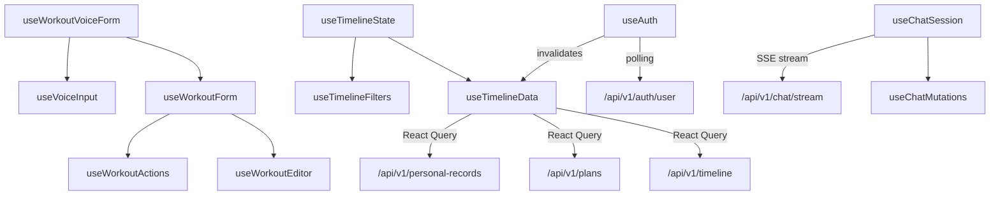
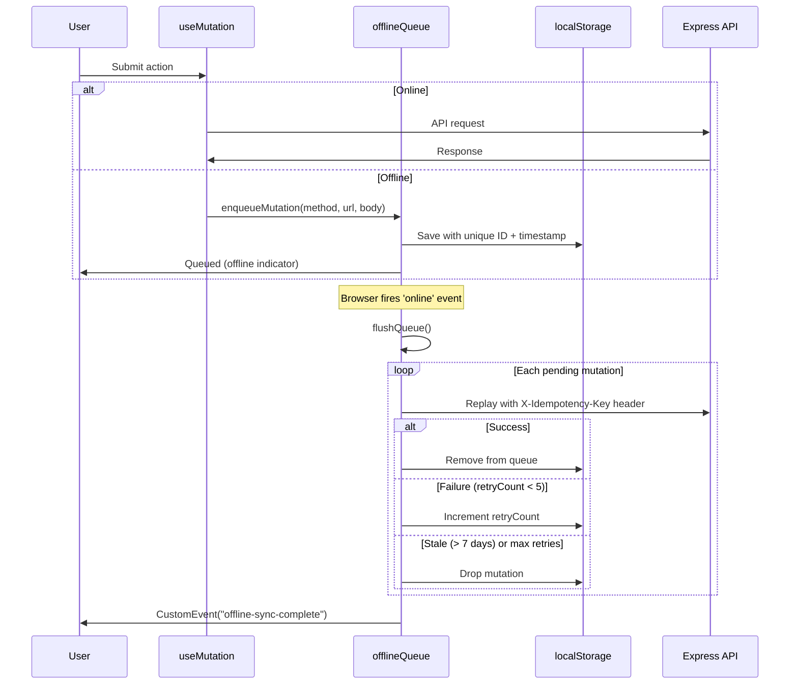

# State Management

[Back to README](../README.md)

## Overview

The Hyrox Companion uses **TanStack Query (React Query)** for server state management and **local React state** (`useState`, `useRef`, `useCallback`) for UI state. There is no global state store (Redux, Zustand, etc.). An offline mutation queue backed by localStorage provides resilience when the network is unavailable.

---

## Table of Contents

- [Query Client Configuration](#query-client-configuration)
- [API Client Layer](#api-client-layer)
- [Custom Hooks Catalog](#custom-hooks-catalog)
- [Offline Queue](#offline-queue)
- [Utility Functions](#utility-functions)
- [Performance Patterns](#performance-patterns)

---

## Query Client Configuration

**File:** `client/src/lib/queryClient.ts`

```typescript
const queryClient = new QueryClient({
  defaultOptions: {
    queries: {
      queryFn: getQueryFn({ on401: "throw" }),
      refetchInterval: false,
      refetchOnWindowFocus: false,
      staleTime: 5 * 60 * 1000,  // 5 minutes
      retry: 1,                   // Single retry on failure
    },
    mutations: {
      retry: false,
    },
  },
});
```

### Key Design Decisions

- **5-minute stale time:** Reduces unnecessary refetches while keeping data reasonably fresh.
- **No window focus refetch:** Prevents jarring data refreshes when switching tabs.
- **Single retry:** Retries once on failure (e.g., transient network issues), then surfaces the error.
- **No mutation retry:** Mutations are not retried automatically to avoid duplicate side effects.

### Query Function

`getQueryFn({ on401 })` creates a typed query function that:
- Joins query key segments into a URL (e.g., `["/api/v1", "workouts"]` becomes `/api/v1/workouts`).
- Includes credentials (`credentials: "include"`) for Clerk JWT auth.
- Handles 401 responses based on the `on401` parameter:
  - `"throw"` (default) -- Throws an error, triggering React Query's error state.
  - `"returnNull"` -- Returns `null`, useful for optional auth checks.

### RateLimitError

A custom error class that extracts the `Retry-After` header from 429 responses:

```typescript
class RateLimitError extends Error {
  readonly retryAfter: number | null;
}
```

---

## API Client Layer

**Files:** `client/src/lib/api/client.ts`, `client/src/lib/queryClient.ts`

### Base Functions

- `apiRequest(method, url, data?, signal?, extraHeaders?)` -- Low-level fetch wrapper. Sets `Content-Type: application/json`, includes credentials, handles error responses.
- `typedRequest<TResponse>(method, url, data?)` -- Returns parsed JSON typed as `TResponse`.
- `rawRequest(method, url, data?)` -- Returns the raw `Response` object (for streaming, file downloads).

### Domain Modules

Each API domain has a dedicated module in `client/src/lib/api/`:

| Module | File | Functions |
|--------|------|-----------|
| Workouts | `workouts.ts` | `create()`, `list()`, `get()`, `update()`, `delete()`, `getUnstructured()`, `reparse()`, `batchReparse()` |
| Plans | `plans.ts` | CRUD, `import()`, `sample()`, `generate()`, `schedule()`, `updateDay()`, `updateDayStatus()` |
| Coaching | `coaching.ts` | Chat (`send()`, `sendStream()`, `saveMessage()`), materials CRUD, `getRagStatus()`, `reEmbed()` |
| Analytics | `analytics.ts` | `getPersonalRecords()`, `getExerciseAnalytics()`, `getTrainingOverview()`, timeline, suggestions |
| User | `user.ts` | `auth.getUser()`, `preferences.get/update()`, `strava.*`, `email.check()` |
| Exercises | `exercises.ts` | `listCustom()`, `create()`, `getHistory()` |

---

## Custom Hooks Catalog

All hooks are in `client/src/hooks/`.

### Authentication and User

| Hook | File | Purpose |
|------|------|---------|
| `useAuth` | `useAuth.ts` | Integrates Clerk auth with database user sync. Polls `isAutoCoaching` every 2s when active (max 5 min). Detects tab visibility to pause polling. Invalidates timeline queries when auto-coaching completes. |
| `useSignOut` | `useSignOut.ts` | Clerk sign-out with query cache clearing. |
| `useEmailCheck` | `useEmailCheck.ts` | Triggers email check on first authenticated load. |

### Data Loading

| Hook | File | Purpose |
|------|------|---------|
| `useTimelineData` | `useTimelineData.ts` | Fetches plans, timeline entries, and personal records. Manages scroll position and "go to today" navigation. |
| `useTimelineState` | `useTimelineState.ts` | Orchestrates timeline page state (filters, data, UI state). |
| `useUnitPreferences` | `useUnitPreferences.ts` | Reads and caches user's weight/distance unit preferences. |

### Mutations

| Hook | File | Purpose |
|------|------|---------|
| `useApiMutation` | `useApiMutation.ts` | Generic wrapper around React Query's `useMutation`. Adds toast notifications (success/error), automatic query invalidation, and optional callbacks. |
| `useWorkoutActions` | `useWorkoutActions.ts` | Workout CRUD mutations (create, update, delete, combine). |
| `useChatMutations` | `useChatMutations.ts` | Save chat message, clear chat history mutations. |
| `useStravaMutations` | `useStravaMutations.ts` | Strava sync and disconnect mutations. |
| `useCoachingMaterials` | `useCoachingMaterials.ts` | Coaching material CRUD with re-embed triggers. |

### Forms and Editors

| Hook | File | Purpose |
|------|------|---------|
| `useWorkoutEditor` | `useWorkoutEditor.ts` | Manages exercise blocks for the LogWorkout page. Handles adding/removing/reordering exercises (dnd-kit integration), parsing text into exercises, and tracking block state. |
| `useWorkoutForm` | `useWorkoutForm.ts` | Manages workout form state (date, focus, RPE, notes, duration). Handles submission with exercise data. |
| `useWorkoutVoiceForm` | `useWorkoutVoiceForm.ts` | Extends workout form with voice input integration. |

### Chat and Coaching

| Hook | File | Purpose |
|------|------|---------|
| `useChatSession` | `useChatSession.ts` | Full chat session management. Handles message history, SSE streaming with `requestAnimationFrame` batching for smooth UI updates, RAG info tracking, and auto-scroll. |

### Plans

| Hook | File | Purpose |
|------|------|---------|
| `usePlanGeneration` | `usePlanGeneration.ts` | Multi-step AI plan generation flow (input validation, API call, result handling). |
| `usePlanImport` | `usePlanImport.ts` | CSV file import with validation and preview. |

### UI State

| Hook | File | Purpose |
|------|------|---------|
| `useTimelineFilters` | `useTimelineFilters.ts` | Filter state for timeline (plan selector, status filter, date range). |
| `useOnboarding` | `useOnboarding.ts` | Tracks onboarding completion state. |
| `useOnboardingWizard` | `useOnboardingWizard.ts` | Multi-step wizard state (current step, form values, navigation). |
| `useOnlineStatus` | `useOnlineStatus.ts` | Tracks `navigator.onLine` with event listeners. |
| `useBlockCounts` | `useBlockCounts.ts` | Calculates exercise block statistics (total sets, exercises). |
| `useCombineWorkouts` | `useCombineWorkouts.ts` | State for merging multiple workout logs into one. |
| `use-toast` | `use-toast.ts` | Toast notification state management. |
| `use-mobile` | `use-mobile.tsx` | Responsive breakpoint detection. |

### Voice Input

| Hook | File | Purpose |
|------|------|---------|
| `useVoiceInput` | `useVoiceInput.ts` | Web Speech API integration. Manages microphone permissions, speech recognition start/stop, transcript accumulation, and error handling. |

### Hook Dependency Tree



---

## Offline Queue

**File:** `client/src/lib/offlineQueue.ts`

A localStorage-backed mutation queue that ensures data isn't lost when the user is offline.

### Design

- **Queue storage:** `localStorage` under the key `hyrox-offline-queue`.
- **Max queue size:** 100 mutations (oldest evicted when full).
- **Max age:** 7 days -- stale mutations are dropped during flush.
- **Max retries:** 5 per mutation -- dropped after exceeding.
- **Idempotency:** Each mutation gets a unique ID (`timestamp-uuid`), sent as `X-Idempotency-Key` header on replay.

### API

| Function | Description |
|----------|-------------|
| `enqueueMutation(method, url, body)` | Adds a mutation to the queue. Returns the mutation ID. |
| `getPendingCount()` | Returns the number of queued mutations. |
| `flushQueue()` | Replays all pending mutations. Returns `{ synced, failed, dropped }`. |

### Auto-flush

When the browser fires the `online` event, `flushQueue()` runs automatically. On completion, it dispatches a `CustomEvent("offline-sync-complete")` for the UI to react.

### Error Handling

- `QuotaExceededError` on save: Evicts the oldest half of the queue, retries once, then clears entirely if still failing.
- Corrupted localStorage: Returns empty queue (gets overwritten on next save).
- Individual mutation failures: Incremented `retryCount`, kept in queue for next flush.

### Offline Queue Lifecycle



---

## Utility Functions

### Date Utilities

**File:** `client/src/lib/dateUtils.ts`

| Function | Description |
|----------|-------------|
| `getTodayString()` | Returns today as `YYYY-MM-DD` |
| `toISODateString(date)` | Converts a Date to `YYYY-MM-DD` |
| `getStartOfWeek(date)` | Returns the Monday of the given week |
| `getEndOfWeek(date)` | Returns the Sunday of the given week |
| `isDateInRange(date, start, end)` | Range check predicate |
| `isDatePast(date)` | Whether a date is before today |
| `isDateToday(date)` | Whether a date is today |
| `formatTime(minutes)` | Formats minutes as `Xh Ym` |
| `getCurrentTimeString()` | Returns current time as `HH:MM` |

### Exercise Utilities

**File:** `client/src/lib/exerciseUtils.ts`

| Function | Description |
|----------|-------------|
| `groupExerciseSets(sets)` | Groups exercise sets by exercise name |
| `formatExerciseSummary(sets)` | Human-readable exercise description |
| `getExerciseLabel(set)` | Returns display name (handles custom exercises) |
| Color/style mappings | Per-category styling (colors, icons) |

Performance: Uses `Set`-based lookups for O(1) membership checks instead of `Array.includes()`.

### Stats Utilities

**File:** `client/src/lib/statsUtils.ts`

| Function | Description |
|----------|-------------|
| `calculatePersonalRecords(sets)` | Max weight, max distance, best time per exercise |
| `calculateExerciseAnalytics(sets)` | Volume and intensity per day/exercise |
| `buildWeeklySummaries(logs, sets)` | Weekly aggregations with RPE averages |
| `buildCategoryTotals(sets)` | Exercise category breakdown (count, total sets) |

---

## Performance Patterns

### Single-pass Array Traversals

Throughout the codebase, multiple data transformations are combined into single array passes instead of chaining `.filter().map().reduce()`. This avoids creating intermediate arrays.

### Set-based Lookups

Exercise name lookups use `Set` instead of `Array.includes()` for O(1) membership checks:

```typescript
const validNames = new Set(VALID_EXERCISE_NAMES);
// O(1) instead of O(n)
if (validNames.has(name)) { ... }
```

### requestAnimationFrame Batching

The `useChatSession` hook batches SSE text chunks using `requestAnimationFrame` to prevent excessive React re-renders during streaming:

```typescript
// Buffer chunks, flush on next animation frame
pendingTextRef.current += chunk;
if (!rafIdRef.current) {
  rafIdRef.current = requestAnimationFrame(() => {
    setMessages(prev => /* append buffered text */);
    rafIdRef.current = null;
  });
}
```

### requestAnimationFrame Batching Detail

The `useChatSession` hook uses rAF batching to prevent excessive React re-renders during SSE streaming:

```typescript
// From client/src/hooks/useChatSession.ts
const acc = { content: "", ragInfo: undefined };
let dirty = false;

const flush = () => {
  if (!dirty) return;
  dirty = false;
  const snapshot = { content: acc.content, ragInfo: acc.ragInfo };
  setMessages((prev) =>
    prev.map((m) =>
      m.id === assistantMessageId
        ? { ...m, content: snapshot.content, ...(snapshot.ragInfo ? { ragInfo: snapshot.ragInfo } : {}) }
        : m,
    ),
  );
};

const scheduleFlush = () => {
  if (!dirty) {
    dirty = true;
    rafId = requestAnimationFrame(flush);
  }
};
```

Without batching, each SSE chunk (arriving every ~50ms) would trigger a React state update + re-render. With rAF batching, multiple chunks are accumulated and flushed once per animation frame (~16ms), reducing renders by 3-5x.

### Parallel Data Fetching

Independent data fetches use `Promise.all()` to run concurrently:

```typescript
const [trainingContext, coachingContext] = await Promise.all([
  buildTrainingContext(userId),
  retrieveCoachingContext(userId, query),
]);
```

### Query Stale Time

The 5-minute stale time prevents redundant API calls when navigating between pages, as cached data is reused without refetching.

---

## Key Files

| File | Purpose |
|------|---------|
| `client/src/lib/queryClient.ts` | QueryClient config, RateLimitError, apiRequest |
| `client/src/lib/offlineQueue.ts` | Offline mutation queue |
| `client/src/lib/api/client.ts` | typedRequest / rawRequest base functions |
| `client/src/lib/api/*.ts` | Domain-specific API modules |
| `client/src/hooks/*.ts` | All custom React hooks |
| `client/src/lib/dateUtils.ts` | Date formatting and predicates |
| `client/src/lib/exerciseUtils.ts` | Exercise data helpers |
| `client/src/lib/statsUtils.ts` | Statistics calculations |

---

See also: [Client -- Component Architecture](client.md#component-architecture), [API Reference](api-reference.md), [Architecture -- Request Lifecycle](architecture.md#request-lifecycle)
