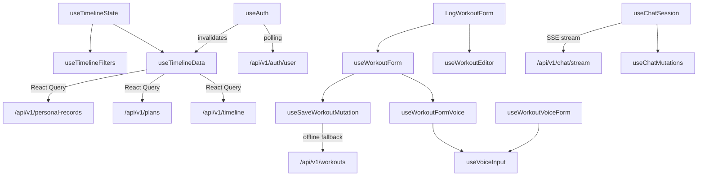
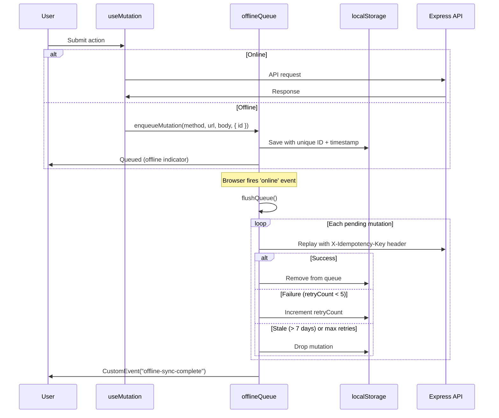

# State Management

[Back to README](../README.md)

## Overview

fitai.coach uses **TanStack Query (React Query v5)** for server state management and **local React state** (`useState`, `useRef`, `useCallback`, `useReducer`) for UI state. There is no global state store (Redux, Zustand, etc.). An offline mutation queue backed by localStorage provides resilience when the network is unavailable.

---

## Table of Contents

- [Query Client Configuration](#query-client-configuration)
- [API Client Layer](#api-client-layer)
- [Custom Hooks Catalog](#custom-hooks-catalog)
- [Offline Queue](#offline-queue)
- [Workout Draft Persistence](#workout-draft-persistence)
- [Utility Functions](#utility-functions)
- [Performance Patterns](#performance-patterns)

---

## Query Client Configuration

**File:** `client/src/lib/queryClient.ts`

```typescript
const queryClient = new QueryClient({
  defaultOptions: {
    queries: {
      queryFn: getQueryFn({ on401: "throw" }),
      refetchInterval: false,
      refetchOnWindowFocus: false,
      staleTime: 5 * 60 * 1000,  // 5 minutes
      retry: 1,                   // Single retry on failure
    },
    mutations: {
      retry: false,
    },
  },
});
```

### Key Design Decisions

- **5-minute stale time:** Reduces unnecessary refetches while keeping data reasonably fresh.
- **No window focus refetch:** Prevents jarring data refreshes when switching tabs.
- **Single retry:** Retries once on failure (e.g., transient network issues), then surfaces the error.
- **No mutation retry:** Mutations are not retried automatically to avoid duplicate side effects.

### Query Function

`getQueryFn({ on401 })` creates a typed query function that:
- Joins query key segments into a URL (e.g., `["/api/v1", "workouts"]` becomes `/api/v1/workouts`).
- Includes credentials (`credentials: "include"`) for Clerk JWT auth.
- Handles 401 responses based on the `on401` parameter:
  - `"throw"` (default) -- Throws an error, triggering React Query's error state.
  - `"returnNull"` -- Returns `null`, useful for optional auth checks.

### Instant-paint Snapshots (placeholderData + localStorage)

The expensive analytics surfaces (Coach Insights, Race Predictor) avoid a blank/spinner state on open by persisting their last result to `localStorage` and feeding it back as React Query `placeholderData`. The helpers live in `client/src/lib/analyticsSnapshot.ts`:

- `readAnalyticsSnapshot<T>(key)` / `writeAnalyticsSnapshot(key, value)` -- JSON get/set that swallow corrupt payloads and quota errors so a bad snapshot can never break the tab.
- `useWriteAnalyticsSnapshot(key, data, isPlaceholderData)` -- persists `data` whenever it changes and is *real* (skips the placeholder it just read back, and no-ops when `key` is `null`, e.g. signed out).

Snapshot keys are **scoped by `userId`** by the caller (e.g. `fitai-race-prediction-cache:<userId>`) so a previous account's data is never shown. The per-tab flow: read the per-user snapshot → pass as `placeholderData` → render instantly → the live query revalidates in the background → `useWriteAnalyticsSnapshot` writes the fresh result back. This pairs with the server's stored-first endpoints (see [API Reference — Analytics Routes](api-reference.md#analytics-routes)): the server returns the last persisted result with a `stale` flag, and the client paints it with no spinner.

### Custom Error Types

`queryClient.ts` exports two custom error classes thrown from `throwIfResNotOk`:

- **`RateLimitError`** -- Thrown on a 429 response. Extracts the `Retry-After` header (in seconds, or `null` if absent).
- **`AiBudgetExceededError`** -- Thrown on a 429 whose body carries `code: "AI_BUDGET_EXCEEDED"`. Carries `currentCostCents` and `limitCents` so the UI can explain the daily AI spend cap.

```typescript
class RateLimitError extends Error {
  readonly retryAfter: number | null;
}

class AiBudgetExceededError extends Error {
  readonly currentCostCents: number;
  readonly limitCents: number;
}
```

`resetCsrfToken()` is also exported here -- it clears the in-memory CSRF token cache on auth state transitions.

---

## API Client Layer

**Files:** `client/src/lib/api/client.ts`, `client/src/lib/queryClient.ts`

### Base Functions

- `apiRequest(method, url, data?, signal?, extraHeaders?)` -- Low-level fetch wrapper in `queryClient.ts`. Sets `Content-Type: application/json` when a body is present, includes credentials, handles error responses. Automatically attaches the `x-csrf-token` header on mutating requests (POST/PUT/PATCH/DELETE) and retries once with a fresh token on a 403 that may be a CSRF rejection (code `EBADCSRFTOKEN`, or no code at all); a 403 naming another code is not resent.
- `typedRequest<TResponse>(method, url, data?, options?)` -- Returns parsed JSON typed as `TResponse`. `options` accepts `timeoutMs` (default 15s), `signal`, and `headers`; the timeout is enforced via an `AbortController`.
- `rawRequest(method, url, data?, options?)` -- Returns the raw `Response` object (for streaming, file downloads). Same `options` as `typedRequest`.

### CSRF Token Management

The API client fetches a CSRF token from `GET /api/v1/csrf-token` on initialization and caches it in memory. The token is automatically attached as the `x-csrf-token` header on all mutating requests. If a 403 CSRF error is received (e.g., after a Clerk sign-in invalidates the old token), the client refetches the token and retries the request transparently.

### Domain Modules

Each API domain has a dedicated module in `client/src/lib/api/`:

| Module | File | Functions |
|--------|------|-----------|
| Workouts | `workouts.ts` | `create()`, `latest()`, `get()`, `update()`, `updateBlockScore()`, `delete()`, `bulkDelete()`, `combine()`, `reparse()`, `reparseFromImage()`, `batchReparse()`, `history()`, `seedFromPlan()`, `assignPlanDay()`, device-link actions (`linkDeviceActivity()`, `unlinkDeviceActivity()`, `dismissDeviceLinkSuggestion()`), plus exercise-set CRUD (`addSet`/`updateSet`/`deleteSet` via `createExerciseSetMutationApi`) |
| Plans | `plans.ts` | `list()`, `get()`, `import()`, `createSample()`, `rename()`, `updateGoal()`, `setRetirement()`, `deletePlan()`, `generate()`, `getGenerationStatus()`, `schedule()`, `updateDayWithoutPlan()`, `updateDayStatus()`, `deleteDay()`, `getDayExercises()`, `updateDayStructure()`, `addDayExercise()`/`updateDayExercise()`/`deleteDayExercise()`, `reparseDay()`, `reparseDayFromImage()` |
| Coaching | `coaching.ts` | `chat` (`send()`, `sendStream()`, `saveMessage()`, `clearHistory()`, `getStoredCoachInsights()`, `regenerateCoachInsights()`), `coaching` materials (`list`/`create`/`delete`), `getRagStatus()`, `reEmbed()` |
| Analytics | `analytics.ts` | `analytics` (`getPersonalRecords()`, `getExerciseAnalytics()`, `getTrainingOverview()` — returns a `TrainingOverview` — `getTrainingSummary()`, `getOverviewAnalysis()`/`regenerateOverviewAnalysis()`, `getRacePrediction()`, `getWeeklyReview()`/`setWeeklyReviewIntent()`, `exportData()`), `timeline` (`getPage()` — one cursor page of [`GET /api/v1/timeline`](api-reference.md#get-apiv1timeline) — `getSuggestions()`, `applySuggestion()`) |
| User | `user.ts` | `preferences.update()` (units, `userTimezone`, `weeklyGoal`, `mealSchedule`, `trainingConstraints`, the email and push toggles, `showAdherenceInsights`, `aiCoachEnabled`, `coachAutoApplyPlanChanges`, `onboardingCompleted`, athlete profile / body composition, training-style and MAF fields), `strava.*` (`auth/disconnect/sync`), `garmin.*` (`connect/disconnect/sync`), `email.check()`. Reads of the current user and preferences go through the default query function, keyed by `QUERY_KEYS.authUser` / `QUERY_KEYS.preferences`, so they have no wrapper here |
| Exercises | `exercises.ts` | `parse()`, `parseStructured()`, `parseFromImage()`, `parseStructuredFromImage()`, `getHistory()` |
| MAF Tests | `mafTests.ts` | `tagWorkout()`, `updateTest()`, `untagWorkout()`, `list()` for MAF-test tagging and the MAF Trend tab |
| Timeline Annotations | `timelineAnnotations.ts` | `list()`, `create()`, `delete()` for injury / illness / travel / rest bands |
| Plan Proposals | `planProposals.ts` | `getPending()`, `apply()`, `dismiss()` for conversational plan-adjustment proposals |
| Recycle Bin | `recycleBin.ts` | `list()`, `restore()`, `restoreBatch()`, `purge()`, `empty()` for the 90-day soft-delete store |
| Consent | `consent.ts` | `recordServerConsent()` — records a consent grant/revocation server-side |
| Nutrition | `nutrition.ts` | The whole food-logging surface: search/recent/favourites, log CRUD + batch/repeat, custom foods and servings, recipes, barcode, the three AI parse calls, targets and per-meal overrides, micros, session fuelling and block view, insights. Consumed through `client/src/hooks/useNutrition.ts` — see [Nutrition & Fuelling § Client UI map](nutrition.md#6-client-ui-map) |

---

## Custom Hooks Catalog

All hooks are in `client/src/hooks/`.

### Authentication and User

| Hook | File | Purpose |
|------|------|---------|
| `useAuth` | `useAuth.ts` | Integrates Clerk auth with database user sync. Polls the `authUser` query every 2s while `isAutoCoaching` is true (max 5 min, pauses while the tab is hidden). Invalidates timeline queries when auto-coaching completes. Resets the cached CSRF token on sign-in state transitions. Also exports `useIsAutoCoaching`, `useIsAiCoachEnabled`, `useIsOnboardingCompleted`, and `useIsAuthUserLoaded` -- thin `select`-based subscribers to single auth-user fields. |
| `useSignOut` | `useSignOut.ts` | Clerk sign-out. Calls `clearUserLocalData()` to purge the offline queue and workout drafts from local/session storage before signing out. |
| `useEmailCheck` | `useEmailCheck.ts` | Fire-and-forget email check once per authenticated session (gated on `isAuthenticated` and `isAppUserLoaded`). |

### Data Loading

| Hook | File | Purpose |
|------|------|---------|
| `useTimelineData` | `useTimelineData.ts` | Fetches plans, timeline entries, and personal records. Manages scroll position and "go to today" navigation. |
| `useTimelineState` | `useTimelineState.ts` | Orchestrates timeline page state (filters, data, UI state). |
| `useUnitPreferences` | `useUnitPreferences.ts` | Reads and caches user's weight/distance unit preferences. |

### Mutations

| Hook | File | Purpose |
|------|------|---------|
| `useApiMutation` | `useApiMutation.ts` | Generic wrapper around React Query's `useMutation`. Adds toast notifications (success/error), automatic query invalidation, and optional callbacks. |
| `useWorkoutActions` | `useWorkoutActions.ts` | Timeline-entry action mutations: mark complete, skip, change status, delete workout/plan-day, and bulk delete (delegates to `workout-actions/useWorkoutActionMutations`). |
| `useChatMutations` | `useChatMutations.ts` | Save chat message, clear chat history mutations. |
| `useStravaMutations` | `useStravaMutations.ts` | Strava sync and disconnect mutations. |
| `useGarminMutations` | `useGarminMutations.ts` | Garmin connect (email/password), disconnect, and manual sync mutations. Surfaces the `GARMIN_BUSY`, `GARMIN_SYNC_TOO_SOON`, and `GARMIN_CIRCUIT_OPEN` error codes as user-friendly toasts. |
| `useCoachingMaterials` | `useCoachingMaterials.ts` | Coaching material CRUD with re-embed triggers. |

Timeline annotation queries and mutations are composed directly from the `client/src/lib/api/timelineAnnotations.ts` module inside `useTimelineData` (read) and the `AnnotationsDialog` component (write), rather than via a dedicated hook — the annotations list is small and refetches cheaply on mutation. Account deletion is invoked from `client/src/components/settings/AccountDangerZone.tsx`, which calls the `DELETE /api/v1/account` endpoint behind a hold-to-confirm gesture, clears the React Query cache on success, and hands off to Clerk's sign-out flow.

### Forms and Editors

| Hook | File | Purpose |
|------|------|---------|
| `useWorkoutEditor` | `useWorkoutEditor.ts` | Manages exercise blocks for the LogWorkout page. Handles adding/removing/reordering exercises (dnd-kit integration), parsing text into exercises, and tracking block state. |
| `useWorkoutForm` | `useWorkoutForm.tsx` | Manages workout form state (date, focus, RPE, notes, duration). Handles submission with exercise data. |
| `useWorkoutVoiceForm` | `useWorkoutVoiceForm.ts` | Voice dictation (via `useVoiceInput`) into an `EditFormState` (focus / main workout / accessory / notes). Standalone — it does not wrap `useWorkoutForm`. |

### Chat and Coaching

| Hook | File | Purpose |
|------|------|---------|
| `useChatSession` | `useChatSession.ts` | Full chat session management. Handles message history, SSE streaming with `requestAnimationFrame` batching for smooth UI updates, RAG info tracking, and auto-scroll. |

### Analytics

| Hook | File | Purpose |
|------|------|---------|
| `useRacePrediction` | `components/analytics/useRacePrediction.ts` | Fetches the stored HYROX race prediction with instant paint (`placeholderData` from a per-user localStorage snapshot, see [Instant-paint Snapshots](#instant-paint-snapshots-placeholderdata--localstorage)). Exposes a manual `refresh()` that forces server regeneration via `?refresh=1` and writes the fresh result back into the query cache. |

### Plans

| Hook | File | Purpose |
|------|------|---------|
| `usePlanGeneration` | `usePlanGeneration.ts` | Multi-step AI plan generation flow (input validation, API call, result handling). |
| `usePlanImport` | `usePlanImport.ts` | CSV file import with validation and preview. |

### UI State

| Hook | File | Purpose |
|------|------|---------|
| `useTimelineFilters` | `useTimelineFilters.ts` | Filter state for timeline (plan selector, status filter, date range). |
| `useOnboarding` | `useOnboarding.ts` | Tracks durable onboarding completion with a local legacy fallback. |
| `useEnableAiCoach` | `useEnableAiCoach.ts` | Mutation that turns `aiCoachEnabled` on (the consent every AI route checks) and refreshes the auth user and preferences. Used by the AI plan generator's consent step. |
| `useOnboardingWizard` | `useOnboardingWizard.ts` | Multi-step wizard state and navigation. The form is a draft over the athlete's saved preferences (`onboardingProfile.ts`), and each step writes only the fields that differ from what is saved, so "Run setup again" never resets an established athlete's settings. |
| `useOnlineStatus` | `useOnlineStatus.ts` | Tracks `navigator.onLine` with event listeners. |
| `useOfflineDropNotifier` | `useOfflineDropNotifier.ts` | Subscribes to the offline queue and shows a destructive toast whenever a queued mutation is permanently dropped (data loss). Mounted once near the app root. |
| `useCombineWorkouts` | `useCombineWorkouts.ts` | State for merging multiple workout logs into one. |
| `use-toast` | `use-toast.ts` | Toast notification state management. |
| `use-mobile` | `use-mobile.tsx` | Responsive breakpoint detection. |

### Voice Input

| Hook | File | Purpose |
|------|------|---------|
| `useVoiceInput` | `useVoiceInput.ts` | Web Speech API integration. Manages microphone permissions, speech recognition start/stop, transcript accumulation, and error handling. |

Additional feature hooks not catalogued above include `useWorkoutDetail`, `usePlanDayExercises`, `useExerciseSetsForOwner`, `useMoveTimelineEntry`, `useLogWorkoutDraft`, `usePushNotifications`, and `useUrlQueryState`. Related hooks are also grouped under the `voice/`, `workout-form/`, and `workout-actions/` subdirectories of `client/src/hooks/`.

### Hook Dependency Tree


```mermaid
flowchart TD
    UTS[useTimelineState] --> UTD[useTimelineData]
    UTS --> UTF[useTimelineFilters]
    UTD --> |React Query| API["/api/v1/timeline"]
    UTD --> |React Query| API2["/api/v1/plans"]
    UTD --> |React Query| API3["/api/v1/personal-records"]
    
    LWF[LogWorkoutForm] --> UWE[useWorkoutEditor]
    LWF --> UWF[useWorkoutForm]
    UWF --> UWFV[useWorkoutFormVoice]
    UWF --> USWM[useSaveWorkoutMutation]
    UWFV --> UVI[useVoiceInput]
    USWM --> |offline fallback| API6["/api/v1/workouts"]
    UWVF[useWorkoutVoiceForm] --> UVI
    
    UCS[useChatSession] --> UCM[useChatMutations]
    UCS --> |SSE stream| API4["/api/v1/chat/stream"]
    
    UA[useAuth] --> |polling| API5["/api/v1/auth/user"]
    UA --> |invalidates| UTD
```

---

## Offline Queue

**File:** `client/src/lib/offlineQueue.ts`

A localStorage-backed mutation queue. Writes opt in through `runWithOfflineFallback` (`client/src/lib/offlineMutationFallback.ts`), which enqueues instead of sending when the browser is offline, or when the live call fails with a connectivity-shaped error (application 4xx/5xx errors are rethrown, not queued). Three writes use it:

- workout-log creates — `POST /api/v1/workouts` (`useSaveWorkoutMutation`);
- plan-day status changes, skips included — `PATCH /api/v1/plans/days/:dayId/status` (`useWorkoutActionMutations`), whose optimistic timeline flip stays in place for the session while the change is queued;
- food-log creates — `POST /api/v1/nutrition/logs` (`useLogFood`).

All other mutations use direct server requests.

### Design

- **Queue storage:** `localStorage` under the key `fitai-offline-queue`.
- **Max queue size:** 100 mutations (oldest evicted when full).
- **Max age:** 7 days -- stale mutations are dropped during flush.
- **Max retries:** 5 per mutation -- dropped after exceeding.
- **Idempotency:** Each queue-backed write generates a crypto-backed unique ID before the first request, sends it as `X-Idempotency-Key`, and reuses it if the body is queued for replay. The server enforces idempotency via the `idempotencyMiddleware`, which caches responses in the `idempotency_keys` database table with a 7-day TTL.
- **Privacy cleanup:** Signout and account deletion clear queued mutation bodies and user-scoped drafts from browser storage.

### API

| Function | Description |
|----------|-------------|
| `enqueueMutation(method, url, body, options?)` | Adds a mutation to the queue (`options.id` overrides the generated ID). Returns the mutation ID. |
| `getPendingCount()` | Returns the number of queued mutations. |
| `flushQueue()` | Replays all pending mutations. Returns `{ synced, failed, dropped }`. |
| `clearOfflineQueue()` | Removes queued mutation bodies from localStorage and notifies listeners. |
| `createOfflineMutationId()` | Generates a crypto-backed unique mutation ID (`crypto.randomUUID()` with a `getRandomValues` fallback). |
| `onMutationDropped(cb)` | Registers a callback fired whenever a mutation is permanently dropped. Returns an unsubscribe function. Used by `useOfflineDropNotifier`. |

### Auto-flush

When the browser fires the `online` event, `flushQueue()` runs automatically. Queue writes dispatch the `OFFLINE_QUEUE_CHANGE_EVENT` (`"offline-queue-change"`); replays that synced or dropped at least one mutation dispatch the `OFFLINE_SYNC_COMPLETE_EVENT` (`"offline-sync-complete"`) for the UI to react. Both event names are exported constants.

### Error Handling

- `QuotaExceededError` on save: Evicts the oldest half of the queue, retries once, then clears entirely if still failing.
- Corrupted localStorage: Returns empty queue (gets overwritten on next save).
- Individual mutation failures: Incremented `retryCount`, kept in queue for next flush.

### Offline Queue Lifecycle


```mermaid
sequenceDiagram
    participant User
    participant Hook as useMutation
    participant Queue as offlineQueue
    participant Storage as localStorage
    participant Server as Express API
    
    User->>Hook: Submit action
    alt Online
        Hook->>Server: API request
        Server->>Hook: Response
    else Offline
        Hook->>Queue: enqueueMutation(method, url, body, { id })
        Queue->>Storage: Save with unique ID + timestamp
        Queue->>User: Queued (offline indicator)
    end
    
    Note over Queue: Browser fires 'online' event
    Queue->>Queue: flushQueue()
    loop Each pending mutation
        Queue->>Server: Replay with X-Idempotency-Key header
        alt Success
            Queue->>Storage: Remove from queue
        else Failure (retryCount < 5)
            Queue->>Storage: Increment retryCount
        else Stale (> 7 days) or max retries
            Queue->>Storage: Drop mutation
        end
    end
    Queue->>User: CustomEvent("offline-sync-complete")
```

---

## Workout Draft Persistence

**File:** `client/src/hooks/useLogWorkoutDraft.ts`

The Log Workout page autosaves a working draft to `localStorage` so an accidental refresh or navigation does not lose in-progress data.

- **Storage keys:**
  - `fitai-log-workout-draft:<userKey>` — the draft payload, in `localStorage` (durable across sessions and tabs). A draft whose stored `userKey` does not match is ignored.
  - `fitai-log-workout-draft-announced:<userKey>` — a per-tab flag in `sessionStorage` that suppresses re-showing the "Draft restored" toast more than once within the same browser session. Scoped to `sessionStorage` deliberately so a fresh tab announces the restore again.
- **Schema version:** `DRAFT_VERSION = 5` (v5 added the manual session start time `timeOfDayMin`, v4 `distance` / `avgHeartrate` / `maxHeartrate`, v3 `durationMinutes`). Drafts written under v2–v4 still load, with the missing fields hydrated as blank/null; any other version (v1) is discarded on load.
- **Lifetime:** Drafts persist **indefinitely** until they are explicitly cleared. The hook stores `savedAt: Date.now()` but never checks the timestamp for expiry — clearing only happens when the user successfully saves the workout, empties the form (a blank draft is removed rather than saved), signs out (via `clearUserLocalData()` in `client/src/hooks/useSignOut.ts`), or deletes their account (via `AccountDangerZone`). This is intentional, since the draft is single-user device-local state with no privacy retention concern beyond the signout/deletion paths that already clear it.

---

## Utility Functions

### Date Utilities

**File:** `client/src/lib/dateUtils.ts`

| Function | Description |
|----------|-------------|
| `getTodayString()` / `getYesterdayString()` | The local calendar date as `YYYY-MM-DD` |
| `toISODateString(date)` | Converts a Date to its local `YYYY-MM-DD` |
| `getStartOfWeek(date, weekStartsOn = 1)` / `getEndOfWeek(...)` | Monday / Sunday of the given week (Monday-start by default, audit L7) |
| `getStartOfWeekString(...)` / `getEndOfWeekString(...)` | The same, as `YYYY-MM-DD` |
| `isDateInRange(date, start, end)` | Inclusive range check on `YYYY-MM-DD` strings |
| `formatTime(date)` | A Date's local time as `HH:MM` (`toLocaleTimeString`) |
| `getCurrentTimeString()` | `formatTime(new Date())` |

### Exercise Utilities

**File:** `client/src/lib/exerciseUtils.ts`

| Function | Description |
|----------|-------------|
| `groupExerciseSets(sets)` | Groups exercise sets by exercise name |
| `formatExerciseSummary(sets)` | Human-readable exercise description |
| `getExerciseLabel(set)` | Returns display name (handles custom exercises) |
| Color/style mappings | Per-category styling (colors, icons) |

Performance: Uses `Set`-based lookups for O(1) membership checks instead of `Array.includes()`.

### Stats Utilities

**File:** `client/src/lib/statsUtils.ts`

| Function | Description |
|----------|-------------|
| `calculateStats(timeline)` | One pass over the timeline entries → `TrainingStats` for the Coach panel: `workoutsThisWeek` / `completedThisWeek` (Monday-start week, matching the server), `plannedUpcoming`, and an all-time `completionRate` over finished days — today and `excused` days are left out, and it is `null` until something has come due |
| `formatSecondsToMmSs(seconds)` | A split as `M:SS` (272 → `4:32`) |
| `formatSecondsToClock(seconds)` | Re-exported from `shared/formatClock.ts`: a duration as `H:MM:SS` |

Personal-record, exercise-analytics, weekly-summary and category-total calculations are server-side, in `server/services/analyticsService.ts`.

---

## Performance Patterns

### Single-pass Array Traversals

Throughout the codebase, multiple data transformations are combined into single array passes instead of chaining `.filter().map().reduce()`. This avoids creating intermediate arrays.

### Set-based Lookups

Exercise name lookups use `Set` instead of `Array.includes()` for O(1) membership checks:

```typescript
const validNames = new Set(VALID_EXERCISE_NAMES);
// O(1) instead of O(n)
if (validNames.has(name)) { ... }
```

### requestAnimationFrame Batching

The `useChatSession` hook batches SSE text chunks using `requestAnimationFrame` to prevent excessive React re-renders during streaming:

```typescript
// Buffer chunks, flush on next animation frame
pendingTextRef.current += chunk;
if (!rafIdRef.current) {
  rafIdRef.current = requestAnimationFrame(() => {
    setMessages(prev => /* append buffered text */);
    rafIdRef.current = null;
  });
}
```

### requestAnimationFrame Batching Detail

The `useChatSession` hook uses rAF batching to prevent excessive React re-renders during SSE streaming:

```typescript
// From client/src/hooks/useChatSession.ts
const acc = { content: "", ragInfo: undefined };
let dirty = false;

const flush = () => {
  if (!dirty) return;
  dirty = false;
  const snapshot = { content: acc.content, ragInfo: acc.ragInfo };
  setMessages((prev) =>
    prev.map((m) =>
      m.id === assistantMessageId
        ? { ...m, content: snapshot.content, ...(snapshot.ragInfo ? { ragInfo: snapshot.ragInfo } : {}) }
        : m,
    ),
  );
};

const scheduleFlush = () => {
  if (!dirty) {
    dirty = true;
    rafId = requestAnimationFrame(flush);
  }
};
```

Without batching, each SSE chunk (arriving every ~50ms) would trigger a React state update + re-render. With rAF batching, multiple chunks are accumulated and flushed once per animation frame (~16ms), reducing renders by 3-5x.

### Parallel Data Fetching

Independent data fetches use `Promise.all()` to run concurrently:

```typescript
const [trainingContext, coachingContext] = await Promise.all([
  buildTrainingContext(userId),
  retrieveCoachingContext(userId, query),
]);
```

### Query Stale Time

The 5-minute stale time prevents redundant API calls when navigating between pages, as cached data is reused without refetching.

---

## Key Files

| File | Purpose |
|------|---------|
| `client/src/lib/queryClient.ts` | QueryClient config, RateLimitError, apiRequest |
| `client/src/lib/offlineQueue.ts` | Offline mutation queue |
| `client/src/lib/api/client.ts` | typedRequest / rawRequest base functions |
| `client/src/lib/api/*.ts` | Domain-specific API modules |
| `client/src/hooks/*.ts` | All custom React hooks |
| `client/src/lib/dateUtils.ts` | Date formatting and predicates |
| `client/src/lib/exerciseUtils.ts` | Exercise data helpers |
| `client/src/lib/statsUtils.ts` | Coach panel training stats, split/clock formatting |

---

See also: [Client -- Component Architecture](client.md#component-architecture), [API Reference](api-reference.md), [Architecture -- Request Lifecycle](architecture.md#2-request-lifecycle)
